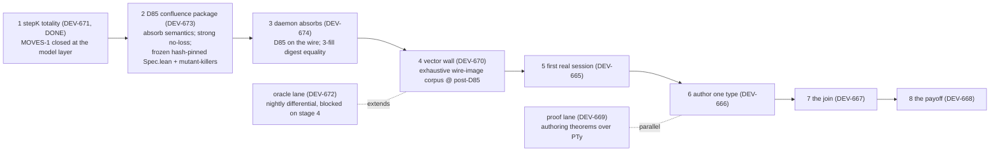

# SLICE — the vertical slice and its seam ledger

One page answering one question auditable: **is X actually connected
to Y yet?** The islands (the moves model, the TyX/IR model, the protod
runtime, codegen) are each real; the seams between them are mostly
not. This ledger names every seam and its status, and the rule is
absolute: **a seam's status changes only in the commit that adds its
mechanical artifact.** No artifact, no upgrade, whatever the report
says.

## Status vocabulary

| Status | Meaning |
| --- | --- |
| **intent** | prose or design only — nothing mechanical crosses the seam |
| **shipped** | code crosses the seam, but no test/artifact exercises the crossing |
| **walled** | a test or replayable committed artifact exercises the crossing |
| **proved** | a machine-checked correspondence (none exists today; stated for honesty) |
| **absent by design** | the seam is deliberately open; crossing it is a future ratification |

## The seam ledger

| # | Seam | Status today | Evidence | Upgrades when |
| --- | --- | --- | --- | --- |
| S1 | protod session runtime ↔ moves model (`verify/moves`) | **walled (weak — replacement ratified and staged)** | 12 hand-authored vectors drive the real daemon (`proto/wire/fixtures/protocol-moves.json`); hand-typed vectors refused by the 2026-08-15 ruling; replacement design fixed by the independent review (`docs/research/2026-08-15-dev670-adversarial-review.md` + companions) and ratified | slice stages 1–2: stepK totality (MOVES-1 closed), then the exhaustive wire-image corpus with executable mapping, typed divergences, and the seat-authority fence proved as a `FenceRule`; the online oracle lane extends it nightly; the refinement map stays future |
| S2 | shipped type code (TS/Go) ↔ IR model (`verify/ir`) | **intent** | the Lean file is the declared reference; the ~10 Go/TS restatements are unchecked against it | referee engine vectors (drafts 05/06) |
| S3 | authoring loop (`type.fill`/frontier) ↔ theorems | **intent** | contract prose + the running concierge's C1–C5 walls; no model-level theorems | draft 02: `unfill_fill`, `frontier_closed`, `no_dead_ends` over `PTy` |
| S4 | protocol scheme holes ↔ catalog type digests | **walled** | protod tests create protocols whose holes resolve real digests (`protocol_moves_test.go` bootstrap); the shipped client does the same (proto/ts/src/protocol.ts:78); never exercised by a real session | slice stage 3: a real session on a hole typed by an authored digest, plus the bogus-digest refusal control |
| S5 | codegen ↔ catalog bytes | **walled** | round-trip wall: derive → compile → re-fold → same digest, over the frozen fixture corpus (proto/ts/test/codegen.test.ts) | slice stage 4 extends the wall to the authored digest |
| S6 | fill values ↔ hole types | **walled** | corrected 2026-08-15: the daemon type-checks every fill against the hole's cataloged type, at fill time and again on replay (proto/go/protod/value_check.go); protocol tests exercise acceptance and refusal | slice stage 4 adds the seat-side differential: the codegen-derived schema must agree with the daemon's checker on the journaled value and on a refused mutant |
| S7 | TS kernel (`packages/moves`) ↔ moves model (`verify/moves`) | **walled** | the model emits the corpus (`verify/moves/Main.lean`, 2000 vectors, provenance = generation command, regeneration byte-diffed by the model gate); the TS kernel replays every vector byte-identically with zero skips; five planted law-dropping mutants each die against the corpus (packages/moves/test) | DEV-670's exhaustive wire-image corpus with closure certificate extends it; the refinement map stays future |

## The slice map

Four staged increments, each ending in a committed artifact that
replays **and a rendering the operator can look at**. The proof lane
rides in parallel and never blocks the slice.

Seams touched per stage: stages 1–4 → S1 (the ratified replacement:
totality, D85 confluence, daemon match, generated wall); stage 5 →
S1 (dogfood); stage 6 → S3 (exercised), S5 (the digest exists);
stage 7 → S4, S6 (exercised for real); stage 8 → S5, S6 (the
seat-side differential). Design authority: the 2026-08-15
independent review + the DEV-671 three-lens Rev report,
`docs/research/2026-08-15-*.md`. D85 (Branch A, ratified
2026-08-15): fills absorb into disputes; confirming refills journal
their holder (MOVES-5 closed); late fills append to evidence —
terminal meaning and evidence become functions of the intent SET
over the wire fragment, which is the semantic-space thesis as a
theorem.

## Why the slice is shaped this way

The estate's bet, stated by the operator 2026-08-15: what matters for
agent alignment is operating over **semantic space, not time**. Every
meaning the system holds is addressed by the digest of its canonical
bytes, and a digest cannot contain itself, so the space of meanings is
forced to be a DAG — a version space in which every point is a
knowable, replayable state. The calculus removes time from the other
end: its fence theorems make outcomes functions of *what was said*,
never of *when it arrived*. Each slice stage therefore ends in an
artifact whose digest pins the semantic state it claims, and a
rendering a person can see — knowability enacted, not asserted.
