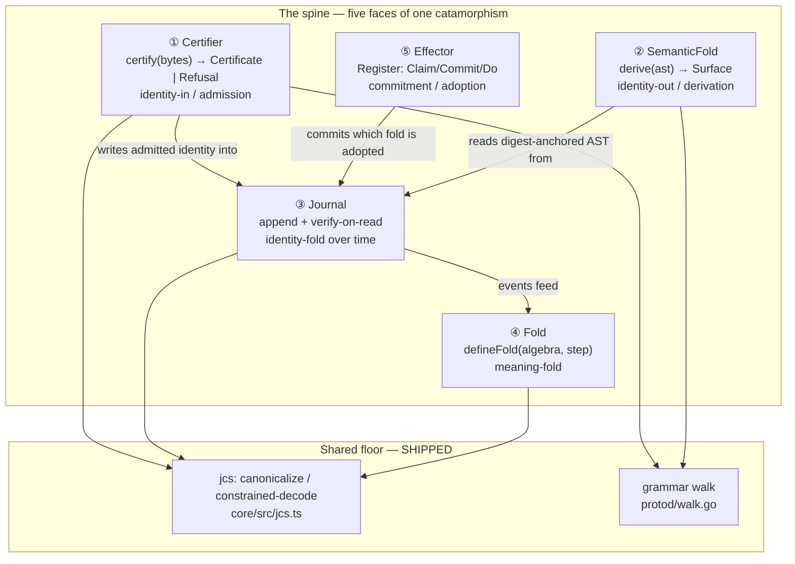
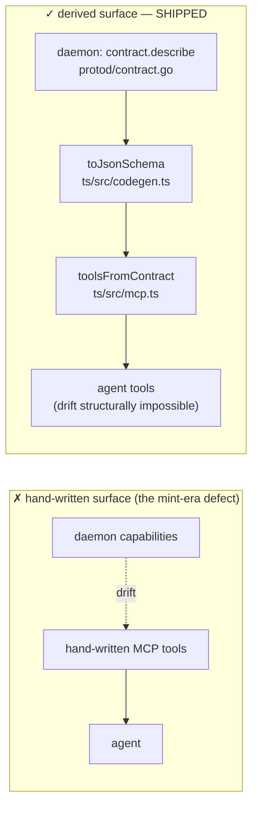
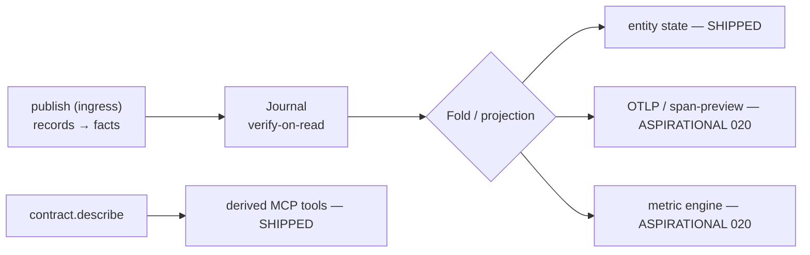

# The capstone as deep modules: one catamorphism, five faces, one writ

Author: architecture team (Opus), 2026-08-13, isolated worktree. **A design doc —
prose, interface signatures, and before/after seam diagrams only. No machinery.**
The architectural companion to the theoretical capstone
(`docs/design/2026-08-13-the-unified-fold.md`, branch
`worktree-agent-a09df0cf34f2ff0a3`): where that doc proves the four identity
mechanisms are one catamorphism, this doc renders that unity as a **map of deep
modules** and names the **agent-first integration surface** they present.

**Vocabulary is `codebase-design`, used exactly.** Module (interface +
implementation, scale-agnostic), Interface (everything a caller must know —
signatures, invariants, ordering, error modes, performance), Depth (leverage at
the interface — behaviour exercised per unit of interface learned; deep = small
interface + large implementation), Seam (where behaviour can be altered without
editing in place), Adapter (a concrete thing satisfying an interface at a seam),
Leverage (caller payoff), Locality (maintainer payoff). The **deletion test** is
run on every module: delete it — if complexity concentrates back into it, it
earns its keep; if the complexity merely relocates to N callers, it was a
pass-through. **One adapter is a hypothetical seam; two is a real one.** The
estate's ruled `Component`/`Unit` (CONTEXT.md R18) and Effect `Layer` (R19) keep
their own senses and are never used here as another word for a module.

**Labels throughout:** **SHIPPED** (walled or tested today), **RATIFIED-UNBUILT**
(decided, no build), **ASPIRATIONAL** (ticket-gated: 004 owned schema encoding,
008 workflow abstraction, 015 grammar foundry, 020 the Effect surface). Every
module is grounded in a real current seam with a file citation, or labelled
against its ticket.

---

## Section 1 — Current module landscape: a deletion-test scan

The scan walks the real seams named in the brief and returns a verdict per
module: **already deep** (earns its keep), **thin adapter** (shallow *by design*
— its thinness is the drift-proof property, not a failure), or **shallow**
(interface nearly as complex as implementation, or a pure function extracted for
testability while the bug lives at the call site).

### 1.1 Already deep — these earn their keep

**The Journal — `go/journal/journal.go`. SHIPPED.**
Interface: `Open`, `Append(payload) → (entry, outcome)`, `Read(from, max) →
(entries, cursor)`, `Head()`. Four verbs. Behind them: hash-chained CAS-append
against JetStream with idempotent-duplicate collapse (`journal.go:249-277`),
verify-on-read that recomputes every entry's digest and refuses a
canonical-but-broken chain as `ErrTampered` (`:203-217`), a shape gate that
refuses any stream importing messages or carrying an eviction policy
(`:298-333`), and a cursor that resyncs from a verified tail after a lost CAS
(`:282-290`). **Deletion test: complexity concentrates hard.** Delete the Journal
and every caller re-implements chain verification, the CAS race, and the shape
gate — and each would re-implement them *differently*, which is exactly the
"two implementations sharing a bug agree" hazard AGENTS.md warns against. This is
the **identity-fold catamorphism** made a module: `Read` is `⦇hash⦈` over the
event list, and its injectivity (modulo SHA-256) is what makes a head a checkable
claim.

**The Effector — `go/effector/effector.go`. SHIPPED.**
Interface: `Claim(digest, owner, lease) → Claim`, `Commit(claim, result) → first`,
`Lookup(digest) → (State, Outcome)`, and the composed `Do(digest, owner, lease,
effect) → (Outcome, first)`. Behind them: a monotone fence sequence, idempotent
commit that classifies a re-commit of identical bytes as a no-op and divergent
bytes as `ErrCommitted` (`effector.go:422-436`), a strict canonical-or-refused
decode of the authority value (`:446-463`), and the KV shape gate (`:465-478`).
**Deletion test: concentrates.** The exactly-once commitment logic — fence
supersession, the post-conflict re-read, "the commit was absorbed without a
stored outcome" recovery (`:317-319`) — has no natural second home. This is the
**commitment register**: not a catamorphism, but the seam that decides *which*
result is adopted when an author produces several.

**Constrained decode / canonicalize — `packages/core/src/jcs.ts`. SHIPPED.**
Interface: `encodeJsonValue(value) → CanonicalEncoding`, `decodeJson(bytes) →
JsonDecode`, `canonicalizeJson(bytes) → CanonicalJson`. Three verbs. Behind them:
RFC 8785 canonicalization, the constrained decoder that admits exactly one JSON
value (valid UTF-8 and scalars, unique member names, finite binary64, ≤256
nesting) and returns a typed refusal otherwise (`jcs.ts:16-27`), refereed by an
independent RFC 8785 Appendix B oracle (VERIFICATION.md R1). **Deletion test:
concentrates.** "Acceptance is part of identity — a decoder that repairs its input
is naming a different value" (CONTEXT.md) is one law with one home; scattered, it
would be re-litigated at every seam. This is the byte floor every other deep
module stands on.

**The grammar walk — `proto/go/protod/walk.go`. SHIPPED (interim, ticket-004
gated for the identity it produces).** Interface: `walkStructure(value, path) →
(walkResult, Refusal)` and its hole-permitting twin `walkPartial`. Two verbs.
Behind them: the entire `flb.type.v0` grammar — kind dispatch, exact-key
enforcement, union canonical-byte normalization and dedup (`walk.go:144-175`),
UTF-16 member ordering matching RFC 8785 (`:352-362`), ref collection for DAG
resolution, and path-precise teaching refusals (`structureRefusal`, `:364-380`).
**Deletion test: concentrates massively** — and note this is the shared deep
implementation behind *three* faces (Section 2.3): certify, the concierge, and
`contract.describe`. That three-way reuse is the strongest earns-its-keep signal
in the estate.

**The declared-algebra Fold — `packages/core/src/{fold,algebra,foldCache}.ts`.
SHIPPED, but consumer-gated.** Interface: `defineFold(algebra, step) → Fold`,
whose returned value exposes `fold`, `extend`, `zip`, `map`, `identity`. Behind
the two-argument constructor: the free-monoid lift, product and mapped
combinators, and a digest-keyed identity that licenses the invalidation-free
cache (`foldCache.ts:50-51`, "no invalidation state exists"). **Deletion test
today: complexity does not concentrate — because no non-test caller exists yet**
(the dossier's named risk). The Fold is *proven* deep but its leverage is
*unrealized*: one adapter (the wall) is a hypothetical seam. This is the single
most important gap in the landscape and it drives the Top Recommendation.

**The Entity collector — `packages/core/src/entity.ts`. SHIPPED.**
Interface: `makeCollector(backing, correlate) → Collector` with `ingest`,
`entity`, `anchors`. Behind it, `EntityView` carries **both folds at once** —
`head` (identity) and `state` (meaning) over one correlation key
(`entity.ts:30-37`). **Deletion test: concentrates**, and it carries the
landscape's sharpest *locality* story, quoted next.

### 1.2 Thin adapters — shallow by design, and correctly so

These modules are deliberately thin. Their depth lives in the seam they front
(ADR-0003: the boundary is data, not FFI; ADR-0006: SDK surfaces are derivation
targets). Thinness *is* the drift-proof property here — flagging them "shallow"
would misread the design.

**`toolsFromContract` — `proto/ts/src/mcp.ts:28-58`.** ~30 lines mapping each
`contract.describe` request to a tool schema via `toJsonSchema`. **Deletion test:
complexity relocates to nothing — it evaporates**, because the depth is entirely
upstream in `contract.describe` (the daemon) and `toJsonSchema` (the SemanticFold).
By the letter of the test this is a pass-through; by intent it is the *seam that
makes drift structurally impossible* (a daemon that grows a request kind grows a
tool, with no hand-written list to fall out of sync). Verdict: **correct thin
adapter, not a shallow module** — its whole value is that it adds nothing.

**`ProtoClient` — `proto/ts/src/client.ts:41-`.** The three-verb TS face
(`request`/`publish`/`read`). Mostly transport, with one piece of real logic:
`read` recomputes the chain locally and returns a `VerifiedRead` whose cursor is
"not the daemon's claim" (`client.ts:32-37`). Verdict: **thin adapter that
requests; authority is the daemon.** Exactly the ticket-002 narrow writ — the TS
side asks, the daemon decides.

### 1.3 Shallow — and the one live hazard the deletion test names

**The catalog resolve index — `proto/go/protod/catalog.go`.** Split verdict.
`catalog.create(...)` (`:82-168`) is **deep** — it *is* the interim Certifier
(canonicalize, derive, DAG-resolve refs, converge-or-append). But the catalog *as
storage* — `resolve`, `resolvableDigests`, the `byDigest` map rebuilt by
`Read` on open (`:37-56`) — is a **thin index over the Journal**: "the catalog is
just a journal plus a resolve index rebuilt by verify-on-read" (`catalog.go:15`).
Deletion test on the *index*: complexity relocates into Journal + a rebuild fold.
This is not a defect — it is the correct recognition that **the Catalog is not a
separate deep module; it is the Certifier writing into the Journal** (Section 2
merges it accordingly).

**The hazard, and its resolution — `packages/core/src/entity.ts:64-73`.** The
brief warns of "pure functions extracted only for testability while bugs hide in
the call sites." The estate hit exactly this and fixed it, and the fix is
instructive. `kvStep` is the walled meaning-step. Previously a *second, unwalled*
decoder lived in the entity call site; it "lossily mapped invalid bytes to U+FFFD
(colliding distinct payloads) and admitted NUL keys that later made `stateDigest`
throw" (`entity.ts:68-71`). The wall was green the whole time — the bug lived
**past** the tested interface, in the call site, precisely the anti-pattern. The
resolution was to make the call site delegate to the one walled step
(`applySync = (state, e) => kvStep(state, e) ?? state`, `:73`) and forgive
out-of-domain payloads as a meaning no-op. **Verdict: the hazard is real, was
found live, and the standing lesson is Section 4's mechanism** — one walled fold,
no second decoder at the call site.

### 1.4 Landscape summary

| Module (file) | Verdict | Capstone face |
|---|---|---|
| Journal (`journal/journal.go`) | Deep | identity-fold |
| Effector (`effector/effector.go`) | Deep | commitment register |
| jcs (`core/src/jcs.ts`) | Deep | byte floor |
| Grammar walk (`protod/walk.go`) | Deep (shared 3 ways) | admission / derivation |
| Fold (`core/src/{fold,algebra,foldCache}.ts`) | Deep, **leverage unrealized** | meaning-fold |
| Entity (`core/src/entity.ts`) | Deep | both folds at a key |
| SemanticFold (`ts/src/codegen.ts`) | Deep | derivation-fold |
| `toolsFromContract` (`ts/src/mcp.ts`) | Thin adapter (correct) | integration surface |
| `ProtoClient` (`ts/src/client.ts`) | Thin adapter (correct) | integration surface |
| Catalog index (`protod/catalog.go`) | Thin over Journal | (merges into Certifier + Journal) |
| Entity call-site decoder (was) | Shallow — **removed** | the Section-4 lesson |

**Count going in: eleven named seams. After the ruthless merge (Section 2):
five deep modules.** Catalog folds into Certifier-over-Journal; the Concierge
folds into the Certifier as its constructive face; jcs and the grammar walk
become the shared floor the five stand on; Entity is the Journal and Fold met at
a correlation key, not a sixth module.

---

## Section 2 — The spine: the tight minimal deep modules

The capstone's claim is that four identity mechanisms are **one catamorphism at
different algebras**. The architectural rendering is **five deep modules**, each
one face of that structure, plus the shared byte floor. A twelve-module map fails
the "smallest deepest set" test; this is the merge that survives.



The identity fold (Journal) and the meaning fold (Fold) are the same
catamorphism over the same event list at two algebras — the hashing algebra and
the declared monoid (the-unified-fold §1.2). The Certifier folds the *AST inward*
to identity; the SemanticFold folds the same AST *outward* to surfaces; they are
the abstract-syntax and concrete-syntax directions of one grammar (GF framing,
the-unified-fold §2.2). The Effector is the one non-fold: the register that
commits which result is adopted.

### 2.1 ① The Certifier — the one lawful admission point

**Interface.** `certify(bytes) → Certificate | Refusal`. That is the whole
interface a caller must learn: submit bytes, receive either a certificate (with
the daemon-derived digest and catalog position) or a refusal that is **data** —
path, law, got, expected, worked example, and next-hints — never a thrown error.
Invariants the caller inherits without learning them: the submitter is
**permanently untrusted** (W1 — every committed digest is recomputed from bytes,
`catalog.go:117-132`); refs must already resolve, so the catalog is a DAG with no
admission on faith (W4, `catalog.go:92-109`); same bytes converge rather than
error (W3, `:142-144`); the trusted base's size is published.

**Implementation (deep).** `catalog.create` over the `walk.go` grammar — the
merge of the interim certifier and the catalog. Today the identity is
byte-coarse `bytes-sha256-v1` over submitted canonical bytes; the ticket-004
build replaces the preimage with the exhaustive AST-fold that makes two
semantically identical schemas share identity, **without changing the interface**
— which is the point of putting the seam here.

**What varies across the seam.** The **scheme** — the function from canonical
bytes to identity (`activeScheme.Derive`, `catalog.go:117`; `scheme.go`). Today
one scheme is wired (`bytes-sha256-v1`). Ticket 004 is the second: the AST-fold
scheme. **Two schemes named, one wired ⇒ the seam is real by design, hypothetical
by population today** — the interface was cut *at the place ticket 004 will vary*,
which is why 004 is a re-pin behind the seam, not a rewrite of it.

**Deletion test.** Concentrates. Delete the Certifier and every ingress path,
every SDK, every agent re-implements "what is a lawful type and what is its
identity" — and the untrusted-synthesizer guarantee (the reason this lab exists)
evaporates into N inconsistent validators.

**Caller learns vs gets (leverage).** Learns: one function and the shape of a
refusal. Gets: RFC 8785 canonicalization, DAG integrity, union normalization,
UTF-16 ordering, byte-derived identity, and a teaching refusal for every way the
bytes could be wrong. Enormous depth. **Label: SHIPPED interim
(`proto/go/protod/catalog.go` + `walk.go`); the AST-fold identity is
ASPIRATIONAL (ticket 004).**

### 2.2 The Concierge is the Certifier's constructive face — merged, not separate

The brief lists the Concierge (hole/fill/frontier) as a candidate module. **It is
rejected as a separate module and merged into the Certifier**, because it satisfies
the *same grammar-walk seam* with `allowHoles = true` (`walk.go:40-42`,
`walkPartial`). Certify is all-or-nothing admission of a complete tree; the
Concierge is slot-by-slot construction *toward* admission:

```
fill(partial, path, subtree)  → { partial', frontier, next }   # protod/concierge.go:40
unfill(partial, path)         → { partial', frontier, next }   # protod/concierge.go:82
```

Every fill revalidates the *whole* partial through the same walk and returns
every remaining hole as a truthful frontier — so there are **no dead ends**: an
illegal fill refuses with the same path-precise teaching, a legal one advances
the frontier. `fill` followed by `unfill` at one path is an exact inverse
(`walk.go:139-142` preserves union positions for this).

**This is the two-adapters-means-a-real-seam test applied inside the Certifier.**
The grammar walk has two real adapters — `walkStructure` (certify) and
`walkPartial` (concierge) — plus a third consumer, `contract.describe`. The walk
is therefore genuinely deep and the Concierge is one *face* of admission, not a
twelfth module. Section 4 uses this face directly: the frontier is how a lossy
author is *taught* a lawful type slot by slot. **Label: SHIPPED
(`proto/go/protod/concierge.go`).**

### 2.3 ② The SemanticFold — derivation that cannot drift

**Interface.** `derive(ast, resolve) → Derived<Surface>` — realized today as
three sibling functions over one digest-anchored AST:
`toEffectSchema(structure, resolve) → Derived<Schema.Top>`,
`toJsonSchema(structure) → Derived<Record<string, Json>>`,
`toGoSource(structure, typeName, digest) → Derived<string>`
(`codegen.ts:136,235,319`). `Derived<A>` is `{ok:true, value} | {ok:false,
refusal}` — a derivation that cannot render its input returns a refusal as data,
not an exception.

**Implementation (deep).** Each target is a catamorphism over the same AST — the
concrete-syntax direction of the grammar whose abstract-syntax admission is the
Certifier. Because the input carries committed identity, each surface **cannot
drift**: it is a function of its input alone (ADR-0006; CONTEXT.md "Semantic
fold").

**What varies across the seam.** The **target algebra** — Effect schema, JSON
Schema, Go source today; GBNF/FSM, DDL, codecs under ticket 015. **Three real
adapters ⇒ a real seam, decisively.** This is the most-populated seam in the
estate and the cleanest demonstration that the "one input, many drift-free
surfaces" claim is built, not aspirational.

**Deletion test.** Concentrates. Delete the SemanticFold and every outside
surface becomes a hand-written port — the exact `ported`-surface hazard ADR-0006
exists to end (the surface census named the TS core as the standing ported
surface to eliminate).

**Caller learns vs gets.** Learns: one function per target and the `Derived`
shape. Gets: a wall-guaranteed surface derived from committed identity, plus (GF
reversibility, ticket 015) the eventual `parse ∘ linearize = id` law that turns a
translation between two DSLs into a derived, recomputable artifact. **Label:
`toEffectSchema`/`toJsonSchema`/`toGoSource` SHIPPED (`proto/ts/src/codegen.ts`);
GBNF/FSM and GF translation ASPIRATIONAL (ticket 015).**

### 2.4 ③ The Journal — the identity-fold substrate

**Interface.** `Append(payload) → (entry, outcome)`, `Read(from, max) →
(entries, verifiedCursor)`, `Head()`. The load-bearing invariant a caller must
know: `Read` **verifies on read** — the returned cursor is recomputed, a claimed
head is never trusted, and a broken chain is `ErrTampered` data. Append is
idempotent under content address (same bytes at a position collapse to
`Duplicate`).

**Implementation (deep).** Hash-chained CAS-append over JetStream with the shape
gate, the lost-CAS resync, and the tail-canonicality check at open. This is
`⦇hash⦈` over the event list — the identity catamorphism.

**What varies across the seam.** The **role and the backing** — authority vs
verified replica (ADR-0009), and the concrete store. **Two real adapters exist
today: the daemon's own journals *and* the catalog, which reuses the identical
substrate** (`catalog.go:15,37-56`). The seam is real. A third adapter is the
Section-3 projection consumer (ticket 020's `JournalMessageStorage`), which is the
Top Recommendation precisely because it is the load-bearing *external* second
adapter.

**Deletion test.** Concentrates hardest of all — every fact in the system, domain
and agent traffic alike, is a journal entry (ADR-0005). **Caller learns vs gets:**
learns three verbs; gets an append-only, tamper-evident, content-addressed history
whose lineage is a *query*, not a subsystem. **Label: SHIPPED
(`go/journal/journal.go`).**

### 2.5 ④ The Fold — the meaning-fold

**Interface.** `defineFold(algebra, step) → Fold<E, A>`. Two arguments in; out
comes `fold`, `extend`, `zip`, `map`, and an optional `identity`
(`fold.ts:27-37`). The invariants a caller inherits: a *declared* algebra + step
earns a digest, and a result keyed on `(fold digest, head)` is an **immutable
truth needing no invalidation** (`foldCache.ts:50-51`); an *anonymous* algebra
runs fine and refuses identity (nothing without a canonical form is cacheable).

**Implementation (deep).** The free-monoid lift, product/mapped combinators, and
the law suite that grants the rights (associativity ⇒ parallel replay, the monoid
action ⇒ O(1) extend, uniqueness ⇒ the invalidation-free cache; `foldLaws.ts`).

**What varies across the seam.** The **algebra** — the projection you fold with.
**Today: one real adapter (the wall). This is a hypothetical seam.** The Fold is
*proven* deep and carries the highest leverage-per-interface in the estate
(two arguments unlock cache + splittability + O(1) extension, all law-licensed) —
but with no non-test caller, that leverage is unrealized. Ticket 020's metric
engine is the second adapter that converts the seam from hypothetical to real.

**Deletion test.** *Today, complexity does not concentrate* — because deleting it
costs only test code. That is the honest reading and the whole argument of the
Top Recommendation: a deep module with no real second adapter is a promise, not
yet a payoff. **Label: SHIPPED but consumer-gated (`packages/core/src`); first
real consumer is ticket 020.**

### 2.6 ⑤ The Effector — the commitment register

**Interface.** `Claim(digest, owner, lease) → Claim`, `Commit(claim, result) →
first`, `Lookup(digest) → (State, Outcome)`, and the composed `Do(digest, owner,
lease, effect) → (Outcome, first)`. The invariant a caller must know: commitment
is **exactly-once under a fence** — a superseded claim is `ErrFenced`, a re-commit
of identical bytes is a no-op, a re-commit of *divergent* bytes is `ErrCommitted`
(`effector.go:422-436`). `Do` is the whole pattern in one call: look up, claim,
run the effect, commit, converge.

**Implementation (deep).** Fenced CAS over JetStream KV with the strict
canonical-or-refused authority decode and the KV shape gate.

**What varies across the seam.** The **effect being committed** — the `effect
func` passed to `Do`. One real caller pattern today (`watch.go`); a second
concrete adapter would make the seam real. Honestly: **the seam is real by
role but thinly populated by adapters today.**

**Why it earns spine placement despite not being a catamorphism.** The capstone
is folds; the Effector is a register. It belongs on the spine because it answers
the question the two-fold split *raises*: if a lossy author produces several
candidate results (retries, samples), and identity remembers all of them while
meaning forgives, **who decides which one is adopted?** "Nobody owns entity
folds; adoption of contested results is the effector's job" (NEXT.md). The
Effector is the commitment counterpart to the Journal's remembering — Section 4
turns on exactly this. **Label: SHIPPED (`go/effector/effector.go`).**

### 2.7 Why five and not seven — the merge ledger

- **Catalog → merged** into Certifier (its `create` path) writing into the
  Journal (its storage). Not a module; a use of two.
- **Concierge → merged** into the Certifier as the constructive face of the same
  grammar-walk seam (`walkPartial`). Not a module; a face.
- **Entity → not promoted.** `EntityView` is the Journal (head) and the Fold
  (state) met at a correlation key — a *composition* of two spine modules, not a
  sixth. It is where the two folds are demonstrated together, and Section 4's
  central mechanism, but it introduces no new deep interface.
- **jcs + grammar walk → the shared floor**, not spine. Every spine module stands
  on them; they are deep, SHIPPED, and correctly *below* the five.

Five deep modules, two floor modules. That is the whole capstone as architecture.

---

## Section 3 — The agent-first integration surface

The estate's ratified constraint is **AGENT FIRST** (NEXT.md R6): the primary
producer and consumer is an agent, and the primary interface is the daemon's
request surface. Human views are projections of that surface, never its source.
The integration surface is therefore not an SDK — it is **the daemon's writ,
presented as an MCP-derived deep module**.

### 3.1 The MCP-first API is a deep module: three verbs over the whole daemon

**Interface (what an agent must learn): three verbs.**

```
request(subject, body) → fact | {ok:false, refusal}     # daemon-owned subjects
publish(journal, frame) → admit | {ok:false, refusal}   # ingress
read(journal, from, max) → entries + locally-verified head
```

Plus a single bootstrapping verb, `contract.describe`, from which **the tool list
itself is derived** (`mcp.ts:28-58`). Everything else an agent needs — the type
grammar, the refusal shape, the next-hints — arrives *as data in the reply*.

**Implementation (deep): the entire daemon.** Behind three verbs sit the
Certifier, the Journal, the Effector, the grammar walk, and the concierge. The
seam is **data, not FFI** (ADR-0003): one entry point takes serialized data and
returns data plus digests; nothing throws across; the same request value works
over NATS, CLI stdin, or in-process.

**Before/after — why derivation, not a hand-written tool list:**



**What varies across the seam.** The **daemon's request set**. Add a request kind
to the daemon and a tool appears; there is no second place to edit. The TS side —
`ProtoClient` (`client.ts`) and `toolsFromContract` (`mcp.ts`) — is an **adapter
that requests**; the **authority is the daemon's deep implementation** (ticket-002
narrow writ). This is the Section-1 "thin adapter, correct" verdict cashed as the
integration story: the thinness is the guarantee.

**Deletion test.** Delete the derivation and you get the mint-era surface back —
hand-written tools that drift from the daemon, the two live MCP defects the
surface census recorded. Complexity does not just relocate; the *correctness
property itself* (structural non-drift) is lost. **Label: SHIPPED
(`proto/ts/src/{mcp,client,codegen}.ts`, `proto/go/protod/contract.go`).**

### 3.2 Workflow ingestion — records → journal facts

**The seam: `publish`** (`proto/go/protod/ingress.go`). Smallest possible
interface: a canonical frame `{type: digest, payload}` to `flb.ing.<journal>`,
request/reply, admitted or refused.

**What varies across the seam.** The **journal name** and the **claimed type
digest** — nothing else. Admission checks **identity resolution only** (ratified):
the claimed digest must be cataloged (W4); payload conformance against the
structure is explicitly *not* checked here — that arrives later as a
codegen-derived codec (`ingress.go:19-20`, admitNote). This is a deliberately
shallow *interface* over the deep Certifier+Journal pair: one verb, and the whole
"unknown identity never enters a journal; lag is absence, not admission on faith"
guarantee (`ingress.go:74-90`) rides underneath. **Label: SHIPPED (identity-only
admission); schema-aware codec conformance ASPIRATIONAL (gated behind ticket
004's derived codecs).**

### 3.3 Projection — journal folds → views / OTLP / span-preview

**The seam: `read` + the Fold.** A projection is a fold read over journal
traffic: `read(journal, from, max)` yields verified entries, and a declared Fold
turns them into a view. Lineage, spans, and metrics are "the same fold read at
different altitudes" (ADR-0005) — a span id *is* a segment's chain head
(CONTEXT.md "Span").

**What varies across the seam.** The **projection algebra** — the Fold you apply.
Entity KV-state is the one shipped projection (`entity.ts`). OTLP export, a
span-preview surface (a SemanticFold target), and the metric engine are the
aspirational adapters. **This is the Fold's hypothetical seam from Section 2.5,
viewed from the integration side: projection is where the meaning-fold finally
gets an external caller.** **Label: entity-state projection SHIPPED; OTLP /
span-preview / metric-engine projections ASPIRATIONAL (ticket 020).**



---

## Section 4 — How the architecture addresses lossy semantic context

The operator's third question: *what makes managing lossy LLM creatures hard, and
what in the module design answers it structurally?* The answer is that **the deep
modules absorb the lossiness at their interfaces, so the caller inherits a
guarantee it never has to reconstruct.** Four mechanisms, each tied to a module.

### 4.1 The two-fold split — identity remembers, meaning forgives

**Module: the Journal (identity) + the Fold (meaning), met in the Entity.**
An LLM is a stochastic author: ask twice, get two byte-different answers. The
architecture never asks a lossy author to be idempotent. Instead:

- **Identity remembers byte-exact.** Every call, every retry, every sample is a
  *new event* appended to the Journal with its own head. Nothing is overwritten;
  the chain distinguishes every distinct output (injective modulo SHA-256).
- **Meaning forgives.** The Fold collapses histories that agree in state:
  `ĝ(u) = ĝ(v)` even when `head(u) ≠ head(v)`. The information the chain remembers
  that the fold forgives is exactly `ker(ĝ)` (the-unified-fold §1.2).

`EntityView` carries both at once (`entity.ts:30-37`), and the live mechanism is
the `applySync` comment (`entity.ts:64-73`): an out-of-domain payload is
**forgiven as a meaning no-op — the head still commits to it**, so the chain
remembers what meaning drops. **This is the exact place a second, unwalled
decoder once hid a bug (Section 1.3); deleting it and delegating to the one
walled step is the two-fold split enforced in code.** A retried stochastic call is
a new fact, never an overwrite — and that is a property of *where the seams are*,
not of discipline asked of the model.

### 4.2 Teaching refusals — admit or teach, never trust

**Module: the Certifier (all-or-nothing) and its concierge face (slot-by-slot).**
A lossy author emits ill-formed structure. The architecture makes that *lawful to
handle* without trusting it:

- **The Certifier admits or teaches.** `certify` returns a certificate or a
  refusal that is data — `{path, law, got, expected, example, next}`
  (`walk.go:364-380`). W8 holds across every seam including MCP: a refusal is a
  tool-result value, never a protocol error (`mcp.ts:79-88`). The
  `mcp.test.ts` typo→self-repair path is this working: the model reads the path
  and the example and fixes its own output.
- **The Concierge constructs with no dead ends.** `fill`/`unfill` revalidate the
  whole partial and return the truthful frontier of remaining holes
  (`concierge.go:40-120`). An LLM builds a type slot by slot; every illegal move
  is refused with teaching, every legal move advances the frontier. **This is
  load-bearing, not UX:** positive-example-only grammar authoring is unlearnable
  in principle (Gold 1967), and Angluin's L* escapes only via a minimally adequate
  teacher — the daemon *is* that teacher (the-unified-fold §2.4).

The guarantee the caller inherits: **an agent cannot emit an invalid message** —
`certify` refuses at the admission seam, and the refusal tells it exactly how to become
valid. Lossiness is absorbed at the interface.

### 4.3 Certified construction — sample freely, admit only what proves

**Module: the Certifier seam.** The trust architecture is: whoever synthesized the
bytes is **permanently untrusted**, the trusted base is small and its size is
published, and there is **no second admission path** (CONTEXT.md "Certifier"; W1,
`catalog.go:117-132`). An asserted identity the daemon cannot re-derive is
refused (`KindDigestMismatch`). So the workflow is: let the model sample, hallucinate,
retry as freely as it likes — **nothing it claims about identity is believed;
only what the certifier re-derives from bytes is admitted.** This is
translation-validation applied to a stochastic author (Jourdan–Pottier–Leroy,
the-unified-fold §2.1): an untrusted synthesizer, a small proved certifier.

### 4.4 Adoption — which forgiven result is committed

**Module: the Effector.** The two-fold split leaves one question: when a lossy
author produces several candidate results and identity remembers them all, which
one does downstream *adopt*? The Effector answers it with a fenced,
exactly-once commitment (`effector.go:186-246,272-321`): `Do` claims the work
digest, runs the effect, and commits **one** outcome; a divergent re-commit is
refused. So the lossiness is remembered (Journal), forgiven where meaning permits
(Fold), and **resolved to a single adopted result where a decision is required
(Effector)** — three modules, three answers, no trust in the author at any step.

### 4.5 The unifying claim

The deep modules are **what let you build fluently on top of a lossy author with
proof-level confidence.** The interface absorbs the lossiness; the caller inherits
the guarantee:

| Lossy-author problem | Absorbing module | Guarantee inherited |
|---|---|---|
| Non-idempotent output | Journal + Fold (two-fold split) | retry is a new fact, never an overwrite |
| Ill-formed structure | Certifier + concierge face | admit-or-teach; cannot emit invalid |
| Unbelievable self-claims | Certifier (W1) | only re-derived identity is admitted |
| Divergent candidates | Effector | exactly-once adoption under a fence |
| Drift in generated surfaces | SemanticFold | derived-from-identity; cannot drift |

The claim, sized to its evidence, matches the capstone's honest cap: the modules
give **recomputability of what was built, never fidelity to intent** (the-unified-
fold §4). The interface absorbs the lossiness up to the semantic gap and stops
there, cleanly and admittedly, at meaning.

---

## Top recommendation — build `JournalMessageStorage` (ticket 020) first

**The single deepest module to build first is the ticket-020 Effect surface,
concretely the `JournalMessageStorage` adapter — the Journal presented as the
backing store for Effect's durable-execution `WorkflowEngine`.** The argument is
on depth, not on the map's ordering.

**Why it, on depth.** Three spine modules are *proven deep but have only a
hypothetical seam* — one adapter each: the Fold (only the wall calls it, §2.5),
the projection path (only entity-state, §3.3), and the Effector-as-activity-
register (only `watch.go`, §2.6). A hypothetical seam is a promise; a deep module
with no real second adapter delivers *no realized leverage*. `JournalMessageStorage`
is the **one build that converts all three hypothetical seams to real
simultaneously**:

- It gives the **Journal** its load-bearing *external* second adapter — the
  identity-fold substrate becomes Effect's `MessageStorage`/durable log, so the
  same verify-on-read history that carries domain traffic carries durable
  workflow state (the workflow-replay design's seam finding:
  `WorkflowEngine.activityExecute` returns `Complete | Suspended`, and foldlab's
  proven register plugs into that disjunction).
- It gives the **Fold** its first non-test consumer — the metric engine is a
  declared algebra folded over journal traffic, retiring the dossier's named
  missing-consumer risk (the-unified-fold §3, "Aggregation").
- It gives the **Effector** its second adapter — activity commitment is exactly
  the fenced exactly-once register, now driving `activityExecute` replay.

**Depth math.** The Fold's interface is two arguments (`defineFold(algebra,
step)`) and its latent leverage is the largest in the estate (cache +
splittability + O(1) extension + `zip`/`map`, all law-licensed). Every other
build spends interface to add implementation; **020 spends almost no new interface
and *activates* implementation that is already shipped and walled.** That is the
highest realized-leverage-per-unit-of-new-interface available — the definition of
the deepest next move.

**The honest caveat.** NEXT.md names ticket **004** (the AST-fold structural
digest) as the critical *path* — everything downstream of *identity* waits on it,
and it is the Certifier's real second scheme (§2.1). The two do not conflict:
004 deepens the Certifier's *identity* (byte-coarse → AST-fold) while 020 realizes
the Journal/Fold/Effector *leverage* that is already proven. If the estate can
carry one build, 020 turns the most already-paid-for depth into caller payoff and
converts three hypothetical seams to real; 004 is the prerequisite for the
*derivation* half (codecs, span-preview conformance) and should follow directly.
Build the module whose depth is already proven and only its second adapter is
missing: **`JournalMessageStorage`.**
