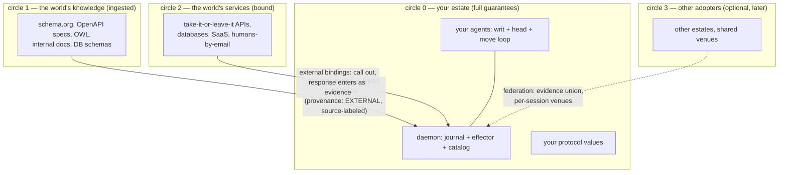

# The adoption boundary: what the protocol requires of whom

2026-08-14, answering the operator's grounding question: "what of this
protocol is required of the one who wants to build an agent on it, and
what is required of the rest of the world?" Companion to the
[agent-surface dossier](2026-08-14-agent-surface-production-shape.md)
and the [lit synthesis](../research/2026-08-14-lit-synthesis.md)
(D1–D6 ratified).

## The one-sentence answer

**The rest of the world is required to change nothing; the protocol
binds only the participants who want their interactions to carry its
guarantees — and the guarantees are about YOUR understanding of the
world, which no take-it-or-leave-it API can prevent you from having.**

## The four circles

**Circle 0 — the participant's obligations (your agents).** An agent
owes: speak in moves against cataloged types (the writ), read by
folding (the head), repair on refusal, respect seats. That is the
whole contract. In exchange: every action journaled, every belief
provenance-carrying, every decision fenced, replay and lineage free.

**Circle 1 — the world's knowledge: ingested, never consulted
live-as-oracle.** An OpenAPI spec, a schema.org vocabulary, a DB
schema, a policy PDF — each is a machine-readable meaning source that
translates (once, at ingest, through the certifier) into catalog
values. Nothing is required of the source. Two disciplines from the
sweep: (a) provenance labels distinguish the source's own claims from
the constraint layer WE add (the schema.org caution — agents must not
mistake house policy for world knowledge); (b) ingested evidence is
EXTERNAL-typed (D5): "so-and-so told me," never a local justification.

**Circle 2 — the world's services: external bindings.** The world says
"here is an API, take it or leave it" — and we take it, exactly as it
is. A call is an external binding (work-digest idempotent, ratified in
the effect-bridge grill); the response enters the journal as EXTERNAL
evidence with source, time, and request digest. The API's side stays a
black box; OUR side of every interaction is journaled, typed, and
replayable. This is the point the operator was reaching for: **we
cannot make the world verifiable, and do not need to — we make our
understanding of the world verifiable.** When the API lies or drifts,
the journal shows exactly what we were told, when, and what we did
because of it. No agent framework offers that audit today.

**Circle 3 — other adopters.** Only here do shared venues, seat
assignments across orgs, and federation matter — and it is entirely
optional and late. The system is fully useful at circles 0–2.

## The primary deployment IS the org-internal case

The operator's own scenario — "autonomous agents acting within a
company, trusted, but you still need to understand their behavior" —
is not a consolation use case; it is the design center. The machinery
is not about distrust; it is about **legibility**: behavior understood
not by reading prompts but by reading the journal. What did the agent
believe when it acted? Fold to its head. Why did it act? The move's
provenance. Who decided the contested thing? The fence record. What
would happen if we re-ran it? Replay, under theorem. The LLM stays
quarantined to proposing among frontier-legal moves, so "autonomous"
never means "unaccountable."

## Multi-fence: already the architecture, with one bright line

The operator asked whether multi-fence can be multiple nodes, all
stream-based. Answer: **many fences is the existing design — the
effector is already one seat PER REGISTER (per work digest), not one
global node.** Fences shard freely: per hole, per protocol instance,
per venue, across nodes. The literature license is directionality
(Baroni–Giacomin, lane 2): disputes in one region cannot un-decide
another, so shard-local fencing is sound. And a fence IS a stream
consumer — it reads dispute facts and emits decision facts; nothing
about it is special except its seat authority.

The one bright line: **one hole-instance, one seat.** Multiple nodes
deciding the SAME hole is consensus, and the sweep priced the lawful
designs if that is ever wanted: quota rules above (k−1)/k, or
status-quo-unless-unanimous — never premise-based (path-dependent,
would break fence determinism). Until a protocol declares such a rule,
"multi-fence" means sharded single seats, which scale horizontally and
need no new theory.

## The true infrastructure list (what must exist for this to be useful)

| # | Piece | Status |
| --- | --- | --- |
| 1 | The daemon: embedded NATS, CAS journal, effector, catalog — one process | Substantially shipped (go/, proto/); hardening list known |
| 2 | The protocol value + certify walk (holes, seats, fence rule, stability tiers, liveness assumption) | THE grill; the one genuinely new object |
| 3 | The agent loop (fold → frontier → propose → submit) + the stable-watch surface (D6 constraints) | Concierge is the sequential precedent; E2 the concurrent toy |
| 4 | Binding adapters: OpenAPI/HTTP → external binding; ingest translators (JSON Schema, schema.org fragments) → catalog values | The practical meat of usefulness; unglamorous, well-understood |
| 5 | SDK + MCP derivation (author agents, connect tools) | Derivation over shipped patterns |
| 6 | The gauntlet (schedule exploration in CI; protocol convergence probe) | E2 harness graduates |

Nothing on the list requires world adoption, a consortium, or a new
wire standard. Items 2–4 are the build; item 4 is where "ingest the
rest of the world's knowledge" becomes concrete engineering
(an OpenAPI document is already a machine-readable type source — the
translator is ordinary code feeding the certifier).
