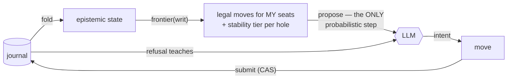
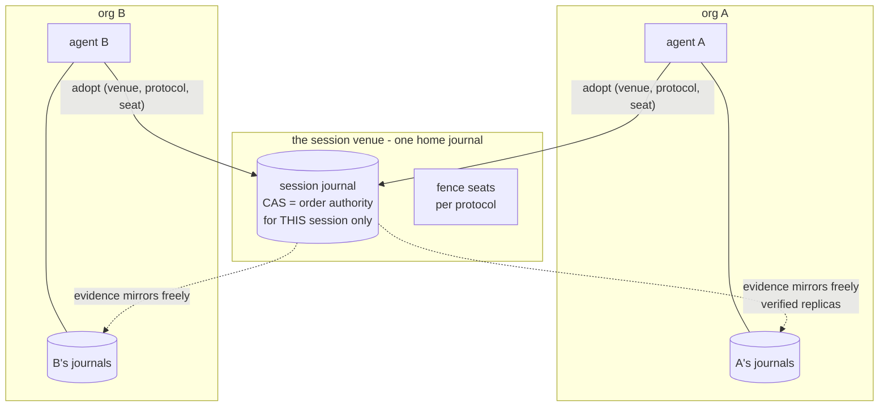
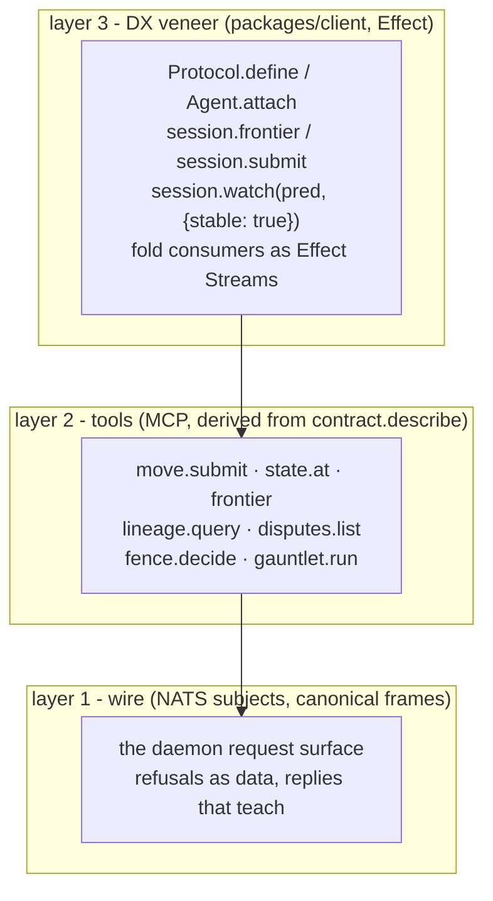

# The agent surface: production shape, the user-facing API, and where the meat is

2026-08-14, third document of the post-retirement study lane. Companions:
the E2 record (+ stability addendum) and
[the production-primitives dossier](2026-08-14-meaning-primitives-production.md).
Status: design analysis; build items remain proposals behind their named
grills. The verify/moves Lean increment is ratified and specced
(scratch/codex/48-moves-model.md, scratch-local).

## 1. The scenario, walked: an agent that talks to a user and a database

The operator's grounding case: "my agent needs to confer with a user and
do database requests; my agent just supplies intents — my view of what I
believe (my ontology) — and then I fold over the state stream."

The load-bearing observation: **neither the user nor the database needs a
special channel.** Both are already shapes the estate ratified:

- **The user is a seat.** Conferring with a user is not an out-of-band
  interaction: the user is a holder with a writ, typically holding FENCE
  seats (decisions) and some fill seats. The concierge dance already
  demonstrated this — "no, the ID is a UUIDv4" was a human overruling a
  fill, i.e., exercising a seat. A user interface is a projection of the
  frontier (which holes are open, which stable states were reached,
  which decisions await my seat) — AGENT FIRST's "human views are
  projections" applied literally.
- **The database is an external binding.** Ratified in the effect-bridge
  grill: bindings classify pure / internal / external; an external
  binding carries a work digest as its idempotency key, its result
  enters the journal as an evidence fact with provenance, and retries
  are attempt-indexed. A DB read is evidence entering meaning; a DB
  write is an effect the fence must have decided.

So the agent's whole loop is:



The LLM is quarantined to one arrow: choosing among moves the frontier
already proved legal. It never touches identity, order, or authority.
That is the original vision sentence — "verify human intention through
structure, not through probabilistic output" — as an architecture.

**"My ontology" =** the writ's type digests (what I may speak) plus my
head (what I have seen). An agent is (head, writ); its knowledge is a
fold, its crash loses nothing, its rehydration is a query.

## 2. What the CAS means here: the venue, not the federation

The operator's question: "the CAS must represent some federation to
which I've agreed to enter?"

Almost — with one correction that keeps the ownership model intact.
**There is no federation-wide CAS, and there must never be one.** A CAS
is per-journal, and a journal is single-homed (per-daemon authority,
ADR-0009). What you agree to when you enter a shared session is not a
global order authority — it is a **venue**: one home journal that
linearizes THIS conversation, plus a protocol digest, plus a seat
assignment. Entering is an ADOPTION — the workflow design's "the only,
local, decision" — and it is per-session, revocable, and cheap to exit,
because everything in the venue is content-addressed evidence you
already hold a copy of: leaving costs nothing epistemically.



The sort stays exactly the ratified three-way split: **evidence**
federates freely across the dotted lines (equal bytes, equal digests,
anywhere); **decisions** single-home at the venue's fence seats;
**absence** is a typed refusal. Choosing a venue is choosing where
contracts are signed — a neutral third daemon is a legal venue when
neither org will home the other's session. Cross-venue consistency is
deliberately NOT offered: two sessions are two histories, related only
by the evidence they share. That refusal is a feature; a global order is
the thing this architecture exists to not need.

## 3. The user-facing API, layer by layer

Three layers, each derived from the one below it (ADR-0006: derived
adapters, never hand-written ports):



What the TS surface should feel like (sketch, not committed API — every
name below goes through the lawful-surface admission rule, ADR-0010):

```ts
// Authoring: a protocol is a VALUE with a digest
const OrderProtocol = Protocol.define({
  holes: {
    "order.id_format": { seats: ["buyer", "seller"], stability: "at-decision" },
    "order.currency":  { seats: ["buyer"],           stability: "at-fill" },     // single seat
  },
  fence: { seat: "operator", rule: "min-candidate" },
})

// An agent is (head, writ) attached to a venue
const me = yield* Agent.attach(venue, { seat: "buyer", ontology: [OrderTypes] })

// The loop: fold -> frontier -> propose -> submit
const frontier = yield* me.frontier()             // legal moves + stability tiers
yield* me.submit(Move.fill("order.currency", { code: "USD" }))

// The consumer: hooks admit ONLY stable predicates by construction
yield* venue.watch(
  (s) => s.decided("order.id_format") && s.stable("order.currency"),
  { onRise: fulfill },                            // unstable predicate = typed refusal
)

// External world: a DB call is an external binding, idempotent by work digest
const row = yield* me.evidence(Db.query(sql), { binding: "external" })
```

The stability law is enforced IN THE TYPES: `watch` accepts predicates
built from a combinator set that can only express stable properties
(decided, single-seat-filled, monotone conjunctions thereof) — the E2
consumer refutation made unstable hooks a refusal, not a footgun.

## 4. Where the meat of the engineering is (ranked)

| # | Work | Why it is the meat | Exists today |
| --- | --- | --- | --- |
| 1 | **The protocol value + its certify walk** — holes, seats, fence rule, stability tiers, as one cataloged type | The one genuinely new core object; everything above types against it. Its grill decides the product | Nothing (grill specced as increment 3) |
| 2 | **The watch/subscription surface with stability tiers** | The consumer API is the product's face; the stability combinators are the novel DX (no framework offers "hooks that cannot observe transients") | Fold algebra + stream bindings exist; the stable-predicate layer does not |
| 3 | **Session runtime on the daemon** — move dispatch, frontier, seat enforcement | The concierge generalized from one hole-filler to many seats; C1–C5 must survive concurrency | proto/ concierge (sequential), journal, effector — substantial |
| 4 | **External bindings + durable execution** (tickets 008/020) | Where DB/user-effects meet leases, work digests, replay; the engine the replay theorem pre-licensed | Designed + grilled; effector shipped; engine unbuilt |
| 5 | **DX veneer + MCP derivation** | Adoption lives or dies here, but it is derivation, not invention | contract.describe pattern proven in proto/ |
| 6 | **The gauntlet instrument** | CI + agent-facing "does my protocol converge?" — the trust story | E2 harness (scratch) is the seed |

Reading the column on the right honestly: the substrate is mostly built
and partly proved; the meat is layers 1–2 — one new value shape and one
new subscription discipline — and then the already-designed engine.
This is a smaller mountain than it looked before the study lane started.

## 5. Sequenced next steps

1. **verify/moves** (dispatched, task 48): the five theorems + two
   machine-checked violations, upgrading E2 from tested to proved at
   model scale — including `decided_stable`, which is what makes the
   `watch` combinators sound.
2. **The protocol-value grill** (operator + coordinator): holes, seats,
   fence rules, stability tiers — armed now with the stability law as a
   forcing constraint.
3. **The gauntlet graduation**, which then tests protocol values as they
   appear.

The workflow engine slots in behind these exactly where the ratified
roadmap already put it.
