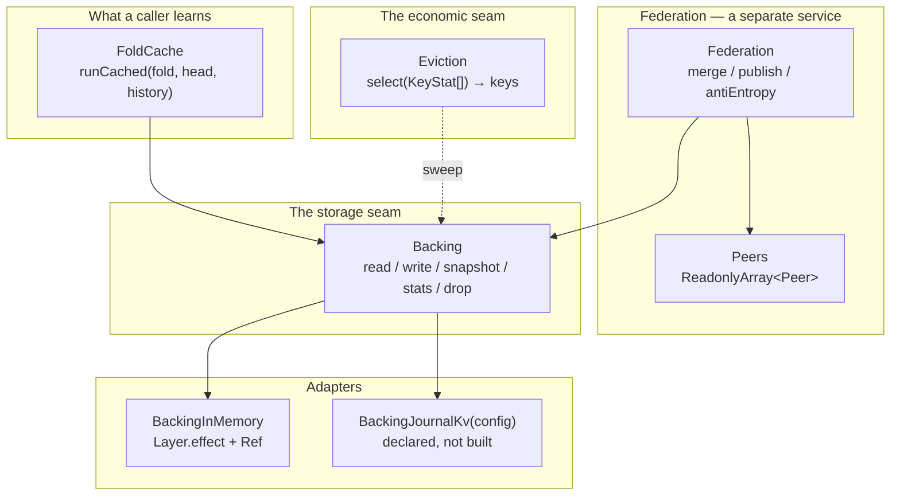

# FROM OPERATOR-DIRECTED RESEARCH — the federated fold cache as Effect services

Author: systems design (Opus), 2026-08-14, isolated worktree. The operator's ask
was "have a few agents sketch out a federated cache as services with effectful
layers." This doc carries the two-interface comparison, the chosen design, the
Layer stack, and the laws. **The sketch compiles and its laws run**:
`packages/cache/` — seven source modules and one law suite, green under the
repository's own gates (§8).

Vocabulary is `codebase-design`, used exactly: module, interface, seam, adapter,
depth, leverage, locality. Effect's `Layer` keeps its own sense (CONTEXT.md R19)
and is never used here as another word for a module.

---

## §0 — The theorem, and everything it deletes

A fold-cache key is `(fold digest, chain head)` — the fold's digest names the
computation and the head names the exact history it ran over
(`packages/core/src/foldCache.ts:2-10`). The fold is a function of those two
things. Therefore **an entry's bytes are determined by its key**, and the
consequences fall out rather than being engineered:

- **Union of two caches is a join-semilattice.** Idempotent, commutative,
  associative — by construction, not by protocol. Two nodes exchanging entries
  in any order, any number of times, with any duplication, converge. There is no
  vector clock, no version, no tie-break, no last-writer-wins.
- **A collision is not a merge conflict; it is proof.** Two different byte
  strings under one key cannot both be the fold's answer. One side is corrupt or
  SHA-256 broke. The only wrong move available is to resolve it — picking a side
  is how a corrupt entry becomes the network's consensus.
- **Federation is coordination-free.** Gossip needs no leader, a partition
  causes staleness and never divergence, a replayed exchange is a no-op.
- **There is no invalidation and no eviction *correctness* concern.** A longer
  history has a different head and therefore a different key. Eviction is purely
  economic (§5).
- **Verification on read is available**, so an untrusted peer is safe: re-fold
  the offered history and compare bytes. The lie is caught locally, on first
  read, without asking anyone (§4).

Everything below is an attempt to *not squander* that. The design's whole job is
to keep those properties reachable from an interface small enough that a caller
cannot step around them.

---

## §1 — Design it twice

### 1.1 Interface A — the KV shape: `get` / `put` / `merge`

```ts
interface FoldCacheKV {
  readonly get: <A>(fold: Fold<StreamEvent, A>, head: Head) => Effect<Option<A>, Refusal>
  readonly put: <A>(fold: Fold<StreamEvent, A>, head: Head, value: A) => Effect<void, Refusal>
  readonly merge: (remote: Snapshot) => Effect<MergeReport, Refusal>
}
```

Three verbs, each obvious. It is the shape the core module already has
(`putFoldCache`/`getFoldCache`, `foldCache.ts:184,224`), lifted into a service.

**What the caller must learn**: that a key exists at all; that a miss is a
success and not an error; that `put` after `get` is their job; that the fold
they pass to `get` must be the same fold they pass to `put`; and — the sharp one
— **what to do on a miss**. Every call site writes the same four-step dance.

**Why it is shallow.** Run the deletion test on the service: the complexity does
not concentrate, it *relocates to N callers*, and each caller re-implements the
dance slightly differently. Worse, it is the estate's own live hazard reappearing
by name. `entity.ts` shipped a bug where a second, unwalled decoder lived at the
call site while the walled fold stayed green
(`packages/core/src/entity.ts:64-73`); the resolution was to make the call site
delegate to the one walled step. Interface A re-opens exactly that door: the
compute-on-miss path is written outside the module, so the cache can be green
while two callers disagree about what a key means.

**Where it is right.** Below the seam. A store genuinely is a key-value thing,
and the adapter that owns bytes needs precisely these verbs. Interface A is not
wrong; it is at the wrong altitude.

### 1.2 Interface B — the fold-through shape: the cache *is* the fold runner

```ts
interface FoldCacheShape {
  readonly runCached: <A extends FoldState, EH = never, RH = never>(
    fold: Fold<StreamEvent, A>,
    head: Head,
    history: Effect<ReadonlyArray<StreamEvent>, EH, RH>,
  ) => Effect<A, IdentityUnavailable | CorruptEntry | EH, RH>
}
```

One verb. The cache is not an argument, not a return value, and not a concept
the caller holds. There is no `get`, so there is no miss to handle; no `put`, so
there is no write to forget; no key, so there is no second key rule.

**The history is passed as an Effect and is read only on a miss.** That is the
move that makes the interface honest about cost: a caller reading a journal
already has a verified head (ADR-0009, verify-on-read), and on a hit the events
are never enumerated — a hit costs one store read and one entry check regardless
of how long the history is. It is testable, and it is tested
(`packages/cache/test/cache.laws.test.ts:107`).

### 1.3 The comparison, and the pick

| | A — KV `get/put/merge` | B — fold-through `runCached` |
|---|---|---|
| **Interface size** | 3 verbs + key concept + miss semantics + a compute contract the caller owns | 1 verb, no cache concept |
| **Depth** | Shallow: implementation ≈ a map with refusals; the interesting behaviour is at the call sites | Deep: memo, canonical-entry check, verification policy, degradation rules, write-collision surfacing — all behind one signature |
| **Leverage** | Caller learns 3 verbs, gets a map | Caller learns 1 verb, gets the memo *and* federation *and* verification *and* eviction, none of which appear in the signature |
| **Locality** | The key rule, the miss policy, and the write policy live at every call site | All three live in one module; a change to any is a change in one file |
| **Failure mode when misused** | Silent: a cache that never hits, or hits on the wrong thing | Structurally unavailable: there is no misuse to commit |
| **Federation cost to a single-node user** | `merge` is on the interface everyone reads | Federation is a different service the single-node user never provides or names |

**Chosen: B.** Rejected: A — three verbs the caller must sequence correctly is
three chances to relocate the bug to the call site, which is the exact hazard
`entity.ts:64-73` already cost this estate once.

**A is not deleted, it is demoted.** It survives as the `Backing` seam
(`packages/cache/src/backing.ts:50-72`), where it is the right shape and where
its callers are two modules in this package rather than every consumer in the
estate. This is the doc's one structural claim about interface design: *the KV
shape is a storage interface that had been mistaken for a cache interface.*

---

## §2 — The full interface

### 2.1 Invariants

1. **A key is derived in one place.** `runCached` calls
   `foldCacheKey(fold, head)` (`packages/core/src/foldCache.ts:150`), newly
   exported from the core module precisely so this package does not restate the
   rule. This is the only change made to `packages/core` and it is
   law-licensed: the fold is a function of computation and history, both of
   which already have names, so the pair names one result. A second derivation
   would not fail loudly — it would silently never hit, or hit on the wrong
   thing.
2. **An entry is the canonical encoding of a fold state, or it is refused.**
   Checked on every read and on every absorbed peer entry
   (`packages/cache/src/entry.ts:32`). Canonical form gives each value exactly
   one byte string, so `decode` then `encode` is the identity on honest entries
   and on nothing else.
3. **One key means one result.** A write of identical bytes succeeds
   (idempotence — which is what lets merge be nothing but repeated write); a
   write of different bytes is refused, never resolved
   (`packages/cache/src/backing.ts:62-66`).
4. **A returned value is rebuilt from bytes**, never shared out of the store, so
   a holder cannot edit what a later reader sees — the property the core cache
   gets by parsing on read.
5. **`head` is the head of `history`.** The one precondition the caller owns; it
   is stated rather than assumed, because checking it costs exactly what not
   caching costs. `FoldCacheVerified` checks it anyway, as a side effect of
   re-folding.

### 2.2 Error modes — and the line that matters

`runCached` fails **two** ways, and both mean something is *wrong*:

| Refusal | Raised when | Why it is not economic |
|---|---|---|
| `IdentityUnavailable` | the fold has no admitted name (anonymous algebra or step) | the request cannot be asked; the reason is copied verbatim from core so the caller learns *which half* to declare |
| `CorruptEntry` | bytes are not canonical / a key already names different bytes / a hit disagrees with a fresh fold | evidence that a store, a wire, a peer, or a hash is broken |

Everything else **degrades to a miss**, which is the theorem spent as an
engineering rule:

- A backing store that cannot be reached is a miss
  (`packages/cache/src/foldCache.ts:73-76`). Unreachability costs the fold it
  would have saved and cannot change an answer, so it is not in the error
  channel of the read path. It *is* in `Backing`'s and `Federation`'s channels,
  where an operator needs to hear it.
- A fold state with no canonical form is a permanent miss
  (`packages/cache/src/foldCache.ts:100-103`): the fold ran, so the answer is
  returned; a naming limit does not become a failure.
- A collision discovered while writing our *own* honest result is **not**
  degraded — it is surfaced (`packages/cache/src/foldCache.ts:105-112`), because
  it is the same evidence as any other collision.

### 2.3 Performance contract

| Path | Cost |
|---|---|
| hit (`FoldCacheLive`) | one backing read + one decode/re-encode of the entry. **The history is never enumerated.** |
| miss | one history read + one fold O(\|events\|) + one encode + one backing write |
| hit (`FoldCacheVerified`) | a miss's cost, plus the entry check. The memo becomes an assertion; safety is bought with the *saving*, never with correctness |
| merge of a peer snapshot | one entry check + one read + at most one write per offered key; repeats absorb nothing |
| sweep | one `stats` + one policy call + one `drop` |

The head is *not* computed here. A caller that must compute a head walks its
history to do it (`stream.ts:115`), which is why the head is an argument: the
cache saves the fold, and only a caller who already holds a verified head can
collect that saving.

---

## §3 — The Layer stack



The composition, verbatim from `packages/cache/src/layers.ts:22-64`:

```ts
/** One process, one map: the whole stack a single-node user needs. */
export const LocalFoldCache: Layer.Layer<FoldCache> =
  Layer.provide(FoldCacheLive, BackingInMemory)

/** One process, every hit re-folded against the history it is handed. */
export const VerifiedFoldCache: Layer.Layer<FoldCache> =
  Layer.provide(FoldCacheVerified, BackingInMemory)

/** Many nodes. Verification is not optional: peers are untrusted by construction. */
export const FederatedFoldCache = (
  peers: ReadonlyArray<Peer>,
): Layer.Layer<FoldCache | Federation> =>
  Layer.provide(Layer.merge(FoldCacheVerified, FederationLive), [
    BackingInMemory,
    PeersOf(peers),
  ])

/** The same stack over durable storage — the only type-level difference is the
 *  BackingUnavailable that opening a remote store can produce. */
export const DurableFederatedFoldCache = (
  config: JournalKvConfig,
  peers: ReadonlyArray<Peer>,
): Layer.Layer<FoldCache | Federation, BackingUnavailable> =>
  Layer.provide(Layer.merge(FoldCacheVerified, FederationLive), [
    BackingJournalKv(config),
    PeersOf(peers),
  ])
```

Three facts this composition is designed to make true:

- **`runCached` is written once and does not know which stack it is in.** No
  flag reaches it and no branch inside it names a deployment. A node moves from
  local to federated by changing the Layer it is built with, and by nothing
  else.
- **Both services share one store because Layer memoization gives them one.**
  The cache reads what federation absorbed because they *are* the same map — not
  because two wirings were kept in agreement.
- **A single-node user never provides `Peers`, never names `Federation`, and
  never sees `Snapshot`.** Federation is not a mode of the cache; it is another
  service over the same seam.

Pinned-API notes (all confirmed against `repos/effect/packages/effect/src/`, per
AGENTS.md, never memory): services are `Context.Service<Self, Shape>()("id")`
(`Context.ts:201`); layers are `Layer.effect(Key)(effect)` (`Layer.ts:1014`),
`Layer.sync` (`:926`), `Layer.provide` (`:1432`), `Layer.merge` (`:1299`); the
anti-entropy loop is `Stream.fromSchedule(Schedule.spaced(interval))`
(`Stream.ts:1304`, `Schedule.ts:1198`) through `Stream.mapEffect` (`:1821`);
degradation uses `Effect.result` returning `Result` (`Effect.ts:2215`).

### 3.1 The NATS-backed adapter, and why it is a stub

`BackingJournalKv(config)` (`packages/cache/src/backing.ts:170`) produces the
same `Backing` service and differs in type only by the `BackingUnavailable` that
opening a remote store can raise. It refuses at construction until the daemon
seam that owns broker access exists. Standing law for this package: **no broker
comes up inside `bun test`** (`packages/cache/AGENTS.md`). The in-memory adapter
is what the laws run against, and that is not a compromise — because entries are
content-keyed and immutable, the two adapters differ in what survives a restart
and in nothing else. There is no consistency model to get wrong, no invalidation
to miss, no ordering to preserve. That is what makes the laws proved on a map
transfer to any store that can put a string under a key.

---

## §4 — The laws, as the interface's test surface

All wired now, in `packages/cache/test/cache.laws.test.ts` (18 tests, 2548
assertions). Each gate ships its negative control, per AGENTS.md ("a prover that
cannot fail proves nothing").

### L1 — Cache union is a join-semilattice

`unionSnapshots` (`packages/cache/src/federation.ts:36`) is idempotent,
commutative, and associative over agreeing snapshots (`test:189`), and a
collision is refused rather than resolved (`test:229`).

**Negative control (`test:244`).** The same order-freedom property is run over a
generator where one key carries two different byte strings, against
last-writer-wins union — the merge rule the estate has already flagged as
non-commutative (#20, #14 §6.1). It **fails**, and the assertion is that it
fails. This is the semilattice gate demonstrating it can refuse something: our
union refuses in both directions, lww answers in both directions and disagrees.

### L2 — `runCached ≡ run`: the transparency law, and THE law

For any admitted fold and any history, `runCached` returns exactly
`fold.fold(events)` — cold, warm (`test:72`), under verification (`test:91`),
with a broken store (`test:139`), after an eviction sweep (`test:322`), and
after absorbing a peer. Property-driven over generated histories drawn from the
step's own declared event shape (`foldArbitrary.ts:79`), so the generator cannot
drift from the fold.

The performance half of the same law is tested as behaviour, not measured:
a hit reads the history **zero** times and a verified hit reads it exactly once
per call (`test:107`).

### L3 — Verification soundness: a corrupt entry is refused, never returned

Two tiers, and the doc is explicit that the cheap one is not the strong one.

- **Always on** — an entry that is not the canonical encoding of the value it
  decodes to is refused by every stack (`test:274`). Cheap: one decode and one
  encode of the entry, no history walk.
- **`FoldCacheVerified`** — a *canonical lie* (well-formed bytes of the wrong
  answer) is refused as `fold-disagreement` (`test:286`), including one arriving
  from a peer through the real federated stack (`test:416`).

**Negative control (`test:295`).** Under `FoldCacheLive` the same canonical lie
is **returned**. The test asserts that. This is what the verified Layer buys,
stated as a fact rather than a hope, and it is why "verification is a Layer, not
a flag" is a real decision with a real price.

### L4 — Eviction cannot affect correctness

A sweep that drops everything changes no answer (`test:322`, property-driven); a
policy naming keys that do not exist drops nothing (`test:345`).

### L5 — Collision is evidence

A rewrite with identical bytes succeeds; a rewrite with different bytes is
refused and the original is untouched (`test:304`).

### L6 — Federation converges

Absorbing peer snapshots in either order reaches the same store, and repeating
an exchange changes nothing (`test:388`). The anti-entropy Stream is monotone:
the first round absorbs, the second absorbs zero (`test:393`).

### What waits on #20 — and what does not

**This design does not need #20 to make its federation claim, and the distinction
is worth being precise about.** Issue #20 records that the generated fold-law
suite has no commutativity and no idempotence law for `combine` — the five it
generates are `monoid identity`, `monoid associativity`, `zip consistency
(banana-split)`, `homomorphism preservation`, and `map commutation`
(`packages/core/src/foldLaws.ts:155,166,179,218,232`). Commutativity and
idempotence are the laws for **merging fold states across histories**. What federates here is **results keyed by history** — cache union is
a set union over content-addressed keys, and its semilattice laws hold whatever
the algebra does. A cache of `max` entries federates exactly as safely as a cache
of `setUnion` entries.

Where #20 becomes load-bearing is the **next** feature, deliberately not built:
serving a head the node does not hold by combining two segment results. That
needs associativity (already generated, `foldLaws.ts:166`) plus — for assembling
segments in arbitrary arrival order — commutativity and idempotence, which are
exactly what #20 asks for. Until that suite exists, this package never combines
entries; it only stores, exchanges, and refuses them. Machinery does not precede
its law here.

---

## §5 — The economic seam

An eviction policy sees `KeyStat` — key, size, age — and returns keys
(`packages/cache/src/eviction.ts:28`, `backing.ts:44-48`).

**The type-level fact.** There is no byte string on either side of the policy's
interface. It cannot write an entry, cannot alter one, and cannot see the value
it drops. The worst a badly written or actively hostile policy can do is drop
everything, and the cost of that is arithmetic: every later `runCached` misses
and folds, returning exactly the answer it would have returned anyway. The
licensing law for `sweep` (`eviction.ts:93`) is stated in exactly that form —
*the store after a sweep holds a subset of what it held before, and `runCached`
is invariant under shrinking the store.*

`storedAtMillis` is deliberately local bookkeeping and deliberately not part of
an entry: the same entry is older on one node than on another and both are
right, because age says nothing about the answer. That is why two nodes running
different TTLs stay convergent — they hold different subsets of one set, and
anti-entropy refills whatever either dropped. Shipped policies: `EvictionNever`
(the default — an entry that cannot go stale has no deadline), `EvictionTtl`,
`EvictionCap`.

---

## §6 — Where this lives, and which deep module owns it

**Owner: the capstone's ④ Fold — the meaning-fold — and this is that module's
second real consumer, not a sixth module.**

The capstone records the Fold as "proven deep but leverage unrealized — one
adapter (the wall) is a hypothetical seam"
(`docs/design/2026-08-13-capstone-deep-modules.md` §1.1, §2.5, branch
`worktree-agent-aa1734538d7359e7f`, commit `5f82cd4`). The concierge/catalog
design names the second consumer family: a catalog query is
`defineFold(setUnion, structureMatches(pattern))` and **a query result is a
fold-cache entry**, keyed by `(query digest, catalog head)`
(`docs/design/2026-08-14-concierge-sessions-and-catalog.md` §3.1, commit
`bf26f1c`). This package is the machine that pays for that: a query result
computed on one daemon is, by the theorem, safe for any other daemon to accept
and verify.

**Placement decision.** Not `packages/core/src`: that package's scoped contract
is explicit — "authoring and proof, never runtime authority: no NATS, no IO in
the algebra" (`packages/core/AGENTS.md`) — and a storage seam with a durable
adapter is exactly runtime authority. Not `examples/`: the root config scopes
typecheck to `packages/*/src` and `packages/*/test` (`tsconfig.json`) and test
discovery to `packages/` (`bunfig.toml`), so a sketch under `examples/` would be
outside every gate, and an unverified sketch is not evidence. So:
`packages/cache`, a workspace sibling of `client`/`ai`/`codegen`, carrying its
own `AGENTS.md`. One function was added to `packages/core` — `foldCacheKey`
(`foldCache.ts:150`) — for the single purpose of *not* restating the key rule
here.

**ADR-0010 compliance.** Four public functions, each with its licensing law:
`foldCacheKey` (uniqueness of the fold's name), `runCached` (the memo law: a
function of two named things is a total memo over their names), `unionSnapshots`
(the join-semilattice), `sweep` (the subset law). Everything else on the surface
is a service key, a Layer, or a refusal type. Every law ships as a generated or
property test in the suite above.

---

## §7 — What is not built, and the open questions

- **`BackingJournalKv` is declared, not built** (§3.1). It waits on the daemon
  seam that owns broker access; nothing above it changes when it lands.
- **No entry combining.** Serving an unheld head by combining segment results
  waits on #20's suite extension (§4).
- **A digest names declarations, not behaviour.** The standing limit the core
  cache already records (`foldCache.ts:203-208`) travels with the key into
  federation and gets *sharper* there: a fold assembled from a genuine
  declaration re-hosted onto a foreign combine writes under the honest fold's
  name. Locally no consumer depends on the distinction. Across a federation of
  untrusted peers it is the one gap `FoldCacheVerified` does **not** close — the
  verifier re-folds with its *own* fold for that digest, so it catches a lying
  peer but not a locally re-hosted one. Naming behaviour, not just declarations,
  is the ticket-004 direction; until then, "verified" means "verified against
  this node's reading of the digest".
- **Peer discovery and transport are absent.** `Peers` is a fixed list and
  `Peer.snapshot` is any Effect producing a snapshot, which is the whole
  interface a transport has to satisfy. Chosen deliberately: no machinery before
  a consumer.
- **Snapshots are whole-store today.** Exchanging entire snapshots is O(store)
  per round. The fix is standard (Merkle summary over the key set, exchange
  differences) and is *purely* an optimization — it cannot change what converges,
  only how fast. Not built, because no deployment has yet complained.

---

## §8 — Gate output

```text
$ bun run typecheck
$ tsc -p packages/core/tsconfig.json --noEmit && tsc --noEmit
typecheck exit=0

$ mise x go@1.26.5 -- bun test packages/cache
bun test v1.3.14 (0d9b296a)
 18 pass
 0 fail
 2548 expect() calls
Ran 18 tests across 1 file. [292.00ms]

$ mise x go@1.26.5 -- bun test
bun test v1.3.14 (0d9b296a)
 157 pass
 4 skip
 0 fail
 44427 expect() calls
Ran 161 tests across 15 files. [1492.00ms]

$ cd go && mise x go@1.26.5 -- gofmt -l .
gofmt-exit=0

$ cd go && mise x go@1.26.5 -- go vet ./...
vet-exit=0

$ cd go && mise x go@1.26.5 -- go test ./...
ok  	foldlab/cmd/journald	1.807s
ok  	foldlab/effector	2.077s
ok  	foldlab/gauntlet	0.628s
ok  	foldlab/journal	1.291s
ok  	foldlab/stream	1.237s
ok  	foldlab/substrate	1.554s
```
