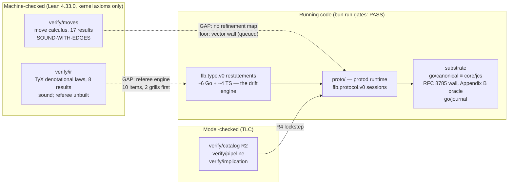

# The estate-focus grill record: four rulings, one lane

2026-08-15, operator + coordinator. After `chore/repo-focus-multica`
named one lane and froze the superseded planners, the operator ruled to
narrow further: off-path work leaves the tree, and the estate points at
one goal — the Lean models powering type generation. Four rulings,
grilled with alternatives named, then stress-tested the same day by two
adversarial model audits
([findings](../research/2026-08-15-model-audit-findings.md)) and a full
local gate run. Companions: the
[architecture audit](../research/2026-08-14-architecture-audit.md) (§3
names the drift engine, §5 the ground-truth program) and the
[protocol grill record](2026-08-14-protocol-grill-record.md) (G6 names
the interim wall).

## The rulings

**F1 — archive by purge, not freeze.** Off-path directories leave the
tree in one commit; the pre-cut tree survives as tag
`archive/pre-estate-focus`; a manifest names what left and why
([retirement manifest](../research/2026-08-15-estate-focus-retirement.md)).
This is the 2026-08-14 branch-retirement pattern applied to
directories. Alternatives rejected: freeze-in-place recreates the
layered self-superseding state the 2026-08-15 reorg just ended; a
separate archive repository fragments history and the line-numbered
citations.

**F2 — the cut line follows dependencies, not topics.** Keep
`proto/`, `verify/{moves,ir,catalog,pipeline,implication}/`,
`go/{canonical,journal,cmd/jcsprobe}/`, and `packages/core` slimmed to
the RFC 8785 encoder with its differential wall. The grounding facts:
`protod` imports `foldlab/canonical` and `foldlab/journal` only;
`go/journal` imports `foldlab/canonical` plus NATS and stdlib only;
`packages/core/src/jcs.ts` has zero internal imports; the differential
wall spawns `go run ./cmd/jcsprobe`. The catalog, pipeline, and
implication gates stay because they guard the semantics the type
system stands on — no admission on faith, snapshot provenance, refusal
projection — and archiving a gate while building on its subject is a
claim without evidence. `go/effector` leaves despite its claimed
R3 + R4 contract: `protod` does its own fencing at close and imports
nothing from it; the claim moves to the archived section with its tag.
Alternatives rejected: a minimal moves + ir keep-set (unguards the
catalog semantics), keeping the effector (surface without a consumer).

**F3 — Lean as referee before Lean as source.** The TyX model becomes
executable and emits golden vectors — normalization, parse verdicts,
conformance verdicts — that every Go and TS restatement of the
`flb.type.v0` grammar must match. This attacks the drift engine (the
grammar restated ~6× in Go and ~4× in TS with divergent defaults)
with the wall discipline the estate already trusts. Code generation
from the model waits for the vectors to show where generation pays;
building the generator first is the un-consumed-machinery pattern this
estate rolls back. The audit sharpened the ruling's honesty: the
referee engine is NOT a garnish on the existing model — normalize,
parse, canonical bytes, and bounded fuel are all unbuilt, ten ordered
work items, two of them blocked on operator grills (`check.args` and
the verdict-semantics choice). Source-of-truth split, ratified so the
model and the catalog never compete: the Lean model defines the
semantics of the grammar and referees every implementation of it; the
catalog holds instances; derived surfaces (ADR-0006) derive from the
catalog using a walk the model has refereed.

**F4 — the one active lane is type generation via TyX.** The lane runs:
referee grills → referee engine → golden vectors → walls over every
grammar restatement. The moves↔protod gap is HELD, not closed and not
abandoned: the G6 interim (Go-step ≡ Lean-step conformance vectors — a
wall, not a correspondence proof) is queued as its floor, and the audit
added the wall's first mandatory content: refused moves, where the
model's abort semantics and the daemon's refuse-and-continue semantics
diverge first (MOVES-1). The full refinement map is queued behind the
lane. Alternatives rejected: keeping the refinement map as the lane
(slowest path to the stated goal), running both lanes (two lanes is
how three planners started).

## What the audits changed

The rulings survived; the claims around them were resized the same day:

- The E2 ledger row now claims admitted complete executions, not all
  finite interleavings, and the IC4 framing is reclassified pending
  disposition (MOVES-1, MOVES-2 — applied in `VERIFICATION.md`,
  ratification pending).
- The referee work is scoped as construction, not research: the
  theorem layer stands (no vacuous law in either model), and the
  missing pieces are named functions with named prerequisites.
- The moves model's remaining prose repairs and optional increments
  (skip semantics, attribution authentication) are dispatched as
  dispositions, not silently fixed
  (`scratch/dispatch/05-moves-claim-repairs.md`).

## The verification chain, drawn

Solid edges are walled or tested today; dashed edges are the named
gaps. The lane is turning the TyX dashed edge solid.

## Dispatch order

Drafted as board-ready issue bodies in `scratch/dispatch/`, ordered:

1. **Dogfood with teeth** — rerun the estate's task acceptance through
   `flb.protocol.v0`. Acceptance is mechanical: a real session journal
   exists and replays to the same state digest. The prior attempt
   produced a report and no journal; a report without a journal is a
   failed run.
2. **The moves vector wall** — Lean-step conformance vectors checked on
   the Lean side, refused moves included (the G6 interim, the moves
   gap's floor).
3. **The referee grills** — `check.args`, numerics scope, verdict
   semantics: three operator decisions, no build.
4. **The referee engine** — the ten work items, blocked on 3.
5. **Moves claim repairs** — dispositions for the audit findings.

The purge itself (F1 + F2) is not dispatched; it was executed by the
coordinator on `chore/estate-focus` with gates run before and after.
