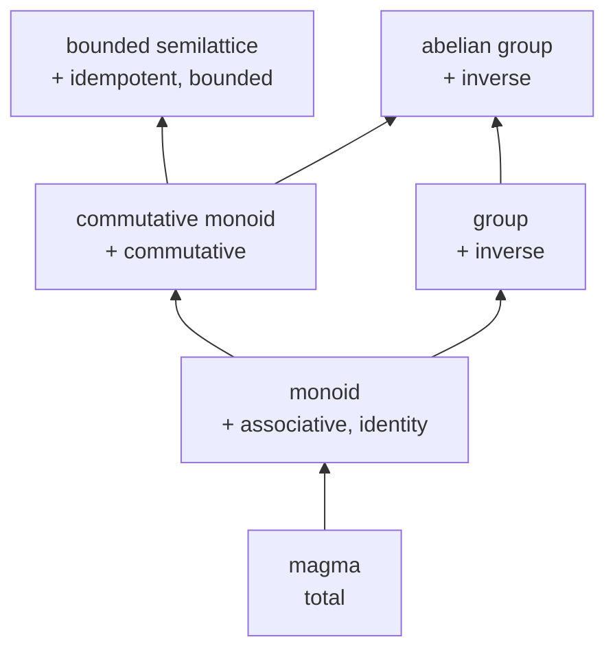
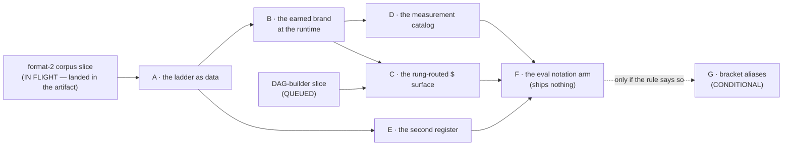

# The algebraic register — rungs in the types, algebras in the catalog, notation in the projections

Date: 2026-08-18. Status: **DESIGN, pre-grill.** Written by the
algebraic-register seat against branch `agent/kernel-model` at HEAD
`4cc9cc9e0` while a four-lane build fleet is in flight over
`verify/unity/**`, `packages/**`, `go/**`, and
`docs/design/2026-08-18-km-conformance-schema.md`. This record realizes
two operator-raised findings — **KM-17** (the algebra ladder as the
earned-brand hierarchy) and **KM-18** (algebraic notation as a
projection register, evaluated rather than assumed) — as an ordered
plan of extension commits that land **after** the fleet integrates.

It changes no code, no gate, no ledger row, no ticket, and no seam
status. It ran no build in any fleet territory. Its only writes are
this file and `scratch/km-algebra/**` (two exemplars, wired into
nothing, both executed and quoted below).

Confidence tiers, as the estate uses them: **ratified** (grill record
or standing ruling) · **proven** (a Lean theorem behind a green gate,
cited by its real name) · **measured** (a ran-it result recorded here)
· **shipped** (code on this branch, read in place) · **proposed** (this
record's own design) · **lead** (an external claim not verified this
session).

Two standing fences ride every sentence. **Safety only** — a rung
brand claims that a declared algebra's stated equations hold; it claims
nothing about liveness, termination, throughput, or the correctness of
any running implementation. **Additive only** — every construct below
is new data, a new generated file, or a new type parameter with a
default; nothing renames a wire name, changes an act encoding, or
removes a surface.

---

## 0. For an outsider, before any house word

This estate runs a coordination substrate for fleets of AI agents. Every
value is named by the hash of its one canonical byte form; every piece
of changing state is either a mergeable set, a checkpointed reduction
over an append-only journal, or a fenced one-winner decision; and the
concurrency claims behind those three shapes are machine-checked in the
Lean proof assistant rather than asserted in prose. The agent-facing API
is deliberately a tiny algebra — eight primitive acts, a closed set of
composition rules, and a list of things that have no syntax at all.

This record adds one layer to that surface. When an agent asks the
system to *combine* things — merge two views, add up shards, take a
maximum, count distinct items — whether that combination is safe
depends entirely on which algebraic laws the combining operation obeys.
Merging shards in parallel is safe if and only if the operation is
commutative. Merging a replica's view into yours is safe if and only if
the operation is also idempotent, so that hearing the same thing twice
means the same as hearing it once. These are not opinions; they are the
premises of theorems the estate has already proved.

Today the system enforces exactly one of those premises, at exactly one
place. This record generalizes it: the ladder of algebraic strength
(magma, monoid, commutative monoid, bounded semilattice, with groups
beside) becomes a **brand** that a declared operation *earns* by passing
a generated law suite, the brand rides in the **type**, and the
operations you are allowed to perform follow from your brand
mechanically — an unearned combination fails to compile, and where it
cannot fail to compile it is refused at the door with the missing
equation named and the suite to run spelled out.

The second half is about how any of this is written down. Mathematical
notation (`∨`, `⊕`, `⊓`) cannot appear in JavaScript identifiers, and
the house naming rule is plain words anyway. So notation goes exactly
three places — the documentation layer that models actually read, a
second "register" of the generated prose beside the plain-word one, and
(only if a measurement says it helps) generated symbol aliases. Whether
symbols help or hurt a language model is unknown, so this record
designs the experiment rather than assuming the answer.

**House terms, one line each.** A **digest** is a SHA-256 hash over a
value's canonical bytes: its permanent name. The **catalog** is the
append-only journal of declared values, admitted through one proved
**door**; a **refusal** is a typed value the door returns instead of an
error, carrying the law it defends and a legal next move. A **cell** is
a lattice value merged by least upper bound; a **lane** is an
append-only evidence stream; a **fold** is a declared reduction over a
lane, checkpointed by **anchors**. A **rung** is this record's word for
one level of algebraic strength. A **brand** is information carried in a
value's type rather than its data, so mixing two differently-branded
values is a compile-time error. The **corpus** is
`packages/plait/fixtures/kernel-conformance.ndjson`, the data file
through which the Lean model hands its tables to every non-Lean
consumer. The **F-numbers** (F1–F12) name the estate's proven law
families; **K-**, **KM-**, **KB-** name grill items from the kernel
record, the kernel-model notes, and the unity-bridge notes.

---

## 1. Result first

**1.1 The ladder is data, and the poset is a theorem.** Seven law atoms
(`total`, `associative`, `identity`, `commutative`, `idempotent`,
`bounded`, `inverse`) and six rungs that bundle them. The rung ordering
is not a table anyone writes down: it is law-set inclusion, and the
model proves it (`rung_le_iff_laws_subset`, proposed §3.6). The ladder
lives in two new corpus record groups, `law` and `rung`, appended
add-only under format 2's own versioning rule; the model is the source,
the corpus is the projection, and every consumer derives.

**1.2 A brand comes in two tiers, and the corpus says which.**
**Donor-backed** — a Lean theorem carries the rung's equations at that
carrier (the bounded-semilattice rung is `join_semilattice_of_aci`
proved once over ACI and instantiated twice; the commutative-monoid
rung is `CommutativeAlgebra` plus `f4_partition_fold`). **Suite-backed**
— a generated property suite over digest-seeded cases found no
counterexample, which is evidence and not proof. Every declared algebra
carries its tier as data, every refusal names it, and no surface may
present the two as the same thing.

**1.3 Rights follow rungs, and the routing is compile-time where
TypeScript can carry it.** `join` elaborates only at a
bounded-semilattice-branded carrier; partition merge demands
commutative-or-better; a windowed difference demands inverses; a
sequential fold needs only closure. **Measured, this session:** an
exemplar of exactly this routing type-checks under the pinned
`tsgo 7.0.0-dev.20260707.2` and under `tsc 5.9.3` as referee, with seven
must-not-compile controls that all fail to compile, and a mutation arm
that catches a weakened rung constraint in three of them (§4.4). The
one honest bound is the one the schema document already states for
value-level brands: the *rung* rides the type; the *availability of an
implementation* rides an Effect Layer plus a runtime refusal, and this
record says so rather than pretending otherwise (§4.5).

**1.4 The measurement catalog is a standard library in the catalog, and
the ladder makes it discriminating.** Six named rows: `max`,
`distinct-set`, and `hyperloglog` reach the bounded-semilattice rung and
may be cell-joined; `count`, `sum`, and `histogram` reach only the
commutative-monoid rung — shard-mergeable, and **refused** as cell
joins, because pointwise addition is not idempotent and a redelivered
observation would double-count. That refusal is not a policy choice; it
is the ladder catching a real bug class by construction. Three
combinators ship with inherited proofs: `product` (whose rung is the
*meet* of its factors' law sets, so `average = (sum × count)` is
shard-mergeable and not joinable), `present` (typed as **not** an
algebra at all, so nobody merges averages), and `sketch` (rung
preserved, error bounds as declared data, answers in a distinct
`Approximate` sort).

**1.5 Notation lives in three places and no fourth.** The doc layer
(every generator's and every affordance's generated JSDoc opens with its
algebraic sentence); the prose projection's second register; and — as an
experiment only — generated bracket aliases. **Measured, this session:**
a working two-concretization renderer produces both registers from one
abstract statement type, including the refusal in both registers (§6.3,
output quoted). Running it surfaced a real finding: a single generic
plain-word template rendered a shard-merge as a join and said something
false, so the plain register needs a per-operator phrasing datum while
the algebraic register does not — recorded as **N-1** and folded into
the corpus's `operator` group.

**1.6 Every proved law becomes an affordance, and sorts are the sharp
case.** Two order sources and no third: the **derived** lattice order,
free at every semilattice-branded algebra (`a ≤ b ⟺ a ∨ b = b`, the
`supLe` clauses of `join_semilattice_of_aci`), and the **declared**
score/identity order of F11's top-k discipline
(`byScoreThenIdentity`, `f11_topk_of_support`). A comparator lambda is
not a third source — it is already a closure-list violation, refused by
the model's `closure-introspection` reason (whose planted control is
`functionDeclare`, and whose repair reads "reference computation by
digest: declare the fold and pin its digest"). Sorting is therefore an
affordance whose correctness is inherited and whose unlawful spelling is
already unrepresentable.

**1.7 Six extension commits, one conditional, all additive.** A (the
ladder as data) → B (the earned brand at the runtime) and E (the second
register) in parallel → D (the measurement catalog) → C (the rung-routed
builder surface, after the DAG-builder slice) → F (the eval notation
arm, which ships nothing) → G (bracket aliases, which **do not exist**
unless F says so). §8 gives each commit its exact territory, acceptance
gate, and reversal statement.

**1.8 The invariant every choice satisfies, in the operator's own
sentence:** rungs go in the types, algebras go in the catalog, notation
goes in the projections, and nothing goes in the identifiers — the wire,
the naming bijection, and the one-assembler law stay untouched.

**1.9 The estate-of-safety candidate, pre-registered as the standing
through-line requires:**

> **A right that type-checks names a law its carrier has earned — every
> algebraic right is a rung's consequence, and a right at an unearned
> rung has no derivation in the surface.**

This is the kernel record's candidate ("a kernel sentence that
type-checks names only lawful acts") extended one layer, and its wall is
the same shape: planted unlawful compositions, each refused with the
missing equation named, plus the must-not-compile family for what the
elaborator can catch — and the mutation arm that proves the controls are
load-bearing rather than decorative.

---

## 2. Grounding — counts and names verified this session

Every count below was measured against the sources at HEAD `4cc9cc9e0`,
not carried from another document. Where the fleet is actively editing a
source, that is said on the row.

| Fact | Measured value | Where |
| --- | --- | --- |
| `theorem` declarations across `verify/fabric/Fabric/*.lean` | **207** (BridgeProofs 46, ControlProofs 53, Mutants 1, Proofs 107) | counted this session; fabric is untouched by the fleet (`git status` clean under `verify/fabric`) |
| `theorem` declarations in `verify/kernel/Kernel/Proofs.lean` | **60** | counted this session; `verify/kernel` is byte-frozen for the current slice |
| Structural refusal kinds in `packages/plait/src/truth/Refusal.ts` | **34** | enumerated `Refusal.ts:25-60` |
| Refusal reasons in the kernel model | **16** (`RefusalReason`, `Definitions.lean:392-409`) | enumerated |
| Declaration kinds | **12**, ranks 0–11, `algebra` at rank 5 | `Definitions.lean:25-38` |
| Conformance corpus, format 2 | **117 lines**, header + 8 groups | the committed fixture, read this session; the fleet's format-2 slice has landed in the artifact |
| The commutative-brand discipline, shipped | one rung, one refusal kind (`unearned-commutative-algebra`), 32 digest-seeded distinct triples minimum | `Algebra.ts:52,73-87,183-236`; `Fold.ts:44-48,132-134` |

The proof donors this design routes to, each name verified to exist:

| Donor | What it discharges | Where |
| --- | --- | --- |
| `join_semilattice_of_aci` | the bounded-semilattice rung, proved **once** from ACI: reflexivity, antisymmetry, transitivity, both upper bounds, and least-upper-bound | `Definitions.lean:625-632` (the package), proved in `Proofs.lean` |
| `f1_cell_join_semilattice`, `f12_directory_join_semilattice` | that package instantiated at the two shipped carriers — the observation cell and the map-shaped directory | `Laws.lean:167-174, 208-215` |
| `f1_cell_merge_aci`, `f12_directory_merge_aci` | the ACI equations the package consumes | `Laws.lean:14-21, 176-188` |
| `cell_absorb_inflationary`, `directory_absorb_inflationary`, `cell_le_iff_subset` | the replica reading ("at least this") and the membership bridge | `Proofs.lean` |
| `CommutativeAlgebra` (`empty`, `leftIdentity`, `associative`, `commutative`) + `f4_partition_fold` | the commutative-monoid rung and the right it licenses | `Definitions.lean:259-265`; `Laws.lean:76-83` |
| `f9_policy_meet_semilattice`, `f9_tree_attenuation` | the same equational rung read in the **meet** sense, with greatest-lower-bound clauses, plus attenuation | `Laws.lean:85-104` |
| `f3_resume_exact` | the monoid rung at the **free** carrier: fold is an action of `(List, ++, [])` on state | `Laws.lean:44-49` |
| `KFillMonoidAction` / `fill_monoid_action` | the monoid rung at the valuation carrier: left-biased union with `empty` as unit, premise-free | `verify/kernel/Kernel/Laws.lean:56-64` |
| `f11_topk_of_support`, `f11_query_deterministic`, `byScoreThenIdentity`, `IdentityDistinct` | the declared score/identity order and its support-invariance | `Laws.lean:139-165`; `Definitions.lean:427-450` |
| `f2_trace_invariant`, `f1_history_convergence`, `f1_cell_extensional` | duplicate/reorder safety and extensional equality of replicas | `Laws.lean:23-42` |
| Unity `U2` (`UDerivedOrdersAgree`) | the two models' derived join orders are **one relation** — so a rung earned against either model's `supLe` is the same rung | `verify/unity/Unity/Laws.lean:19-22` (fleet territory; read-only) |

**Two rungs have no donor, and the record says so.** `group` and
`abelian-group` add inverses, and nothing in `verify/fabric` or
`verify/kernel` models an inverse operation. Those rungs are
suite-backed only until a consumer needs them enough to justify a model
increment.

---

## 3. (Q1) The rung lattice as data

### 3.1 The ladder stated precisely, and the direction of the inclusion

The operator's ladder is *magma ⊂ monoid ⊂ commutative monoid ⊂ bounded
semilattice; group beside*. One precision before anything is built on
it, because the inclusion runs two ways depending on what is being
included:

- As **law sets**, the inclusions read left to right exactly as written:
  every monoid obligation is also a commutative-monoid obligation.
  Climbing the ladder **adds** laws.
- As **classes of algebras**, the inclusions reverse: every bounded
  semilattice *is* a commutative monoid, so the class of qualifying
  algebras **shrinks** as the rung climbs.

Everything below uses the law-set reading, because that is what a brand
carries: a rung *is* its set of earned laws, and "at least this rung" is
set inclusion. Stating it this way is not pedantry — it is what makes
`product`'s inherited rung computable (§5.2) and what makes the ladder a
poset rather than a chain.

**Group is genuinely beside, not above.** A group is a monoid with
inverses. It cannot also be idempotent: `a ∘ a = a` plus inverses forces
`a = e` for every `a`, so the only idempotent group is trivial. Inverses
are therefore an independent axis, and the ladder is a poset:



*Figure: the rung poset, arrows pointing from weaker to stronger law
sets. The bounded-semilattice and abelian-group tops are incomparable —
an algebra cannot be both without being trivial.*

### 3.2 Where the ladder lives

**Both, with the corpus as the projection source** — which is the same
answer the estate already gave for kinds, stages, and refusals.

1. **The model is the source.** `verify/kernel` gains a `Law` inductive
   (7 constructors) and a `Rung` inductive (6 constructors) with
   `Rung.laws : Rung → List Law`. Nothing about the ladder is written
   twice: `Rung.implies` is **derived** from law-set inclusion, not
   tabulated (§3.6).
2. **The corpus is the projection.** Two new record groups, `law` and
   `rung`, appended after every existing group — the add-only rule of
   the schema's §6, so no format bump. Every non-Lean consumer derives
   its ladder from those rows.
3. **Cataloged algebra declarations carry a rung field.** The rung is
   *content of the declaration*, so it is inside the algebra's digest: a
   brand cannot be attached to or detached from an algebra after the
   fact, because doing so mints a different algebra. This is the
   property that makes "agents compose by pinning digests" mean
   something.

**No rank field on a rung row, deliberately.** Ranks are wire-stable in
the strong sense — `encodeAct` writes `kind.rank` into an act's
canonical framing, so renumbering a kind changes the identity of every
declaration. A rung is never written into an act encoding; it is looked
up by name, exactly as refusal reasons are. Giving rungs a rank would
either invent a total order the mathematics does not have (§3.1) or
create a wire-stable number nothing consumes. The join key is `name`.

The proposed rows (canonical form sorts the members; shown here in
reading order):

```
law   : { name, equation, reading, donor, donor_source }        -- 7 rows
rung  : { name, adjective, laws, implies, donor, donor_source }  -- 6 rows
```

`equation` is the algebraic-register text (`a ∘ b = b ∘ a`), `reading`
the plain-word one ("order of arrival does not matter"), `adjective` the
plain-word rung word ("order-free"). `donor` is a theorem name or the
empty string; `donor_source` is `verify/fabric`, `verify/kernel`, or
empty. Those five fields are exactly what §6's two registers and §3.5's
taught refusals consume — the prose is generated from them and nothing
is retyped.

### 3.3 The per-rung obligations, stated exactly

Over a carrier `S` with a binary `∘ : S × S → S` and a distinguished
`e : S`:

| Rung | Obligations (cumulative along an arrow of §3.1) |
| --- | --- |
| `magma` | **total**: `∘` is a total function into `S` — it returns an `S` for every pair and does not diverge or throw |
| `monoid` | + **associative**: `(a∘b)∘c = a∘(b∘c)`; + **identity**: `e∘a = a = a∘e` |
| `commutative-monoid` | + **commutative**: `a∘b = b∘a` |
| `bounded-semilattice` | + **idempotent**: `a∘a = a`; + **bounded**: `e ≤ a` for every `a` under the derived order `a ≤ b ⟺ a∘b = b` |
| `group` | monoid + **inverse**: every `a` has `a⁻¹` with `a∘a⁻¹ = e = a⁻¹∘a` |
| `abelian-group` | commutative monoid + **inverse** |

Two notes that are load-bearing rather than decorative.

**Boundedness is not a separate equation at a commutative idempotent
monoid — it is a consequence.** If `e` is a two-sided identity then
`e ∘ a = a`, which is exactly `e ≤ a` under the derived order. So the
`bounded` law atom is *implied* by `identity` in the presence of
idempotence, and listing it separately would be redundant. It is listed
because the derived order is the thing consumers reason with, and a
`bounded` brand is what licenses the affordance that answers "is this
the bottom?" without a separate proof obligation. The model states the
implication and proves it, so the redundancy is checked rather than
assumed (`bounded_of_identity_idem`, proposed).

**Totality is free in Lean and not free in TypeScript.** A Lean function
`S → S → S` is total by construction, so the magma rung is discharged by
the type in the model. A TypeScript reducer can throw, can return
`undefined`, and can loop. The magma suite's entire job at the runtime
is therefore: over the generated cases, `combine` returns a value of the
carrier and does not throw. That is a small suite and it is not
pointless — it is the only rung whose obligation the model cannot carry
for the runtime, and saying so is what keeps the two-tier claim honest.

### 3.4 How a brand is earned — two tiers, and the corpus says which

> **Donor-backed.** A Lean theorem at a named carrier discharges the
> rung's equations. The brand is inherited from a machine-checked proof.
>
> **Suite-backed.** A generated property suite over digest-seeded cases
> found no counterexample. The brand is evidence from a finite sample.

These are not the same claim and no surface may present them as one. The
distinction is a field on the algebra row (`evidence`), it appears in
the generated JSDoc, and it appears in the refusal when a brand is
missing. A donor-backed brand may still be wrong about the *runtime*
implementation — the theorem is about the model's carrier, and the
conformance corpus is what ties the runtime to it, verdict for verdict.
That bound is the corpus's own bound (schema §0) and it rides here
unchanged.

The donor map, rung by rung:

| Rung | Donor | Carrier the donor covers | Runtime suite still runs? |
| --- | --- | --- | --- |
| `magma` | — (free in Lean) | — | **yes**, and it is the only obligation the runtime alone carries |
| `monoid` | `f3_resume_exact` | the free carrier: `(List, ++, [])` acting on state | yes, at any declared carrier |
| `monoid` | `KFillMonoidAction` | valuations under left-biased union, `empty` as unit — premise-free | yes |
| `commutative-monoid` | `CommutativeAlgebra` + `f4_partition_fold` | any declared commutative algebra; this is the rung F4's partition-fold theorem quantifies over | yes |
| `bounded-semilattice` | `join_semilattice_of_aci` | proved once over ACI; instantiated at the observation cell (`f1_cell_join_semilattice`) and the directory (`f12_directory_join_semilattice`) | yes |
| `bounded-semilattice` (meet sense) | `f9_policy_meet_semilattice` | policies, with the greatest-lower-bound clauses and `f9_tree_attenuation` | yes |
| `group`, `abelian-group` | **none** | — | yes, and the brand is suite-backed only |

The suite generalizes what `Algebra.ts` already ships. Today
`commutativeLaws` returns four predicates and `Algebra.commutative`
derives at least 32 distinct digest-seeded triples before branding
(`Algebra.ts:52,168-236`). The generalization is mechanical: one
predicate per **law atom**, and a rung's suite is the union of its law
atoms' predicates. Seven predicates replace four; the seeding, the
distinctness floor, and the refusal shape are unchanged. `inverse`
additionally needs a declared `invert : S → S` on the algebra, which is
why the group rungs cost a field and the others cost none.

The claim a passing suite licenses, stated for the doc layer verbatim:
*over 32 or more distinct cases derived deterministically from this
algebra's own digest, no counterexample to these equations was found.*
Not "this algebra is commutative."

### 3.5 The unearned-brand refusal, generalized from one row to the ladder

Today there is exactly one such refusal: `unearned-commutative-algebra`,
minted by `Fold.declare` when a lane has more than one partition and the
algebra carries no commutative witness (`Fold.ts:99-134`). It teaches a
law and a repair. It is the right shape and the wrong cardinality.

The generalization adds **one** reason, not six:

```
unearned-rung
  law     : "<right> is licensed only at the <needed> rung: <missing equations>"
  got     : { algebra: <digest>, earned: <rung>, evidence: "donor" | "suite" }
  expected: { rung: <needed>, missing: [<law names>] }
  next    : [{ subject: "Algebra.earn", note: "run suite:<needed> …" }]
```

Design decisions inside that shape, each priced:

- **One reason, parameterized by the needed rung** — not one reason per
  rung. Six reasons would sextuple the taught table, the planted-control
  battery, and the corpus's `refusal` group for zero discrimination: the
  `expected` payload already names the rung and the missing equations,
  which is strictly more information than a reason string carries. This
  follows KM-11's own test — two things deserve distinct identities only
  when the door checks them differently, and the door runs one check.
- **`unearned-commutative-algebra` is retained and stops being
  minted.** Retiring a wire-visible refusal kind is breaking; keeping
  two names for one fault is the incoherence the naming rule exists to
  prevent. The resolution is a deprecation with the blast radius named:
  the kind stays in the closed 34-kind union so no consumer breaks, the
  commutative case is minted as `unearned-rung` from commit B onward,
  and a later ruling retires the old kind once nothing names it. The
  cheaper alternative — leave the old kind minting for its one rung and
  add the general kind beside — is refused for exactly the two-names
  reason. Priced as **A-3** in the grill sheet.
- **The refusal teaches in both registers** (§6.3), because the missing
  equation is what actually transfers: "your `⊕` has no `a ⊕ b = b ⊕ a`"
  is repairable knowledge in a way that "unearned brand" is not.
- **Machine-applicability: advisory.** By the marking criterion the
  model already uses — a repair is machine-applicable exactly when the
  lawful rewrite is a function of the refused candidate alone — an
  unearned-rung repair is **advisory**: it needs a suite run, which is
  new information the candidate does not carry. The four
  machine-applicable rows stay four.

Corpus impact, stated so the fleet can price it: `counts.refusal` goes
16 → 17, one planted candidate joins the admission battery (17 → 18
rows, lawful twin last), and validation checks 15, 20, and 28 of the
schema's §11 update their numbers in the same commit. Adding a refusal
row is not listed among §6's add-only corollaries, so **whether a
seventeenth reason is add-only or a format bump is a ruling the schema
owner makes**, and it is raised as **A-1**.

### 3.6 What the model proves about the ladder itself

Two statements, both small, both worth having because they turn a table
into a theorem:

> **`rung_le_iff_laws_subset`** — for rungs `r` and `s`, `r` implies `s`
> exactly when `s`'s law set is a subset of `r`'s. The `implies` column
> of the corpus's `rung` group is therefore a *derived* projection, and
> a hand-edit to it fails the shape check.

> **`bounded_of_identity_idem`** — at an idempotent carrier with a
> two-sided identity, the identity is the bottom of the derived order.
> The `bounded` law atom is implied rather than independently assumed
> (§3.3).

Both are membership inductions over finite lists; neither invents
machinery. They are the ladder's own anti-vacuity arm: a ladder whose
ordering is asserted could be wrong silently, and this one cannot.

---

## 4. (Q2) Type-level routing in TypeScript and Effect

### 4.1 Laws are the brand atoms; rungs are generated bundles

The natural first design brands an algebra with its rung name and
compares rung names. It is the wrong design, for two reasons that only
show up later: the ladder is a poset, so "at least" is not a numeric
comparison; and `product`'s inherited rung is a *set intersection*
(§5.2), which a rung name cannot express without a lookup table.

So the brand carries **laws**, and rungs are named bundles of laws
generated from the corpus's `rung` rows:

```ts
declare const TOTAL: unique symbol      // + ASSOC, IDENTITY, COMM,
declare const ASSOC: unique symbol      //   IDEM, BOUND, INVERSE
type Total = { readonly [TOTAL]: true }
type Assoc = { readonly [ASSOC]: true }

type Monoid              = Total & Assoc & Identity
type CommutativeMonoid   = Monoid & Comm
type BoundedSemilattice  = CommutativeMonoid & Idem & Bound
type Group               = Monoid & Inverse
type AbelianGroup        = CommutativeMonoid & Inverse

type Algebra<State, Laws extends LawSet> = AlgebraCore<State> & Laws
```

"At least commutative-monoid" is then plain structural assignability: an
intersection with more brand keys is assignable to one with fewer, so a
bounded-semilattice algebra passes anywhere a commutative monoid is
required, and a monoid does not. No conditional types, no variance
tricks, no lookup table. The ladder's poset shape falls out of
intersection subtyping for free — which is a good sign that the encoding
matches the mathematics rather than fighting it.

Every one of those declarations is **generated** from the `law` and
`rung` corpus groups. Nothing above is hand-written in the shipped
design; the block is here because the design has to be readable.

### 4.2 Carriers inherit the brand of the algebra they were declared at

A cell is declared *at* an algebra. Its handle therefore carries that
algebra's brand, and there is no other way to obtain one:

```ts
type Cell<State, Laws extends LawSet> = CellCore<State> & Laws
declare function declareCell<State, Laws extends LawSet>(
  algebra: Algebra<State, Laws>,
): Cell<State, Laws>
```

This is the whole mechanism. A cell cannot exist at an algebra weaker
than its writes require, because the only constructor takes the algebra
and copies its brand. There is no `Cell.of(digest)` that mints a brand
from nothing — a bare digest resolves through the door, which looks the
rung up in the catalog and either produces the branded handle or refuses
`unearned-rung`. Two layers, one door, exactly the discipline the kernel
model already runs for acts.

### 4.3 The rights, routed

| Right | Rung required | Licensing donor | Why nothing weaker |
| --- | --- | --- | --- |
| `join(cell, contribution)` | bounded semilattice | `join_semilattice_of_aci`, `f1_cell_merge_aci` | idempotence is what makes redelivery free (`f2_trace_invariant`); without it a duplicate observation changes the state |
| `mergeShards(algebra, shards)` | commutative monoid | `f4_partition_fold` | the theorem's hypothesis *is* `CommutativeAlgebra`; an interleaving and a partition merge identify only there |
| `foldSequential(algebra, events)` | magma | `f3_resume_exact` (free carrier), `f2b_guarded_exactly_once` for exactness across redelivery | a single-partition fold imposes an order, so no algebra law is needed — exactness is the successor discipline's job, not the algebra's |
| `differenceOver(whole, prefix)` | group | **none — suite-backed** | subtraction of two folded states needs inverses and nothing else provides them |
| `narrow(writ, request)` | bounded semilattice, meet sense | `f9_policy_meet_semilattice`, `f9_tree_attenuation` | the greatest-lower-bound clauses are what make an escalating request clamp rather than refuse |

One sentence rides `differenceOver` verbatim wherever it appears,
because it is the row most likely to be misread: **a group's inverse
subtracts two folded states; it does not un-emit evidence.** Nothing
unbecomes — the closure list's row 12 is untouched, and a windowed
difference is arithmetic over two anchored reads, not a retraction of
the past.

### 4.4 The demonstration — measured, this session

`scratch/km-algebra/rung-brands.ts` is a zero-import, strict-mode
exemplar in the idiom of `verify/kernel/projections/kernel.ts`: the
`@ts-expect-error` lines are must-not-compile controls, so the file
type-checks only if each of them fails to.

Seven controls, one per claim the routing makes:

| Control | The unlawful composition |
| --- | --- |
| `doubleCounted` | `join` at a `count` cell — commutative monoid, not idempotent |
| `doubleBucketed` | `join` at a `histogram` cell — pointwise sum, not idempotent |
| `shardedMagma` | partition merge at a magma |
| `undoMax` | windowed difference at `max` — no inverses |
| `mergedAverages` | partition merge of a **presented** reading — not an algebra at all |
| `averageCell` | `join` at the `(sum × count)` product carrier — the meet lost idempotence |
| `exactFromSketch` | reading a sketch's `Approximate` answer as exact |

`scratch/km-algebra/run.sh` runs three arms. Its actual output:

```
== arm 1: tsgo Version 7.0.0-dev.20260707.2 ==
PASS  exemplar type-checks; every must-not-compile control failed to compile

== arm 2: tsc Version 5.9.3 ==
PASS  referee agrees

== arm 3: mutation — join weakened to the commutative-monoid rung ==
PASS  mutation caught — the weakened rung leaves controls unused:
  .mutant.ts(229,1): error TS2578: Unused '@ts-expect-error' directive.
  .mutant.ts(234,1): error TS2578: Unused '@ts-expect-error' directive.
  .mutant.ts(249,1): error TS2578: Unused '@ts-expect-error' directive.

ALL ARMS PASS
```

The third arm is the one that matters. A green must-not-compile suite
proves nothing on its own — the controls could pass because a file
rotted. Arm 3 weakens `join`'s requirement from the bounded-semilattice
rung to the commutative-monoid rung and confirms that exactly the three
cell-join controls (count, histogram, and the average product) stop
failing. The rung constraint is therefore load-bearing, measured rather
than asserted. This is the witness-twin discipline the kernel model
already applies to its four Lean must-not-compile controls, carried to
the TypeScript surface.

**What the exemplar does not show:** it is hand-written, and in the
shipped design every declaration in it is generated from the corpus. It
is the reference sketch generation owes, exactly as
`verify/kernel/projections/kernel.ts` is. It is wired into nothing and
is not a gate.

### 4.5 Layer composition as the implementation channel — two tiers, honestly

An algebra declaration's digest must resolve to an implementation. The
operator's direction is that Effect's `Layer` is that channel, and it
is — with one honest split, because TypeScript can carry one half at
compile time and not the other.

**Tier 1 — the standard library, compile-time.** The measurement catalog
is cataloged at generation time: its digests are known when the code is
written. So each standard measurement gets a **generated service tag**,
and a program that folds `count` names `CountAlgebra` in its
requirements channel. `Layer.provide(Measurements.layer)` discharges
exactly those tags, and Effect's own `provide` type — `RIn | Exclude<RIn2,
ROut>`, read in place at the pin and already recorded in KM-14's
correspondence — does the arithmetic. A runtime that never provided the
measurement layer **fails to typecheck**.

**Tier 2 — agent-declared algebras, run-time.** An algebra an agent
declares during a session has a digest nobody knew at generation time.
It resolves through one `Algebras` service, and an unprovided digest is
a taught refusal (`unresolved-algebra`), never a type error. This is the
same limit the schema document already records for value-level brands
(§9.1: "a brand parameter bound to a *value* … can be tracked only when
that value's type is a literal"), and it is stated here rather than
papered over.

```ts
interface AlgebraCatalog {
  readonly resolve: <S>(digest: Digest<'algebra'>) =>
    | AlgebraImpl<S>
    | { readonly refusal: 'unresolved-algebra' }
}
```

The exemplar carries the `Exclude` arithmetic as a type-level sketch
(`scratch/km-algebra/rung-brands.ts` §10) and it type-checks under both
compilers.

**What closes the tier-2 gap without a type system.** The
served-equals-derived wall: at admission, every algebra digest a program
pins must resolve in the catalog (this is the existing forward-reference
check, not a new one), and the builder's coherence suite replays the
program's pinned digests against the corpus. A missing implementation is
therefore caught at declaration admission rather than at execution — one
hop earlier than a runtime refusal, and by machinery that already
exists. Unrepresentability is better; this is what is available, and the
record does not call it unrepresentability.

**Layers are not a second source of algebra identity.** A Layer supplies
an *implementation* for a digest; it never names an algebra, never
brands one, and never overrides a rung. Two Layers providing different
implementations for one digest is a conformance defect the corpus
catches, not a configuration choice. This fence matters because Effect
service keys are strings with documented collision semantics
(`Context.ts:166-169`, read at the pin by the KM-14 correspondence) —
the kernel's upgrade is that the key is the digest, so a collision needs
a hash preimage.

### 4.6 The `$` surface and its negative controls

The DAG-builder slice generates one `$`-constructor per generator from
the corpus. The rung constraints bite there, and only there, because the
`$` surface is where an agent writes a composition:

```ts
const rollup = Kernel.program("rollup", ($) => {
  const shards  = $.fold(Measurements.count, OpsLane, anchor, query)
  const total   = $.mergeShards(Measurements.count, shards)   // commutative ✓
  return $.join(ProgressCell, total)                          // ✗ refuses
})
```

The last line does not compile: `ProgressCell` is declared at `count`,
whose brand lacks `Idem` and `Bound`. The repair the error teaches is
either to declare the progress carrier at `max` or `distinct-set`, or to
route the total through a `decide` — and the taught text is generated
from the same `law` and `rung` rows the type came from, so the error and
the type cannot disagree.

Commit C promotes the exemplar's seven controls into the builder slice's
compile-time negative-control suite, **including arm 3**. A
must-not-compile suite without a mutation arm is the failure mode the
kernel model's notes already name (§3 of the kernel-model notes: a
control could "pass" because the file rotted), and it applies here
identically.

### 4.7 What TypeScript cannot carry, stated plainly

1. **Value-level brands.** A cell's rung is a literal from a closed
   six-element set, so it brands cleanly. A *register* or a *partition*
   is a runtime digest, so those brands collapse — the schema document's
   §9.1 finding, unchanged by anything here.
2. **Rung erasure at a boundary.** A cast erases a brand, as it erases
   every TypeScript brand. The estate's answer everywhere else is the
   door: the runtime witness (`hasCommutativeWitness` today, generalized
   to `earnedRungOf` in commit B) is checked at the door regardless of
   what the type said. Type-level routing is developer experience; the
   door is the security boundary. This is ruling G10's honesty split,
   applied one layer down, and it is why commit B keeps a runtime check
   even where a compile-time one exists.
3. **The model's own unrepresentability, if the kernel freeze holds.**
   §8's commit A has a fork: with the freeze lifted, `Act.join` takes a
   `BrandedCell boundedSemilattice` whose rung is a type index that
   **erases at encoding** — so the intrinsic layer gains
   unrepresentability with no change to `encodeAct`'s arity and no
   format bump. With the freeze held, the ladder is corpus data plus a
   door check plus TypeScript brands, and the model-level
   unrepresentability waits. Both are priced in §8.

---

## 5. (Q3) The measurement standard library

### 5.1 Six named rows, their rungs, and what the rung costs them

| Measurement | Carrier and operation | Rung | Evidence | Cell join | Shard merge |
| --- | --- | --- | --- | --- | --- |
| `count` | `(ℕ, +, 0)`, contribution `1` | commutative monoid | suite | **refused** | ✓ |
| `sum` | `(ℤ, +, 0)` | abelian group | suite | **refused** | ✓ (and `differenceOver` ✓) |
| `max` | `(ℕ ∪ {⊥}, max, ⊥)` | bounded semilattice | donor: `join_semilattice_of_aci` | ✓ | ✓ |
| `distinct-set` | `(finite sets, ∪, ∅)` | bounded semilattice | donor: `f1_cell_merge_aci` + the package at the cell carrier | ✓ | ✓ |
| `hyperloglog` | register vector under pointwise `max` | bounded semilattice | donor: the package at the **map** carrier (`f12_directory_join_semilattice`) | ✓ | ✓ |
| `histogram` | fixed bucket vector under pointwise `+` | commutative monoid | suite | **refused** | ✓ |

**The three refusals are the design working, not the design failing.**
Pointwise addition is not idempotent, so a redelivered observation
double-counts. On the monotone plane — where duplication and reordering
are explicitly harmless by theorem (`f2_trace_invariant`) — a
count-shaped cell would be a silent correctness bug that no amount of
review reliably catches. The ladder catches it at the type. Counting
remains perfectly available: it is a **fold over a positioned journal**
under the successor discipline (`f2b_guarded_exactly_once`), where
positions make exactly-once meaningful, and it is shard-mergeable
because F4's hypothesis is satisfied. The routing tells an agent exactly
which of the two planes its measurement belongs on, which is a question
agents currently have to know the answer to.

**Two donor claims worth stating precisely.** `distinct-set` is
donor-backed because the fabric cell *is* a finite set under union with
extensionality (`f1_cell_extensional`) and the semilattice package
instantiated at it — that is the same algebra, not an analogy.
`hyperloglog` is donor-backed for its **merge** only: HLL's merge is
pointwise max over a fixed register array, which is the map carrier the
directory package already covers, so associativity, commutativity,
idempotence, and the derived order transfer whole. HLL's *estimator* —
the function from registers to a cardinality — is not covered by any
donor and is not claimed; it is the `present` projection, quarantined
per §5.2, and its error bounds are declared data, never a proof.

`max` and `histogram` need one more line each. `max` is bounded only if
the carrier has a least element the identity can be; over `ℕ` that is
`0` and the brand is honest, over an unbounded signed carrier there is
no bottom and the algebra earns `commutative-monoid` at best — so the
carrier is part of the declaration and the suite is run against it.
`histogram` is over-known-buckets by name because a growing bucket set
would make the carrier a map with insertion, which is a different
algebra with a different rung; the fence is in the name and in the
declaration's content.

### 5.2 The three combinators, with inherited proofs

**`product(A, B)` — the pair algebra.** Equational classes are closed
under products (Birkhoff, the standing HSP discipline of KM-19), and a
product satisfies an equation exactly when both factors do. So the
product's earned law set is the **intersection** of its factors' law
sets — the meet in the rung poset — and the type computes it rather than
declaring it:

```ts
type Meet<A extends LawSet, B extends LawSet> = Pick<A, Extract<keyof A, keyof B>>
declare function product<A, B, LA extends LawSet, LB extends LawSet>(
  left: Algebra<A, LA>, right: Algebra<B, LB>,
): Algebra<readonly [A, B], Meet<LA, LB>>
```

`average = (sum × count)` is the worked example the operator named.
`sum` is an abelian group, `count` a commutative monoid; the meet is
commutative monoid. So the average carrier is shard-mergeable and **not**
cell-joinable, and the exemplar's `averageCell` control proves the type
system enforces exactly that. Nobody had to know it; the meet computed
it.

The obligation this mints, stated NEEDS-A-LAW in the F13 posture (the
F-number mints at ratification, beside F13's, and no surface claims it
before then):

> **The rung-preservation obligation.** For each combinator, the
> constructed algebra's earned law set is the stated function of its
> inputs': `product` takes the intersection; pointwise lifting over a
> fixed index set preserves the law set exactly; a contribution
> transformer preserves it; a subalgebra preserves it.

Every conjunct is a standard variety-theory fact, and each is a short
induction at the model's carrier. Until it is proved, the combinators'
brands are **suite-backed** even when their factors are donor-backed —
the tier is computed as the weaker of the two, which is the honest
default and is a one-line rule in the generator.

**`present(A, φ)` — the finishing projection.** Typed as **not an
algebra**:

```ts
interface Finished<Out> { readonly finished_of: Digest<'algebra'>; readonly out: Out }
declare function present<S, L extends LawSet, Out>(
  algebra: Algebra<S, L>, phi: (state: S) => Out,
): (state: S) => Finished<Out>
```

`Finished` has no `combine`, no identity, and no law keys, so it is
assignable to nothing that merges. That is the whole mechanism behind
"nobody merges averages": an average is not refused from merging, it has
no merge to be called. This is F11's read-time quarantine made
structural, and it is why the projection is a *function to* `Finished`
rather than a field on the algebra — a field would still be reachable
from a merge site.

**`sketch(A, bounds)` — the exactness trade as declared data.**

```ts
type Sketch<S, L extends LawSet> = Algebra<S, L> & { readonly bounds: ErrorBounds }
interface Approximate<Out> { readonly approximate: Out; readonly bounds: ErrorBounds }
```

Three properties, each doing work. The **rung is preserved** — a sketch
is a real algebra and HLL really is a bounded semilattice, so a sketch
may be joined wherever its rung allows. The **bounds are declared data**
inside the digest, so two sketches with different bounds are different
algebras and cannot be silently substituted. And the **answer sort is
distinct** — `Approximate<T>` is not `T`, so an estimated cardinality
cannot flow into a slot that wants an exact count. The exemplar's
`exactFromSketch` control is that last property, checked.

`ErrorBounds` carries `relative_error_ppm`, `confidence_ppm`, and
`register_count` as integers, because the corpus admits no floats
(schema §1.2) and a bound expressed as a rounded double in a
content-addressed declaration would be a different value on a different
platform.

**The wider combinator set is KM-19's, not this record's.** KM-19
already rules the lawful constructor set — products and pointwise
lifting, contribution transformers, subalgebras, one free object per
rung — and observes that pointwise lifting alone generates histograms,
vector clocks, HyperLogLog (pointwise max), Bloom (pointwise or), and
Count-Min (pointwise plus). This record ships three of them because
three is what the measurement catalog consumes; the rest arrive when a
consumer names them, under KM-19's own growth discipline.

### 5.3 The fence: in the catalog, never in the language declaration

The language declaration names sorts, generators, composition rules, the
refusal table, the trigger grammar, and teaching frames. It carries no
helper code and no standard library — that is risk 4 of the ratified
record, and it binds here.

The measurement catalog is a set of ordinary **cataloged algebra
declarations**, admitted through the one door, named by digest, with
lineage. It sits beside every other declared value. Three consequences
that make the fence real rather than nominal:

1. **An agent composes measurements by pinning digests**, exactly as it
   composes anything else. There is no `Measurements.average(...)` call
   that constructs an algebra at runtime — there is a digest, and the
   builder pins it.
2. **Retiring a measurement strands no identity.** A declaration nobody
   pins is inert; a declaration someone pinned resolves forever, because
   digests do not unbecome.
3. **The generated `Measurements.ts` is a convenience over the catalog,
   not a source.** It exports digest constants and the Tier-1 service
   tags, and it is regenerated from the corpus's `algebra` group. Delete
   it and the catalog is unchanged.

The corpus group that carries them:

```
algebra : { name, algebra_digest, operator, rung, evidence,
            carrier, built_by, factors, bounds }
```

`built_by` is `primitive | product | pointwise | transform | sketch`;
`factors` is the digest list a combinator consumed; `bounds` is present
only on sketches. That is enough for a consumer to reconstruct the
derivation and re-check the inherited rung — which is what makes
"inherited proofs" checkable rather than a claim.

---

## 6. (Q4) Notation as projection

### 6.1 Three lawful places, and no fourth

| Place | What lives there | Ships |
| --- | --- | --- |
| The type/doc layer | every generator's, every affordance's, and every measurement's generated JSDoc opens with its algebraic sentence | **unconditionally** (commit E) |
| The prose projection | a second register beside the plain-word one, both generated from one rule datum; refusals teach in both | **unconditionally** (commit E) |
| Generated bracket aliases | `cell["∨"](x)` | **only if the eval says so** (commit G, conditional on F) |

And the fourth place that does not exist: **identifiers**. Refused
twice over — JavaScript's identifier grammar admits no `∨`, `∧`, or `⊕`,
and the house naming ruling is plain words regardless. A parsed
math-DSL string surface is refused a third way: it would be a second
assembler, and `render = assemble ∘ compile` is law.

### 6.2 The doc layer

The Dvořák rule the ratified record already adopts — *the signature is
where the law shows, so every exported generator's JSDoc opens with its
licensing law's real name* — extends one rung: it opens with its
**algebraic sentence** and then its law name.

The corpus data it is assembled from already exists or is added by
commit A:

- the `type` group's `Act` record supplies each generator's field names
  and sorts (shipped);
- the `doc` group supplies each type's docstring, extracted from the
  Lean environment and never retyped (shipped, format 2);
- the new `operator` group supplies the symbol, the plain-word reading
  template, and the required rung;
- the new `law` and `rung` groups supply the equations and the rung
  words.

The `doc` group's `target` field was added in format 2 with exactly this
in mind — "the key exists so that a later `doc` record about a
constructor, a field, or a refusal is an add-only change" — so
constructor-level doc rows for the eight generators are the extension
the schema already anticipated.

Rendered, for `join`:

```ts
/**
 * join: s ↦ s ∨ c(x) — ∨ is associative, commutative, idempotent.
 * Derived order: a ≤ b ⟺ a ∨ b = b.
 *
 * What is known here comes to include at least this observation.
 *
 * Licensed by join_semilattice_of_aci (verify/fabric), instantiated at
 * this carrier by f1_cell_join_semilattice. Requires the
 * bounded-semilattice rung; evidence tier: donor.
 */
```

Both registers, the donor, and the tier — in the place a model actually
reads, because Effect Schema annotations feed JSON Schema generation and
JSON Schema is what an MCP tool surface publishes as its parameter
descriptions (schema §4.3). A sentence written once in the model reaches
an agent's tool description with no human in the path.

**Only three generators have a genuine algebraic sentence:** `join`
(`∨`), `fold` through its declared algebra (`⊕` or whatever the algebra's
operator row names), and `spawn` (`⊓`). The other five get their
signature over sorts rendered in the algebraic register, which is a
weaker but still useful opener, and the record says so rather than
inventing operators for acts that have none. `emit` in particular is not
an algebra operation — the algebra is in the fold that consumes the lane.

### 6.3 The prose projection's second register — measured

The claim to be careful about is that the two registers are **two
concretizations of one abstraction** and not two texts that happen to
agree. If they were two texts, they would drift, and a drifted teaching
frame is a wrong answer rather than a typo.

`scratch/km-algebra/two-registers.ts` demonstrates the shape: one
abstract `Statement` type (five constructors: rewrite, laws,
derived-order, requires, unearned), and two total rendering functions
over it. No sentence is written twice. Its actual output, for the three
worked examples the commission asked for:

```
### join (the monotone write at a lattice carrier)
  plain      : what is known here comes to include at least this observation
  algebraic  : s ↦ s ∨ c(observation)
  plain      : join: order of grouping does not matter; order of arrival does not matter; saying it twice is saying it once
  algebraic  : ∨: (a ∨ b) ∨ c = a ∨ (b ∨ c); a ∨ b = b ∨ a; a ∨ a = a
  plain      : one state is at or below another exactly when joining it in changes nothing
  algebraic  : a ≤ b ⟺ a ∨ b = b
  plain      : join is allowed only on a duplicate-safe carrier
  algebraic  : ∨ : A × A → A requires A ∈ bounded semilattice

### partition merge (one meaning from many shards)
  plain      : what is known here accumulates this shard fold, and the shards may finish in any order
  algebraic  : s ↦ s ⊕ c(shard fold)
  plain      : shard-merge: order of grouping does not matter; order of arrival does not matter; there is a starting value that changes nothing
  algebraic  : ⊕: (a ⊕ b) ⊕ c = a ⊕ (b ⊕ c); a ⊕ b = b ⊕ a; e ⊕ a = a = a ⊕ e
  plain      : shard-merge is allowed only on an order-free carrier
  algebraic  : ⊕ : A × A → A requires A ∈ commutative monoid

### the taught refusal
  plain      : refused: shard-merge on the first-write-wins carrier needs an order-free carrier; yours is only closed — run suite:commutative-monoid
  algebraic  : refused: the first-write-wins carrier under ⊕ requires commutative monoid; earned brand is magma — missing a ⊕ b = b ⊕ a; run suite:commutative-monoid

### the doc-layer sentence, assembled from the same data
  /** join: s ↦ s ∨ c(observation) — ∨: (a ∨ b) ∨ c = a ∨ (b ∨ c); a ∨ b = b ∨ a; a ∨ a = a. Derived order: a ≤ b ⟺ a ∨ b = b. */
  what is known here comes to include at least this observation.
```

The last block is the point of the exercise: the doc-layer opener of
§6.2 is not a third text. It is the same three statements, rendered in
the algebraic register and concatenated — so a change to the `law` rows
moves the JSDoc, the prose page, and the refusal together or moves none
of them.

**Finding N-1, surfaced by running it.** The first version rendered the
shard-merge rewrite with the same generic template as `join` — "comes to
include at least this shard fold" — which is a join sentence and is
false of an accumulating merge. The algebraic register had no such
problem, because the symbol already carries the distinction. **The plain
register needs a per-operator phrasing datum; the algebraic register
does not.** That is why the corpus's `operator` group carries a
`reading` template per row, and why the renderer has no generic fallback
— a missing reading is a shape-check failure, not a default. A design
that had not been run would have shipped the generic template.

**Refusals teach in both registers, and the registers teach different
things.** The plain register teaches the *rule* ("you need an order-free
carrier"). The algebraic register teaches the *reason* ("you are missing
`a ⊕ b = b ⊕ a`"). The reason is what transfers to the next unfamiliar
carrier, which is the operator's argument for the register and is the
hypothesis the eval tests.

### 6.4 The bracket-alias experiment, specified and not shipped

`cell["∨"](x)` is legal JavaScript. If aliases ever ship, this is the
specification, written now so the experiment has something concrete to
evaluate and so nobody hand-writes one:

- **Generation source.** One alias per `operator` row, emitted into a
  single generated file. The alias's key is the row's `symbol`; its
  value is the plain-word method the row's `name` already names. No
  alias exists that is not an operator row, and no operator row lacks
  one — so the alias set is a bijection with the notation table, checked
  by cardinality in the gate.
- **No new behavior, ever.** An alias is a property whose value is the
  plain-word function. It is not an overload, not a different code path,
  and not a place a law can hide. A generated alias with its own body
  would be a second assembler in miniature.
- **Retirement by regeneration.** Remove the `symbol` field from a row
  and the alias disappears on the next emit. Nothing pins an alias
  because aliases are not digests; there is no identity to strand.
- **Types are unchanged.** The alias carries the same rung constraint as
  the method it aliases, because it *is* that method.

**It does not ship on this record's say-so.** Commit G exists in §8 only
as a conditional, and its precondition is commit F's decision rule.

### 6.5 The eval notation arm, designed concretely

The Q1 eval harness gains a notation arm. Designed here so the decision
rule is pre-registered before any data exists.

**Three surfaces, identical semantics.**

| Surface | What the agent sees |
| --- | --- |
| S1 | plain words only; generated JSDoc with law names but no algebraic sentences |
| S2 | S1 + the doc-layer algebraic sentences (§6.2) — the recommended ship |
| S3 | S2 + generated bracket aliases (§6.4) |

**Sixty tasks, generated from the corpus so the task set cannot be
hand-picked.**

| Count | Task family | Drawn from |
| --- | --- | --- |
| 8 | author one lawful sentence per generator | the `type` group's `Act` constructors |
| 17 | given a refused candidate and its taught repair, produce the lawful rewrite | the `refusal` group, one per reason (16 today, 17 after commit A) |
| 6 | choose the lawful right for this measurement | the `algebra` group, one per row |
| 29 | author a two-step composition | generated pairs over the composition rules and the combinators |

**Two primary metrics, both mechanical — no judge, no rubric.**

- **Lawfulness rate.** The produced program is run through the door. It
  is admitted, or it is not. Measured by the same admission vectors the
  conformance corpus already commits, so the metric cannot drift from
  the language.
- **Wrong-slot rate.** An argument placed in a slot of the wrong sort,
  counted from the compiler's error class rather than by reading. This
  is the metric the notation arm exists for: the honest worry about
  symbol surfaces is that they make slots *look* interchangeable.

**Two secondary metrics**, reported but not decisive: refusal-repair
success (did the taught repair get applied correctly), and
unearned-brand attempts (did the agent reach for a right its rung does
not license — the ladder's own eval).

**Sample size.** 60 tasks × 3 surfaces × 5 independent samples = **900
runs**. Five samples per cell is enough to see a large effect and is
honestly not enough to resolve a small one; that bound is stated in the
decision rule rather than discovered afterward.

**The decision rule, pre-registered.**

1. **S2 over S1** if S2's lawfulness rate is at least S1's *and* its
   wrong-slot rate is no worse, with both differences outside the
   sampling interval the harness reports. Otherwise ship S1 and keep
   notation in the prose projection only.
2. **S3 ships only if it beats S2 on both primary metrics** by a margin
   stated before the run. **A tie ships S2.** Aliases cost a generated
   surface, a gate check, and a retirement path; a tie means they bought
   nothing, and the default is not to ship.
3. **A regression on wrong-slot rate vetoes a surface** even if its
   lawfulness rate improves. A surface that gets more programs admitted
   while putting more arguments in the wrong slot is producing
   confidently wrong compositions, which is worse than refusals.

**Honest bound, stated on the result wherever it is quoted.** This
measures one model family at one version on synthetic authoring tasks
drawn from the corpus. It does not measure production agents, it does
not measure long-horizon sessions, and a green notation arm licenses
shipping a doc surface — never a claim about how models reason.

---

## 7. (Q5) Affordances with inherited correctness

The standing ruling: every proved law becomes a convenience function
with inherited correctness, and the estate surfaces these unprompted.
Here is the inventory the rung ladder licenses. Each is **generated**,
each carries both registers in its docstring, and each names its donor.

### 7.1 Merges

| Affordance | Rung | Inherited from | What the caller no longer has to know |
| --- | --- | --- | --- |
| `joinAll(cell, contributions)` | bounded semilattice | `f1_cell_merge_aci`, `f1_history_convergence` | any grouping, any order, any duplication of the batch gives one result — so batching is free and needs no ordering discipline |
| `joinInto(cell, replica)` | bounded semilattice | `join_semilattice_of_aci` (`sup_le`) | merging a whole replica is one join, and the result is the least upper bound of both |
| `atLeast(cell, other)` | bounded semilattice | `supLe` reflexivity/antisymmetry/transitivity; `cell_le_iff_subset` | the derived order is *free* — no comparator, no score, no declaration |
| `sameKnowledge(a, b)` | bounded semilattice | `f1_cell_extensional` | two replicas with the same verified set **are** one replica; equality is by membership, never by history |
| `mergeShards(algebra, shards)` | commutative monoid | `f4_partition_fold` | a partition merge and any interleaving are one meaning |
| `narrow(writ, request)` | bounded semilattice (meet) | `f9_policy_meet_semilattice`, `f9_tree_attenuation` | an escalating request **clamps** rather than refuses, and no descendant escapes the root grant |
| `differenceOver(whole, prefix)` | group | none (suite) | windowed arithmetic over two anchored reads — *not* a retraction of evidence |

`atLeast` carries one refusal in its own docstring, in both registers,
because it is the affordance most likely to be misread: it answers "at
least this," never "not present anywhere." A replica is a lattice lower
bound (`cell_absorb_inflationary`), and absence reasoning from a local
view is closure-list row 11. The affordance's type returns
`AtLeast<'yes' | 'unknown'>` rather than a boolean, so the unlawful
reading has no value to be.

### 7.2 Sorts — order as declared data, and exactly two sources

This is the sharpest case, and it is sharp because the unlawful spelling
is already refused by a law the estate ships.

**Source one: the derived lattice order, free at every
semilattice-branded algebra.** `a ≤ b ⟺ a ∨ b = b`. No declaration, no
score, no comparator — the order is a consequence of the rung, and
`join_semilattice_of_aci` proves it is a partial order with least upper
bounds. Affordance: `orderOf(algebra)`, available exactly at the
bounded-semilattice rung and nowhere else.

**Source two: the declared score/identity order of F11's top-k
discipline.** `byScoreThenIdentity` is score descending, then identity
ascending; distinct scores never consult identity, and ties break by
identity bytes, never by arrival. Its support-invariance is
`f11_topk_of_support` under the `IdentityDistinct` premise, which
content-addressed entries carry by construction. Affordance:

```ts
topBy({ score: Digest<'index'>, identity: Digest<'index'>, k: number })
```

Two declared projections into the naturals, by digest, and a width.
**There is no `compare` parameter**, and adding one would not be a
convenience — it would be a lambda in a declaration, which is closure
introspection (closure-list row 14) and is already refused by the
model's `closure-introspection` reason. So sorts are the cleanest illustration
of the through-line: the lawful affordance is generated with inherited
correctness, and the unlawful spelling was already unrepresentable
before this record existed.

`sortAll(order)` is the same order without a width; `dedupBy(identity)`
is `topK`'s own dedup exposed under the same premise. Nothing else.

### 7.3 Reductions, checkpoints, and readings

| Affordance | Inherited from | Note |
| --- | --- | --- |
| `resumeFrom(fold, anchor, tail)` | `f3_resume_exact` | resumption from any anchor is exact; the anchor is typed by its own fold and partition, so replay elsewhere has no spelling |
| `compactBelow(fold, upTo)` | `compact_below_floor_preserves_resumption` | boundary-inclusive; the derived horizon fences it |
| `exactlyOnce(step, positions)` | `f2b_guarded_exactly_once` | the successor discipline, for the non-idempotent steps the ladder routes here |
| `presentAs(algebra, φ)` | F11's read-time quarantine | returns `Finished`, which merges with nothing (§5.2) |
| `estimate(sketch)` | none — bounds are declared data | returns `Approximate`, which is not the exact sort |

Every row's docstring opens with its algebraic sentence and closes with
its donor and evidence tier, generated. A row whose donor is empty says
`evidence: suite` in the same place, so a reader never has to guess
which tier a convenience inherited.

---

## 8. (Q6) The extension-commit plan

### 8.1 What this work sits behind



**Hard dependencies, stated precisely.** The format-2 corpus slice is
upstream of everything, because every new record group is a format-2
add-only extension and the doc-record pipeline is what commit E extends;
it has landed in the artifact (117 lines, format 2) and needs only to
integrate. The DAG-builder slice is upstream of commit C alone, because
the `$` surface is what carries the rung constraint at the authoring
site; nothing else in this plan waits on it. **KM-12 (`KindContent`) is
upstream of commit A's model half**, because `.algebra`'s content type
is where a rung lives in the model — if KM-12 is not ruled, commit A
lands as A′ (below) and the ladder is corpus data plus a door check with
no model-level unrepresentability.

### 8.2 The commits

---

**Commit A — the ladder as data.**

*Territory.* `verify/kernel/Kernel/{Definitions,Laws,Proofs}.lean` (the
`Law` and `Rung` inductives, `Rung.laws`, the two ladder theorems, and —
if the freeze lifts — the `BrandedCell` wrapper and the door's rung
check); `verify/unity/Unity/{Emit,Shape}.lean` (the `law` and `rung`
groups plus their shape checks); `docs/design/2026-08-18-km-conformance-schema.md`
(§2.1's group table and line count, §11's checks); the committed fixture.

*Acceptance gate.* `verify/unity/run.sh` green and
`verify/kernel/run.sh` green; byte-identical regeneration of the
fixture; the two ladder theorems rostered with the trusted-base sweep
unchanged; three new validation checks — every `rung.implies` entry
derivable from law-set inclusion, every `law.donor` naming a theorem
that exists in its `donor_source` package, and the `law`/`rung`
cardinalities pinned; one mutated-corpus control per new check, refused
for its own named reason.

*Reversal.* Two appended groups. Consumers skip unknown groups by the
schema's own rule, so removing them is a regeneration plus a counts
edit. The model's inductives are new declarations nothing else consumes
until commit B.

*The fork, priced.* **A** (recommended) requires the `verify/kernel`
freeze to lift by ruling, and buys model-level unrepresentability: with
`Act.join` taking a `BrandedCell boundedSemilattice` whose rung is a
type index that **erases at encoding**, an unbranded join has no
derivation, and `encodeAct`'s tag and arity are untouched — so no format
bump. **A′** (fallback) holds the freeze: the ladder is unity-side data
plus a door check plus TypeScript brands. A′ costs the model-level
refusal and costs nothing else; A can be adopted later additively, which
is the direction of the asymmetry.

---

**Commit B — the earned brand at the runtime.**

*Territory.* `packages/plait/src/truth/Algebra.ts` (one predicate per law
atom; `Algebra.earn(algebra, rung, suite)` generalizing
`Algebra.commutative`; `earnedRungOf` generalizing
`hasCommutativeWitness`); `packages/plait/src/planes/Fold.ts` (the F4 constraint
widened from `CommutativeAlgebra` to `Algebra<S, CommutativeMonoid>`);
`packages/plait/src/truth/Refusal.ts` (`unearned-rung`, kind 35); a new
generated `packages/plait/src/KernelRungs.generated.ts`; the generator
script beside the existing table generator.

*Acceptance gate.* Every existing `Algebra` and `Fold` test passes
unchanged — enforced by keeping `CommutativeAlgebra<State>` as a
generated alias for `Algebra<State, CommutativeMonoid>`, so no call site
moves; new per-rung suites for all seven law atoms; the `unearned-rung`
refusal round-trips through the wire schema and carries its rung and
missing-equation payload; byte-identical regeneration of the generated
rung tables; the deprecation of `unearned-commutative-algebra` recorded
in the api-log with the retirement condition ("no consumer names it")
stated.

*Reversal.* Brands are additive metadata on declared values; the alias
means no consumer changed. Retiring a rung deletes a bundle and strands
no identity, because a rung is never inside an act encoding.

---

**Commit C — the rung-routed `$` surface.** *(after the DAG-builder
slice)*

*Territory.* The generated builder surface the DAG-builder slice
produces, plus its compile-time negative-control file.

*Acceptance gate.* The seven controls of §4.4 promoted into the slice's
suite **with arm 3** — the mutation arm is mandatory, not optional; the
generated `$` signatures byte-identical to a fresh emit; a built program
pinning an algebra whose rung does not license its right fails to
typecheck, and its witness twin at a sufficient rung compiles.

*Reversal.* The constraint is a generated type parameter with the
unconstrained form as its predecessor; regeneration without the rung
column restores the previous surface exactly.

---

**Commit D — the measurement catalog.**

*Territory.* A new `algebra` corpus group; `verify/unity`'s emitter for
it; a generated `packages/plait/src/Measurements.generated.ts` (digest
constants, Tier-1 service tags, the `Measurements.layer`); the three
combinators.

*Acceptance gate.* Each of the six rows' rungs earned by its generated
suite **and** cross-checked against its donor where one exists — a row
claiming `evidence: donor` whose donor does not cover its carrier fails
the check; the routing refusals demonstrated as committed controls
(`count` cannot join; `histogram` cannot join; the `(sum × count)`
product cannot join); `present`'s non-mergeability as a compile-time
control; every combinator's inherited rung recomputed from its factors
and compared to its declared one; `Layer.provide(Measurements.layer)`
discharging exactly the Tier-1 tags.

*Reversal.* Catalog content. Retiring a measurement strands no identity
(§5.3), and the generated convenience file is a projection nothing
depends on for correctness.

---

**Commit E — the second register.**

*Territory.* A new `operator` corpus group (with N-1's per-operator
`reading` template); `packages/plait/scripts/render-kernel-prose.ts`
(the second register and the constructor-level `doc` rows);
`docs/generated/kernel-language.generated.md`.

*Acceptance gate.* Totality — every rule datum renders in **both**
registers, and a row missing either is a shape-check failure with no
generic fallback (this is N-1's whole point); byte-identical
regeneration of the rendered page; the three worked examples of §6.3
present verbatim; every refusal row rendering in both registers; the
verbatim rule from the schema's §9.3 preserved — law, repair, and
docstring texts are reproduced, never paraphrased.

*Reversal.* Doc-layer notation is inert: it changes no type, no wire
value, and no behavior. Deleting the register is deleting a rendering
function.

---

**Commit F — the eval notation arm.** *(ships nothing)*

*Territory.* A new eval harness directory; no runtime surface, no
generated consumer, no gate wiring.

*Acceptance gate.* All 900 runs completed against the three surfaces;
the two primary metrics reported with their sampling intervals; the
pre-registered decision rule of §6.5 applied and its verdict recorded
with the honest bound attached. A report without the runs is a failed
run — the dogfood ruling binds.

*Reversal.* An eval that ships nothing has nothing to reverse.

---

**Commit G — bracket aliases.** *(CONDITIONAL — does not exist unless F
says so)*

*Territory.* One generated alias file, per §6.4.

*Acceptance gate.* Bijection with the `operator` group's symbol column,
checked by cardinality; no alias with its own body; retirement by
regeneration demonstrated (remove a symbol, re-emit, alias gone).

*Reversal.* Regeneration.

---

### 8.3 What this plan deliberately does not do

- It does not touch `verify/fabric` or `verify/fabric-veil`. The donors
  are cited, never edited.
- It does not change any act encoding, any generator tag, or any arity —
  so no format bump originates here. The one open question about
  add-only status is the seventeenth refusal row (**A-1**), and that is
  a schema-owner ruling, not a change this plan makes unilaterally.
- It does not mint an F-number. The rung-preservation obligation is
  stated NEEDS-A-LAW in the F13 posture, and no surface claims it.
- It ships no alias, no symbol identifier, and no math-DSL string
  surface.

---

## 9. Risks and honest bounds

1. **Two-tier evidence is easy to collapse in a summary.** A
   donor-backed brand and a suite-backed brand are different claims, and
   the difference will be lost the first time someone writes "the
   algebra is proved commutative." The mitigation is mechanical: the
   tier is a field, it appears in every generated docstring, and it
   appears in every refusal. It is not a style guideline.
2. **A passing suite is a finite sample.** 32 digest-seeded distinct
   cases found no counterexample; that is the claim, and it is all of
   it. A carrier with a rare degenerate case can pass. The suite floor
   is inherited from the shipped `Algebra.ts` discipline; whether 32 is
   the right floor for seven law atoms rather than four is **A-4**.
3. **TypeScript brands erase.** A cast defeats any of this. The door's
   runtime witness is the security boundary and the type is developer
   experience — G10's split, restated one layer down (§4.7).
4. **The rung-preservation obligation is unproved.** Until it is, every
   combinator's brand is suite-backed even when its factors are
   donor-backed. That is the honest default and it is what the generator
   computes; the risk is that someone reads "inherited proofs" as
   "proved."
5. **The group rungs have no donor at all**, and no consumer has asked
   for them yet. They are in the ladder because leaving them out would
   make the ladder a chain and hide the poset (§3.1) — but a rung with
   no consumer is a dead production, and if none appears they should be
   retired rather than carried.
6. **The `algebra` corpus group can grow into a package manager.** Every
   cataloged declaration invites a registry. The fence is the same as
   the language declaration's: the group carries declarations and their
   derivations, no code, and a new combinator is a grill item under
   KM-19's growth discipline, never a patch.
7. **The eval measures one model family on synthetic tasks.** §6.5
   states this on the result. A green notation arm licenses a doc
   surface, never a claim about how models reason.
8. **HyperLogLog's estimator is not covered by anything.** The merge is
   donor-backed; the cardinality estimate is a `present` projection with
   declared bounds and no proof. Any surface quoting an HLL estimate
   must carry its bounds, which is why `Approximate<T>` is a distinct
   sort rather than a comment.
9. **The seventeenth refusal row may be a format bump.** §6 of the
   schema does not list refusal rows among its add-only corollaries, and
   three validation checks pin the count at sixteen. If the ruling makes
   it a bump, commit A's acceptance gate grows a version bump and every
   consumer refuses the old artifact at the header — which is the
   designed behavior, but it is a coordination cost, not a free
   extension.
10. **The fleet is mid-flight and this design read moving files.**
    `verify/unity/**`, `packages/**`, `go/**`, and the schema document
    were being edited while this record was written. Every count in §2
    was measured this session, but the schema document in particular may
    have moved under it; at integration, §3.5's corpus-impact numbers
    and §8's territory lists are the first things to reconcile.

---

## 10. (Q7) The grill sheet

House style: one decision per item; recommended option first;
alternatives priced; reversal cost stated. All items PROPOSED. KM-17 and
KM-18 are restated in final grill-ready shape, incorporating this
record's design decisions; the A-series is new and belongs to this
record.

### 10.1 KM-17 and KM-18, restated

- **KM-17 — the algebra ladder as the earned-brand hierarchy, with
  two-tier evidence.** Recommended: adopt the ladder as **seven law
  atoms and six rungs** — magma, monoid, commutative monoid, bounded
  semilattice, with group and abelian group beside — carried as two
  add-only corpus record groups (`law`, `rung`), sourced from the model
  (`KindContent .algebra` per KM-12), and ordered by **law-set
  inclusion proved rather than tabulated**
  (`rung_le_iff_laws_subset`). A brand is earned in one of two tiers,
  and the corpus says which: **donor-backed**, where a named Lean
  theorem discharges the rung's equations at that carrier
  (`join_semilattice_of_aci` and its two instantiations for the
  bounded-semilattice rung; `CommutativeAlgebra` + `f4_partition_fold`
  for commutative monoid; `f9_policy_meet_semilattice` for the meet
  sense; `f3_resume_exact` and `KFillMonoidAction` for monoid at the
  free and valuation carriers), or **suite-backed**, where a generated
  digest-seeded property suite found no counterexample — which is
  evidence, not proof, and no surface may present the two as one.
  Rights follow rungs mechanically and at compile time where TypeScript
  can carry it: `join` only at bounded semilattice, partition merge at
  commutative-or-better, windowed difference only at a group,
  sequential fold at magma; **measured** — the routing type-checks
  under tsgo 7.0.0-dev.20260707.2 and tsc 5.9.3 with seven
  must-not-compile controls and a mutation arm that catches a weakened
  constraint in three of them. The unearned-brand refusal generalizes
  from F4's one row to **one parameterized reason** (`unearned-rung`,
  carrying the needed rung, the earned rung, the evidence tier, and the
  missing equations), taught in both registers; the shipped
  `unearned-commutative-algebra` kind is retained and stops being
  minted, retiring by a later ruling. The named measurement catalog
  (count, sum, max, distinct-set, HyperLogLog, histogram) lands as
  cataloged algebra declarations with rungs — a standard library **in
  the catalog**, never in the language declaration — and the ladder is
  discriminating rather than decorative: max, distinct-set, and HLL may
  be cell-joined; count, sum, and histogram are refused there because
  pointwise addition is not idempotent, and route to positioned folds
  and shard merges instead. Alternatives: rungs as documentation only
  (loses compile-time routing and the taught refusals); one refusal
  reason per rung (sextuples the taught table and the control battery
  for no discrimination the payload does not already carry); a full
  typeclass tower (more structure than any current law consumes);
  branding by rung name rather than by law set (cannot express the
  product's inherited rung, which is a set intersection). Reversal:
  brands are additive metadata on declared values, a rung is never
  inside an act encoding, and retiring a rung strands no identity.

- **KM-18 — algebraic notation as a projection register, evaluated
  before anything symbolic ships.** Recommended: notation lives in three
  lawful places and no fourth. **(1) The type/doc layer**, shipped
  unconditionally: every generator's, affordance's, and measurement's
  generated JSDoc opens with its algebraic sentence, then its plain-word
  reading, then its donor and evidence tier — assembled from the corpus's
  `type`, `doc`, `operator`, `law`, and `rung` rows, reaching agents
  through Effect Schema annotations and thence the MCP tool surface, with
  no human in the path. Only `join` (`∨`), `fold` through its declared
  algebra (`⊕`), and `spawn` (`⊓`) have genuine algebraic sentences; the
  other five generators get their signature over sorts rendered in the
  algebraic register, and the record says so rather than inventing
  operators. **(2) The prose projection's second register**, shipped
  unconditionally: plain-word and algebraic concretizations generated
  from one abstract statement type — **measured**, a working
  two-concretization renderer produces both registers plus the refusal in
  both from one datum. Running it surfaced **N-1**: a single generic
  plain-word template rendered a shard-merge as a join and said something
  false, so the plain register carries a per-operator `reading` datum and
  the renderer has no generic fallback, while the algebraic register
  needs none because the symbol carries the distinction. Refusals teach
  in both registers because they teach different things — the plain
  register teaches the rule, the algebraic register teaches the missing
  equation, and the equation is what transfers. **(3) Generated bracket
  aliases** (`cell["∨"](x)`) as an experiment only, specified (one alias
  per operator row, no body of its own, bijection checked by
  cardinality, retirement by regeneration) and **not shipped**: the Q1
  eval gains a notation arm — three surfaces, 60 corpus-generated tasks,
  5 samples, 900 runs, primary metrics lawfulness rate (measured by the
  door) and wrong-slot rate (measured by the compiler's error class),
  with the decision rule pre-registered: a tie ships plain-words +
  doc-notation, and a wrong-slot regression vetoes a surface even if
  lawfulness improves. Alternatives: notation in identifiers (refused
  twice — JS identifier grammar and the plain-words ruling); a parsed
  math-DSL string surface (refused — a second assembler); shipping
  aliases on judgment (refused — the question is empirical and the eval
  is cheap). Reversal: doc-layer notation is inert; the second register
  is a rendering function; aliases are generated and retire by
  regeneration.

### 10.2 New rows this design mints

- **A-1 — is a seventeenth refusal reason add-only, or a format bump?**
  Recommended: rule it **add-only**, on the same argument that makes a
  new type or encoding vector add-only — the reason is a new row in an
  existing group, no key changes, no encoding changes, and consumers key
  on `reason` rather than position. The three validation checks that pin
  "sixteen" update in the same commit as the fixture, which is already
  the discipline for editing a law or repair text. Alternative: treat it
  as a bump (every consumer refuses the old artifact at the header,
  which is safe but is a coordination cost for a purely additive row).
  Reversal: if add-only proves wrong, the next added reason bumps and
  nothing is stranded. **The schema owner's call, not this seat's.**

- **A-2 — lift the `verify/kernel` freeze for the ladder, or hold it?**
  Recommended: **lift by ruling for commit A**, and take model-level
  unrepresentability: `Act.join` over a `BrandedCell` whose rung is a
  type index erasing at encoding, so the intrinsic layer refuses an
  unbranded join with no change to `encodeAct`'s tag or arity and no
  format bump. Alternative A′: hold the freeze; the ladder is corpus
  data plus a door check plus TypeScript brands, and the model-level
  refusal waits. Reversal: A′ → A is additive (adding a type index
  re-types the constructor's consumers inside the model only); A → A′
  deletes a parameter. The asymmetry favors A, but the freeze is the
  slice constitution's and only a ruling moves it.

- **A-3 — the deprecation path for `unearned-commutative-algebra`.**
  Recommended: retain the kind in the closed union (retiring a
  wire-visible refusal kind is breaking), stop minting it from commit B,
  mint `unearned-rung` for every rung including commutative monoid, and
  retire the old kind by a later ruling once no consumer names it —
  recorded in the api-log with that retirement condition stated.
  Alternative: keep the old kind minting for its one rung and add the
  general kind beside (two names for one fault — the incoherence the
  naming rule exists to prevent). Reversal: un-deprecating is one line
  while nothing has been retired.

- **A-4 — the suite floor for seven law atoms.** The shipped discipline
  derives at least 32 distinct digest-seeded triples for four
  predicates. Recommended: keep 32 as the floor and add a per-atom
  minimum only where an atom needs a shape the triple does not supply —
  `inverse` needs pairs `(a, a⁻¹)` and `bounded` needs the identity in
  position, so those two get their own case shapes rather than a larger
  count. Alternative: scale the floor with the atom count (more runtime,
  no argued gain — the cases are already independent per atom).
  Reversal: the floor is a constant in the generator.

- **A-5 — the rung-preservation obligation, stated NEEDS-A-LAW.**
  Recommended: state it verbatim (§5.2), gate-fence it in the F13
  posture so no proof or consumer appears without a ruling, and compute
  every combinator's evidence tier as the weaker of its factors' until
  it is proved. Alternative: prove the abstract skeleton now (cheap, and
  it is exactly the overclaim channel the F13 posture exists to close —
  the value is at the concrete carriers). Reversal: additive; the
  combinators work suite-backed either way.

- **A-6 — two order sources and no third.** Recommended: rule that the
  only two orders in the estate are the **derived** lattice order (free
  at the bounded-semilattice rung) and the **declared** score/identity
  order (F11's `byScoreThenIdentity`, order-as-data by digest), and that
  a comparator function value is not a third source but an instance of
  the closure-introspection row already refused. Alternative: admit
  declared comparator *declarations* (a third order kind, a third set of
  determinism obligations, and no law asking for it). Reversal: a
  ruling, retirable before any consumer.

- **A-7 — group rungs with no donor and no consumer.** Recommended:
  carry them in the ladder (leaving them out hides the poset and would
  make a later addition re-type the lattice), brand them suite-backed,
  and retire them if no consumer names them by the time the measurement
  catalog ships. Alternative: omit until a consumer appears (cheaper
  now; a later addition changes the ladder's shape, which is the
  expensive direction). Reversal: retiring an unconsumed rung is
  deleting two rows.

---

## 11. Glossary additions

| Term | Meaning |
| --- | --- |
| rung | one level of algebraic strength, defined as a set of law atoms; the six are magma, monoid, commutative monoid, bounded semilattice, group, abelian group |
| law atom | one equation a brand can carry: total, associative, identity, commutative, idempotent, bounded, inverse |
| the rung poset | the ordering of rungs by law-set inclusion — a poset, not a chain, because inverses and idempotence cannot coexist non-trivially (§3.1) |
| donor-backed / suite-backed | the two evidence tiers of an earned brand: a named Lean theorem at that carrier, or a finite generated property suite that found no counterexample |
| the meet of two rungs | the intersection of their law sets; the rung a `product` algebra inherits (§5.2) |
| the two registers | the plain-word and algebraic renderings of one rule datum — two concretizations of one abstraction, never two texts |
| N-1 | the finding that the plain register needs a per-operator phrasing datum while the algebraic register does not (§6.3) |
| the finishing projection | `present` — a read-time map out of an algebra into `Finished`, which has no merge, so its results cannot be combined |
| the notation arm | the Q1 eval's three-surface comparison, whose pre-registered decision rule gates whether bracket aliases ever ship (§6.5) |

---

## 12. Sources

Estate records, read in place this session at HEAD `4cc9cc9e0`:
`docs/design/2026-08-18-plait-kernel-algebra.md` (whole — §3's grounding
table, §4.2's generators, §4.5's naming and Dvořák rules, §5.2's
composition rules, §5.3's closure list, §5.6's one-AST rule, §6's Effect
binding and the dual construction, §7's language declaration, §10's
risks, §11's K-1..K-10);
`docs/research/2026-08-18-kernel-model-notes.md` (whole — the two-layer
discipline, the fourteen closure rows, §11's KM-1..KM-21 including
KM-11, KM-12, KM-14, KM-15, KM-17, KM-18, KM-19, KM-20, KM-21, and
§11a's four projection rulings);
`docs/design/2026-08-18-km-conformance-schema.md` (whole — format 2's
canonical JSON, the both-ways law, §2.1's groups, §4.3's annotation
mapping, §6's versioning discipline, §9's mapping tables and the
value-level-brand limit, §11's validation checklist; **fleet territory,
read-only, and in motion**);
`docs/design/2026-08-18-km-dag-builder.md` (the queued builder slice and
its `$` surface); `docs/design/2026-08-18-fabric-kernel-parity-driver.md`
(§0–§2, the two lanes and the parity classes);
`docs/research/2026-08-18-unity-bridge-notes.md` (the KB grill list and
the parity-driver addendum).

Proof surfaces, read in place and name-verified this session:
`verify/fabric/Fabric/Definitions.lean` (`CommutativeAlgebra` 259-265,
`JoinSemilatticePackage` and `supLe` 608-632, `byScoreThenIdentity`
427-434, `IdentityDistinct` 440-443, `topK` 445-450, `QueryAlgebra`
452-457, the directory carrier 634-677);
`verify/fabric/Fabric/Laws.lean` (whole — every law statement cited in
§2's donor table read in place);
`verify/kernel/Kernel/Definitions.lean` (`DeclKind` 25-38, `Act` 213-226,
`encodeAct` 259-273, `RefusalReason` 392-409);
`verify/kernel/Kernel/Laws.lean` (the eleven `K`-prefixed law
statements; `KFillMonoidAction` 56-64 read in full);
`verify/unity/Unity/Laws.lean` (U1–U13; U2's derived-order agreement is
what makes a rung earned at either model the same rung — **fleet
territory, read-only**);
`verify/kernel/projections/kernel.ts` (the branded-digest,
`NoInfer`-tied, `@ts-expect-error`-controlled idiom this record's
exemplar extends); `verify/kernel/projections/prose.md` (the eight
speech-act sentences the second register joins).

Shipped code, read in place: `packages/plait/src/truth/Algebra.ts` (whole —
the F4 brand discipline this record generalizes);
`packages/plait/src/planes/Fold.ts:1-150` (the partition constraint and its
refusal); `packages/plait/src/truth/Refusal.ts:1-100` (the 34-kind closed
union, enumerated); `packages/plait/src/kernel/KernelTables.generated.ts` (the
generated-surface idiom); `packages/plait/src/kernel/KernelDoor.ts:1-70` (the
candidate layer at the runtime);
`packages/plait/scripts/render-kernel-prose.ts:1-60` (the prose pipeline
commit E extends — **fleet territory, read-only**);
`packages/plait/fixtures/kernel-conformance.ndjson` (header and line
count).

Built and measured this session, both **exemplar only**, wired into
nothing, gated by nothing:
`scratch/km-algebra/rung-brands.ts` — the rung-brand routing with seven
must-not-compile controls; `scratch/km-algebra/run.sh` — three arms
(tsgo 7.0.0-dev.20260707.2, tsc 5.9.3 as referee, and the mutation arm),
all passing, output quoted verbatim in §4.4;
`scratch/km-algebra/two-registers.ts` — the two-concretization renderer,
output quoted verbatim in §6.3, and the source of finding N-1.

Diagrams: two inline Mermaid figures (§3.1 the rung poset, §8.1 the
commit dependency graph), authored this session; their labels carry the
content so the prose stands without the renders.
