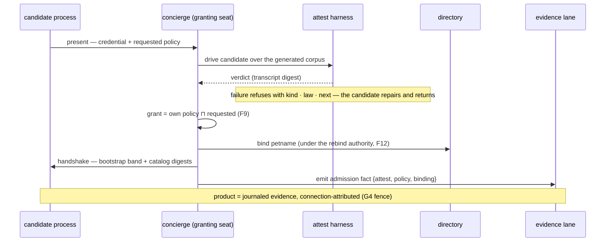
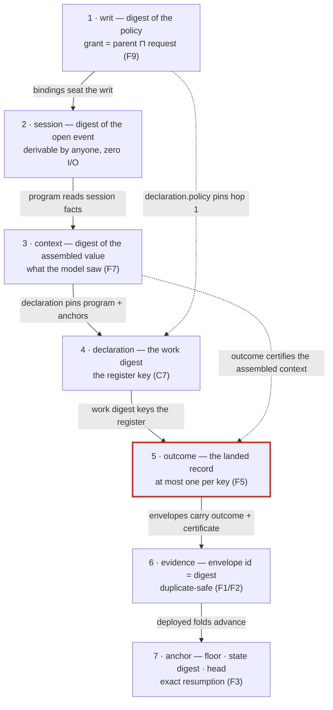
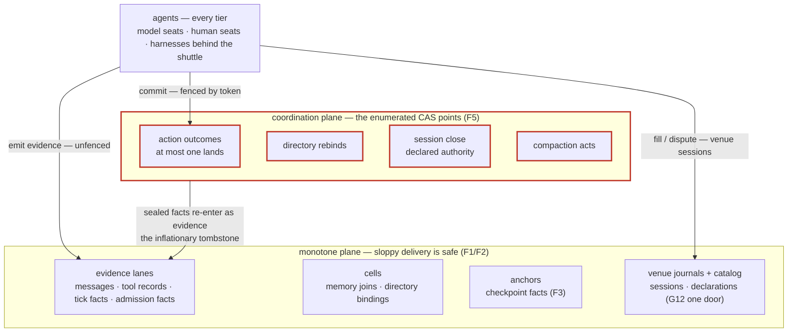
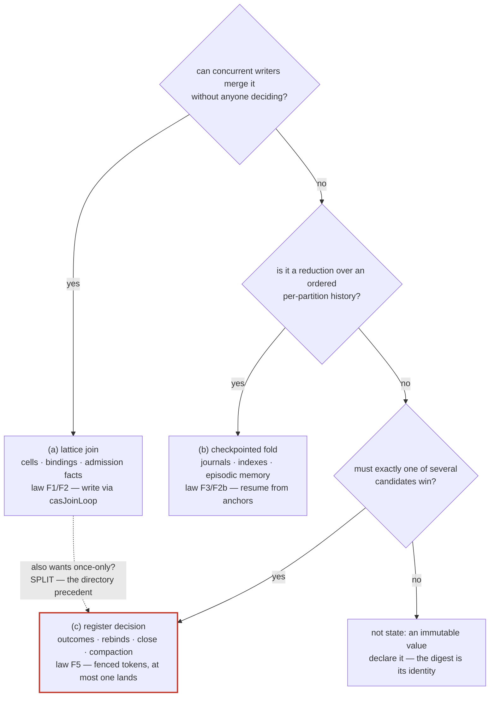

# Plait, part 4 — the agent plane (design commission, continued)

Status: **commissioned continuation**, dispatched by the coordinator
2026-08-18 from the operator's question cluster, asked in two waves.
Wave one: structured input and output, the concierge, the task
abstraction, provisioning and the Effect configuration question, the
native Go comms layer, and agent identity with the digest chain. Wave
two, under the standing directive *base everything as deeply as
possible on what the mathematics gives for free*: agent and system
memory, scheduled tasks, timestamps, id schemas, resources and
workflows, hierarchy and tiers, and the free-construct inventory with
its datastructure taxonomy. Part 1
([the fabric](2026-08-17-plait-coordination-fabric.md)) built the
coordination substrate; part 2
([the action plane](2026-08-17-plait-action-plane.md)) made the act a
fabric citizen; part 3
([the harness plane](2026-08-17-plait-harness-plane.md)) gave search,
naming, and the production inventory; the
[architecture record](2026-08-17-plait-architecture.md) binds the
module map; the [next-phase plan](2026-08-17-plait-next-phase-plan.md)
fixes the model bundle and the fan-out; and the
[Effect affordances record](2026-08-17-plait-effect-affordances.md)
(landed) fixes the CAS-surface vocabulary this part reuses —
`casJoinLoop`, `ResolveCache`, `CellReplica`, the `Blobs` service,
`Registers.audit` with the `Replay` builder, and the matcher sets —
referencing its pending grill items G-1..G-7 by number rather than
re-opening them. **Entered as PROPOSED — nothing below is ratified
until the §20 grill sheet is worked.** This document changes no code,
no ledger row, no dispatch spec, and no seam status; its one finding
against the standing records is FILED in §19, not fixed; amendments it
proposes are collected in §17 and are proposals only.

Confidence tiers, as parts 1–3: **ratified** (grill record or standing
ruling) · **proven** (Lean theorem behind a green gate) · **measured**
(ran-it result in a durable estate document) · **shipped** (code on
main, read in place) · **proposed** (this document's own design) ·
**lead** (external claim not verified against a primary source this
session).

Design law, stated once and obeyed throughout: **no new physics.**
Every answer below either reduces to the ratified constructs (C1–C11,
F1–F12, the session laws, the wire laws W1–W10) or is flagged as a
genuinely new decision and priced in §20. Two standing fences ride the
whole part and are restated wherever they bite: **safety only** — no
liveness claim anywhere; and **the attribution fence** — seat bindings
are unauthenticated strings today, so every multi-party evidentiary
claim is gated on the estate's pending attribution decision (ruling
G4), and every section that touches identity says so in place.

---

## 1. What the agent plane is

Parts 1–3 answer how many agents agree, how one agent acts, and how an
agent finds things. None of them answers the questions an operator
asks when standing up a real fleet: in what language does an agent
speak and listen? through which door does it arrive? what is the unit
of work it is handed? who dresses it before it runs? how does a
harness that has never heard of Effect become a citizen? what does it
remember, and when? who tells it what time it is? what is anything
called? what is a workflow? who outranks whom? and when it has done
something — who was it, and how is the proof walked?

Those questions are the agent plane. For an outsider, in one
paragraph: on this substrate an agent's inputs and outputs are
cataloged types checked at the seam; its arrival is a conformance test
plus a granted authority plus a name; its task is a view over records
that already exist; its equipment is a stack of Effect Layers; its
memory is the substrate itself, read at declared coordinates; its
clock is a stream of attributed tick observations, never a coordinate;
its every name is a hash it can re-derive; its workflows are protocol
sessions; its hierarchy is an authority order, never an org chart; a
foreign harness joins by having its bytes translated rather than its
insides trusted; and everything the agent ever touched is one chain of
content addresses an auditor can re-derive end to end.

The finding of this part, stated up front the way part 3 stated its
own: **eleven of the thirteen questions are answered by composition of
already-proven machinery, and the two that are not (the comms daemon;
the ontology declaration) are new build, not new physics.** The
genuinely new decisions number twelve, and each is a grill item in
§20. Wave two's directive turned out to be the part's method: §15
derives the free constructs from the fold algebra and then grades
every structure this document proposes against a three-way taxonomy —
a test that catches a bad datastructure at declaration time instead of
in review.

House-jargon gloss for readers outside the estate — each term gets one
line here and full weight where it works. A **digest** is a SHA-256
hash over the one canonical byte form (RFC 8785) of a value: its
permanent name, re-derived by every reader, never trusted. A **fold**
is a declared reduction over an event stream; because the declaration
has a digest, "the state of fold F over history H" is a name, not a
cache entry. The **catalog** is the journal of created declarations,
admitted through one proved door (the **certifier**). A **writ** is
what a connection may do (read / publish / request); a **seat** is a
bound role in a protocol session; a **node** is any credentialed
process speaking the writ — `(head, writ)` — admitted by
`plait attest` (part 1 §14). A **refusal** is a typed value returned
instead of an error, carrying the law it defends and a legal next
move; **structural** refusals are permanent (repair them), **absence**
refusals are not-here-yet (retry them). A **register** is the one
place the fabric coordinates: a lease keyed by a work digest, advanced
by compare-and-swap under a monotone **fencing token** — a
strictly-increasing number that decides which commit lands, never who
holds it. A **lane** is a declared evidence stream; a **cell** is a
lattice value merged by least upper bound; an **anchor** is a fold's
checkpoint fact `(fold digest, partition) → (position floor, state
digest, head)`.

---

## 2. Result first — the thirteen answers

**2.1 Schemas live in the catalog; the seam is a constrained decode;
an ontology is one more cataloged declaration.** Effect Schema is the
modeling surface — there is no second schema language — and every
schema that matters crosses into the catalog, where it has a digest
(ruling G12 as amended: types, programs, frames, toolkits, indexes,
resources, directories, retention policies — one door, no exceptions).
An agent declares its output type by pinning a cataloged schema digest
in its capability declaration; a model call's structured output is
admitted by constrained decode against the resolved schema at the
`Models` seam — parse-don't-validate, excess refused, failures landing
as structural refusals with taught next steps while the raw sample
survives as attributed evidence. Input context carries schema
references by digest inside assembled context values, so F7 commits
what the model was told to produce. An **ontology** is designed here
(§4.5) as a cataloged declaration over member type digests and a
closed grammar of declared relations — composition plus one new
declaration kind (grill G27).

**2.2 The concierge is a ceremony, not an authority.** Admission — the
front door where a process presents itself and becomes a node —
composes four acts that all exist: **attest** (generated-vector
conformance; passing is what "is a node" means — part 1 §7.2), **writ
grant** (a policy minted by meet from the granting authority's own
policy — F9 makes over-grant unrepresentable), **directory
registration** (a petname bound under the declared rebind authority —
F12's construct; naming, never identity), and the **provisioning
handshake** (the environmental bootstrap plus a set of catalog
digests). Its product is a journaled admission fact on the monotone
plane — evidence, not a new authority construct (grill G28). The
concierge is not an auth server: credentials stay substrate-side NATS
account machinery at the pin until the attribution decision lands (G4).

**2.3 The task abstraction exists and is derived.** C7 actions are the
single-effect task primitive — declaration digest keys the register,
at most one landed outcome, rounds separating retries from revisions —
and sessions are the acceptance-loop abstraction (rubric as protocol
value, grader as seat, iteration as successor round, done as close —
part 2 §5.4). A **task** is therefore a derived view: the DAG walk
rooted at an action declaration — its round chain, its per-round
register history and landed outcomes, and, where the work rides a
session, that session's acceptance state (grill G29). The two open E9
questions the DEV-725 review surfaced — the identical-call/work-digest
collision and who assigns `round` — stay open and are routed to E9's
grill unchanged; the derived view is stable under any answer (§6.3).

**2.4 Provisioning is a Layer stack; configuration is split by law.**
An agent's runtime is exactly its Layers: `FabricClient` + the
writ-compiled policy Layer + toolkit Layers + the model-provider
`LayerMap` keyed by capability class. Embedding hosts hold a
`ManagedRuntime`; `Scope` bounds connections, consumers, and leases,
and lease loss interrupts the fiber — the ruled runtime meaning of a
stale token. Configuration splits on a ratified fence: everything
semantic is a cataloged declaration (G12 — "no YAML of semantics
exists"), and Effect's `Config`/`ConfigProvider` covers exactly the
environmental band — connection bootstrap, credentials as `Redacted`,
non-identity deployment knobs (grill G30). One pin fact matters: there
is no `Supervisor` module at `effect@4.0.0-rc.108`; supervision rides
`Scope` plus run options (§7.5).

**2.5 The Go comms daemon is a translator, and it is its own epic.**
The analogue of the Multica daemon's role: spawn or attach LLM agent
harnesses (CLI processes speaking a stdio JSON-lines event protocol,
or API loops) and translate their event streams into the language of
the fold — evidence envelopes on lanes, action declarations, fenced
outcomes on registers — so any harness becomes a node without speaking
Effect. The wire contract is bytes; a node's insides are never
trusted, only its bytes; `go/register` and `go/cmd/plaitwall` already
prove the Go-twin pattern. v0 is one adapter, a fixed mapping table,
and no orchestration logic in Go — the daemon translates, the fold
decides. Sized as its own epic: three slices, 5–8 seat sessions, 2–3
review rounds (§8.5, grill G31).

**2.6 Identity is credential + writ today, a session is a derivable
key, and the whole story is one digest chain.** An agent's identity is
its NATS credential plus its policy digest, and the honest boundary is
stated: holder strings are unauthenticated until attribution lands. A
session's key is client-derivable with zero I/O — the digest of its
canonical open event `(protocol, bindings, predecessor)` (measured,
subsession-hole report E7) — and its `final_state_digest` is the
pinnable terminal fact. §9.3 is the section the operator asked for by
name: the walk from writ digest to session digest to context digest
(F7) to action declaration digest (C7) to outcome digest (F5) to
evidence digests on lanes (F1/F2) to anchor digests (F3) — every arrow
a content address, every hop re-derivable, the whole chain one
provenance walk.

**2.7 Memory is the substrate read at declared coordinates — nothing
new is built.** Working state is cells (merge, never overwrite —
F1/F2, written through `casJoinLoop`); episodes are journal spans
checkpointed by anchors (F3); declarative long-term memory is the
catalog (G12's one door, read through `ResolveCache`); working-memory
assembly is a context program (F7); staleness is head-relative absence,
never corruption (F8). Agent-private versus system memory is the same
construct set under different writs — the F9 carrier's `indexes` and
`resources` allowlists are already proven fields. Forgetting is the
ratified retention story (G21: cataloged policy, fenced compaction,
derived horizon), and what is deliberately impossible is silent
mutation of the past (§10). No grill item — the section is derivation.

**2.8 Scheduling is a seat act at the boundary; the fold never gets a
clock.** A schedule is a declared value (the pin's `Cron` is a pure
value module, so a schedule has a digest); a scheduler is a seat that
fires by emitting evidence — a tick fact, holder-attributed, carrying
the claimed time as observation data; monotone triggers react to the
tick's existence, never to time itself (C9/F10, ruled G9); and the
deadline seat stays the one sanctioned door for acting on silence.
What this buys is replay determinism: a replayed history contains the
same tick evidence at the same positions, so no re-run ever consults a
clock (§11, grill G32).

**2.9 Timestamps are observation data, load-bearing for nothing.** The
ruled posture stands: no wall clock enters identity, coordinates, or
arbitration — the DAG position is the coordinate. Time appears in
exactly five audited places (evidence bodies, lease deadlines,
telemetry, substrate metadata, the dedup window), each outside
meaning. The envelope has no timestamp field, by design; claimed times
live inside bodies as attributed observations (§11.4). No grill item —
the rule is already ratified; the section is the audit.

**2.10 No new id namespace is needed, anywhere.** Every identifier in
this part is derived: value digests, declaration digests, work digests,
session keys (a digest of the open event), span ids (chain heads),
message ids (envelope digests), anchors (fold digest + partition),
petnames (naming, never identity), fencing tokens (per-register
opaque ordinals). Agent id = credential + policy digest; session id =
the derived key; task id = the root work digest. The one licensed
future exception is attribution, whose pending estate decision may
mint a principal namespace — and nothing here pre-empts it (§12,
grill G33).

**2.11 Resources are ratified; workflows are sessions; the pinned
Effect workflow engine is refused with its reopen trigger named.**
Part 3's C11 resource declaration stands and is built on, not
re-derived. A workflow, fold-natively, is a protocol session over
declared actions: rubric as protocol value, holes as steps, C7 actions
as the limbs, C9 triggers for reactive transitions, rounds as
iteration, close as done — every piece cataloged, so a workflow
definition has a digest and its instances have derivable keys. The
pinned `unstable/workflow` engine was evaluated at source: its
execution identity is a 16-byte-truncated hash over a
developer-asserted, delimiter-joined pre-image — the exact shape the
estate measured colliding — and its engine journals durable truth
under that identity, which would put a second source of durable truth
beside the fold. Integration is refused at the engine level; the
mapping table in §13.3 shows every construct met by an existing fold
construct; the reopen triggers are named (§13.4, grill G34 — the
part's biggest new decision).

**2.12 Encode the authority lattice, never the topology.** F9's
meet-attenuation is proven and non-optional — a descendant's writ
never exceeds its ancestor's, and that is safety. Communication shape
(trees, DAGs, peer swarms) stays deliberately unencoded: any topology
whose writs compose by meet is lawful, and each task shape is a
protocol value, not a framework change. A tier is a writ profile plus
a provider layer, never a rank. Org-chart machinery and fixed global
roles are refused (§14, grill G35).

**2.13 The mathematics dictates the datastructures — a three-way
taxonomy, and every structure in this part graded against it.**
Catamorphisms give folds and checkpoints; join-semilattices give the
mergeable plane; meet-semilattices give policy — knowledge grows by
join, authority shrinks by meet, two halves of one lattice story;
monotone predicates give triggers; the register is the one construct
that is deliberately not free, because linearization is bought with
CAS and fenced by F5. Every application datastructure is then exactly
one of: **(a) a lattice join** (mergeable, sloppy-safe), **(b) a
checkpointed fold** (ordered per partition, resumable), or **(c) a
register decision** (fenced, at most one lands) — over the ground of
immutable declared values. A structure that wants two classes at once
is a design smell the taxonomy catches early, and the directory is the
precedent: it wanted both and was split. §15.5 grades memory, tasks,
workflows, schedules, and ids in one table (grill G36).

---

## 3. Grounding — what is already settled

| Settled thing | Status | What part 4 does with it |
| --- | --- | --- |
| Catalog = the journal of created declarations; ruling G12 as amended: types, programs, frames, toolkits, indexes, resources, directories, retention policies through the same one door | ratified (CONTEXT.md §Catalog) | the schema store for structured I/O; the door the ontology declaration enters by (§4.5); declarative long-term memory (§10) |
| Effect Schema is the modeling surface; the certifier is the single admission point; constrained decode refuses excess | shipped discipline (CONTEXT.md; W-laws) | structured output is this discipline applied at the `Models` seam |
| `ResolvedOf` — references that decode by resolving; `Schema.Codec<A, Digest, Catalog \| Blobs \| RD, RE>`; service channels propagate; encode is total, publication is a separate act | ratified-binding (architecture §3, DEV-705 corrections) | schema-by-digest made executable (§4.3); the memory read path (§10) |
| Certificate `{schema, program, input anchor, span head}`, every field recomputable | shipped vocabulary | why output schemas must be cataloged digests (§4.2) |
| `Models.generate` takes a Context Value and an output schema; decodes the result against the schema; journals the exchange with the context digest | proposed (part 2 §6.2, ratified G11 seam) | §4.3 fixes what "an output schema" is and adds the commit-side conformance refusal |
| Node = `(head, writ)`, admitted by `plait attest`; attest = generated-vector conformance over a real local NATS | ratified design (part 1 §7.1–7.2, §14) | the concierge's first act; nodehood is defined by attest, and the concierge adds no second definition |
| F9 attenuation — `child = parent ⊓ requested`; the ten-component policy carrier including `indexes`/`resources` allowlists; writ compiles to Layers, DX-not-security | proven (model-level R5, `verify/fabric`) + ratified G10 | the writ-grant act (§5.2); private-vs-system memory (§10.5); the hierarchy answer (§14) |
| F12 — the directory: grow-only petname→digest-set cell; ambiguity structural; rebind a fenced register act; no unanchored resolve (G19/G20) | ratified statement (grill item 12; proof rides wave M3) | the concierge's naming act; the taxonomy's split precedent (§15.4) |
| Attribution gap — seat bindings are bare strings; any credentialed connection may act as any bound principal | measured; decision pending (ruled G4 scoping) | the fence stated in §5, §8, §9, §12, and §18 |
| C7 — action declarations `{capability, context, anchors, policy, round}`; work digest keys the register; retry re-claims, revision pins `round` | proposed (part 2), riding proven-shape F5 (R3 + replay wall) | the task primitive (§6); the workflow limb (§13) |
| Sessions: fills idempotent per `(value, seat)`; close atomic at declared authority; `final_state_digest` excludes journal head; completion a total function of the completion declaration | shipped (R0/R1; `protocol_step.go:226-232`) | the acceptance half of tasks and workflows; the chain's hop 2 |
| Session key = journal prefix + digest(canonical open event); predecessor pins `final_state_digest`; the head is provably unsuitable (a closed session's head keeps moving) | measured (subsession-hole report E7/E8, `protocol_session.go:140-149`) | §9.2; §12's session-id answer — derived, not minted |
| DEV-725 findings: F-1 (skill bundle has no ratified home), F-3 (identical calls collide on one work digest; who assigns `round` is unruled), F-2 (G23's bound missing from reader pages), T14 | measured/filed (`packages/plait/FOR-WORKING-AGENTS.md` §9; `DECISIONS.md` T14) | §6.3 extends F-3; §4.5's ontology ruling sets F-1's precedent; F-2's pages stay owned elsewhere |
| External-effect bound (G23): at-most-one landed outcome is not at-most-one external side effect | ratified; rides the F5 ledger row | restated in §6.4, §8.3, and §13 |
| The wire contract is bytes: canonical envelopes, closed struct, excess refused; refusal envelope carries kind/sort/law/path/next; the envelope has no timestamp field | shipped (`packages/plait/src/Wire.ts`) | the shuttle's entire node contract (§8); the timestamp audit (§11.4) |
| Go-twin pattern: `go/register` (five-action register twin; incarnation bound in the package doc) and `go/cmd/plaitwall` (envelope corpus re-derived by independent Go RFC 8785) | shipped, walled | the existence proof a Go process is a full citizen; the shuttle reuses both (§8.2) |
| Substrate gate + next-phase §D postures: watch behind a ninth probe suite; blob behind an object-store probe; no batch-as-atomicity, pre-registered | executable integration + ratified §E items 7–11 | the shuttle and every replica build inside this envelope |
| Affordances record (landed): `casJoinLoop` (G-2), `ResolveCache` (G-3), `CellReplica` (watch-fenced), `Blobs` service with swappable backends (G-5) and the ranged-read refusal (G-6), matcher sets (G-1), `Registers.audit` + `Replay` builder (G-7), register loop never unified with the join loop (G-4), A-11 durability facts | landed record; grill G-1..G-7 pending | reused by name throughout; every dependency on a pending item cites its number; §16.4 lists this part's deltas against it |
| Trigger algebra monotone-only; the deadline seat is the sanctioned non-monotone door; `Cron` at the pin is a pure value module (`parse`/`next`/`match`), so a schedule is canonical data with a digest | ratified G9 + part 3 gap row 1 (pin cites `Cron.ts:545, :714, :789`) | §11's tick design composes these and adds only the evidence shape |
| "Not Effect durable execution": execution identity is a truncated, delimiter-ambiguous, developer-asserted pre-image; a cross-tag collision was produced; adoption refused; upstream disclosure required before public use of the evidence | measured + ruled (part 1 §3; grill sheet item 15) | §13.4 re-verifies the shape at source and extends the ruling to the namespace, with reopen triggers named |
| Retention: cataloged policy, fenced compaction act, derived horizon = minimum anchor floor; compaction preserves the `(head, state digest)` pair | ratified G21 + shipped compaction discipline | forgetting (§10.6) |
| Capabilities publicly, vendors only in evidence-tier docs | ratified (grill sheet item 14) | §8 names the adapter by protocol shape; §13 names the engine by namespace |
| The 2026-08-14 concierge record: the authoring concierge is stateless; "brand or be unfindable" — brands are the single naming channel identity keeps | measured + proposed (pre-Plait record) | the word "concierge" collision is finding H-5; the brand rule fences §4.5 |

Effect v4 shapes re-checked against the vendored pin this session
(`repos/effect/packages/effect/src`, `effect@4.0.0-rc.108`):
`Layer.mergeAll` (`Layer.ts:1246`), `Layer.provide` (`:1432`),
`Layer.unwrap` (`:1174`), `Layer.buildWithScope` (`:762`),
`Layer.launch` (`:2207`); `LayerMap` (`LayerMap.ts:77`, `make` `:143`);
`ManagedRuntime.make(layer, {memoMap})` (`ManagedRuntime.ts:285`) —
built on `Scope.makeUnsafe("parallel")` + `Layer.buildWithMemoMap`,
fibers supervised via `Fiber.runIn` through `RunOptions.onFiberStart`
(read in place, `:285-320`); `Scope` (`Scope.ts:45`), `Scope.make`
(`:233`), `Scope.provide` (`:303`); `Config` — configs are Effects,
yieldable once a provider is supplied (module header),
`Config.schema<T>(codec, path?)` (`Config.ts:877`), `Config.redacted`
= `Config.schema(Schema.Redacted(Schema.String), name)` (`:1498`),
`Config.nested` (`:1628`), `Config.withDefault` (`:528`);
`ConfigProvider.fromEnv` (the default value of the `ConfigProvider`
`Context.Reference`, `ConfigProvider.ts:343`),
`ConfigProvider.fromUnknown` (JSON objects, `:323` area),
`ConfigProvider.orElse` (`:480`), `ConfigProvider.constantCase`
(`:574`), `ConfigProvider.nested` (`:620`), `ConfigProvider.layer`
(`:666`); `Redacted.make`/`Redacted.value` (`Redacted.ts:187, :245`).
The workflow namespace, read for §13: `Workflow.make` with a
developer-supplied `idempotencyKey: (payload) => string`
(`unstable/workflow/Workflow.ts:59`), execution id =
`makeHashDigest(`` `${tag}-${idempotencyKey(payload)}` ``)`
(`Workflow.ts:316-317`) where `makeHashDigest` truncates SHA-256 to
its first 16 bytes (`unstable/workflow/internal/crypto.ts:4-15`);
`WorkflowEngine` (register/execute/poll/resume, activities, durable
deferreds, clocks — `WorkflowEngine.ts:1-50`); `DurableClock` ("runs
short sleeps through an in-memory activity, and schedules longer
sleeps through the WorkflowEngine" — `DurableClock.ts:1-10`). Two
negative shape-checks: the flat module roster carries no
`Supervisor.ts` (supervision is `Scope` + run options), and no
keyed-function memo exists (`Effect.cachedFunction` is absent; the
affordances record's `Cache.makeWith` route stands).

---

## 4. S1 — structured input and output

### 4.1 Where schemas are held — the settled half, cited

Four sentences, all standing law. Effect Schema is the modeling
surface: a schema is "the declared form of a boundary crossing: a Type
side, an Encoded side, and the transformation between them"
(CONTEXT.md §Schema), and no second schema language exists. The
catalog is where declared schemas live: the journal of created
declarations, one door, no exceptions (G12 as amended — CONTEXT.md
names indexes, resources, directories, and retention policies in the
same list as types, programs, frames, toolkits). Identity is the
structural digest over the owned `flb.type.v0` walk, with refs
resolving only to cataloged digests — the catalog is a DAG by
construction, no forward refs, no cycles (`proto/SPEC.md`). The wire
in is a constrained decode: exactly one JSON value, excess properties
refused, acceptance part of identity — a decoder that repairs its
input is naming a different value than the one that arrived.

"Data formats," in the operator's phrasing, are therefore never a
separate registry. A format is a cataloged schema, its identity is its
digest, and cross-boundary agreement is digest equality. Payloads
above the inline threshold ride the `Blobs` service exactly as the
affordances record designs it (A-9, grill G-5): durable-put,
verified-get — the reader re-derives the digest of what it fetched and
refuses on mismatch — and ranged reads stay refused until the
chunk-manifest law exists (G-6). Nothing in this part adds a format
system or a second blob story.

### 4.2 Declaring output: a capability's schemas are cataloged types, referenced by digest

The capability declaration already carries `input` and `output`
schemas (part 2's C7 capability; the E9 sketch in
`packages/plait/FOR-WORKING-AGENTS.md` §1a). Part 4 fixes the one
under-specified bit — what kind of thing those fields hold — and the
answer is forced by three standing laws rather than chosen:

1. **The certificate needs a digest.** Every produced record's
   certificate carries a `schema` field an auditor recomputes. An
   inline, anonymous schema has no digest to put there — and the
   estate already rules that "anonymous algebras run fine and refuse
   identity: nothing without a canonical form is cacheable or
   catalogable" (CONTEXT.md §Declared algebra). The sentence applies
   to schemas verbatim.
2. **Drift walls need a source pin.** Tool descriptions are derived
   from capability declarations and walled served-equals-derived
   (part 2 §5.1; architecture §5). A wall needs the declaration's
   digest to pin the derivation.
3. **`ResolvedOf` makes the reference executable.** A declaration
   field holding a schema digest decodes by resolving — the
   architecture's Schema-R core, service channels propagating. The
   type of a capability declaration therefore documents that using it
   requires the catalog, and re-derivation on resolve is unskippable.

So (grill G26): capability `input`/`output` fields are catalog digests
of declared schemas, never inline anonymous schema values. The cost is
that declaring a capability means cataloging its types first, or in
the same breath — `Capability.declare` can admit-and-pin in one call,
which is sugar, not a second door. The payoff is that "which type did
this agent promise?" is a digest in the declaration, "did its output
drift?" is a wall, and "what changed between versions?" is a value
diff.

### 4.3 The seam: structured output as constrained decode, with the sample preserved

The flow at `Models.generate`, every step existing machinery:

1. The action declaration pins `capability` (hence the output schema
   digest) and `context` (hence what the model is told — §4.4).
2. The provider adapter asks for structured output however the
   provider does it. JSON modes, tool-call schemas, and grammar
   constraints are adapter concerns at the edge, never part of the
   node contract, and no fabric claim rests on a provider honoring
   them — the fabric's guarantee is the next step.
3. The raw reply is journaled as an opaque-leaf value with
   attribution. The monotone plane welcomes it whether or not it
   parses (part 2 §2.3: the probabilistic arrow is quarantined, not
   denied), so a failed decode never destroys the sample.
4. The reply is constrained-decoded against the resolved output
   schema — parse-don't-validate at the seam. Success yields the typed
   value. Failure yields a structural refusal carrying
   `kind, sort, law, path, got, expected, next`, where `next` teaches
   the repair (the estate's replies-teach discipline, W7). The refusal
   is data the calling agent acts on: render it into the next round's
   context and re-prompt — F8's successor-round idiom for knowledge,
   already ratified.
5. The commit door checks conformance — the part-4 addition, small
   and priced in G26. `Registers.commit` for an action outcome refuses
   an outcome value that does not decode against the capability's
   declared output schema — structural, citing the capability digest.
   This is the certifier discipline applied at the one place an
   outcome becomes the outcome; it needs no new theorem, only the
   existing decode at one more seam. The part's estate-of-safety
   candidate is pre-registered here, per the standing through-line:
   **a landed outcome always decodes against the schema its
   certificate names.** Safety by construction for every downstream
   consumer of outcomes; the wall is a planted non-conforming commit
   shown refused.

What is deliberately not claimed: output quality, provider
determinism, or that a refused decode means the model failed. A
refusal is typed backpressure to the acceptance loop (§6), and an
acceptance loop that never sees a refusal should be treated as
suspicious rather than celebrated — the ontology demo's own acceptance
row says exactly that (dispatch 04).

### 4.4 Input: context carries schema references by digest

Already ratified; assembled here in one place. A context program's
segments are digest-anchored selectors (C6); toolkit segments render
capability declarations carrying their source digests (the MCP `_meta`
bridge precedent, part 2 §5.1) and therefore the input/output schema
digests of every tool the model may call; and the assembled Context
Value's digest commits all of it (F7). The model is told, inside a
value with committed identity, exactly which cataloged types its
outputs must hit — so an auditor reconstructs both what the model saw
and what it was told to produce. Schema references in context are
digests, never prose restatements, and the rendering is a semantic
fold walled against its declarations like every other derived surface.

### 4.5 What an ontology is here — designed (PROPOSED, grill G27)

The operator's question: what is an "ontology" on this substrate — a
new declaration kind, or composition of existing ones? The estate
already has the consumer: the ontology test bed — "prose domain in,
agent-authored types, a protocol over them, replayable journals out"
(AGENTS.md active lane; dispatch 04). What it lacks is a name for the
family itself.

An **ontology declaration** (proposed) is a canonical value admitted
through the certifier:

```
{ types:     [<schema digest>...]        // the member family, cataloged
  relations: [{ kind: <relation kind>,   // closed grammar, see below
                from: <schema digest>,
                to:   <schema digest>,
                note?: <string> }...]
  lineage:   [<digest>...] }             // predecessor ontologies
```

Its digest is the ontology's identity. Members are referenced by
digest and must resolve — the catalog-DAG rule extends unchanged, so
an ontology referencing an unknown digest refuses on absence. The
relation `kind` grammar is closed and deliberately small, the C9
trigger-grammar precedent applied to description rather than reaction.
Proposed v0 productions: `subtype-of`, `key-into` (a field of `from`
identifies a `to` — the correlation-key shape), `part-of`,
`supersedes` (the lineage edge made explicit per member). Growing the
grammar is a ruling, not a patch.

The two readings, stated the way DEV-725's F-1 states the skill
question — deliberately, because ruling one sets precedent for the
other:

- **Reading A — composition only.** An ontology is a directory petname
  over member digests (E12 machinery, zero new build). Costs: the
  family has no single pinnable identity; relations have nowhere to
  live (a directory binds names to digests and carries no edge
  content); a certificate cannot cite "typed under O@digest".
- **Reading B — a declaration kind (recommended).** The value above,
  one more kind through G12's one door. Buys: the family is one
  citable, diffable, lineage-bearing fact; "this session's types were
  drawn from O@digest" is a single certificate entry; an index over an
  ontology's members is an ordinary C10 index whose lane is the
  catalog; the test bed's acceptance artifact gets one name instead of
  N.

Two honesty fences, both inherited:

1. **Relations are declared claims, not checked theorems.** A relation
   never moves the member types' identity — annotations never move
   identity (ticket 004's law), and the members' digests are unchanged
   by being mentioned. A relation moves only the ontology's own
   identity. A relation kind that is mechanically checkable (for
   example `subtype-of` read as "every value of `from`
   constrained-decodes as `to`") may earn a generated wall later,
   rights-follow-proofs style; until then every relation is
   claims-tier and the API renders it as such. No OWL-style reasoner
   is implied, promised, or claimed — any inference over an ontology
   is a declared fold or an action with its own certificate, never a
   property of the ontology itself.
2. **"Brand or be unfindable" still governs.** Schema identity commits
   shape only; brands are the single naming channel identity keeps
   (measured, the 2026-08-14 concierge record). An ontology names a
   family; search inside the family is still by shape and brand, and
   the test bed's authoring guidance inherits that rule unchanged.

---

## 5. S2 — the concierge: the admission surface

A vocabulary note first, because the word is load-bearing twice. The
estate already has a concierge: the stateless type-authoring surface
(typed holes, fill/unfill on partials — `proto/go/protod/concierge.go`,
the 2026-08-14 record, dispatch 04's "concierge typed holes"). This
section designs a different door — the admission concierge — and the
collision is filed as finding H-5 with a naming recommendation (§19).
Prose below says "the concierge" for the admission surface only.

### 5.1 What admission is

A process becomes a node — `(head, writ)` with credentials — and
nodehood is already defined: "admitted by `plait attest`" (part 1
§14). The attest harness drives a candidate over the generated
conformance corpus on a real local NATS: publish these frames, expect
these digests, expect these refusals, crash here, resume, expect this
anchor (part 1 §7.2). It is implementation-language-agnostic because
it speaks only bytes on subjects. The concierge adds no second
definition of nodehood. It is the ceremony that composes admission's
four acts so a fleet operator — or an agent, through the same derived
tools — performs them as one legible sequence.

### 5.2 The four acts — each existing machinery

**Act 1 — attest (conformance).** The candidate passes the vector
corpus. This claims behavior on the corpus and only that: no
internals, no honesty, no availability (part 1 §7.3). A conformant
node can still be malicious; the part-1 candidate law is exactly the
statement that this costs liveness and evidentiary weight, never
meaning integrity.

**Act 2 — writ grant (authority).** The granting authority holds a
policy; the candidate requests one; the grant is
`granted = grantor ⊓ requested` — the one spawn form F9 defines, so a
concierge cannot mint authority exceeding its own, by construction
rather than by review (proven at the model level, `verify/fabric`,
allowlist fields included). The granted policy is a canonical value
whose digest enters the admission fact. G10's honesty box rides
verbatim: the Layer compilation of that writ is developer experience;
the security half is server-side refusal plus NATS permissions plus
the pending attribution decision.

**Act 3 — directory registration (naming).** A petname for the node
is bound in a directory under the declared rebind authority (F12;
rulings G19/G20: binding-append monotone, ambiguity a structural
refusal, rebind a fenced register act, no unanchored resolve). A
petname is never an identity — it is how humans and dashboards refer
to the node; every evidentiary reference is the credential-plus-writ
pair. Registration is optional at admission: an unnamed node is a full
citizen.

**Act 4 — the provisioning handshake (equipment).** The concierge
hands the node two different kinds of thing, and the split is the
design: (a) the environmental band — servers URL, credential material
(as `Redacted`, never through the fabric), local paths — the only band
that is configuration (§7.4); and (b) digests — the granted policy
digest, the context-program digests its policy allowlists, the toolkit
digest, the venue map. Everything in (b) is a catalog reference the
node resolves and re-derives (`ResolvedOf`, with `ResolveCache` as the
read path once its wrapping layer lands — affordances A-8a, grill
G-3). The handshake carries no semantic content, only names of
content — so a tampered handshake can misdirect (a liveness cost) but
cannot corrupt (the part-1 candidate law doing admission duty).

The ceremony, end to end — the diagram shows the real order and the
one product:



*Figure: the admission ceremony as a sequence — four acts over existing
services, producing one journaled fact.*

### 5.3 The admission fact

The ceremony's product is a journaled admission fact on the monotone
plane — an ordinary evidence envelope, not a new record kind:

```
{ kind: "attest",                    // the existing envelope kind
  body: { candidate:  <connection/credential reference>,
          corpus:     <conformance corpus digest>,
          verdict:    <attest transcript digest>,
          policy:     <granted policy digest>,
          binding?:   <directory, petname, token> } }
```

Recommendation (G28): evidence plus a derived view, no new declaration
kind. "Who is admitted at head H" is a fold over admission facts —
head-relative, like every other roster. Re-admission after an upgrade
is a new attest run and a new fact: history, not mutation. A revoked
writ is a regrant or rebind act whose record supersedes; nothing is
deleted.

The attribution fence, restated where it bites: the admission fact's
`candidate` field names a credential, and the estate's measured
finding stands that bindings are unauthenticated strings beneath that.
An admission fact is therefore mechanics evidence — "this credentialed
connection passed the corpus and was granted P" — and never a
multi-party evidentiary claim about who stands behind the credential.
That sentence ships on the admission surface until the attribution
decision lands (G4).

### 5.4 What the concierge is NOT

- **Not an auth server.** It issues no credentials, verifies no
  identities, holds no accounts. The credential story is
  substrate-side NATS operator/account/user machinery at the pin —
  distinct credentials per node, the signature seam reserved on the
  envelope (part 1 §7.4) — until the estate's attribution decision
  replaces or extends it. The concierge consumes a credential that
  already exists.
- **Not a gatekeeper for meaning.** A process that skips the ceremony
  and speaks the wire is refused or admitted by the same server-side
  laws as everyone else; its bytes verify or refuse on their own
  digests. Admission gates participation ergonomics — a writ, a name,
  equipment — never the substrate's integrity.
- **Not a liveness authority.** No heartbeat it observes is a claim.
  Presence subjects stay advisory (`flb.fab.node.*`, part 1 §6.2: "no
  meaning").

### 5.5 The surface

One module, `Admission.ts`, orchestrating existing services — it owns
the ceremony and the derived roster view, and calls `Attest`,
`Policy`, `Directory`, `Lanes`; it mints no protocol. Its refusal
handling rides the affordances matcher set (A-6, grill G-1):
`Refusal.match` branches on sort with compile-time closure, so
admission tooling retries absences and surfaces structural refusals
with their taught next steps rather than re-deriving the union. MCP
tools are derived and writ-projected per architecture §5: introspect —
`admission.roster` (the fold, anchored), `admission.describe` (one
fact with its digests resolved); configure — `admission.admit` (the
ceremony; requires the granting writ), `admission.regrant`,
`admission.bind`. The tools are the same derivation the runtime
executes, so a human and an agent see one truth.

---

## 6. S3 — the task abstraction

### 6.1 Do we have one? Yes — two ratified halves

The operator's question is whether Plait has a Task. The honest answer
is that it has the two halves a task decomposes into, both ratified,
and gluing them with a new construct would duplicate physics:

- **The effect half is C7.** An action declaration is the
  single-effect unit: its digest keys the register; at most one
  outcome lands per declaration under arbitrary duplicate scheduling
  (F5's safety statement — proven shape, R3 plus the two-runtime
  replay wall on the real substrate); a retry re-claims the same work
  digest while a revision is a new declaration pinning its predecessor
  through `round`. The distinction is definitional, so a scheduler
  cannot confuse them even in principle (part 2 C7).
- **The acceptance half is a session.** Rubric as protocol value,
  performer/grader/closer as seats, each iteration a successor round,
  done as close under declared authority sealing `final_state_digest`
  (part 2 §5.4). The loop's whole history is a DAG walk, and the
  fabric cannot tell whether the grader is a model, a harness, or a
  human.

### 6.2 The Task, defined as a derived view (PROPOSED, grill G29)

> **A task is the DAG walk rooted at an action declaration:** the
> round chain (each revision pinning its predecessor's work digest),
> each round's register history (grants, steals, the landed outcome if
> any — F5's retained history is the witness), each outcome's
> certificate (context digest, capability digest, schema digest), and
> — where a declaration's anchors pin session facts — that session's
> acceptance state, with `final_state_digest` when closed.

Nothing in that sentence is new state. The API is a read:

```ts
// A read over records that already exist. It writes nothing, fences
// nothing, and is safe to serve to any writ that may read its parts.
Actions.task(root: WorkDigest, anchor: Anchor): Effect<TaskView, Refusal, R>
// TaskView = { declaration, rounds: [{ declaration, attempts, outcome? }...],
//              acceptance?: SessionState }
```

`Actions.task` is head-relative like every read (F8's vocabulary: a
view at anchor A is a true record of a DAG position, never wrong
later); an unanchored form does not exist (G20's rule, applied
uniformly). The register-history rows come through `Registers.audit`
and the `Replay` register arm exactly as the affordances record
designs them (A-10; row and builder shape pending grill G-7; the
ratified timing is post-M3, fused with the incarnation-pin conversion
per plan items 7 and 8) — inheriting both of its bounds verbatim:
history depth is declared retention, and every row is stamped with the
backing-stream incarnation, so a task view spanning a bucket
recreation is two histories, never one order. Register state inside
the view renders through `Register.matchState` (absent / held /
landed — A-6), so "what is this task doing right now" is an exhaustive
three-arm fold, not a string comparison.

Universal-properties-to-DX, stated because the house rule demands it:
the view inherits its correctness — uniqueness of the landed outcome
per round from F5, well-foundedness of the walk from C7's acyclicity
(a cycle needs a digest preimage), reproducibility of each round's
context from F7 — and claims nothing of its own.

### 6.3 What stays open — extended, not re-opened

The DEV-725 review filed F-3, and this part's job is to route it, not
decide it: a model calling the same tool twice with byte-identical
arguments inside one generation — a poll, a re-read, a deliberate
second sample — produces one work digest, and the register treats the
second call as a retry of the first, whose outcome cannot land. The
only separating field is `round`, and nothing ratified says who
assigns it or at what granularity (per call site? per position in the
call sequence? per generation turn?). Polling and re-reading are
ordinary agent behavior, so this is not a corner case. It is
recommended as an E9 grill item by the filing and endorsed here.

What part 4 adds is one constraint the E9 ruling should inherit, and
it argues for the derived view: `Actions.task` is stable under any
round-assignment answer. The view walks `round` pins wherever they
come from; a per-call-site rule, a per-sequence-position rule, and a
per-turn rule all produce walks the view renders unchanged. Deciding
the collision therefore does not reshape the task abstraction — which
is precisely why the abstraction should stay derived until E9 rules,
rather than baking a granularity into a construct now and paying to
unbake it.

### 6.4 What a task is NOT

Not a queue entry — work distribution stays claim hints on a
work-queue stream with exclusivity owned by registers (part 1 §6.3: a
raced hint costs duplicate work, never duplicate commits). Not a
workflow node — §13 answers what a workflow is, and it is not an
engine. Not a liveness promise — nothing says a task completes, and no
view field implies it. And its landed outcome is not an external side
effect: G23's sentence rides every task-shaped surface — at-most-one
landed outcome is not at-most-one external side effect — with the work
digest offered as the vendor idempotency key where one exists.

---

## 7. S4 — provisioning into nodes, and the Effect configuration question

### 7.1 The provisioning unit is a Layer

An agent's runtime is its Layer stack — provisioning and capability
are the same fact, which is G10's design made operational:

```ts
import { Layer, ManagedRuntime } from "effect"
import { FabricClient, Policy, Models, Toolkits, Contexts } from "@foldlab/plait"

// The stack IS the writ: absent services are absent capabilities.
const WorkerRuntime = Layer.mergeAll(          // Layer.ts:1246
  Policy.layer(WorkerSeat),                    // writ-compiled: Contexts | Models | Lanes
  Toolkits.layer(DistillToolkit),              // derived from cataloged capabilities
  Models.layerByClass({ compact: CompactProvider }),  // LayerMap keyed by capability class
).pipe(Layer.provide(FabricClient.layer(bootstrap))) // Layer.ts:1432; the one env-fed layer
```

The pieces are all ratified: `Policy.layer` compiles the writ (G10,
with its honesty box), `Models` provisioning is a `LayerMap` keyed by
capability class — `compact | standard | frontier`, provider bindings
at deployment configuration, vendor names refused in policies (part 2
§6.2, G11) — and `FabricClient` is the Scope-bound connection with a
`LayerMap` by venue (part 1 §8.2; keying granularity stays the
architecture's recorded open seam, decided when E7 makes it real).

### 7.2 Embedding is a ManagedRuntime

For hosts that are not themselves one Effect program — a CLI, a test
harness, a server embedding an agent — the pin's embedding seam is
`ManagedRuntime.make(layer)` (`ManagedRuntime.ts:285`): the stack
builds once (memoized via the layer `MemoMap`), every `runPromise`
executes against it, and disposal closes the root `Scope`, which
releases the connection, consumers, and leases in order. The Plait
affordance is one constructor, sugar only:
`Plait.runtime(policy, bootstrap)` wraps `ManagedRuntime.make` of the
§7.1 stack. The Go daemon does not embed Effect — it speaks bytes
(§8); `ManagedRuntime` is the TS-host story.

### 7.3 Scope is the lease made structural

Ratified and restated: `Scope` bounds connection, consumer, and lease
lifetimes; lease loss interrupts the holder's fiber — interruption is
the runtime meaning of "your token is stale," and budget exhaustion
rides the same door (exhausted → interrupt → lease lapses → another
claimant steals; budgets stay liveness machinery, never identity —
part 2 §7). The zombie path is thereby structured: the interrupted
fiber's already-emitted evidence stands attributed on the monotone
plane, and its commit, if it races on, dies on the token (F5). Nothing
an interrupted agent did needs semantic cleanup — that is the
two-plane split paying rent inside one process.

### 7.4 The configuration question, split by law (PROPOSED, grill G30)

The operator's standing charge: configuration legible to agents AND
humans. The design answer is that a fence already ratified decides
what configuration even is, and Effect's `Config` machinery is adopted
for exactly the remainder:

- **Everything semantic is a cataloged declaration** — programs,
  policies, frames, toolkits, indexes, resources, directories,
  retention (G12). These are not configuration; they have digests,
  diff as values, refuse on absence, and enter through the certifier.
  "Config drift is not representable: there is no file to drift"
  (next-phase §C.6).
- **Only the environmental band is configuration**: connection
  bootstrap (servers URL, credential material, TLS), local paths, and
  non-identity deployment knobs — for example the inline/blob
  threshold, which is deployment configuration with a wall, never
  identity-bearing (ratified, plan grill item 10). Architecture §5's
  sentence is the fence: "only connection bootstrap (URLs,
  credentials) stays environmental."

For that band, adopt the pin's constructs as follows:

```ts
// One declared, closed config schema for the band — Config.schema
// (Config.ts:877) over an ordinary Effect Schema struct, so the band
// is enumerable, documented, and derivable like everything else.
const PlaitBootstrap = Config.schema(BootstrapSchema, "PLAIT")
// BootstrapSchema = { servers: URL[], creds: Redacted, dataDir: Path,
//                     inlineThreshold?: Bytes, venue?: Nested per-venue }

// Secrets: Config.redacted (Config.ts:1498) — the parsed value is a
// Redacted container; logs and toString show "<redacted>". The same
// Redacted the edge-capability law requires at the boundary (part 3
// §5.2): the wire grammar admits no secret carrier, so a secret's
// only homes are the environment and the Redacted value.

// Provider layering is the deployment posture (all pin-cited):
const provider = ConfigProvider.fromEnv()                    // :343 (the default)
  .pipe(ConfigProvider.orElse(() =>                          // :480
    ConfigProvider.fromUnknown(defaultsJson)),               // :323
    ConfigProvider.constantCase)                             // :574 — PLAIT_SERVERS etc.
// Config.nested (Config.ts:1628) / ConfigProvider.nested (:620) give
// per-venue scoping; ConfigProvider.layer (:666) installs the chain.
```

Both audiences, one truth, without a second surface: agents read the
same `BootstrapSchema` declaration the runtime decodes (it is a
schema, so it is catalogable and derivable); humans get a generated
env-var reference — one more codegen-family artifact (architecture
§6), walled served-equals-derived, so the documentation of the band
cannot drift from the band. The MCP configuration plane continues to
serve the cataloged half only; it never proxies environment variables,
because a config value that matters to meaning is, by the fence, not
an environment variable.

Higher-order constructs evaluated, verdicts one line each: layered
`ConfigProvider`s — adopted (env over declared defaults, the
deployment posture above). `Config.nested` — adopted (per-venue
scoping). Secrets redaction — adopted and load-bearing (`Redacted` is
the only lawful home for a secret this side of the vault seam).
`Config.withDefault` (`:528`) — adopted for knobs with safe defaults.
Refused: any decode path from `ConfigProvider` into declarations. A
context program, policy, or lane in an env var is not representable,
because declarations enter only through the certifier — a config key
that tried would have nowhere to go. That refusal is the G12 fence
surfacing in the type system, and it is the whole answer to "why can't
I just set it in the environment."

### 7.5 Lower-level constructs: where they earn a place

| Construct (pin) | Verdict | Why |
| --- | --- | --- |
| `ManagedRuntime` (`ManagedRuntime.ts:285`) | public, at the embedding seam | the one sanctioned way a non-Effect TS host runs a provisioned agent; memoized build + scoped disposal are the §7.2 lifecycle |
| `Scope` (`Scope.ts:45, :233, :303`) | public in semantics, internal in surface | users meet Scope through `Effect.scoped` and lease behavior; no Plait API takes a raw Scope |
| `Layer` combinators (`mergeAll :1246`, `provide :1432`, `unwrap :1174`) | public | provisioning IS layering; hiding it would invent a second composition story |
| `LayerMap` (`LayerMap.ts:77, :143`) | internal, surfaced as configuration | capability-class and venue keying are declared data; the map is plumbing |
| `Fiber` / `FiberHandle` / `FiberSet` | internal | consumer pumps, heartbeats, deploy handles; interruption is public semantics, the fiber is not public surface |
| `Runtime` (`Runtime.ts`) | internal | `ManagedRuntime` is the sanctioned wrapper; raw runtimes invite ambient execution |
| `Supervisor` | does not exist at the pin | no `Supervisor.ts` in the flat module roster (read in place); supervision is `Scope` + `RunOptions.onFiberStart` (`ManagedRuntime.ts:285-320`). Any design prose leaning on an Effect "Supervisor" is wrong at rc.108 and gets caught here before it is written |

---

## 8. S5 — the native Go comms layer: the shuttle daemon

### 8.1 The role, in the fold's own words

The Multica daemon's role, transposed: a Go daemon that spawns or
attaches LLM agent harnesses — CLI processes speaking a stdio
JSON-lines event protocol, or API loops — and translates their event
streams into the language of the fold: evidence envelopes on lanes,
action declarations, fenced outcomes on registers. The daemon is
itself a node — credentialed, `(head, writ)`, admitted by attest like
any other — and the harnesses behind it are its insides, which the
fabric never trusts. Only its bytes. That sentence is why this layer
exists: agent-implementation agnosticism stops being a slogan the
moment a harness that has never heard of Effect lands outcomes under
the same laws as everyone else.

Naming (offered, not assumed — the G2 precedent): **the shuttle** —
the weaving tool that carries a foreign thread through the warp.
Short, plait-flavored, honest about the job: it carries, it does not
decide. Plain alternative if the operator prefers no coinage:
`agentd`. Homes: `go/shuttle/` (package) + `go/cmd/shuttle/` (binary),
stdlib + `nats.go` at the pin, per the standing Go-module rule.

### 8.2 The shape — five pieces, three of them precedented

```
go/shuttle/
  supervisor   spawn/attach/detach harness processes; restart = re-attach
               writ to head (crash-recovery is free by construction, part 1 §5.0)
  adapter      one harness protocol: stdio JSON-lines event frames in,
               refusals and prompts out (v0: exactly one adapter)
  translator   the mapping table (§8.3): harness event → fabric act;
               canonical bytes + digests via go/canonical (shipped, walled)
  fabric       NATS client at the pins: lanes (publish), registers
               (go/register, shipped, walled), anchors/KV — inside the
               substrate gate's probed envelope and its refused list
  attest       the passage harness: the daemon runs the same generated
               corpus as every node; passing IS its nodehood
```

The precedents are load-bearing: `go/canonical` is the independent
RFC 8785 implementation the JCS wall trusts; `go/cmd/plaitwall`
already re-derives the TS-emitted envelope corpus byte-for-byte
(provenance line checked, digest equality per row); and `go/register`
is the five-action register twin whose replay wall carries F5 onto the
real substrate, incarnation bound included. The shuttle composes
shipped, walled Go parts; the new build is the supervisor, the
adapter, and the translator.

### 8.3 The mapping table — the design center

Harness event in, fabric act out. The table is the whole contract, and
it is deliberately mechanical: the daemon never decides what happens
next. The harness proposes (its model is the probabilistic arrow); the
fold arbitrates (registers, refusals, session steps); the shuttle
translates in both directions.

| Harness event (adapter frame) | Fabric act | Plane / law |
| --- | --- | --- |
| harness started / exited / crashed | evidence emit on an agent-ops lane; advisory presence on `flb.fab.node.*` | monotone; presence carries no meaning (part 1 §6.2) |
| assistant message / turn complete | evidence emit — opaque-leaf body, holder-attributed | monotone; the arrow's raw output is welcome as evidence (part 2 §2.3) |
| tool call proposed (name + args) | action declaration submitted: capability digest resolved from the toolkit, args as canonical value, `round` per the E9 ruling (open — §6.3); declaration digest computed Go-side over canonical bytes | the declaration is data; submitting it fences nothing yet |
| tool call is fabric-facing work to perform | register claim under the daemon's writ (`go/register` grant), perform, then fenced commit with the token; the outcome constrained-decodes against the capability's output schema or refuses (G26's commit-door rule) | coordination plane; F5; at most one landed outcome |
| tool result to hand back to the harness | render the outcome — or the refusal, kind · sort · law · `next` — into the harness's own input framing | the replies-teach discipline crossing the adapter unchanged (W7) |
| scheduler duty (optional): a declared schedule fires | emit the tick fact (§11.2) — evidence, holder-attributed, claimed time as observation data | monotone; the shuttle is a natural tick host, and the fold never sees a clock |
| token/progress stream | transport only: surfaced live if a UI wants it, never identity-bearing, never journaled beyond the final record | part 2 §6.2's rule verbatim |
| harness self-report of its own prompt/context | evidence emit, labeled self-report | see the bound below |

Two bounds, stated loudly because a comms layer is exactly where they
would otherwise be assumed away:

1. **A harness's account of its own context is a self-report, never a
   certificate.** F7 covers contexts assembled through `Contexts` from
   digest-anchored inputs. A v0 harness assembles its own prompt
   inside its own process; the shuttle can journal what the harness
   says it saw — attributed evidence, welcome — but no context digest
   exists and no certificate claims one. The chain in §9 for
   shuttle-fronted nodes therefore enters at the declaration hop, not
   the context hop, and the ledger row for the shuttle says so.
   Closing that gap — harnesses that accept fabric-assembled
   contexts — is real future work, not a v0 promise.
2. **G23 rides the adapter verbatim.** A harness that called a vendor
   API and then died before its outcome committed has already called
   the vendor API. The work digest is offered as the idempotency key
   where the vendor supports one; where not, the bound is the bound.

And the attribution fence, restated: everything the shuttle emits is
attributed to the daemon's credential; per-harness `holder` strings
are carried verbatim and are unauthenticated (measured). A
multi-harness deployment under one shuttle is one principal until the
attribution decision lands — the daemon partitions harnesses and
cannot claim isolation between them (part 3 §6.2's tenancy sentence,
one level down).

### 8.4 v0 scope, honestly

IN: one adapter (stdio JSON-lines — the shape every current CLI
harness can emit or be wrapped to emit; named by protocol shape, not
vendor, per the ratified positioning rule); the mapping table above;
the attest passage; the walls below; crash/kill chaos on the
supervisor path. OUT, each with its reason: no orchestration in Go
(the fold decides; a scheduling loop in the daemon would be a second
coordinator — refused by the no-orchestrator doctrine, part 1 §2.1);
no context assembly in Go (F7's home is the TS `Contexts` service and
the model lane; a second assembler is a second-canonicalizer-class
mistake); no API-loop adapter yet (same seam, second adapter — lands
when a consumer exists); no MCP surface in the daemon (the
introspection door is the estate's MCP layer; the shuttle is not a
tool server); no per-harness credentials (blocked on attribution,
named, not worked around).

Gates, in the house shape: the translation wall — a generated corpus
of harness event frames (emitted by a fixture harness, never
hand-typed — the generated-vectors law applies to the adapter too)
maps to envelope and declaration bytes identical between the Go
translator and a TS reference translation, digest per row; attest
green for the daemon itself; register conformance re-using the F5
replay rows; chaos — kill -9 the harness mid-tool-call (the outcome
never half-lands; the register history shows grant-without-commit and
a steal), kill -9 the daemon (restart re-attaches writ to head; no
duplicate landed outcomes — F5 at the daemon seam); negative
controls — a planted non-canonical frame refused at the adapter, a
planted stale-token commit refused with the law named, a planted
excess-property envelope refused (the spine's existing control,
crossed by a second implementation).

### 8.5 Size — its own epic, estimated in the house currency

This is an epic, not a ticket: it has its own binary, its own walls,
its own chaos schedule, and a consumer (the E10 gauntlet's agentic
scene, plus every seat the operator already runs by hand). Calibration
anchors from the measured cadence (next-phase §A.2): `go/register`
plus its replay wall was one seat run inside the E5 slice; the spine's
corpus wall was one slice; DEV-695-class pushes ran one seat run plus
three review rounds.

Estimate: **three slices, 5–8 seat sessions, 2–3 adversarial review
rounds.** Slice S1 — skeleton: supervisor + fabric client + attest
passage (the daemon is a node before it fronts anyone); 2–3 sessions.
Slice S2 — the adapter + translator + translation wall; 2–3 sessions
(the wall's fixture harness is half the work). Slice S3 — chaos +
negative controls + the ledger row with its bounds (self-report bound,
G23, attribution, incarnation); 1–2 sessions. Dependency edges: the
merged spine/register surfaces suffice today; the
tool-call-to-declaration row consumes E9's `Capability`/`Action`
declaration shapes (scaffold can precede; the wall keys to E9's
merge); the `round` field consumes E9's F-3 ruling — until then the
adapter assigns a per-process monotone round and the DECISIONS log
records the interim. Seat class per directive 6: runtime/Go work on
codex/CC seats; no model half exists in this epic.

---

## 9. S6 — agent identity, sessions, and the digest chain

### 9.1 Identity today, stated honestly

An agent's identity is its credential plus its writ: the NATS
account/user it connects as (distinct per node, substrate-side at the
pin) and the policy digest it was granted (F9-attenuated, cataloged).
That is the whole of it, and the boundary is stated rather than
blurred: `holder` strings on envelopes are carried verbatim and are
unauthenticated — any credentialed connection may act as any bound
principal, and replay confirms rather than detects the forgery
(measured). The estate's pending attribution decision is the fix, and
the envelope's reserved signature seam is where it lands as a field
addition plus a gate, not a redesign (part 1 §7.4). Until then,
identity claims are connection-attributed mechanics, and no surface in
this part mints an evidentiary "who."

A petname in a directory is an agent's name, never its identity
(§5.2 act 3); the admission fact links name, credential reference, and
policy digest as evidence. That is deliberately all the "agent id
system" there is — anything richer would be attribution by the back
door.

### 9.2 What a session is, exactly

Assembled from shipped machinery and the measured probe results, one
fact per clause. A session is a journal at its home venue whose key is
derivable by any party with zero I/O — the journal prefix plus the
digest of the canonical open event `{protocol digest, bindings,
predecessor}` (measured, subsession-hole report E7;
`protocol_session.go:140-149`). On that journal, fills are idempotent
per `(value, seat)` — redelivery-safe by law, not by dedup — and close
is atomic at the declared authority: the one non-monotone act, placed
where CALM demands. The terminal fact is `final_state_digest` — the
meaning fold's digest, excluding the journal head. The head is
provably unsuitable as a pin: a closed session's head keeps moving
while its final-state digest does not (measured, E8) — which is why
`predecessor` pins `(session, final_state_digest)` and why acceptance
loops chain on meaning, not on transcript length. Completion is a
total function of the completion declaration: `completed` iff every
declared name ends `filled` or `decided`, else `abandoned` — and an
abandoned session still carries a final-state digest, so a failed task
is a first-class, pinnable value (measured; `protocol_step.go:226-232`).

Sessions ride venues unchanged over the fabric (part 1's inherited
row: "the fabric adds reach, not semantics"); part 2 §5.4's acceptance
loop is this machinery used as a loop; and the W1–W10 wire laws are
the contract every session move travels under.

### 9.3 The chain — one provenance walk, written to be quoted

> The fabric's coordinates are content addresses; "where are we?" is a
> position in a DAG of meanings, not a position in time (part 1 §2.3).
> This section is that thesis walked end to end for one agent's one
> act — the operator's semantic-space doctrine, made mechanical.



*Figure: the digest chain — seven hops, every arrow a content address
inside a canonical value. The outlined hop is the one fenced step; the
dashed edges are the two cross-pins that make the chain auditable
backwards.*

A review-lead agent, seat R, in a review protocol. Seven hops; every
hop names the law that makes it re-derivable.

**Hop 1 — the writ digest: what it may do.** The granted policy
`P = grantor ⊓ requested` is a canonical value; `digest(P)` names R's
entire authority — writ bits, budgets, allowlists, spawn bound.
Delegation is a digest pair: a child's policy pins its parent's, and
F9 (proven) says no chain ever escalates. An auditor re-derives the
meet from the two operand values.

**Hop 2 — the session digest: what game it is in.** The session key is
`digest(canonical {protocol, bindings, predecessor})` under the
journal prefix — derivable by anyone, no lookup (measured, E7).
`protocol` pins the rubric (seats, holes, fences, completion — a
cataloged value); `predecessor` pins the prior round's
`(session, final_state_digest)` — the acceptance loop's chain, linking
on meaning rather than on heads (E8). An auditor re-derives the key
itself from three digests already in hand.

**Hop 3 — the context digest: what it saw.** `assemble(program,
inputs)` is a function (F7): the context program's digest plus the
pinned input anchors — frames from the catalog, the session's protocol
value, the frontier at a head, a retrieval selector
`search(index, anchor, query, k)` — determine the assembled Context
Value's bytes, hence its digest. What the model saw, and why it saw
that rather than something else, is one digest. An auditor re-derives
the assembly byte-for-byte from the program and the anchored inputs
(the E6/M2 wall's exact statement).

**Hop 4 — the action declaration digest: what it undertook.**
`{capability, context program, anchors, policy, round}` — the chain
folds in here: hop 1's policy digest and hop 3's program-plus-anchors
are fields of this value. Its digest is the work digest — the register
key, so "the same call" and "the same key" are the same fact. `round`
pins the predecessor declaration: revision is a new fact, never an
overwrite (C7). An auditor re-derives the work digest from the
declaration value and the round chain by walking pins.

**Hop 5 — the outcome digest: what landed.** The register keyed by
hop 4's work digest admits at most one landed outcome, decided by the
fencing token, never the holder (F5 — proven at R3, carried onto the
real substrate by the two-runtime replay wall). The outcome record's
certificate pins the capability digest, the schema digest its result
decodes against (G26's commit door), and the context digest actually
assembled — hop 3, sworn into hop 5. An auditor re-derives the
result's schema conformance, and the token order from the register's
retained history (`Registers.audit`, incarnation-stamped — A-10).
Bounds ride in place: safety only; within one backing-stream
incarnation; and G23 — the landed outcome bounds Plait's record, never
a vendor's side effect.

**Hop 6 — the evidence digests: what everyone learns.** Evidence
envelopes carry the outcome's digest, the certificate, and DAG pins;
each envelope's message id IS its digest, so duplication and
reordering are harmless by theorem shape (F1/F2), and two readers that
verified the same set hold byte-identical cell state — agreement is
digest equality, never negotiation. An auditor re-derives every
envelope digest, and the cell state by folding the verified set in any
order.

**Hop 7 — the anchor digests: where to resume.** Every fold and index
reading those lanes advances its anchor — `(fold digest, partition) →
(position floor, state digest, head)` — a fact, not a cache: F3 makes
resumption from it exact, so "where we got to" is itself a
re-derivable claim, and a span id is the segment's chain head,
recomputable rather than assigned. An auditor re-derives the state
digest by refolding from any earlier anchor.

**The walk backwards is the audit.** From any landed outcome: hop 5
names the context (hop 3), the capability and schema (§4), the policy
(hop 1), and the round chain (hop 4); hop 3's certificate names the
session (hop 2) and every input anchor (hop 7); every name is a
digest; every digest re-derives from bytes; no clock, no sequence
number, and no one's say-so appears anywhere on the path. Two agents
disagreeing about "what did you know when you did that" is a digest
comparison (part 2 §2.2) — and so is every other question on the
chain.

What the chain does not prove, stated with the same care: who stood
behind the credential (attribution — G4 gates every evidentiary "who";
the chain proves what-under-which-writ, not whom); quality (a bad
program assembles bad context deterministically — part 2 §9.1);
liveness (nothing says any hop ever happens). And where the chain is
honestly thinner today: hops 1–2 and 5–7 ride shipped or proven
machinery at their recorded rungs; hops 3–4 are ratified design
landing with E6/E9 and the M2 wave; shuttle-fronted harnesses (§8)
enter at hop 4 without hop 3 until fabric-assembled contexts reach
them. Each gap is named in its owning slice's ledger row, never
papered over.

---

## 10. S7 — memory, agent and system

The operator's charge for this section: build the memory story from
what the mathematics gives for free. It turns out the whole story is
free — this section introduces no construct, no module, and no grill
item. Memory on this substrate is the substrate, read at declared
coordinates. What follows names each kind of memory, the law that
carries it, and the one thing each kind makes impossible.

### 10.1 Four kinds of memory, four laws

| Kind | Construct | The law | The read/write path |
| --- | --- | --- | --- |
| working state | cell — a lattice value, merged by least upper bound | F1/F2: merge is associative, commutative, idempotent; the terminal state is invariant under permutation and duplication of the trace | write via `casJoinLoop` (affordances A-7, grill G-2); local view via `CellReplica` (A-8b) |
| episodes | journal spans + anchors | F3: folding a resumed prefix then the rest equals folding the whole; a span id is the segment's chain head, recomputable | deployed folds advance anchors; `Replay.lane(...).fromAnchor(...)` is the replay door (A-10, lane arm with E4) |
| declarative long-term | the catalog — declarations behind the certifier | G12's one door; verify-on-read: resolve re-derives the digest and refuses on mismatch | `ResolvedOf` decode; `ResolveCache` (A-8a, grill G-3) — successes cached forever because a digest's value cannot change, failures never cached |
| working-memory assembly | context programs | F7: equal program plus equal inputs give byte-equal context values | `Contexts.assemble`; the memo keyed `(program digest, input digests)` is invalidation-free |

The table's fourth column is the coherence directive discharged: every
read and write path is the affordances record's construct, cited by
name — this section adds none.

### 10.2 Merge, never overwrite

A cell write takes only a join. There is no ordering parameter, no
conflict-resolution strategy, no last-write-wins register — not
because they were omitted but because F1 leaves a knob nothing to
choose: two nodes that verified the same evidence set hold the same
state regardless of arrival order, so `casJoinLoop` re-reads,
re-merges, and re-CASes on a lost race and convergence is the
theorem's, not the loop's (affordances A-7; termination is liveness
and carries no claim). The register's reconcile loop is never unified
with this one — pre-registered refusal G-4, because idempotence is
what discharges CAS ambiguity for joins and the register's writes are
non-idempotent by design.

### 10.3 Episodes and resumption

An agent's episode is a journal span: its id is the segment's chain
head, so "which episode" is recomputable rather than assigned. Crash
recovery is re-attachment — a node is `(head, writ)`, so restart
re-attaches the writ to the head and deployed folds resume from
anchors with byte-identical state (F3, chaos-gated at E4). There is no
`reset`, no `rebuild`, no offset management, because F3 makes
resumption the only verb.

### 10.4 Head-relative truth — what staleness means here

F8's vocabulary, inherited whole: a context assembled at heads H is
never wrong later — it is a true record of a DAG position, and
staleness is head-relative absence, repealed by reassembly at newer
heads, never corruption. Against a conversation buffer the difference
is what a stale entry means: in a buffer an old summary is wrong and
needs an eviction policy before it poisons the next turn; here it is
true at its anchor, and the newer view is a different value with a
different digest pinned to the old one. Nothing is invalidated. Things
are superseded, and the supersession is a fact that can be walked.

### 10.5 Agent-private versus system memory — same constructs, different writs

Private memory is not a new store. A seat's private lane, cell, or
index is a resource (C11) whose access class only that seat's writ
reaches, and the F9 carrier's `indexes` and `resources` allowlists —
already proven fields in the model — meet-intersect on spawn, so a
child cannot see stores its parent could not grant. System memory is
the same construct set on shared lanes under wider writs. One fence,
stated because "private" invites overreading: writ-scoped privacy is
mechanics, not confidentiality. A malicious credentialed peer is
constrained by server-side refusal and NATS permissions, and any
stronger confidentiality claim waits on the attribution decision like
every other multi-party claim (G4).

### 10.6 Forgetting — retention, compaction, and the derived horizon

Forgetting is the ratified retention story, applied to memory without
modification: the retention policy is a cataloged declaration; the
compaction horizon is derived, not chosen — the minimum anchor floor
across every deployed fold reading the lane — and a compaction past it
refuses rather than warns (G21, with the M3 corollary as the citable
theorem). Compaction is a fenced act that replaces a prefix by its
`(head, fold state)` pair, so what is lost is step-through inside the
prefix, only ever by explicit choice — and the digest of what was
forgotten survives. Forgetting here keeps the memory of having
remembered: the state digest and corpus digest stand as evidence of
the summarized prefix (shipped discipline, CONTEXT.md).

### 10.7 What is deliberately impossible

Silent mutation of the past — journals are append-only and
tamper-evident, values are content-addressed, and a "corrected" memory
is a new value pinned to its predecessor, never an overwrite.
Un-attributed memory writes — evidence is holder-attributed by the
envelope grammar. A memory that changes meaning when re-read — a
digest names one value forever, which is why `ResolveCache` can cache
successes with no TTL and why no invalidation API exists anywhere in
the surface. And a replica that becomes the truth — every cache and
replica in this part sits over an already-durable substrate and exists
for latency, never durability; no recovery path may read one as a
source of truth (affordances A-11, adopted verbatim).

---

## 11. S8 — scheduling and time

### 11.1 The honest premise: the fold has no clock

By construction, wall-clock time never enters identity, coordinates,
or arbitration — the DAG position is the coordinate, arbitration is a
declared constant, and the fabric needs no clocks to compute either
(part 1 §2.3, determination D-3). The trigger algebra is monotone-only
with no deadline production, ruled G9, and the deadline seat is the
one sanctioned door for acting on silence. So the design question for
scheduled tasks is not "how does the fold tell time" — it never
does — but "how does a clock at the boundary become lawful evidence."

### 11.2 The tick pattern (PROPOSED, grill G32)

Three pieces, two of them ratified:

1. **A schedule is a declared value.** The pin's `Cron` is a pure
   value module — `parse`, `next`, `match` (`Cron.ts:545, :789,
   :714`) — so a schedule is canonical data with a digest, cataloged
   through the one door (part 3 gap row 1 already states this; no
   `Schedule.ts` module is minted, avoiding the pin's barrel name).
2. **A scheduler is a seat, and firing is emitting evidence.** A
   host-side process — a cron-like loop, or the shuttle daemon wearing
   one more duty (§8.3's optional row) — holds the schedule
   declaration and, at each occurrence, emits a **tick fact** on an
   ordinary lane:

   ```
   { schedule: <schedule declaration digest>,
     firing:   <n>,                  // the n-th occurrence per Cron.next
     claimed:  <ISO time string> }   // observation data, nothing more
   ```

   The fact is holder-attributed and monotone. Its identity is its
   digest, and because `(schedule digest, firing)` names the
   occurrence, two racing scheduler seats emitting the n-th tick emit
   byte-identical bodies — duplicates on the monotone plane, harmless
   by F2.
3. **Triggers react to existence, never to time.** A C9 trigger's
   evidence-appears production matches the tick fact like any other
   evidence, fires a hint, and the register dedups the landed claim
   (F10: an enabled firing never un-fires and never lands twice). The
   trigger grammar still contains no deadline — the tick is evidence
   that exists, not a time that passed.

What this buys, and it is the point: **replay determinism.** A
replayed history contains the same tick facts at the same positions,
so re-running any fold, index, or trigger evaluation consults no
clock and reproduces the same states and the same firings — the chaos
gauntlet's digest-equality verdict extends over scheduled behavior
with no new machinery. And scheduling inherits the whole safety story:
a duplicated tick is absorbed (F2), a triggered action lands at most
once (F5), and a revision fires as a new round, never a swallowed
retry (C7).

What it refuses, each with its reason: no cron semantics inside
meaning (a schedule interpreter in a fold would smuggle the clock back
in — the scheduler seat is the only place `Cron.next` executes); no
timer triggers (ruled G9 — the deadline seat stays the door for "if
nothing by Friday"); no liveness (a scheduler seat that dies fires
nothing, and no claim breaks — scheduled tasks are liveness machinery
end to end, and the fabric records firings, never promises them). The
contrast with the pinned workflow namespace is instructive:
`DurableClock` "schedules longer sleeps through the WorkflowEngine"
(`DurableClock.ts:1-10`) — a timer inside the durable-truth engine,
which is exactly the coupling the tick pattern exists to avoid (§13.4
prices the rest).

### 11.3 The deadline seat, unchanged

"Fire if nothing arrived by Friday" is a decision that a candidate set
is complete — CALM's non-monotone act — so it belongs to a declared
authority: a deadline seat holding close or dispute authority, whose
act is journaled, attributed, and fenced (ruled G9; part 2 §6.3). The
tick pattern feeds it (the seat wakes on tick facts), and the two
compose without contact: ticks are evidence, deadline acts are
authority, and nothing monotone ever reasons from absence.

### 11.4 Timestamps — the audit, and the rule stated once

The rule, already ratified and applied here without exception: **a
timestamp is an observation some holder claims, carried as data;
nothing arbitrates, orders, identifies, or expires meaning by it.**
Where time actually appears in the estate, audited:

| Where | What it is | Meaning role |
| --- | --- | --- |
| evidence bodies (tick facts, deadline facts, harness self-reports) | a holder's attributed claim — "I observed T" | none — observation data; useful to humans and heuristics; enters identity only as ordinary body bytes of the claim itself |
| lease deadlines / heartbeats | liveness machinery on registers | none — "a liveness heuristic with no meaning-side effect" (part 1 §5.3); expiry enables a steal; the token decides |
| telemetry spans (Otlp export) | operational wall-clock times | none — span identity is the chain head, recomputable; wall times ride the export, not the record |
| substrate metadata (KV entry times, stream message times) | server-side bookkeeping | none — outside the wire grammar; never read as arbitration; the refused-semantics list already bans transport order as application order |
| the dedup window (2 minutes, stream-wide) | a bandwidth optimization | none — correctness is F2/F2b; the window suppresses bytes, never meaning |

And the structural fact that makes the rule enforceable rather than
aspirational: the envelope has no timestamp field (`Wire.ts` — v,
kind, lane, key, holder, body, cert, pins). A claimed time can only
live inside a body, where it is one more attributed value, and a
declaration that tried to make time identity-bearing — a wall clock in
a query algebra, a timestamp selector in a context program — refuses
at admission citing the law (part 3 §7.3; part 2 slice 2a's planted
control). No grill item: the posture is ratified, and this section is
its audit.

---

## 12. S9 — id schemas: everything is derived, nothing is minted

### 12.1 The inventory

Every identifier in the fabric, with its derivation:

| Identifier | Derivation | Notes |
| --- | --- | --- |
| value digest | SHA-256 over canonical bytes | the ground; never asserted, always re-derived |
| declaration digest (schema, program, policy, capability, lane, index, resource, ontology, schedule) | digest of the declaration value | one rule for every kind G12 admits |
| work digest (= task root) | digest of the action declaration | "the same call" and "the same key" are the same fact (C7) |
| message id | digest of the envelope | dedup and identity from one derivation |
| session key | journal prefix + digest of the open event `{protocol, bindings, predecessor}` | derivable by anyone, zero I/O (measured, E7) |
| span id | the segment's chain head | recomputable, never assigned |
| anchor key | `(fold digest, partition)` | a coordinate built from two derived names |
| petname | bound in a directory (F12) | naming, never identity; resolution is anchored and journaled |
| fencing token | the register's revision order | per-register opaque ordinal; bucket-global stream sequence underneath — never rendered as an attempt number, never compared across keys (affordances A-2's bounds) |
| incarnation stamp | the backing stream's creation identity | what makes audit rows honest across bucket recreations |
| NATS credential | substrate-side transport identity | the connection half of agent identity; outside the wire grammar |

Nothing in that table is minted. There is no UUID, no serial, no
sequence-as-name anywhere in the fabric — "no developer-supplied
identifier exists anywhere in that chain to get wrong"
(`FOR-WORKING-AGENTS.md` §2a) — and the two apparent exceptions prove
the rule: petnames are explicitly naming-not-identity, and fencing
tokens are order-not-identity, each with its bound stated on its
surface.

### 12.2 The three asked-for ids, each met by derivation

- **Agent id** = credential + policy digest, with an optional petname
  for humans (§9.1). No agent-id namespace exists to administer,
  collide, or leak.
- **Session id** = the derived session key. Two parties that agree on
  `(protocol, bindings, predecessor)` compute the same key
  independently — an id that is also a checkable claim.
- **Task id** = the root action declaration's work digest, with the
  round chain as the task's history (§6.2). A "task number" would be a
  second name for a value that already has one.

### 12.3 The rule, and its one licensed exception (PROPOSED, grill G33)

The recommendation: adopt "no new minted id namespaces" as an API
law — every identifier is a digest of a declaration or a derivation
from one, and a surface that accepts or returns an undeciphered id (a
UUID, a serial, an opaque token that is not a digest, head, or fencing
token) refuses design review. The exception is named rather than
denied: the attribution decision may mint a principal namespace —
signing keys, certificates, whatever the estate rules — because
authorship is the one thing content cannot derive (a digest proves
what, never who). That is exactly why attribution is a pending estate
decision and not a Plait field, and nothing in this part pre-empts it.

---

## 13. S10 — resources and workflows

### 13.1 Resources: ratified, built on, not re-derived

Part 3's C11 stands: a resource is a cataloged declaration
`{schema, family, state, access, retention, lineage}` over the four
substrate families — lane, cell, blob set, edge capability — named via
fenced directories (F12), with secrets never entering identity (the
wire grammar admits no secret carrier, so a secret-bearing declaration
refuses structurally). This part adds two connections and no
machinery: the blobs family's service face is the affordances `Blobs`
interface (A-9, grill G-5 — durable-put, verified-get, swappable
backends, ranged reads refused pending the chunk-manifest law, G-6),
and private-versus-shared memory (§10.5) is the resource access class
plus the F9 allowlists doing their ratified jobs.

### 13.2 A workflow, fold-natively: a session over declared actions

The field's word "workflow" names three different needs. On this
substrate each is already a construct:

- **The loop** — state what done looks like, grade, revise until
  satisfied — is a protocol session: rubric as protocol value,
  performer/grader/closer as seats, iteration as successor round
  (`predecessor` pinning `final_state_digest`), done as close under
  declared authority (part 2 §5.4, verbatim).
- **The limbs** — the steps that do things — are C7 actions: fenced,
  content-addressed, at most one landed outcome each, with G23's
  external-effect bound riding every step that touches a vendor.
- **The reactions** — "when X lands, do Y" — are C9 triggers over the
  monotone plane (F10), with the deadline seat for silence and the
  tick pattern (§11.2) for schedules.

A **workflow definition** is therefore the triple of cataloged values
(protocol, trigger set, context programs) — it has a digest, diffs as
a value, and upgrades by successor declaration like everything else. A
**workflow instance** is a session — its key derivable, its history a
journal, its steps' outcomes fenced, its completion a total function
of the completion declaration, and an abandoned instance still a
pinnable fact. Sub-workflows are sub-session holes (the
subsession-hole machinery: the parent pins the child's
`final_state_digest`); compensation is a successor round declaring the
compensating action; fan-out is spawn under policy meets (F9). Nothing
is minted; part 2 said the thesis in one line — "sessions are the loop
structure; the action plane only supplies the limbs" — and this
section only adds the noun.

### 13.3 The pinned Effect workflow machinery, evaluated at source

The pin ships `unstable/workflow`: `Workflow` (a named, typed, durable
execution), `Activity` (a step), `WorkflowEngine`
(register/execute/poll/resume, activities, durable deferreds, durable
clocks), `DurableDeferred`, `DurableQueue`, `DurableClock`. Read
against the fold, every construct is already met:

| Their construct (pin) | Fold construct | The difference that decides |
| --- | --- | --- |
| `Workflow` — tag + payload/success/error schemas | workflow definition — protocol value + programs + triggers | theirs is code registered with an engine; ours is cataloged data with a digest |
| execution | session | their execution id is minted (below); a session key is derived and re-derivable |
| `executionId` = 16-byte-truncated SHA-256 over `` `${tag}-${idempotencyKey(payload)}` `` (`Workflow.ts:316-317`, `internal/crypto.ts:4-15`) | session key = full digest of the canonical open event | truncated + delimiter-joined + developer-asserted pre-image is the measured collision shape (part 1 §3); the fold's key is the full digest of a canonical value |
| `idempotencyKey: (payload) => string` — developer-supplied (`Workflow.ts:59`) | the work digest — by construction | their dedup is as good as the developer's key discipline; ours is the identity function of the declaration |
| `Activity` | C7 action | C7 adds the attempt/round separation and the fenced register; their activity replays from the engine's journal |
| `DurableDeferred` | a hole and its fill | fills are session moves: attributed, idempotent per `(value, seat)`, disputable |
| `DurableClock` — sleeps scheduled through the engine | tick evidence + the deadline seat (§11) | theirs puts the timer inside durable truth; the fold keeps the clock at the boundary as attributed observation |
| `DurableQueue` | work-queue claim hints + registers | hints are advisory; exclusivity is the register's, so a raced hint costs duplicate work, never duplicate commits |
| engine journal (activity results, deferred states, clocks) | the fold journal: lanes, registers, session journals | the decision point — one source of durable truth, or two |

### 13.4 The integration verdict (PROPOSED, grill G34 — the part's biggest new decision)

Three integration shapes were priced without prejudice, as charged:

1. **G11-style seam — wrap the engine, subordinate its journal.**
   Implement `WorkflowEngine` over Plait registers and lanes, so their
   API runs on our substrate. Refused on identity: every engine
   operation keys on `executionId` (`execute`/`poll`/`resume` take it
   by contract — `WorkflowEngine.ts`), and that identity is the
   truncated, delimiter-ambiguous, developer-asserted pre-image the
   estate measured colliding — a wrapper cannot repair it without
   breaking the contract being wrapped. The wrap would also import
   `DurableClock`'s timer-inside-truth shape against §11's law. Price
   if attempted anyway: a wide engine contract to implement, a
   permanent identity impedance layer, and the collision class carried
   into the fabric's own keyspace.
2. **Thin adapter — their activities are our actions.** Map
   `Activity` bodies onto C7 declarations and let sessions do the
   looping. Technically feasible and semantically empty: C7 already
   carries what `Activity` carries plus the attempt/round separation,
   so the adapter imports an unstable namespace's vocabulary to name
   constructs the fabric already names — two names for one thing,
   which is the exact incoherence the affordances record's naming note
   exists to prevent. Refused as a default; retained as the named
   migration tool below.
3. **Refusal — two sources of durable truth is the failure mode.**
   Their engine journals durable truth (activity results, deferred
   states, clock wakeups) under its own identity scheme; the fold
   journals under content-addressed identity. A deployment running
   both holds two authorities for "what happened," reconcilable only
   through the very identity scheme that collides. Part 1 §3 already
   refused durable execution on the measured evidence; this part
   re-verified the shape at source and **recommends extending the
   refusal to the whole `unstable/workflow` namespace for fabric
   use**, with part 2 §5.4's session construction affirmed as the
   workflow story.

Recommended: option 3, with two reopen triggers named so the refusal
is a decision and not a reflex. First, a measured consumer arriving
with a substantial existing Effect-workflow codebase reopens option 2
as a migration adapter — their API surface mapped onto fold
constructs, their engine never run — priced then as an adapter file,
not a redesign. Second, upstream replacing the execution identity with
full-digest content addressing reopens the evaluation from the top
(and the estate's disclosure obligation — grill sheet item 15,
disclose the collision upstream before any public use — stands
regardless of what Plait does). Until either trigger fires, the
sentence for the ledger is one line: the fold already has durable
execution; it is called a session, and its identity is a theorem
rather than a convention.

---

## 14. S11 — hierarchy and tiers: encode the lattice, not the topology

### 14.1 The operator's question, answered directly

Is encoding agent hierarchy wise, or too restrictive for diverse
fold-native task handling? Both, depending on which half of
"hierarchy" is meant — so the design splits it. **Authority** is
encoded, because it must be: F9's meet-attenuation is proven and
non-optional, every spawn's writ is `parent ⊓ requested`, and no
delegation chain ever escalates. That is safety, and it stays.
**Topology** — who talks to whom, trees versus DAGs versus peer
swarms — is deliberately not encoded anywhere, and this section
recommends ruling that absence permanent (grill G35).

### 14.2 Why the lattice is enough

The authority order is a partial order on policy values, and any
communication shape whose writs compose by meet is lawful within it: a
lead spawning thirty workers (a tree), reviewers grading each other's
fills (a peer pair inside one session), a swarm sharing an evidence
lane (no structure at all beyond the lane's writ), a human approver
seated beside a compact-model worker (the fabric cannot tell — part 2
§5.4). Nothing in the constructs asks which shape is in force: lanes
are readable per writ, sessions seat whoever the protocol binds, and
evidence from any seat converges by F1/F2 regardless of who "reports
to" whom. A node granted policies by two authorities simply holds two
writs, each attenuated along its own chain — the lattice admits every
composition; only the per-chain spawn rule is fixed.

The consequence for diverse task shapes is the point: a review triad,
a distillation fleet, a single-agent loop, and a human-in-the-loop
approval differ only in their protocol values and policies — data,
cataloged, digested — so a new shape is a new declaration, never a
framework change. Encoding topology would make every new shape a
build; encoding only authority makes every new shape a value.

### 14.3 Tiers are writ profiles, not ranks

A tier is a policy (writ bits, budgets, allowlists, capability-class
floor) plus a provider Layer bound at deployment — part 2 §7's
sentence stands: a tier is a policy, a policy is a value, and the
fabric coordinates values. "Frontier" outranks "compact" only in the
sense that its policy is higher in the authority order; nothing else
in the fabric knows the word. The same lattice covers a Haiku-class
worker, an Opus-class lead, a test harness, and a human reviewer, and
the estate's own seat law (Eng builds, Rev disputes, operator closes)
types onto it directly.

### 14.4 What this refuses

Org-chart machinery: no role registry, no reporting lines, no manager
construct, no global role names — a seat is a per-protocol binding,
and the same credential is a performer in one session and a grader in
the next. Fixed topology: no "workers may not address leads," no
routing rules as policy — if two writs may both emit to a lane, the
lane is their conversation. And rank-as-authority: holder identity
never decides anything (the token decides at registers; the declared
fence decides at close), so seniority is not a mechanism even where it
is a fact about the deployment.

---

## 15. S12 — the free-construct inventory, and the taxonomy the datastructures must obey

The deepest of the operator's questions: what does the mathematics say
evolves from the fold for free, and does that dictate the shape of
every datastructure under consideration? Derived, not brainstormed —
each entry names its law — and the answer to the second half is yes:
the inventory closes into a three-way taxonomy, and §15.5 grades every
structure this document proposes against it.

### 15.1 What the fold algebra gives without being asked

1. **Catamorphisms — every state is a fold.** A fold is a declared
   reduction; its identity is the digest over (algebra, step); its
   rights follow its laws — associativity licenses parallel replay,
   the monoid action licenses O(1) extension, uniqueness licenses the
   invalidation-free cache keyed `(fold digest, head)` (CONTEXT.md
   declared rights). F3 makes checkpoints compose —
   `fold (xs ++ ys) = foldFrom (fold xs) ys` — so anchors, resumption,
   and the compaction horizon are consequences, not features.
2. **Join-semilattices — the mergeable plane.** F1/F2 give cells,
   directories (the bind half), membership, evidence bags, admission
   rosters: anything whose writes are joins converges under
   permutation and duplication, which is why JetStream's real delivery
   semantics is correct for this plane rather than a hazard (part 1
   §6.3). The write loop is one combinator (`casJoinLoop`), licensed
   once.
3. **Meet-semilattices — authority.** F9's attenuation is the meet
   half of the same lattice story, and the duality is the estate's
   safety story in one sentence: **knowledge grows by join; authority
   shrinks by meet.** What is known can only accumulate upward; what
   is permitted can only attenuate downward; and both directions are
   theorems, not policies.
4. **Monotone predicates over the join order — reaction.** F10:
   triggers are stable (once enabled at s, enabled at every s' ⊒ s)
   and their landed claims dedup through registers. This is CALM's own
   class — the reactions that need no coordination are exactly the
   monotone ones, and the grammar enforces the class by construction
   (G9).
5. **The register — the one construct that is deliberately not
   free.** Linearization cannot be derived from the fold; it is bought
   with CAS and fenced by F5, and CALM says non-monotone acts need
   exactly one coordination point — so the fabric has exactly one
   priced construct, and everything else stays free precisely by
   refusing to decide. The price is visible in the design: the
   register has its own bespoke reconcile loop, never unified with the
   join loop (affordances G-4), because its writes are non-idempotent
   by design.
6. **Galois-connection shapes — named honestly, not claimed.** Two
   candidates are worth recording because each would license an API if
   proved, and neither is proved. The attenuation adjoint: for a fixed
   parent policy p, `request ↦ p ⊓ request` has a right adjoint —
   "the weakest request yielding at least x" — exactly when the
   carrier supports relative pseudo-complement; writ bits (Boolean)
   and min-composed budgets qualify, the full ten-component carrier is
   unchecked. NEEDS-A-LAW if anyone wants `Policy.weakestRequest(x)`
   as a surface; until then it does not exist. The projection pair:
   the per-seat frontier view against the global session is an
   abstraction/concretization pair, which is a proof-shape hint for
   the E8 projection-soundness IOU the estate already owes — a hint,
   not a new obligation.
7. **The fold/unfold duality — why the vectors are generated.** The
   model emits corpora by unfolding (the Lean emitter walks the
   transition relation, generating traces); the runtimes fold them
   back; the wall — emit, replay, byte-compare — runs the hylomorphism
   both ways. "Generated vectors, not hand-typed" is this duality as
   law: the only lawful fixture is one produced by the unfold of the
   very model the fold is walled against, which is why a hand-typed
   vector is refused on sight.

### 15.2 The two planes, with the agent plane overlaid

The inventory sorts the whole agent plane onto the CALM split parts
1–3 built. Everything an agent does lands in one of two places, and
the diagram shows which:



*Figure: the two-plane split with the agent plane overlaid — three
doors for every agent act, four fenced record kinds, and one edge
returning sealed outcomes to the mergeable world.*

### 15.3 The taxonomy

Every application datastructure is exactly one of three things, over
the ground of immutable declared values (which are not state at all):

- **(a) a lattice join** — concurrent writers merge without deciding;
  order and duplication cannot matter; licensed by F1/F2; written
  through `casJoinLoop`.
- **(b) a checkpointed fold** — a reduction over an ordered
  per-partition history; resumable from anchors; licensed by F3/F2b.
- **(c) a register decision** — exactly one of several candidates
  wins; fenced by tokens; licensed by F5; priced, never free.

A structure that wants to be two of these at once is a design smell
the taxonomy catches at declaration time, and the estate already owns
the precedent: the directory wanted both merge (bind) and decide
(rebind), and the design split it into a monotone cell plus a fenced
register act instead of minting a last-writer-wins map (part 3
§5.3–5.4). Sessions repeat the pattern — idempotent fills on the
journal, one fenced close at the end. The split is the discipline, and
it is why no LWW structure exists anywhere in the fabric.



*Figure: the three-way shape test. Ask the questions in order; a
structure that answers yes twice gets split, never merged.*

### 15.4 Adopting the taxonomy as design law (PROPOSED, grill G36)

The recommendation: every declared structure names its class — (a),
(b), (c), value, or outside-meaning — at declaration, in its DECISIONS
entry and on its ledger row; a structure claiming both join and
decision semantics in one carrier is split on the directory precedent
or refused; and the refuse-list gains the corresponding entry. The
cost is one line of ceremony per structure. The payoff is that the
review question "which law licenses this thing's concurrency story?"
always has a one-word answer, and the class dictates the write path
(`casJoinLoop`, `Folds.deploy`, or `Registers`) before anyone
improvises one.

### 15.5 Every structure in this part, graded

| Structure (section) | Class | Law / write path | Note |
| --- | --- | --- | --- |
| capability, schema, ontology, policy, schedule, workflow definition (§4, §11, §13) | value | certifier admission; digest is identity | never state; upgrades are successor declarations |
| memory cells (§10) | (a) | F1/F2; `casJoinLoop` | local view `CellReplica`, a lattice lower bound |
| admission facts and rosters (§5) | (a) | F1/F2; evidence emit + fold to a grow-only set | re-admission is a new fact, never mutation |
| tick facts (§11) | (a) | F2; identical bodies from racing schedulers are duplicates | `(schedule, firing)` names the occurrence |
| episodic memory: journals, spans, indexes (§10) | (b) | F3/F2b; anchors; `Replay.lane(...).fromAnchor(...)` | span id = chain head |
| the catalog as a store (§4, §10) | (b) per venue | single-writer CAS-append journal; values immutable once admitted | reads are (0)-class truths; `ResolveCache` caches them forever |
| session journal / workflow instance (§9, §13) | (b) + one (c) | fills idempotent on the journal; close fenced at declared authority | the split pattern, second precedent |
| action outcome (§6) | (c) | F5; `Registers.commit`; conformance-checked at the door (G26) | at most one lands; G23 bounds the outside world |
| directory (§5, §12) | (a) + (c), split | bind monotone; rebind fenced (F12) | the taxonomy's founding precedent |
| task view (§6), admission roster view (§5) | derived read | folds over (b)/(c) records; head-relative (F8) | no state of their own; anchored, never ambient |
| context assembly (§4, §10) | pure function | F7 over values and anchored inputs | memoized by digest; no invalidation exists |
| ids (§12) | value / derived | digests, heads, derived keys | nothing minted |
| shuttle presence, heartbeats, budgets (§8, §7) | outside meaning | liveness machinery; advisory subjects | no claims, by construction |
| the bootstrap band (§7) | outside meaning | `Config` over the environment | no decode path into declarations |

Every row answers the operator's implication question the same way:
the shapes were not chosen and then justified — the class was read off
the law, and the structure took the only shape its class allows.

---

## 16. The API surface, collected

### 16.1 Module map delta

Against the architecture record's binding map (§2), part 4 proposes
two new TS modules, one read surface on an existing module, one new Go
package pair, and no changes to existing modules:

```
packages/plait/src/
  Admission.ts    the concierge ceremony: attest + grant + bind + handshake;
                  the admission-fact emit; the anchored roster view
  Ontology.ts     the ontology declaration kind (G27 reading B): members,
                  closed relation grammar, lineage; certifier admission

  Action.ts       gains Actions.task(root, anchor) — the derived task view
  FabricClient.ts gains the declared BootstrapSchema + Config wiring (§7.4)

go/
  shuttle/        supervisor, adapter, translator, fabric client, attest passage
  cmd/shuttle/    the daemon binary
```

Deliberately not minted, each with its reason: a `Task.ts` (a derived
view is not a concept-owning module); a `Schedule.ts` (part 3 already
declined it — a schedule is a value, and the module name collides with
the pin's barrel); a `Workflow.ts` (a workflow is a session; a module
would imply an engine); a `Config.ts` (the band rides `FabricClient`;
a module would dignify configuration into a concept G12 says it is
not); a `Memory.ts` (memory is cells, anchors, the catalog, and
context programs — four owners already exist); a `Skill.ts` (F-1 is
unruled and this part does not front-run it, though G27's ruling sets
its precedent).

### 16.2 Service surface delta

```
Admission   admit / regrant / bind / roster / describe   (ceremony + read)
Ontologies  declare / describe / members / relations     (catalog kind + reads)
Actions     + task(root, anchor)                          (derived view)
```

MCP tools derive per architecture §5 (writ-projected,
served-equals-derived): `admission.*`, `ontology.*`, `action.task`.
The estate's MCP untyped-argument fix remains a named wait for the
argument shapes, not worked around.

### 16.3 What the API refuses (part-4 additions to parts 1–3's lists)

- An inline anonymous schema in a capability declaration — schemas are
  cataloged; the field is a digest (G26).
- A committed outcome that does not decode against its declared output
  schema — refused at the commit door, citing the capability digest
  (G26).
- An ontology relation to an unresolvable digest (absence), or a
  relation kind outside the closed grammar (structural; growing the
  grammar is a ruling — G27).
- An admission that skips attest — nodehood is defined by the harness,
  not the ceremony (G28).
- A concierge-minted credential — credentials are substrate-side until
  attribution lands.
- A task view that writes — there is no task state to mutate (G29).
- A semantic value in configuration — no decode path exists from
  `ConfigProvider` into declarations (G30).
- A shuttle act outside the mapping table — an unmapped harness event
  is journaled as opaque evidence, never improvised into an act (G31).
- A clock, timer, or cron interpreter inside any fold, trigger, or
  identity-bearing position — schedules are values; ticks are
  evidence; the deadline seat is the door (G32; ruled G9).
- A minted identifier — an API accepting or returning an id that is
  not a digest, head, derived key, or fencing token refuses design
  review (G33).
- A second source of durable truth — no workflow engine journal beside
  the fold journal (G34).
- A topology requirement — no construct may demand a communication
  shape; task shapes are protocol values (G35).
- A one-carrier join-plus-decision structure — split on the directory
  precedent or refused (G36).
- An identity claim beyond credential + writ — anything stronger waits
  for attribution, by ruling (G4), and the refusal says so.

### 16.4 Deltas against the affordances record, stated for coherence

The two documents are read together, so what this part needs that the
affordances record does not provide is named as a delta, and nothing
is renamed: `Admission.ts` and `Ontology.ts` are new modules outside
its catalog (it scoped CAS surfaces); `Actions.task` is a new read
that consumes its A-10 audit/`Replay` shapes (dependent on grill G-7);
the tick fact is a new evidence body shape riding the existing
envelope (no new affordance); the shuttle is Go-side and reuses
`go/register`/`go/canonical` directly (no TS affordance involved); and
the commit-door conformance check (G26) is a new refusal at a seam the
record's B-findings audited but did not extend. Everything else this
part touches — `casJoinLoop`, `ResolveCache`, `CellReplica`, `Blobs`,
`Registers.audit`, `Replay`, the matchers — is used under the record's
own names and pending grill numbers, never re-derived.

---

## 17. Amendments proposed to parts 1–3 and the architecture record

Proposals only — the epic map, the slice ladder, and the catalog's
kind list are the coordinator's.

1. **Constructs.** C12, the ontology declaration (if G27 lands on
   reading B), joins C1–C11; the CONTEXT.md catalog entry's G12 list
   gains "ontologies" by ruling, through the same one door.
2. **Admission rules.** G26's two halves enter the certifier/API
   discipline: capability schema fields are catalog digests; outcome
   commits constrained-decode. The part's estate-of-safety candidate —
   a landed outcome always decodes against the schema its certificate
   names — is pre-registered for the E9 slice's wall.
3. **E9's grill** gains the DEV-725 F-3 round-assignment item
   (already recommended by the filing; endorsed here) with §6.3's
   constraint recorded: the ruling reshapes declaration authoring,
   never the derived task view.
4. **The board** gains the shuttle epic (§8.5: three slices, sized)
   beside E9 with its named dependency edges; `Admission.ts` and
   `Ontology.ts` land as E11/E12-adjacent tickets behind their grill
   items; the tick pattern rides whichever host slice G32 assigns
   (the shuttle's optional row, or a small host-seat ticket).
5. **The architecture record's module map** gains `Admission.ts`,
   `Ontology.ts`, and the `Actions.task` read; the Go tree gains
   `shuttle/` — each an amendment-by-finding in the record's own
   protocol, none applied here.
6. **The design-law list** gains the taxonomy rule (G36): every
   declared structure names its class; the DECISIONS template gains
   the one-line class field.
7. **API log entries** for every surface above ride their adopting
   slices, per the log's own mechanics (ratified item 21); this
   document adds none directly.
8. **Ledger discipline unchanged:** nothing here enters
   VERIFICATION.md before its slice lands (G6), and this document
   writes no ledger text.

---

## 18. Risks and honest bounds

1. **Attribution remains the program risk**, and this part touches it
   four times (admission, the shuttle, identity, id schemas). Every
   surface ships connection-attributed with the fence stated; if the
   estate's decision is the hard in-place grammar redefinition, the
   admission fact and the envelope move with it — a re-key by
   federation replay, priced in part 1 risk 1, not a redesign.
2. **The ontology invites scope creep toward a reasoner.** The fence
   is in the declaration: relations are claims-tier data; checkable
   kinds may earn walls; nothing infers. The moment someone wants
   inference, that is a grill item, not a feature request.
3. **The shuttle's harness reports are self-reports.** No context
   certificate exists for a harness-assembled prompt (§8.3); the chain
   enters at hop 4 for those nodes. Closing the gap has a named shape
   (fabric-assembled contexts handed to harnesses) and no v0 promise.
4. **Config-band creep is §7.4's failure mode.** The defense is
   structural — no decode path into declarations — and the generated
   env-var reference keeps the band's whole extent public.
5. **The round-assignment collision (F-3) is real until E9 rules.**
   Polling agents on today's shapes would collide on work digests; the
   shuttle's interim per-process round is a recorded stopgap; the
   derived task view is stable under any ruling.
6. **Scheduling is liveness end to end.** A dead scheduler seat fires
   nothing and breaks no claim; deployments that need firing
   assurance run redundant scheduler seats and let F2 absorb the
   duplicates — a measured-cost answer, never a fabric guarantee.
7. **The workflow refusal forecloses convenience.** Teams fluent in
   durable-execution engines will ask where the engine is; the answer
   ("sessions") costs a vocabulary lesson, and G34's reopen triggers
   are the honest hedge. The disclosure obligation on the collision
   evidence (item 15) is upstream work the refusal does not discharge.
8. **The taxonomy could ossify.** A genuinely new class — something
   neither join, fold, nor decision — would first present as friction
   against G36. The remedy is the same as for the trigger grammar: a
   demand for a fourth class is a grill item with the CALM analysis
   attached, not a workaround.
9. **No Supervisor exists at the pin** (§7.5). If a future pin ships
   one, adoption is an adapter decision; supervision semantics here
   are Scope's, which the pin owns stably.
10. **Sizing is calibration, not commitment** (§8.5). The shuttle
    estimate leans on measured seat cadences from a different epic
    family; the S1 closing report re-prices S2/S3, and the epic is
    severable at every slice boundary.
11. **Two questions are answered by pointing at their owners**: the
    skill bundle (F-1 — §4.5 sets precedent, does not decide) and
    declaration upgrade (G22, deferred to the estate's owed grilling
    #2). Manufacturing either answer here would front-run a decision
    this seat does not own.

---

## 19. Findings filed against the standing records

Per seat law, findings are FILED, not fixed. One this session:

**H-5 — "concierge" now names two different doors.** The estate's
shipped concierge is the stateless type-authoring surface
(`proto/go/protod/concierge.go:40, :82`; the 2026-08-14 design record
"Concierge sessions and the type catalog"; dispatch 04's "concierge
typed holes"). The operator's part-4 question uses the same word for
the node-admission surface. The two are cousins — both are front doors
that admit by law and teach by refusal — but they admit different
things: types to the catalog, processes to nodehood, and prose that
says "the concierge" unqualified will eventually mislead someone.
Suggested disposition (the coordinator's to make): keep "concierge"
for the admission surface going forward (it is the outward-facing
door, and the operator has used it that way twice), rename references
to the authoring surface "the authoring concierge," and note the split
in CONTEXT.md when the admission surface lands. This document says
"admission" in every API name (`Admission.ts`, `admission.*`) so the
code never carries the ambiguity either way.

Cited rather than re-filed (already owned): F-1 (skill bundle home),
F-2 (G23's sentence missing from reader-facing pages), F-3 (round
assignment) — all `packages/plait/FOR-WORKING-AGENTS.md` §9; the
declaration-upgrade law (G22, estate grilling #2); the
projection-soundness IOU (E8); the affordances record's B-1..B-13
audit findings and G-1..G-7 grill items, which stay that record's.

---

## 20. The grill sheet — G25–G36

Per house style: one decision at a time, recommended option first,
alternatives priced. Continues part 3's numbering (G13–G24 are
ratified); the affordances record's G-1..G-7 and the next-phase plan's
§E items are separate, unrenumbered series this sheet references but
does not contain.

- **G25 — adopt part 4 as the agent plane.** Recommended: yes — the
  thirteen answers as designed; `Admission.ts`/`Ontology.ts`/
  `Actions.task` into the module map as amendments; the shuttle epic
  chartered; the commit-door conformance rule into E9's slice gates;
  the chain section (§9.3) adopted as the program's provenance
  narrative for outward pages (it claims only what its hops' rungs
  carry); the memory and timestamp sections recorded as derivations
  with no decision content. Alternative: adopt the wave-one sections
  only and defer wave two — keeps the build surface minimal, loses
  the taxonomy that makes the datastructure reviews mechanical.
- **G26 — structured output binds to cataloged types, and the commit
  door checks it.** Recommended: yes — capability `input`/`output`
  fields are catalog digests, never inline anonymous schemas;
  `Models.generate` constrained-decodes against the resolved schema
  with the raw sample preserved as evidence; `Registers.commit`
  refuses a non-conforming outcome structurally, citing the capability
  digest; the pre-registered candidate ("a landed outcome always
  decodes against the schema its certificate names") gates the E9
  wall. Alternatives: inline schemas allowed (loses the certificate's
  schema digest, the drift walls, and the memo law — listed because
  every SDK does it); decode-at-seam only with no commit-door check
  (cheaper by one decode; a racing non-conforming commit could then
  land, and every downstream consumer re-validates forever — the cost
  parse-don't-validate exists to kill).
- **G27 — an ontology is a cataloged declaration kind (reading B):
  members by digest, a closed relation grammar (`subtype-of` ·
  `key-into` · `part-of` · `supersedes`), lineage; relations are
  claims-tier and move only the ontology's own identity; no reasoner
  implied.** Recommended: yes. Alternatives: reading A —
  directory-composition only (zero build; loses single pinnable
  identity, certificate citability, and anywhere for relations to
  live); defer entirely (the test bed ships family-less, and its
  acceptance artifact has N names instead of one). Noted for the
  record: ruling B here sets the natural precedent for DEV-725's F-1
  (the skill bundle), which stays its own decision.
- **G28 — the concierge is a ceremony over four existing acts, its
  product a journaled admission fact plus a derived roster; no new
  authority construct; not an auth server.** Recommended: yes — with
  the connection-attribution sentence riding the surface until the
  attribution decision (G4). Alternatives: a node-record declaration
  kind (buys a pinnable "node identity" — refused because it would
  look like attribution before attribution exists, the exact overclaim
  the fence forbids); no ceremony (attest alone — loses the
  writ/naming/equipment composition and leaves admission as tribal
  knowledge).
- **G29 — the task abstraction is a derived view
  (`Actions.task(root, anchor)`), minting no construct; DEV-725 F-3
  is routed to E9's grill unchanged, with the recorded constraint that
  the ruling cannot reshape the view; the view's history half consumes
  the affordances audit/`Replay` shapes (G-7).** Recommended: yes.
  Alternative: a first-class Task declaration kind (a second work
  identity beside C7's — new physics, duplicated register semantics,
  and a construct that would need unbaking when E9 rules round
  granularity; listed because every orchestration stack has one).
- **G30 — provisioning and configuration: Layer as the provisioning
  unit; `ManagedRuntime` as the embedding seam; `Config`/
  `ConfigProvider` adopted for the environmental band only (declared
  `BootstrapSchema` via `Config.schema`, secrets via `Config.redacted`,
  per-venue `Config.nested`, layered providers); no decode path from
  configuration into declarations; the env-var reference is a
  generated, served-equals-derived artifact.** Recommended: yes.
  Alternatives: config files for semantic values (refused by G12 —
  listed because it is what every other framework does); ad-hoc
  `process.env` reads (no declared band, no redaction, no generated
  reference); adopt `Config` for everything including declarations
  (would need a certifier bypass — not representable, and rightly).
- **G31 — the shuttle: charter the Go agent-comms daemon as its own
  epic with v0 scope = one stdio JSON-lines adapter + the §8.3 mapping
  table + attest passage + translate-only fence; sized 3 slices /
  5–8 seat sessions / 2–3 review rounds; name "shuttle" (plain
  alternative: `agentd`).** Recommended: yes. Alternatives: a TS-side
  adapter first (cheaper, but process supervision is where Go earns
  its keep, and agent-agnosticism is only proven by a non-Effect node
  landing fenced outcomes); fold into E8 (mixes a runtime epic into
  one carrying a model half and REF-4 dependencies); defer entirely
  (the operator's own seats keep being driven by hand, and the E10
  agentic scene loses its node supply).
- **G32 — scheduling: schedules are declared values (the pin's `Cron`
  as pure data); a scheduler is a seat that fires by emitting tick
  facts (`{schedule, firing, claimed}` — claimed time as observation
  data); triggers react to tick existence under the unchanged
  monotone grammar; the deadline seat stays the only door for acting
  on silence; the shuttle may host a scheduler duty; no clock ever
  enters a fold.** Recommended: yes. Alternatives: timer triggers as
  primitives (already refused by G9 — reintroduces coordination into
  the reactive path); a durable-clock construct inside the substrate
  (the `DurableClock` shape — refused with §13's engine, and for the
  same reason: a timer inside durable truth); no scheduling story
  (every deployment improvises a cron that writes unattributed
  evidence — the illegible outcome).
- **G33 — no new minted id namespaces: every identifier is a digest
  of a declaration or a derivation from one; agent id = credential +
  policy digest, session id = the derived key, task id = the root
  work digest; the API refuse-list gains the corresponding entry;
  attribution's future principal namespace is the one licensed
  exception and is not pre-empted.** Recommended: yes. Alternatives:
  mint an agent-registry id (a second name for the credential+writ
  pair, and a shadow attribution scheme — the exact overclaim G4
  fences); mint task numbers for ergonomics (petnames and directories
  already carry the human-naming need, with F12's fences instead of a
  new namespace's none).
- **G34 — workflows: affirm the fold-native construction (workflow
  definition = protocol + triggers + programs, all cataloged;
  instance = session; steps = C7 actions) and refuse the pinned
  `unstable/workflow` namespace for fabric use at the engine level —
  two sources of durable truth is the failure mode, and the engine's
  execution identity is the measured collision shape re-verified at
  source (16-byte truncation over a delimiter-joined,
  developer-asserted pre-image). Reopen triggers named: a measured
  consumer with an existing Effect-workflow codebase reopens the
  thin-adapter route as a migration tool; upstream moving to
  full-digest content-addressed identity reopens the evaluation.**
  Recommended: yes — this extends part 1 §3's ruling to the namespace
  and settles the operator's question with the §13.3 mapping table as
  the record. Alternatives: the G11-style engine wrap (priced in
  §13.4: wide contract, permanent identity impedance, the collision
  imported — refused on identity, not on effort); the thin adapter as
  a default surface (two names for every construct, the incoherence
  the affordances record's naming rule exists to prevent); silence
  (the question returns on every adoption call).
- **G35 — hierarchy: encode the authority lattice, never the
  topology. F9 attenuation stays non-optional; communication shape
  stays unencoded (any topology whose writs compose by meet is
  lawful); a tier is a writ profile plus a provider layer, never a
  rank; org-chart machinery, fixed global roles, and
  topology-requiring constructs are refused.** Recommended: yes.
  Alternatives: encode delegation trees as first-class structure
  (makes every non-tree task shape a framework change, and the
  fabric's own review protocols — peer graders inside one session —
  already violate a tree); encode nothing including authority
  (unavailable — F9 is proven and its absence would be the escalation
  hole the estate built the lattice to close).
- **G36 — adopt the three-class taxonomy as design law: every
  declared structure names its class — (a) lattice join, (b)
  checkpointed fold, (c) register decision, value, or
  outside-meaning — at declaration and on its ledger row; a
  join-plus-decision want splits on the directory precedent or
  refuses; the DECISIONS template gains the class field.**
  Recommended: yes. Alternatives: keep the taxonomy as guidance
  without the declaration-time field (the smell gets caught in
  review, later and dearer); refuse the taxonomy (each structure
  re-argues its concurrency story from scratch — the exact repetition
  the free-construct inventory exists to end). A demand for a fourth
  class is a grill item with its CALM analysis attached, per risk 8.

---

## 21. Glossary additions

| Term | Meaning |
| --- | --- |
| agent plane | this part's subject: structured I/O, admission, tasks, provisioning, the comms daemon, memory, scheduling, ids, workflows, hierarchy, and the digest chain over parts 1–3 |
| ontology declaration | a cataloged value naming a family of schema digests plus declared relations from a closed grammar; identity is its digest; relations are claims-tier (G27) |
| admission / the concierge | the ceremony composing attest + writ grant + directory bind + provisioning handshake; product is a journaled admission fact; defines nothing attest does not (G28) |
| admission fact | monotone evidence `{candidate, corpus, verdict, policy, binding?}`; connection-attributed until the attribution decision |
| task (derived) | the DAG walk rooted at an action declaration: round chain, register history, outcomes, acceptance state; a read, never a construct (G29) |
| environmental band | the only lawful configuration surface: connection bootstrap, `Redacted` credentials, non-identity deployment knobs; everything semantic is cataloged instead (G30) |
| the shuttle | the proposed Go agent-comms daemon: spawns/attaches harnesses and translates their event streams into fabric acts; a node like any other; translate-only (G31) |
| self-report | a harness's account of its own context or conduct: attributed evidence, never a certificate |
| tick fact | a scheduler seat's evidence that a declared schedule's n-th occurrence fired, with the claimed time as observation data; what monotone triggers react to instead of a clock (G32) |
| workflow definition / instance | the cataloged triple (protocol, triggers, programs) / a session running it; durable execution with a derived identity (G34) |
| the taxonomy | the three-way shape test — lattice join, checkpointed fold, register decision — every declared structure names its class (G36) |
| the chain | §9.3's walk: writ → session → context → declaration → outcome → evidence → anchor, every arrow a content address |

---

## 22. Sources

Program records, read in place this session:
`docs/design/2026-08-17-plait-coordination-fabric.md` (part 1, whole —
node contract §7, glossary §14, subject grammar §6.2, coordination
points §5.2, the durable-execution refusal §3);
`docs/design/2026-08-17-plait-action-plane.md` (part 2, whole — C6–C9,
F7–F10, §5.4 acceptance loop, §6 API, §6.2 model seam);
`docs/design/2026-08-17-plait-harness-plane.md` (part 3, whole —
C10/C11, F11/F12, §5 naming, §6.3 external-effect bound, gap row 1
scheduling, grill G13–G24);
`docs/design/2026-08-17-plait-architecture.md` (binding map; §3
Schema-R core as corrected by DEV-705; §4 runtime discipline; §5 MCP);
`docs/design/2026-08-17-plait-ratification-record.md` (G1–G12,
execution directives, second wave);
`docs/design/2026-08-17-plait-grill-sheet.md` (items 1–21, notably 12
— F11/F12 as named statements; 14 — capabilities-not-vendors; 15 —
the collision disclosure obligation);
`docs/design/2026-08-17-plait-next-phase-plan.md` (§A waves, §B lanes,
§C affordances, §D substrate postures, §E items 1–13);
`docs/design/2026-08-17-plait-effect-affordances.md` (whole — A-1..
A-11, B-1..B-13, G-1..G-7, the ticket map; the vocabulary this part
reuses by name);
`docs/design/plait-api-log.md` (mechanics; entries 0001–0008 read).

DEV-725 thread deliverables, read in place:
`packages/plait/FOR-WORKING-AGENTS.md` (whole — labels, §1b run
output, findings F-1..F-5); `packages/plait/DECISIONS.md` (T13, T14).

Estate records, read in place: `AGENTS.md` (seat law, precepts, the
active lane and its ontology test bed); `CONTEXT.md` (catalog as
amended by G12; certifier; declared algebra and rights; refusal;
effector; schema/structural digest; identity order; compaction);
`VERIFICATION.md` (the Plait register row and bounds; the
fabric-algebra row with the F9 allowlist fields; the substrate-gate
row; the durability spectrum rows);
`proto/SPEC.md` (W1–W10; the `flb.type.v0` grammar and its DAG rule);
`docs/design/2026-08-14-concierge-sessions-and-catalog.md` (the
authoring concierge; brand-or-be-unfindable);
`scratch/dispatch/04-ontology-demo.md` (the test bed's acceptance
shape);
`docs/research/reference/session-lanes-2026-08-16/subsession-hole-report.md`
(E7 session-key derivation, E8 head unsuitability, completion
semantics, `protocol_session.go` / `protocol_step.go` citations).

Go substrate, read in place: `go/register/register.go` (the twin; the
incarnation bound in the package doc); `go/cmd/plaitwall/main.go` (the
envelope corpus wall; provenance check); module layout under `go/`.

Vendored Effect source, read in place at `effect@4.0.0-rc.108`
(`repos/effect/packages/effect/src`): `Layer.ts:762, :1174, :1246,
:1432, :2207`; `LayerMap.ts:77, :143`; `ManagedRuntime.ts:285-320`;
`Scope.ts:45, :233, :303`; `Config.ts` header, `:528, :877, :1498,
:1628`; `ConfigProvider.ts:323, :343, :480, :574, :620, :666`;
`Redacted.ts:187, :245`; `Cron.ts:545, :714, :789` (carried from
part 3); `unstable/workflow/Workflow.ts:45-59, :316-317, :392-397`;
`unstable/workflow/internal/crypto.ts:4-15`;
`unstable/workflow/WorkflowEngine.ts:1-50`;
`unstable/workflow/DurableClock.ts:1-10`; module rosters (negative
checks: no `Supervisor.ts`; no keyed-function memo).

Diagrams: authored as inline Mermaid; each source was rendered and
inspected at delivery size this session (flowchart and sequence
families; color is a redundant cue — every fenced element is also
named fenced in its label or caption).

No external sources were fetched for this part; every provider and
substrate claim it relies on is carried at the tier the prior records
assigned, not re-fetched.
