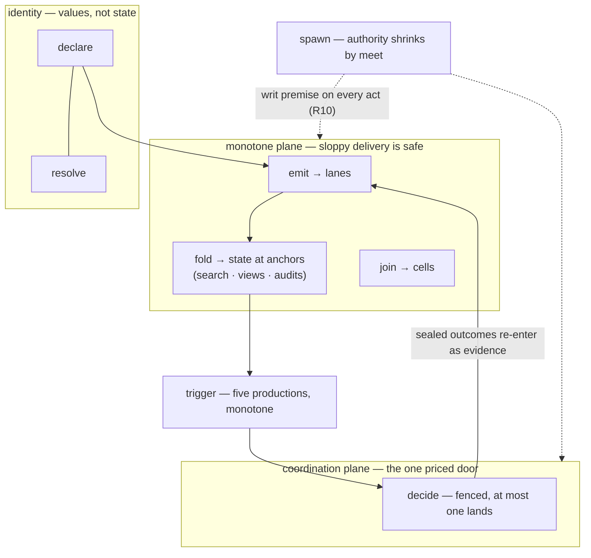
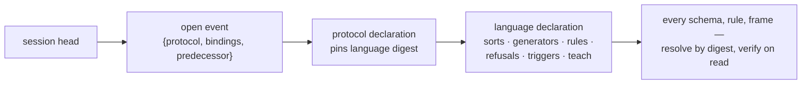

# Plait, part 5 — the kernel algebra: the API is a language, the language is the algebra

Status: **RATIFIED 2026-08-18 — the operator ruled all ten grill items
on their recommended options ("taking all recommendations"), with K-6
ruled explicitly: the protocol declaration pins the language digest
(the protocol-pin reading); the literal first-slot form is retired as
the priced alternative.** Commissioned 2026-08-18 by the
operator's ruled direction, dispatched through the coordinator;
written by the Fable kernel-algebra seat against main at `fdfc0cc12`
(the merged M3 wave: 206 theorem declarations counted across
`verify/fabric/Fabric/*.lean` this session). This record realizes the
operator's theses; it does not relitigate them. It changes no code, no
ledger row, no ticket, and no seam status. Design-first sequencing
governs: the record lands for grilling, and nothing in it licenses a
build. Checkpoint-collaborated: the frame was locked with the
coordinator before §5 and §6 were written, and four checkpoint rulings
are applied in place — the anchor-free `resolve` signature, the lease
boundary stated on `decide`, the no-closure-introspection closure row,
and §6's dual-construction mandate; the bootstrap placement question
was elevated to its own grill item (K-6) because the operator dictated
the literal form and the ruling is the operator's to make.

Confidence tiers, as parts 1–4: **ratified** (grill record or standing
ruling) · **proven** (Lean theorem behind a green gate, cited by its
real name) · **measured** (ran-it result in a durable estate document)
· **shipped** (code on main, read in place this session) · **proposed**
(this record's own design) · **lead** (external claim not verified
against a primary source this session).

Design law, inherited whole: **no new physics.** Every sentence below
either reduces to the ratified constructs and the proven law families,
or is flagged as a genuinely new decision and priced in §11. Two
standing fences ride the whole record: **safety only** — no liveness
claim anywhere; and **the attribution fence** — seat bindings are
unauthenticated strings until the estate's attribution decision lands
(ruling G4), so every "who" in this record means "which credentialed
connection under which writ."

---

## 1. The ruled direction, and what this record does with it

The operator's direction, in six theses — each realized in a named
section, none re-opened:

1. **The API surface is a programming meta-language for agents**: a
   small closed algebra over content-addressed state, composed into a
   grammar. Agents are the only first-class users; MCP is the wire.
   (§4 gives the algebra; §5 the grammar; §8 the efficiency argument.)
2. **The alphabet is tiny.** Only operations expressible in the fold
   family are valid; search is a fold (ruling C10: indexes are anchored
   folds). (§4 states the alphabet at eight generators and defends the
   count.)
3. **Effect binding**: Effect programs model their dependency
   structure; bind that structure onto the content-addressed store so
   "coding your thing in Effect" makes it "appear on the CAS," and
   execution rides the proven machinery. The operator suspects this is
   provable. (§6 chooses the binding, names the provable statement,
   and prices the alternatives.)
4. **Session bootstrap**: the first thing resolvable from a session is
   the language itself — compressed, coherent, self-contained. (§7.)
5. **One AST**: MCP tools, the DSL, and the runtime derive from the
   same grammar — the served-equals-derived discipline, already
   ratified for codegen. (§5.6, §6.3, §7.2.)
6. **The template algebra is demoted to a consumer** of the kernel:
   its typed-hole laws and its no-second-assembler rule bind this
   record, and templates become one composition family. (§5.5.)

For an outsider, one paragraph before any house word. This estate runs
a coordination substrate for fleets of AI agents in which every value
is named by a cryptographic hash of its one canonical byte form, every
piece of state is either a mergeable set, a checkpointed reduction over
a journal, or a fenced one-winner decision, and the concurrency claims
behind those three shapes are machine-checked in Lean rather than
asserted in prose. This record designs the programming surface an agent
meets: not a REST API, not a toolbox of verbs that grew by accretion,
but a deliberately tiny algebra — eight generators and a closed set of
composition rules — where every generator names the proven law that
licenses it and everything the laws cannot license has no syntax at
all. The API is a language; the language is the algebra; the algebra is
already proven.

House-jargon gloss, one line each at first use; full weight where each
term works. A **digest** is a SHA-256 hash over a value's canonical
bytes (RFC 8785): its permanent name, re-derived by every reader, never
trusted. The **catalog** is the append-only journal of declared values,
admitted through one proved door (the **certifier**); a reference
resolves only to a cataloged digest, so the reference graph is a DAG by
construction. A **lane** is a declared evidence stream; a **cell** is a
lattice value merged by least upper bound; a **fold** is a declared
reduction over a lane, checkpointed by **anchors** (facts of the form
`(fold digest, partition) → (position floor, state digest, head)`). A
**register** is the one place the fabric coordinates: a lease keyed by
a work digest, advanced by compare-and-swap under a monotone **fencing
token** — a strictly increasing number that decides which commit lands,
never who holds it. A **writ** is what a connection may do, carried as
a policy value; a **refusal** is a typed value returned instead of an
error, carrying the law it defends and a legal next move —
**structural** refusals are permanent (repair them), **absence**
refusals are not-here-yet (retry them). The **F-numbers** (F1–F12) name
the estate's proven law families and are glossed individually where
they first do work below; the **G-numbers** cite standing rulings from
the parts-1–4 grill records; the **C-numbers** name ratified constructs
(C7 action declarations, C10 indexes-are-folds, C11 resources).

---

## 2. Result first

**2.1 The alphabet has eight generators, and the count is defended,
not asserted.** `declare` and `resolve` (identity), `emit` and `join`
(the two monotone writes), `fold` (the one reduction — search, indexes,
and every head-relative read are this), `decide` (the one priced
coordination act), `trigger` (the one lawful automation), `spawn` (the
one derivation of new authority). Every generator names the proven law
that licenses it; every G36 state class has exactly one write path
among them; a ninth generator would either duplicate a class's write
path or write outside meaning (§4.4). Sessions, tasks, workflows,
memory, schedules, templates, and search are all compositions — zero
new physics. One checkpoint repair is folded in: `resolve` takes no
anchor — a digest names one value forever, and every head-relative
read is fold-class, so the immutable/head-relative split is carried by
the sort system itself (§4.2, §5.1).

**2.2 The grammar is F10's pattern at API scale.** Sorts come from the
G36 taxonomy plus branded identifier sorts that are never comparable
across kinds; composition rules are each licensed by a named theorem;
and the record's estate-of-safety candidate is pre-registered in one
sentence (§5.4): **a kernel sentence that type-checks names only
lawful acts — every composition rule is a proven law's statement, and
the unlawful act has no derivation in the grammar.** The closure list —
what is unrepresentable by construction — is stated in full (§5.3),
and the wall shape is the estate's own negative-control discipline
applied at API scale: planted unlawful programs, each refused at
admission with the law named.

**2.3 Effect binding is shallow, dual-constructed, and the pin decides
it.** At `effect@4.0.0-rc.108` an Effect is a tree of `Primitive`
nodes whose continuations are opaque closures
(`internal/core.ts:365-381`, read in place) — no canonical bytes exist
for a closure, so a deep embedding of Effect's own AST would require a
second canonicalizer and is refused on that standing class. The
binding that works is the one the estate already runs twice: programs
are **declared values** — the dependency DAG written in the kernel
grammar, cataloged by digest, references as content-address pins — and
Effect is the execution carrier. The honest mechanism of "code it in
Effect and it appears on the CAS" is the **dual construction**: the
kernel's TypeScript surface is an Effect-based builder where one
authoring act constructs both the executable Effect and the cataloged
declaration; the builder is the link, and nothing introspects
closures. Structure binds at declaration time (by digest); outcomes
bind at execution time (C7 rounds, F5 fenced outcomes, journaled
evidence). The provable statement is named — **candidate F13,
bound-execution replay** — and marked NEEDS-A-LAW: its conjuncts are
already proven hop by hop; the composition statement is the one new
obligation, and the F-number mints at ratification (§6.5).

**2.4 The session bootstrap makes the language the first resolvable
fact.** The language is itself a cataloged declaration family — the
G27 ontology machinery pointed at the kernel — and the recommended
placement has every session's protocol declaration pin the language
digest, so an agent holding only a session head reaches the full
language definition in three verify-on-read hops with zero ambient
input and no wire change. The operator dictated the literal
first-slot form, so placement is its own grill item (K-6) with both
options priced; the self-containment test is stated as a future gate
in dogfood-must-run-the-artifact shape; the size budget is a stated
constraint, measured later, never claimed early (§7).

**2.5 The eighteen-component harness anatomy collapses into the
alphabet.** One table (§8) maps every component of the production
agent-harness anatomy — system prompts, tools, memory, compaction,
planning, hooks, all eighteen — to a kernel composition with its
generators named, or to a refusal with its reason. Five components are
refused outright (git integration: we are already the Merkle DAG;
sandboxes: outside meaning at the G23 boundary; orchestration logic:
the no-orchestrator doctrine; filesystem-as-truth and
environment-as-semantics: the catalog and the G30 fence). That table
is the API-efficiency argument the operator asked for.

**2.6 Positioning claims derivation and proof, never architecture
novelty.** The nearest neighbor (grite, arXiv:2606.19616) was
re-verified against its abstract this session: a server-less
coordination substrate storing an append-only signed event log inside
git, presented through a mining study — and no agent-facing algebra,
API, or DSL appears in that abstract. The differentiated claim this
record supports is the **pure-algebra agent-facing API over
machine-checked laws** (§9), consistent with the template
investigation's ruling that the architecture-novelty claim is lost and
the proof claim is clean.

---

## 3. Grounding — what is already settled, verified at `fdfc0cc12`

| Settled thing | Status | Where this record uses it |
| --- | --- | --- |
| The M3 semilattice package: `join_semilattice_of_aci` proved once over ACI hypotheses with the derived order `supLe` and the six named laws (`le_refl`, `le_antisymm`, `le_trans`, `le_sup_left`, `le_sup_right`, `sup_le`); instantiated at both carriers (`f1_cell_join_semilattice`, `f12_directory_join_semilattice`); replica reading rostered (`cell_absorb_inflationary`, `directory_absorb_inflationary`); order-membership bridge (`cell_le_iff_subset`) | proven (Laws.lean:167-174, DECISIONS T29) | `join`'s license and the lattice sort's order vocabulary (§4.2, §5.2) |
| F1/F2 — cell merge ACI, extensionality, history convergence, trace invariance (`f1_cell_merge_aci`, `f1_cell_extensional`, `f1_history_convergence`, `f2_trace_invariant`) | proven | `emit` and `join` (§4.2) |
| F2b — the successor discipline (`f2b_guarded_exactly_once` under the two named premise halves, T15); the floor is a derived record, not a guard (`guard_is_redundant`, api-log 0024) | proven + ruled | `fold` over non-idempotent steps (§4.2, §5.2) |
| F3 — anchored resumption (`f3_resume_exact`); the compaction corollary, boundary-inclusive (`compact_below_floor_preserves_resumption`, `compact_below_horizon_preserves_resumption`, `compact_preserves_anchor_state`, T33) | proven | `fold`'s checkpoint story; compaction as a `decide` composition (§4.3, §8) |
| F4 — partition folds identify with interleavings only under a declared commutative algebra (`f4_partition_fold`); brands are earned by generated law suites (Algebra.ts discipline) | proven + shipped discipline | the parallel-composition rule (§5.2) |
| F5 — at-most-one-landed over the Veil register model: I1/I2 as the named invariants `token_monotone`, `grant_or_steal_strict`, `at_most_one_landed_commit`, `no_stale_token_lands` (`verify/fabric-veil/FabricVeil/Statements.lean:91-97`), claimed at R3 plus the two-runtime replay wall | proven shape + walled | `decide` (§4.2); the trigger→decide dedup (§5.2) |
| F7 — context assembly determinism in three halves (`f7_assembly_reads_only_declared`, `f7_segment_order_stable`, `f7_within_class_order`, T20/T25) | proven | the compilation story (§6); bootstrap rendering (§7) |
| F9 — policy meet semilattice with the greatest-lower-bound clauses, and tree attenuation (`f9_policy_meet_semilattice`, `f9_tree_attenuation`, allowlist fields included per T19) | proven | `spawn` (§4.2) |
| F10 — the closed five-production trigger grammar (T32: evidence-appears, cell-reaches, hole-reaches, outcome-landed, head-advanced-past; no admission map — closure IS the enforcement); stability and hint determinism (`f10_stability`, `f10_hints_of_support`, `enabled_declarations_monotone`, `holds_iff_holds_bool`) | proven + ruled G9 | `trigger` (§4.2); the unrepresentability template the whole grammar copies (§5.3) |
| F11 — query determinism (`f11_topk_of_support`, `f11_query_deterministic`, `f11_state_of_anchor`); ambient query inputs refused at admission (T23 — the carrier has no clock, seed, schedule, or locale parameter to read) | proven | `fold` as the search story (§4.2); the ambient-input closure row (§5.3) |
| F12 — the directory: merge ACI/extensionality/convergence on the binding-graph carrier (T26), canonical candidates through the T22 sort (`candidates_eq_canonical`), seal arbitration (`f12_resolution_of_support`, `f12_greatest_seal_wins`, `f12_resolution_characterization`, T27/T30) | proven | naming stays outside identity; the head-relative read exemplar (§4.2 `resolve`; §5.1) |
| C7 — the admission order: pins name already-admitted digests, freshness embedded, well-foundedness by rank embedding (`c7_pin_well_founded`, `pin_rank_lt`, `c7_pin_irrefl`, T33) | proven | `declare`'s DAG guarantee; the no-recursion closure row; the program-DAG binding (§6.2) |
| The G36 taxonomy: every structure is (a) a lattice join, (b) a checkpointed fold, (c) a register decision, a value, or outside meaning; one-carrier join-plus-decision structures split on the directory precedent | proposed at part 4 §15, pending its grill | the sort system's ground (§5.1); the alphabet's completeness argument (§4.4) |
| G12 as amended — one catalog door for every declaration kind; "no YAML of semantics exists"; context programs are already cataloged | ratified | `declare`; the program-value generalization (§6.2) |
| G20 (no unanchored resolve — governing derived reads: directory resolution, task views), G21 (retention cataloged, horizon derived), G23 (at-most-one landed outcome is not at-most-one external side effect), G26 (structured output binds to cataloged schema digests; the commit door checks conformance), G27 (ontology declarations, reading B), G32 (tick facts), G33 (no minted ids), G34 (the workflow-engine refusal), G9 (monotone-only triggers; the deadline seat is the one non-monotone door) | ratified / proposed at part 4 pending grill | cited in place throughout; G34 fences §6; G32 fences the clock rows of §5.3 and §8 |
| The wire: canonical envelopes, closed struct, excess refused; refusals carry kind · sort · law · path · got/expected · next; the structural refusal union is closed at 34 kinds on main (`packages/plait/src/Refusal.ts:25-60`); the envelope has no timestamp field | shipped | the refusal half of the grammar (§5.4); the language declaration's refusal table (§7.1) |
| Sessions: fills idempotent per `(value, seat)`; close atomic at declared authority; session key = digest of the canonical open event `{protocol, bindings, predecessor}` (measured, E7); `final_state_digest` the pinnable terminal fact (E8) | shipped + measured | sessions as compositions (§4.3); the bootstrap pin (§7.2) |
| Lease machinery is liveness, not meaning: heartbeats and lease expiry are "a liveness heuristic with no meaning-side effect" (part 1 §5.3); `Scope` bounds leases and lease loss interrupts the fiber | ratified + shipped discipline | the lease boundary stated on `decide` (§4.2) |
| The template algebra investigation: render is defined as compile-then-assemble (no second assembler, ever); fill is a commutative monoid action on typed-hole signatures (T3), compilation coherence is the one new obligation (T7); the operad decoration refused (clone ≡ monad) | proposed (pre-grill record, binding on this seat by charter) | templates as one composition family (§5.5); §6.3's helper discipline |
| The agentic-Lean lit pass, three pressure items answered by construction here: referent pinning (2604#1), refusal-branch parity (acl1836#3), unit spaces (acl1836#6) | measured lit findings | §5.1 (sorts), §5.3 (closure), §5.4 (refusal parity), §7.1 (the symbol table as a cataloged declaration) |
| Dvořák statement-design notes: argument-order visual proximity; notation as design; trusted code = statements plus the definitions they depend on | measured (excerpt record) | the syntax rules of §4.5 and §5.6 |
| Effect pin facts, read in place this session: an Effect is a `Primitive` with closure continuations (`repos/effect/packages/effect/src/internal/core.ts:365-381`); Layers/`ManagedRuntime`/`Scope` per the part-4 §3 pin block; `Cron` is a pure value module | shipped (vendored pin) | §6.1's decisive fact |

One correction to the charter, recorded rather than silently absorbed:
the template investigation lives at
`docs/research/2026-08-18-template-algebra-investigation.md` (no
`plait-` in the basename). It was read whole and binds as charged.

---

## 4. (A) The alphabet

### 4.1 The sort system, inherited before the generators are stated

The G36 taxonomy is the ground: every piece of application state is
exactly one of **(a) a lattice join**, **(b) a checkpointed fold**,
**(c) a register decision**, an immutable **value** (not state at
all), or **outside meaning** (liveness machinery, transport,
environment). The kernel's sorts are these classes made typed, plus
the identifier discipline §5.1 fixes: every identifier is a branded
digest sort or a derived coordinate, and sorts never compare across
kinds. Nothing in the alphabet below writes to a carrier its class
does not license — that is what "the mathematics dictates the
datastructures" means at the API boundary. One split the sorts carry
on their own, because it is half the language's honesty: **immutable
reads and head-relative reads are different sorts of act.** A digest
read (`resolve`) is anchor-free and never stale; a state read (a
`fold` at an anchor) is head-relative and never wrong later. The two
are unconfusable by type, not by convention.

### 4.2 The eight generators

Each entry: signature over sorts, the licensing law by its real
theorem name, and the refusal behavior. Signatures are stated in the
record's neutral notation; the TS surface derives from them (§5.6).

**1 · `declare` — mint an immutable value.**

```
declare : Value σ × Writ → Digest σ          (Effect-typed; refuses)
```

Admission through the certifier: exactly one canonical byte form,
excess refused, references resolve only to already-admitted digests —
the catalog is a DAG by construction, and the freshness half of that
sentence is in the model (`c7_pin_well_founded` with freshness
embedded in the admission order, T33; the real-world half — a digest
cycle needs a hash preimage — stays in the trusted base, on the row).
Two carriers, one law: canonical values enter the catalog; opaque byte
payloads enter the blob store under the same content-addressing
discipline (the affordances `Blobs` face: durable-put, verified-get,
ranged reads refused until the chunk-manifest law exists — G-5/G-6,
cited not re-opened). Refusals are structural and taught:
`non-canonical-value`, excess property, forward reference, and — the
lit-pass addition K-8 prices — an identifier outside the declaring
writ's pinned universe (2604#1). What `declare` is not: an update.
There is no second write to a digest; revision is a successor
declaration pinning its predecessor.

**2 · `resolve` — digest to value, verify-on-read.**

```
resolve : Digest σ → Value σ                 (refuses; never trusts)
```

The decode re-derives the digest of what it fetched and refuses on
mismatch — re-derivation is unskippable; the schema is the
verify-on-read law (architecture §3, `ResolvedOf`). **No anchor
parameter exists, and its absence is the law showing:** a digest names
one value forever, so there is nothing an anchor could change — which
is exactly what licenses `ResolveCache` to cache successes with no
TTL (affordances A-8a). Refusals: absence (retryable — the value is
not-here-yet at this node's horizon) or `digest-mismatch`
(structural). What `resolve` is not: a head-relative read. Directory
resolution at a petname, task views, rosters — every read whose
answer can change as history grows — is **fold-class**, served at an
anchor (F12's resolution is a derived read over observed bindings and
seals; `f12_resolution_of_support` is its order-free license), and
ruling G20's no-unanchored-resolve governs those, not digest
resolution. The one thing an anchor here would have bought —
provenance stamping of reads — is an `emit` beside the resolve where
a consumer wants the act journaled (the api-log 0014 discipline),
never a parameter on identity.

**3 · `emit` — evidence onto the monotone plane.**

```
emit : Lane × Body → Envelope                (attributed; duplicate-safe)
```

An envelope's message id is its digest, so duplication and reordering
are harmless by theorem shape (`f2_trace_invariant`; the convergence
reading `f1_history_convergence`). Everything an agent learns arrives
through this door: messages, tool records, tick facts (G32 — the
claimed time is observation data, never a coordinate), admission
facts, harness self-reports. Session fills ride this door onto venue
journals, idempotent per `(value, seat)` — shipped machinery, cited
not re-derived. Refusals: structural wire refusals
(`malformed-envelope`, `inline-body-too-large`, `non-canonical-value`).
What `emit` is not: a send. There is no point-to-point message
primitive; subjects route, and lanes mean.

**4 · `join` — merge into a lattice carrier.**

```
join : Cell A × A → Cell A                   (via casJoinLoop; converges)
```

Lattice carriers only. The license is the full M3 package: ACI
(`f1_cell_merge_aci` / `f12_directory_merge_aci`), extensionality
(the verified observation set determines the cell,
`f1_cell_extensional`), and the derived order with least upper bound
(`join_semilattice_of_aci` instantiated as
`f1_cell_join_semilattice` and `f12_directory_join_semilattice`) —
so "my local view is a lower bound of the truth" is the theorem
`cell_absorb_inflationary`, not a hope. The write path is one
combinator (`casJoinLoop`, affordances A-7): on a lost race it
re-reads, re-merges, re-CASes, and convergence is F1's, not the
loop's; termination is never claimed. There is no ordering parameter
and no conflict strategy because idempotence leaves nothing to
choose. Refusals: none semantic — conflicts retry; transport surfaces
as absence. What `join` is not: an overwrite. No last-write-wins
carrier exists anywhere in the fabric.

**5 · `fold` — declared reduction over a lane, with anchors.**

```
fold : Algebra × Lane × Anchor → State × Anchor
```

The reduction generator, and deliberately the only one. Its rights
follow its laws: resumption from an anchor is exact
(`f3_resume_exact`); for non-idempotent steps the successor
discipline manufactures exactly-once application
(`f2b_guarded_exactly_once`, with the floor a derived record —
`guard_is_redundant`, api-log 0024); partition folds merge into one
meaning only under an earned commutative brand (`f4_partition_fold`;
the `unearned-commutative-algebra` refusal is already in the shipped
union); and queries over folded state are functions of support and
query alone (`f11_topk_of_support`, `f11_query_deterministic`), with
ambient inputs refused at admission because the carrier has no
parameter to read them through (T23). **Search is this generator**
(ruling C10: indexes are anchored folds) — `search(index, anchor,
query, k)` is a fold's state read at an anchor, which is why result
sets are citable, cacheable by `(fold digest, head)`, and replayable.
**So is every head-relative read**: views, rosters, task walks, audit
rows, directory resolution — all anchored folds, all head-relative
(F8's vocabulary — a view at an anchor is a true record of a DAG
position, never wrong later). What `fold` is not: a query engine with
a clock, a random seed, or a "latest" — none of those is representable
in the carrier.

**6 · `decide` — the fenced register write.**

```
decide : Register × Token × Outcome → Landed  (at most one lands)
```

The one priced generator. Linearization cannot be derived from the
fold; it is bought with compare-and-swap and fenced by tokens, and
CALM says non-monotone acts need exactly one coordination point — so
the fabric has exactly one, and everything else stays free precisely
by refusing to decide. The license is the F5 invariant package over
the Veil model: `token_monotone`, `grant_or_steal_strict`,
`at_most_one_landed_commit`, `no_stale_token_lands`
(`verify/fabric-veil/FabricVeil/Statements.lean:91-97`), carried onto
the real substrate by the two-runtime replay wall. **The lease
boundary, stated so nobody hunts for missing generators:** grant,
steal, renew, and heartbeat are outside-meaning liveness machinery —
"a liveness heuristic with no meaning-side effect" (part 1 §5.3) —
provided by the runtime (`Scope` bounds the lease; loss interrupts
the fiber) and never part of the grammar; `decide` is
commit-with-token, the one door where meaning lands. The commit door
constrained-decodes the outcome against the capability's declared
output schema (G26) — a non-conforming outcome refuses structurally,
citing the capability digest. Action outcomes, directory rebinds,
session close, and compaction acts are all this generator at four
register families; retention's derived horizon fences compaction
(`compact_below_floor_preserves_resumption` is the citable theorem
behind the refusal). Two sentences ride every use, verbatim: **at
most one landed outcome is not at most one external side effect**
(G23); and the door proves conformance against a read — it does not
prove the read still holds at landing, so any door predicate over
mutable coordination state must be one fenced act with the landing
(the TOCTOU bound, lit item 2604#3, pre-registered here for K-2's
wall). Refusals: `stale-register-token`, `outcome-already-landed`,
`duplicate-grant`, non-conforming outcome — each structural, each
naming its law. What `decide` is not: consensus, a transaction, or a
lock on the world.

**7 · `trigger` — monotone reaction.**

```
trigger : Predicate → Declaration             (fires hints; never un-fires)
```

The one lawful automation. The predicate grammar is F10's closed
five-production inductive — evidence-appears, cell-reaches,
hole-reaches, outcome-landed, head-advanced-past (T32) — and the
closure is the enforcement: absence, negation, and deadline have no
constructor to carry them. Stability is proven (`f10_stability`: a
predicate that holds at a state holds at every componentwise-grown
state), hint emission is support-deterministic
(`f10_hints_of_support`) and monotone
(`enabled_declarations_monotone`), and a fired hint's landed claim
never lands twice because the register's I2 dedups it — cited, never
restated. Acting on silence is not a trigger: "nothing by Friday" is
a completeness judgment, so it belongs to the deadline seat — a
declared authority whose act is a `decide`, fed by tick facts that
arrive as ordinary `emit` evidence (G9, G32). What `trigger` is not:
a cron, a watcher with a timeout, or a hook that can veto — vetoes
are door refusals, and doors are laws, not user code.

**8 · `spawn` — writ attenuation.**

```
spawn : Writ × Request → Writ                 (child = parent ⊓ request)
```

The one derivation of new authority. The grant is the meet —
`f9_policy_meet_semilattice` gives the operation its greatest-lower-
bound clauses, and `f9_tree_attenuation` says every effective
descendant stays under the root grant, allowlist fields included
(T19) — so over-grant is unrepresentable rather than reviewed-for.
Knowledge grows by join; authority shrinks by meet; both directions
are theorems. Refusal: spawn-bound exhaustion (the budget component
is part of the meet carrier); an escalating request is not refused
but **clamped**, which is the stronger property. What `spawn` is not:
an org chart, a role registry, or a topology (G35 — any communication
shape whose writs compose by meet is lawful).

### 4.3 What is deliberately NOT a generator

Each candidate below is a real verb in some other system's API, and
each is either refused with its law or exhibited as a composition —
which is the alphabet earning its size.

| Candidate verb | Verdict | Why |
| --- | --- | --- |
| `readLatest` | refused | an unanchored derived read is an ambient input (G20); reads are `resolve` (immutable, anchor-free) or a `fold` state at an anchor (head-relative) — the sort split of §4.1 |
| `sleep` / `now` / `cron` | refused | the fold has no clock (ruled; the envelope has no timestamp field); schedules are declared values, firings are tick facts arriving by `emit`, and the deadline seat's act is a `decide` (G9/G32) |
| `delete` / `update` | refused | nothing unbecomes; revision is a successor declaration; forgetting is retention's fenced compaction — a `decide` over the derived horizon (G21), preserving the `(head, state digest)` pair |
| `grant` / `renew` / `steal` (leases) | outside meaning | liveness machinery the runtime provides (part 1 §5.3; `Scope` bounds the lease, loss interrupts); never grammar — `decide` is the only meaning-bearing register act |
| `send(to, msg)` | derived | `emit` on a lane both parties' writs reach; there is no point-to-point primitive because delivery-to-a-party is a liveness claim the fabric refuses to make |
| `call` / RPC | derived | an action: `declare` the C7 declaration (the work digest is the register key), `decide` the outcome; the request plane is transport, never meaning |
| `search` | derived | a `fold` (C10) plus `resolve` of the hits; the query is data with a digest |
| `fill` (session move) | derived | an `emit` onto the session's venue journal, idempotent per `(value, seat)` — shipped |
| `close` (session) | derived | a `decide` at the declared authority — the one non-monotone act a session contains |
| `assert` / `axiom` | refused | policy and authority content enters as declared values and decidable predicates, never as trusted assertions — the fail-open hole 2604#4 exhibits |
| `onAbsence` / `not` / `timeout` triggers | refused | no constructor exists (T32); the is-exactly variant is the committed negative control |
| `lock` / `mutex` | refused | the register is not a lock: it fences outcomes, it does not exclude effort; a raced claim hint costs duplicate work, never duplicate commits |
| `subscribe(callback)` | derived | consuming a lane IS deploying a fold; streams are the only read surface |

### 4.4 The size claim, stated and defended

**The alphabet is eight, and eight is an audit, not an aesthetic.**
The defense is a completeness-and-necessity argument over the G36
classes:

- **Necessity** — remove any generator and a proven right becomes
  unreachable: without `join` the F1/F12 carriers have no lawful
  write; without `fold` the F3/F2b/F4/F11 package has no consumer and
  search is impossible; without `decide` nothing non-monotone can
  ever land (CALM demands the one coordination point); without
  `trigger` every reaction is a poll loop outside the grammar;
  without `spawn` no fleet exists; without `declare`/`resolve` there
  is no identity; without `emit` there is no evidence.
- **Completeness** — every G36 class has exactly one write path
  (value → `declare`; (a) → `join`; (b) → `emit`, reduced by `fold`;
  (c) → `decide`) and outside-meaning has none by definition. A
  ninth generator must therefore either write to a class that
  already has its path — two names for one thing, the incoherence
  the affordances naming rule exists to prevent — or write outside
  meaning, which is not an API act at all.
- **Growth discipline** — the alphabet grows only by ruling, the C9
  trigger-grammar precedent: a demand for a ninth generator is a
  grill item carrying its CALM analysis and its licensing law, never
  a patch (K-1).

The corollary the operator's thesis 2 asked for: **only operations
expressible in the fold family are valid** is realized as: the two
identity generators ground the values folds range over; the three
plane writes produce exactly the histories folds consume; `fold` is
the family's own name; and `trigger`/`spawn`/`decide` are the three
lawful ways a fold's verdicts re-enter the world. Nothing else is
expressible, and that is §5.3's list.

### 4.5 Naming and syntax discipline

Names are the plain words above — `declare`, `resolve`, `emit`,
`join`, `fold`, `decide`, `trigger`, `spawn` — no coinage, per the
standing prose-clarity ruling and api-log 0018's plain-word rule.
Two Dvořák rules bind the surface (measured, the excerpt record):
**argument-order proximity** — co-varying arguments sit adjacent at
the call site (`decide(register, token, outcome)` keeps the fence
pair together; `fold(algebra, lane).from(anchor)` keeps the
coordinate pair together — the `Replay` builder precedent), and
**notation as design** — the signature is where the law shows, so
every exported generator's JSDoc opens with its licensing law's real
name, the universal-properties-to-DX rule made mechanical.

---

## 5. (B) The grammar

### 5.1 Sorts and the identifier discipline

The sort family, each row naming what makes it distinct and what it
can never be confused with:

| Sort | What it is | Discipline |
| --- | --- | --- |
| `Value σ` | an immutable value conforming to cataloged schema digest σ | never state; upgrades are successor declarations |
| `Digest σ` | the branded content address of a `Value σ` — one brand per declaration kind (schema, program, policy, capability, lane, algebra, index, resource, ontology, schedule, template, language) | a `Digest Program` and a `Digest Policy` never compare, assign, or substitute — brands are sorts, not documentation |
| `Cell A` | a join-semilattice carrier at a declared ACI algebra A | class (a); written by `join` only; local views are lattice lower bounds (`cell_absorb_inflationary`) |
| `Lane` / `Journal` | an append-only evidence stream / venue journal | class (b); written by `emit` only; reduced by `fold` |
| `Register κ` | a decision carrier keyed by work digest κ | class (c); written by `decide` only; audit reads are fold-class |
| `Anchor` | `(fold digest, partition) → (floor, state digest, head)` | a fact, not a cache; the resume coordinate; head-relative reads carry one |
| `Writ` | a policy value in the meet-semilattice | shrinks by `spawn`; compiles to Layers (DX); enforced server-side (security) — G10's split |
| `Token@r` | a fencing token, meaningful within register r and one backing-stream incarnation | per-register; never compared across keys, never rendered as an attempt count (affordances A-2 bounds) |
| `Position@p` | a journal position, meaningful within partition p | per-partition stream sequence; never compared across partitions |
| `Petname` | a human-facing name bound in a directory | naming, never identity (F12); resolution is a fold-class read |
| `Refusal` | structural (closed 34-kind union) or absence (open kind, retryable) | the only failure sort; carries law · path · got/expected · next |

Three lit-pass pressure items land here by construction. **Unit
spaces (acl1836#6):** `Token@r` and `Position@p` are space-indexed —
a cross-register token comparison or cross-partition position
comparison has no syntax, so the proven-but-vacuous-bound failure
(two sides of a comparison denominated in different spaces) fails to
elaborate instead of proving a true, empty statement; the control
suite gains the corresponding **must-not-compile class** (K-3).
**Referent pinning (2604#1):** the digest brands are drawn from a
closed, content-addressed identifier universe — the language
declaration's own sort table (§7.1) — so an off-catalog referent is
unrepresentable, not merely invalid. **The immutable/head-relative
split (§4.1):** `Digest σ` reads are anchor-free; every read of
class-(a)/(b)/(c) state carries an `Anchor` — two act sorts, never
confusable.

### 5.2 Composition rules, each licensed by a named law

The judgment shape is ordinary — programs are typed terms over the
sorts; `K A` below abbreviates the kernel's effect type (surfacing in
TS as `Effect<A, Refusal, R>` with R carrying the substrate services).
What earns each rule its place is the licensing column: **a
composition rule enters the grammar only with the theorem that makes
it meaning-preserving.** These nine are the grammar; growth is by
ruling (K-2).

| # | Rule (informal but exact) | Licensed by |
| --- | --- | --- |
| R1 · sequence | `a : K A`, `f : A → K B` compose to `K B`; a refusal short-circuits on the error channel, and branch analyses over refusals are compile-time exhaustive | the error-channel ruling (api-log 0022) + the matcher closure (affordances A-6, T10's closed-kind contract) |
| R2 · resolution | `d : Digest σ ⊢ resolve d : K (Value σ)`; recursive resolution of a value's references terminates | content addressing (R0 wall) + `c7_pin_well_founded` — the reference walk descends admission rank (`pin_rank_lt`) |
| R3 · evidence convergence | any interleaving, duplication, or reordering of `emit`/`join` writes over one support yields one state; two readers of the same verified set hold byte-identical cells | `f2_trace_invariant`, `f1_history_convergence`, `f1_cell_extensional`; at the directory carrier `f12_directory_convergence` |
| R4 · reduction | `fold alg lane` resumes exactly from any of its anchors, and `fold (xs ++ ys) = foldFrom (fold xs) ys`; non-idempotent steps compose only under the successor discipline | `f3_resume_exact`; `f2b_guarded_exactly_once` under the two named premise halves (T15) |
| R5 · parallel merge | partition folds merge into one meaning only when the algebra carries the earned `Commutative` brand; otherwise the composition refuses at declaration | `f4_partition_fold`; brands earned by generated law suites (`unearned-commutative-algebra` is the shipped refusal) |
| R6 · reaction | `trigger p → d` is well-formed only for `p` in the five productions; an enabled firing never un-fires, and its landed claim lands at most once | `f10_stability` + `enabled_declarations_monotone`; dedup is F5's `at_most_one_landed_commit`, cited never restated |
| R7 · decision | `decide` is well-formed only against a declared work digest — the register key IS a declaration digest, so no anonymous decision exists; the outcome must decode against the declared output schema | C7 (the key derivation) + G26 (the commit door); the TOCTOU bound rides the rule: a door predicate over mutable coordination state must be one fenced act with the landing (2604#3) |
| R8 · iteration | repetition is the successor round — a new declaration pinning its predecessor; general recursion has no syntax, because a self-referencing declaration would need its own digest as a subterm | C7 round discipline; the preimage argument (`c7_pin_irrefl` in-model; hash preimage in the trusted base) — the template record's T6 shape, generalized |
| R9 · parameterization | a program value may carry typed holes; `fill` is simultaneous substitution, disjoint fills commute and compose, and rendering is defined as compilation into the one assembler | the template algebra's T3 (the concierge L4 lineage) and T7 (compilation coherence — its one new obligation); the no-second-assembler law adopted as grammar law |
| R10 · attenuation | every generator application type-requires the writ bits its class names; spawn chains never escalate | `f9_tree_attenuation`; G10's honesty split restated: typed writs are DX, server-side refusal is security |

(R10 listed with the nine composition rules because it is a typing
premise on all of them rather than a tenth way to compose.)

The two planes, with the generators placed — the CALM split as the
grammar's own picture:



*Figure: eight generators over the two-plane split — three monotone
doors, one fenced door, the reaction path from fold to trigger to
decide, and sealed outcomes returning as evidence.*

### 5.3 The closure list — unrepresentable by construction

What has no syntax, each row with the mechanism that removes it. This
is F10's pattern — closure IS the enforcement — applied to the whole
API:

1. **Clock reads in meaning.** No generator takes or returns a time;
   the envelope has no timestamp field; schedules are declared values
   and firings are tick facts (evidence). A wall clock in a query or
   context program refuses at admission (T23; part 2's planted
   control).
2. **Absence, negation, and deadline predicates.** No trigger
   constructor carries them (T32); acting on silence is the deadline
   seat's fenced authority act.
3. **Unfenced decisions.** The only register write is
   `decide`-with-token; grant/steal/renew are runtime liveness, not
   grammar (§4.2).
4. **Last-write-wins.** No LWW carrier exists; a structure wanting
   join and decision in one carrier splits on the directory precedent
   or refuses (G36).
5. **Unverified reads.** No decode path trusts an asserted digest;
   `resolve` re-derives or refuses.
6. **Cross-sort identifier comparison.** Space-indexed sorts;
   the must-not-compile control class (K-3; acl1836#6).
7. **Minted identifiers.** Every identifier is a digest of a
   declaration or a derivation from one (G33); an API accepting a
   UUID refuses design review.
8. **Ambient query inputs.** The query carrier has no seed, clock,
   schedule, or locale parameter to read (T23); declared seeds are
   data inside the digest.
9. **Reference cycles and general recursion.** Pins name
   already-admitted digests; a cycle needs a hash preimage
   (`c7_pin_well_founded`; R8).
10. **Secret carriers.** The wire grammar admits no secret position;
    credentials live in the environmental band as `Redacted`, outside
    meaning (G30; part 3 §5.2).
11. **Absence reasoning from local views.** A replica is a lattice
    lower bound (`cell_absorb_inflationary`) — "at least this," never
    "not present anywhere" (F8; affordances A-8b).
12. **Silent mutation of the past.** Journals are append-only;
    correction is a successor value pinned to its predecessor;
    forgetting is fenced compaction above the derived horizon,
    preserving `(head, state digest)` (G21).
13. **Off-writ referents.** A declaration's identifier set must lie
    inside the universe its writ pins (K-8; 2604#1) — the referential
    attack that shape-valid decoding passes is refused at the door.
14. **Closure introspection.** A program's identity is its
    declaration, never its closure bytes: no API reads, hashes, or
    compares a function value, so "what does this program do" has
    exactly one answer surface — the cataloged declaration (§6.1's
    refusal, stated as a closure property so it survives as law).

### 5.4 The estate-of-safety candidate, and refusal parity

Pre-registered, per the standing through-line, in one sentence:

> **A kernel sentence that type-checks names only lawful acts — every
> composition rule is a proven law's statement, and the unlawful act
> has no derivation in the grammar.**

The wall shape is the estate's own negative-control discipline at API
scale (K-2): a committed family of **planted unlawful programs** — a
clock read in a fold, an unfenced register write, a cross-sort token
comparison, an unverified read, an off-writ referent — each refused
at admission with kind · law · next, traces committed; plus the
must-not-compile family for the sort violations. A grammar that
cannot refuse proves nothing, so the controls are the claim's other
half.

And the parity discipline the lit pass forces (acl1836#3 — all three
neighboring systems prove only the admit branch): **the refusals are
half the grammar.** Every generator's refusal enumeration is part of
the language definition, each refusal carrying the law it defends and
a taught repair (`next` as data — W7's replies-teach, shipped in the
34-kind union). K-9 adopts door-guard/refusal pairing as an API law:
a door predicate without its paired refusal behavior is an unfinished
rule.

### 5.5 Templates: one composition family, demoted as ruled

The operator's thesis 6, realized in three sentences. A template is a
program value with typed holes (R9): its signature is data, `fill` is
simultaneous substitution whose disjoint fills commute (template T3 —
the concierge's path-disjointness lifted to name-sets), and rendering
is **defined** as compilation into the one assembler
(`render = assemble ∘ compile`, template T7 the coherence obligation)
— so no second render path exists and nothing needs walling against
drift. The template record's refuse-list binds unchanged (no names
inside declared values; no implicit context capture; helpers are
declared folds by digest or they do not exist; no hole defaults), and
its GT-1..GT-7 grill items stay its own record's — nothing here
advances their status. What the demotion buys the kernel: the
parameterization rule R9 is the whole template story, and the
kernel's grammar owes templates nothing further.

### 5.6 One AST — the grammar stated once, projected three ways

The grammar above is not prose about an API; it is the content of the
**language declaration** (§7.1): sorts, generator signatures,
composition rules, and the refusal table, all cataloged data with one
digest. Three projections derive from that one statement, each walled
served-equals-derived (the ratified codegen discipline, architecture
§5–6):

- **The wire projection** — MCP tools, writ-projected: the tools an
  agent sees are derived from the same declarations the runtime
  executes; a hand-written tool list is refused by the wall.
- **The TS projection** — the builder (§6.3): the typed authoring
  surface whose signatures are generated from the generator
  signatures, Dvořák's proximity rule applied mechanically.
- **The prose projection** — reference docs and the bootstrap
  teaching frames, F7-assembled from the same declaration.

One drift class dies here by construction: the tool an agent calls,
the type the SDK checks, and the sentence the docs teach cannot
disagree, because all three are folds of one cataloged value — and a
disagreement is a digest mismatch, which is a FINDING, not a doc bug.

---

## 6. (C) Effect binding — the dependency tree onto the CAS

### 6.1 The pin fact that decides the shape

At `effect@4.0.0-rc.108`, an Effect program is a tree of `Primitive`
nodes whose continuation slots are plain functions —
`contA`/`contE`/`contAll` typed as closures, evaluated by the fiber
(`repos/effect/packages/effect/src/internal/core.ts:365-381`, read in
place this session). A closure has no canonical byte form: hashing
one would mean hashing either source text (fragile, toolchain-bound)
or a bespoke serialization (a second language and a second
canonicalizer — the exact drift class the estate kills on sight). So
the operator's thesis — Effect programs model their dependency tree —
is true in two senses the pin supports and one it does not: the **R
channel** types every service a program needs (dependencies visible
in types); **Layer composition** is a dependency graph of values
(memoized, buildable, inspectable); but the **runtime continuation
graph** is opaque by design. The binding therefore reifies what is
declarable and refuses to introspect what is not — closure
introspection is closure-list row 14, a law rather than an
implementation note.

### 6.2 The program declaration — the dependency DAG as cataloged data

The estate already catalogs programs twice: context programs (an
ordered read list — data, digested, F7-executed) and C7 action
declarations (`{capability, context, anchors, policy, round}` — data,
digested, register-keyed). The kernel generalizes the pattern to all
capability compositions, exactly as ruling G12's amended list
anticipates (one door, no exceptions):

```
program declaration (proposed kind, through the one catalog door):
{ nodes:  [{ name:      <local name, program-scoped>
             generator: declare | resolve | emit | join | fold |
                        decide | trigger | spawn
             args:      { <field>: <digest> | <local name> | <literal> } }...]
  edges:  [{ from: <local name>, to: <local name> }...]   // the DAG, explicit
  holes:  [(name, <schema digest>)...]                    // R9: typed parameters
  lineage: [<digest>...] }
```

Two levels of reference, one discipline. **Inside** the program, nodes
reference each other by local name within the one canonical value —
the program's digest commits the whole DAG, so the dependency tree is
committed content, not metadata. **Outside**, every reference is a
digest that must resolve — capabilities, schemas, algebras, lanes,
context programs, child programs — so the inter-declaration graph
inherits the catalog's DAG-by-admission (`c7_pin_well_founded`), and
a program cannot reference itself at any depth (R8). Well-formedness
at admission is the §5 grammar run as the certifier's check: sorts
match, rules license every edge, the writ covers every named
capability (R10), and the identifier set lies inside the writ's
universe (K-8).

What this generalizes, stated so the precedent is visible: a context
program is the special case whose nodes are all reads; a C7 action
declaration is the special case with one effect node. Both keep their
existing shapes and laws — the program declaration composes them, it
does not replace them.

### 6.3 The dual construction — how "coding it in Effect" puts it on the CAS

The checkpoint mandate, realized. The kernel's TypeScript surface is
an **Effect-based builder in which one authoring act constructs both
artifacts**: the executable Effect (each generator application
compiling to its runtime carrier — `casJoinLoop` for joins,
`Folds.deploy` for reductions, `Registers` for decisions, `Lanes`
for evidence, exactly the affordances catalog's services) and the
cataloged declaration (the program-as-data of §6.2, by digest). The
builder is the link between the two, and it is the one-AST thesis
made mechanical: the grammar is stated once as data (§5.6), the
builder is its TS projection, and what the builder will execute and
what it declares are the same value read two ways.

```ts
// Shape sketch, signatures derived from the grammar (§5.6) — not a build.
const distill = Kernel.program("distill", ($) => {
  const source  = $.resolve(Frames.corpusManifest)          // Digest σ, pinned
  const summary = $.decide(DistillCapability, {             // one effect node:
    context: DistillContext,                                //   C7 underneath
    input:   source,
  })
  const noted   = $.emit(OpsLane, $.certificateOf(summary))
  return $.join(ProgressCell, $.contribution(noted))
})
// distill.digest  — the cataloged declaration's identity (declare-on-build
//                   is explicit publication, never a side effect: encode is
//                   total, publication is an act — the DEV-705 ruling)
// distill.effect  — Effect<..., Refusal, Catalog | Registers | Lanes | ...>
```

The fences that keep the mechanism honest, each already law:
computation inside a program — renderers, algebras, predicates — is
referenced **by digest** (declared folds with earned brands; the
template record's helper discipline verbatim), never carried as a
function value; a bare `Effect.gen` with ambient reads is simply
**outside the language** — the builder cannot express it, which is
the point, not a limitation; and the builder's two outputs are walled
against each other by the T7-shaped coherence suite (K-4's wall:
generated program/valuation pairs, build-then-declare and
declare-then-compile compared byte-for-byte — the same discipline the
template compiler owes, because the builder IS a compiler).

### 6.4 What binds when

| Binds at DECLARATION time (by digest, ahead of any run) | Binds at EXECUTION time (journaled, fenced) |
| --- | --- |
| the program's node/edge DAG — committed by the program digest | which claims were granted, stolen, renewed (liveness history, outside meaning) |
| every capability, schema, algebra, lane, and child-program reference | each effect node's C7 action declaration and round (the E9 F-3 round ruling stays owned there) |
| the typed-hole signature and every filled valuation (successor values) | the landed outcome per node — at most one, by token (F5), conformance-checked at the door (G26) |
| the policy the program will run under (R10's premise) | the evidence emitted, holder-attributed, on lanes (F1/F2) |
| the context programs its model nodes will assemble (F7's inputs) | the anchors every consuming fold advances (F3) |

The chain from part 4 §9.3 is unchanged and gains one hop of context:
the action declaration's place in a cataloged program is itself a
digest fact, so "why did this act happen" resolves to a program node,
not just a capability — provenance one level higher, for free, by
composition.

### 6.5 The provable statement — candidate F13, named and bounded

Stated verbatim, marked NEEDS-A-LAW; the F-number mints at
ratification (the F11/F12 precedent — named in part 3, proven in
M2/M3):

> **Candidate F13 (bound-execution replay).** For a cataloged program
> P, any landed execution of P is reproducible and attributable from
> `digest(P)` plus the journal: every context hop re-assembles
> byte-identically (F7's three halves), every effect node admits at
> most one landed outcome per round (F5's I1/I2), replay from any
> anchor is exact (F3), and the provenance walk terminates (C7's
> well-foundedness).

Every conjunct is proven at its own rung today; the composition
statement is the one new obligation, and it is exactly the shape the
operator suspected was provable. Its wall, when its slice comes:
generated program corpora executed twice — two runtimes, or one
runtime replayed from anchors — with byte-equality per hop, the
two-runtime replay discipline the register wall already runs.

What is deliberately NOT claimed, each with its fence: **no second
runtime** — Effect executes, the fold records and fences; the
workflow-engine refusal G34 binds, and no engine, scheduler, or
durable-clock enters through this section. **No Effect-runtime
correspondence** — nothing here models the fiber runtime, `Scope`
semantics, or interruption; the declaration is what is proven about,
the carrier is trusted to carry (the same honesty as the moves↔protod
gap: held, not closed). **No external-effect claim** — G23 rides
every effect node verbatim. **No attribution beyond the fence** —
"attributable" means to a credentialed connection under a writ, G4
pending. **No liveness** — nothing says a bound program runs.

### 6.6 The alternatives, priced

- **Deep embedding (closure introspection).** Reify Effect's own
  `Primitive` tree as the cataloged program. Refused on the pin fact
  (§6.1): closures have no canonical bytes, so this route requires a
  second canonicalizer or a source-text hash — either is a new
  identity scheme beside the fold's, the G34 failure class in
  identity clothing. Price if attempted: a bespoke serializer chasing
  a moving internal representation (the pin's internals are not a
  contract), plus the collision/drift surface the estate exists to
  kill. Closure-list row 14 makes the refusal a law.
- **Shallow binding (recommended, K-4).** The §6.2/§6.3 design:
  programs as declared kernel values, dual-constructed, compiled to
  Effect. Costs one new declaration kind and the builder; buys
  ahead-of-execution identity, drift walls, the bootstrap story, and
  candidate F13's ground.
- **Trace-only reconstruction (deferred, not adopted).** Skip program
  declarations; journal executions and reconstruct structure from
  evidence after the fact. Cheaper by one kind; loses the work-digest
  derivation for composite work, every served-equals-derived wall
  (nothing declared to derive from), and the self-containment
  bootstrap (no language-level object to resolve). The estate already
  exceeds this posture with C7 — adopting it would be a regression,
  not a simplification. Retained only as the honest description of
  what a v0 harness behind the shuttle produces before it speaks the
  grammar (part 4 §8.3's self-report bound), never as the kernel's
  own story.

---

## 7. (D) Session bootstrap — the language is the first resolvable fact

### 7.1 The language as a cataloged declaration family (PROPOSED, K-5)

The operator's thesis: when a session is created, the first thing on
its digest chain is the language itself — compressed, small enough to
be fully coherent and self-contained. The design realizes it with
G27's machinery pointed at the kernel: the language is **declared
data, admitted through the one catalog door, named by one digest.**

The **language declaration** (proposed kind, priced against
composition in K-5):

```
{ sorts:      [<schema digest>...]     // the wire types: envelope, refusal,
                                       // declaration kinds, anchor, token —
                                       // the closed identifier universe
  generators: [<signature digest>...]  // the eight generators as cataloged
                                       // signature declarations (sorts in,
                                       // sorts out, refusal enumeration)
  rules:      [<rule digest>...]       // the §5.2 composition rules as data:
                                       // premise sorts, conclusion sort, the
                                       // licensing law's name
  refusals:   <digest>                 // the closed refusal table: every
                                       // structural kind with its law and its
                                       // taught repair (34 kinds on main)
  triggers:   <digest>                 // the five-production grammar as data
  teach:      [<frame digest>...]      // the compressed teaching frames the
                                       // bootstrap rendering assembles
  lineage:    [<digest>...] }          // predecessor language versions
```

Its digest is the language version's identity; upgrades are successor
declarations; diffing two language versions is a value diff. Three
lit-pass pressure items are answered by this shape by construction,
and the record says exactly how:

- **Referent pinning (2604#1).** The language's identifier universe is
  closed and content-addressed: `sorts` and `generators` ARE the
  symbol table, and the symbol table is itself a cataloged
  declaration — so symbol drift is unrepresentable, not merely
  invalid. An agent cannot bind a concept to an off-catalog referent
  because the only referents that exist in the grammar are digests
  the language declaration pins, and a declaration naming an
  identifier outside its writ's pinned universe refuses at the door
  (K-8).
- **Refusal-branch parity (acl1836#3).** The refusal table is part of
  the language definition, not ops documentation: every generator's
  refusal enumeration ships inside the declaration with the law named
  and the repair taught (`next` is data, W7's replies-teach
  discipline). The grammar's refusals are grammar.
- **Unit spaces (acl1836#6).** The sort family carries the distinct
  identifier sorts — digests by declaration kind, per-register
  tokens, per-partition positions — so cross-sort comparison has no
  syntax (§5.1), and the language declaration is where that sort
  distinction is published to agents.

### 7.2 The first-digest rule (placement is K-6 — the operator's call)

The shipped session key is the digest of the canonical open event
`{protocol, bindings, predecessor}` (measured, E7). Two readings of
"the first thing on its digest chain is the language," both stated,
because the operator dictated the literal form and the ruling is the
operator's to make (K-6):

- **The protocol pin (recommended).** The protocol declaration pins
  the language digest. Every session opens under a protocol; the
  protocol is written in the language, so the pin is the natural
  lineage edge; and the walk from a bare session head is fixed and
  ambient-free — three verify-on-read hops, no wire change.
- **The literal first slot (priced).** The language digest as a
  distinguished field of the canonical open event itself. Honors the
  dictum ordinally; touches the shipped, measured open-event shape —
  a wire change — and buys no additional resolvability, because both
  readings give a fixed-hop, verify-on-read walk from the head.

The argument carried to the grill, one sentence: **the load-bearing
property is the self-containment test, not the ordinal position.**



*Figure: the bootstrap walk under the recommended reading — every
arrow a `resolve`, every hop re-derived, zero ambient input.*

An agent resolves the language before anything else because the
protocol — the thing it must speak first — names the language as its
own ground. The admission handshake hands the same digest (part 4
§5.2 act 4's catalog-digests band), so a node knows the language
before its first session, and a session's protocol re-pins it so an
auditor needs no handshake context — the chain is the authority.

### 7.3 The self-containment test, stated as a future gate

Dogfood-must-run-the-artifact shape, pre-registered now, run when the
bootstrap slice lands: **a fresh harness holding only (a) a session
head, (b) connectivity, and (c) its credential must, with no estate
priors in its prompt, (1) derive the session key's open event, (2)
resolve protocol and language, (3) resolve the language's closure,
and (4) perform one lawful act of each generator class its writ
licenses — including receiving one structural refusal and executing
its taught repair.** Pass is mechanical (the acts land; the refusal's
`next` was followed); a report without the run is a failed run. The
refusal leg is deliberate: an agent that has never been refused has
not learned the language, because the refusals are half the grammar.

### 7.4 The size budget — a constraint, not a claim

The constraint, stated for the grill: the language closure — the
declaration plus its transitive resolution set, rendered by the
bootstrap context program — must fit one context assembly at the
compact capability class, with headroom stated when measured. No
number is claimed here; the measurement lands with the slice that
builds the bootstrap rendering, and the ledger row carries it
(claims sized to evidence). Two design pressures already push the
right way: the grammar is eight generators and one closed rule set
(small by construction), and the teaching frames are F7-assembled —
so the rendered bootstrap is one digest, cacheable forever, identical
for every agent at the same language version. Compression here means
*conceptual* compression — the language is small because the algebra
is — never lossy prose.

---

## 8. (E) The harness-anatomy mapping — eighteen components, one alphabet

The reference anatomy is the eighteen-component inventory of
production agent harnesses from the LangChain post (Trivedy,
2026-03-10), as carried by the commission; the component list is the
charter's, the mapping is this record's. The claim the table makes is
the operator's API-efficiency argument: **the anatomy collapses into
the alphabet plus composition — most rows are three generators or
fewer, and the refusals are load-bearing design, not gaps.**

| # | Harness component | Kernel answer | Generators / law |
| --- | --- | --- | --- |
| 1 | System prompts | context programs: cataloged, digest-anchored, F7-assembled; what the model saw is one digest | `declare` + `fold` (assembly); `f7_*` |
| 2 | Tools / skills / MCPs | capability declarations with cataloged input/output schemas (G26); toolkits are declared sets | `declare`; served via the one MCP door |
| 3 | Tool descriptions | derived renderings of capability declarations, walled served-equals-derived — a hand-written tool list is refused | `fold` over the catalog; the codegen wall |
| 4 | Filesystem abstractions | refused as a truth store: the catalog and blob store are the store (verify-on-read; no paths, no mutation); a harness's scratch disk is outside meaning | `declare`/`resolve`; G23 boundary for the scratch half |
| 5 | Bash / code execution | an action at the boundary: declaration → fenced outcome → attested evidence; what ran is the harness's report, what landed is the fold's record | `declare` + `decide` + `emit`; G23 verbatim |
| 6 | Sandboxes | outside meaning — a sandbox bounds how code runs, never which action is permitted (2604#12); the permission story is writs | refused as a kernel concern; `spawn` carries authority |
| 7 | Environment tooling | the environmental band only (G30): bootstrap, credentials as `Redacted`; everything semantic is cataloged — no decode path from environment into declarations | refused into `Config`; `declare` for semantics |
| 8 | Git integration | refused: **we are the Merkle DAG** — content-addressed values, append-only journals, successor declarations, anchors; a second DAG would be a second source of truth (the G34 class) | `declare`/`emit`/`fold`; C7 |
| 9 | Memory systems | the substrate read at declared coordinates: cells (working), journal spans + anchors (episodic), the catalog (declarative), context programs (assembly) — part 4 §10 whole | `join`/`emit`+`fold`/`declare`+`resolve` |
| 10 | Web search | an edge capability: action out, attributed evidence in; indexes over results are anchored folds; the raw reply survives as evidence whether or not it parses | `declare`+`decide`+`emit`; `fold` (C10) |
| 11 | Context compaction | retention as law: cataloged policy, derived horizon (minimum anchor floor), fenced compaction preserving `(head, state digest)` — forgetting keeps the memory of having remembered | `fold` (horizon) + `decide`; `compact_below_floor_preserves_resumption` |
| 12 | Tool output offloading | the inline/blob threshold: large payloads ride the blob store by digest reference; identity is unchanged by placement | `declare` (blob carrier) + `resolve` |
| 13 | Progressive disclosure | resolve-on-demand by construction: context carries digests, `ResolvedOf` decodes by resolving, the MCP surface is writ-projected — an agent sees what its writ licenses, and can always go one digest deeper | `resolve`; `spawn` (the writ half) |
| 14 | Planning support | plans are declared values; the plan/build seam is a typed declaration in the chain, not a conversation (lit 2606#10); revision is a successor round | `declare`; C7 rounds |
| 15 | Self-verification | the certifier + the commit door: constrained decode at the seam, conformance refusal at landing (G26); graders are seats in acceptance sessions; refusals teach the repair | `decide`'s door; `emit` fills; W7 |
| 16 | Ralph loops (retry-until-accepted) | acceptance sessions: rubric as protocol value, iteration as successor rounds pinning `final_state_digest`, done as close at declared authority — at most one landed outcome per round, and an abandoned loop is a pinnable fact | `emit` (fills) + `decide` (close); C7/F5 |
| 17 | Orchestration logic | refused: no orchestrator exists (part 1's doctrine) — coordination is registers, reactions are triggers, delegation is meets; every task shape is a protocol value, never framework code | `trigger` + `decide` + `spawn` |
| 18 | Hooks / middleware | monotone hooks are triggers (five productions, nothing else); veto-shaped hooks are door refusals (laws, not user code); the deadline seat is the one door for acting on silence | `trigger`; G9; the certifier |

Three reading notes, so the table cannot be over-read. First, the
refused rows are the argument, not gaps: git, sandboxes,
orchestration, filesystem-as-truth, and environment-as-semantics are
refused because the kernel already carries their lawful content, and
carrying them twice is the two-sources-of-durable-truth failure mode
(G34's class). Second, every row inherits the standing fences — G23
on anything touching the outside world, the attribution fence on
every "who," safety-only everywhere. Third, the table claims surface
coverage, not parity of maturity: rows ride their constructs' recorded
rungs, and the ones resting on part-4 items pending grill (G26–G36)
say so by citation.

---

## 9. (F) Positioning — one honest paragraph

The nearest published neighbor is grite (arXiv:2606.19616, "Before
the Pull Request: Mining Multi-Agent Coordination"), whose abstract
was re-fetched and read this session: an open-source coordination
substrate that "needs no central server and stores its records inside
git itself," whose "append-only, signed event log captures the
coordination process directly," evaluated by mining agent
coordination before the pull request. The abstract describes a
substrate and a mining study; it describes no agent-facing algebra,
API, or DSL — and the finer characterization the estate carries (CRDT
projection over the log, TTL leases claimed by CAS on git refs)
remains lead-tier from the template investigation's sweep, cited
there, not re-verified here. The estate's standing verdict on novelty
therefore governs unchanged: the architecture claim ("nobody has
built agent orchestration on pure CAS + CRDTs") is lost, and this
record does not make it. What this record adds is the surface claim,
stated narrowly: **Plait's agent-facing API is, to our knowledge, the
first that is a pure algebra — a closed generator set over
content-addressed state in which every generator and every
composition rule cites a machine-checked law, and the unlawful
compositions are unrepresentable rather than reviewed-for.** grite
gives its agents a substrate; Plait gives its agents a language whose
grammar is the proof surface. Related-work discipline for any outward
page: cite grite first, put the backbone-versus-architecture caveat
from the lit pass (2606#11) beside any harness number, and keep the
novelty sentence on derivation and proof, where the template
investigation already ruled it clean.

---

## 10. Risks and honest bounds

1. **The G36 taxonomy is still pending its own grill.** The sort
   system grounds on part 4's §15; if G36 is amended, §5.1 re-grades
   with it. The alphabet itself is robust to that: the generators cite
   proven laws directly, and the taxonomy is the organizing story, not
   the license.
2. **Candidate F13 is named, not proven.** §6.5's statement is
   NEEDS-A-LAW by design; every conjunct is proven at its own rung,
   the composition is the new obligation, and the F-number itself
   mints only at ratification. No surface may claim replay of bound
   programs before the law (or its wall) exists — that claim would be
   exactly the drift class this estate kills.
3. **The builder is a compiler, and compilers drift.** §6.3's dual
   construction makes the TS surface a projection of the grammar; its
   honesty is the T7-shaped coherence wall (K-4), the same
   served-equals-derived discipline as the MCP tools. A builder
   change that moves declared bytes without moving executed behavior
   — or the reverse — is a FINDING at that wall, not a patch.
4. **The language declaration invites scope creep toward a standard
   library.** The fence is the same as the ontology's: the declaration
   names sorts, generators, rules, refusals, and teaching frames —
   it carries no helper code, and a "convenience generator" is a grill
   item with a CALM analysis, never a patch (K-1's growth rule).
5. **Bootstrap size is unmeasured.** §7.4 states the constraint and
   refuses the number until a slice measures it. If the closure does
   not fit the compact class, the remedy is compression of the
   teaching frames, never trimming the refusal table — the refusals
   are half the grammar.
6. **The anatomy table can be over-read as parity.** §8's third
   reading note is the bound: coverage, not maturity; rows ride their
   constructs' recorded rungs.
7. **Attribution remains the program risk.** The language can say who
   may act (writs) and what landed (fenced outcomes); it cannot say
   who stood behind a credential until the estate's attribution
   decision lands (G4). Every bootstrap and chain sentence in this
   record is connection-attributed, and says so.
8. **The eight-generator claim is falsifiable by a consumer.** A real
   workload that cannot be expressed as a composition — and whose
   CALM analysis shows it monotone or properly fenced — would force a
   ninth generator through K-1. That is the designed failure mode:
   friction against the closed alphabet surfaces as a grill item with
   an analysis attached, not as a workaround.
9. **Templates and search inherit their own record's bounds.** The
   template family (§5.5) is pre-grill (GT-1..GT-7); nothing here
   advances its status, and the no-second-assembler law binds this
   record's compilation story the same way it binds templates.
10. **A v0 harness does not speak the grammar.** Behind the shuttle,
    a harness's acts enter at the declaration hop with self-reported
    context (part 4 §8.3's bound); the trace-only posture §6.6 defers
    is the honest description of that interim, and no bootstrap or
    F13-shaped claim covers those nodes until they consume
    fabric-assembled programs.

---

## 11. (G) The grill sheet — K-1..K-10

House style: one decision per item; recommended option first;
alternatives priced; reversal cost stated. All items PROPOSED. The
K-series is this record's own; it references the standing G-series
and the affordances G-x series without renumbering either. The
coordinator referees this sheet before it goes to the operator.

- **K-1 — adopt the eight-generator alphabet as the closed kernel.**
  Recommended: yes — `declare`, `resolve`, `emit`, `join`, `fold`,
  `decide`, `trigger`, `spawn`, exactly as §4.2 signs them (anchor-free
  `resolve`; the lease boundary stated on `decide`), with the §4.3
  not-a-generator table adopted as refuse-list entries and growth by
  ruling only (a ninth generator is a grill item carrying its CALM
  analysis and licensing law — the C9 precedent). Alternatives: a
  wider verb set with conveniences as primitives (`send`, `search`,
  `close` — every convenience then needs its own law or silently
  borrows one; the drift channel every SDK digs); a narrower set
  folding `emit` into `join` (loses the plane distinction the
  taxonomy is built on — journals are not lattices, and F2b exists
  precisely because some folds are not idempotent). Reversal: adding
  a generator later is a ruling plus a language successor
  declaration; removing one after agents learn it is a breaking
  retirement — asymmetry favors starting minimal.
- **K-2 — adopt the grammar and its closure list as design law, with
  the estate-of-safety candidate pre-registered.** Recommended: yes —
  §5.2's composition rules (each licensed by a named theorem), §5.3's
  fourteen closure rows as refuse-list entries (closure introspection
  included), and the candidate sentence ("a kernel sentence that
  type-checks names only lawful acts — every composition rule is a
  proven law's statement, and the unlawful act has no derivation in
  the grammar") pre-registered for the slice wall: planted unlawful
  programs — a clock read, an unfenced decide, a cross-sort
  comparison, an unverified read, an off-writ referent — each refused
  at admission citing the law, the F10 negative-control discipline at
  API scale. The TOCTOU bound rides the decide rule by name.
  Alternatives: grammar as documentation without admission
  enforcement (the smell gets caught in review, later and dearer —
  G36's own pricing); runtime checks without the closed grammar
  (checks can be skipped; unrepresentability cannot).
- **K-3 — the sort system: G36 classes plus branded identifier sorts,
  with cross-sort comparison a must-not-compile control class.**
  Recommended: yes — digests branded by declaration kind, tokens
  per-register, positions per-partition, petnames naming-only; a
  comparison across sorts fails to elaborate, and the control suite
  gains the lit pass's must-not-compile class (acl1836#6).
  Alternatives: plain string/number identifiers with review
  discipline (the proven-vacuous-bound exhibit: a cross-space
  comparison that type-checks proves a true, empty statement);
  branding digests only (leaves tokens and positions comparable —
  exactly the two the lit item names).
- **K-4 — Effect binding: shallow, dual-constructed; deep embedding
  and trace-only refused as defaults; candidate F13 named.**
  Recommended: yes, as §6 designs it — the program declaration
  `{nodes, edges, holes, lineage}` through G12's one door; the
  builder constructs the executable Effect and the cataloged
  declaration in one authoring act, walled by the T7-shaped coherence
  suite; structure binds at declaration time, outcomes at execution
  time; candidate F13 (bound-execution replay) stated verbatim,
  NEEDS-A-LAW, its F-number minting at ratification (the F11/F12
  precedent); the G34 no-second-runtime fence restated on the
  surface. Alternatives: deep embedding via closure introspection
  (refused on the pin fact — closure continuations have no canonical
  bytes, so it requires a second canonicalizer; now also closure-list
  row 14); trace-only journaling with no program declaration
  (deferred — loses ahead-of-execution identity, the drift walls, and
  the bootstrap story; retained only as the honest description of
  pre-grammar harnesses behind the shuttle). Reversal: shallow
  binding is upward-compatible — a richer grammar compiles to the
  same declarations; trace-only could not be retrofitted with
  identity.
- **K-5 — the language is a cataloged declaration kind.**
  Recommended: yes — the §7.1 shape (sorts, generators, rules,
  refusals, triggers, teach, lineage), one more kind through G12's
  door on the G27 reading-B precedent; the self-containment gate
  pre-registered in §7.3's shape; the size budget stated, measured at
  its slice. Alternatives: composition only — an ontology instance
  plus directory petnames (zero new kinds; but relations cannot carry
  rule/refusal content, and the language loses its single pinnable
  identity — the same argument that decided G27); a bootstrap context
  program alone (a rendering without an identity — nothing for a
  protocol or certificate to cite). Reversal: a declaration kind with
  no consumers is a dead grammar production, cheap to retire
  pre-build.
- **K-6 — the first-digest placement: protocol pin, or the literal
  first slot.** Recommended: the protocol declaration pins the
  language digest — three verify-on-read hops from any session head,
  zero ambient input, no change to the shipped, measured open-event
  shape `{protocol, bindings, predecessor}` (E7). Priced alternative:
  the language digest as a distinguished field of the open event
  itself — honors the operator's dictum ordinally; costs a wire
  change to a measured shape; buys no additional resolvability. The
  argument carried to the grill in one sentence: the load-bearing
  property is the self-containment test, not the ordinal position.
  This item is elevated because the operator dictated the literal
  form — the ruling is the operator's to make, not this seat's or
  the coordinator's. Reversal: the pin reading can adopt the
  first-slot form later as an additive field; the reverse migration
  would strand a wire field.
- **K-7 — adopt the §8 anatomy table as the outward API-efficiency
  exhibit.** Recommended: yes — with its three reading notes attached
  verbatim (refusals are design; fences ride every row; coverage is
  not maturity), for use on outward pages once the cited constructs'
  rungs carry them. Alternatives: do not publish the mapping (the
  efficiency argument stays folklore); publish without the notes
  (over-claim by table — the exact failure the bounds discipline
  exists to stop).
- **K-8 — the identifier-universe door check.** Recommended: yes —
  a declaration's identifier set must be a subset of the universe its
  writ pins (the language declaration's sorts/generators are the
  closed symbol table; 2604#1's two deltas adopted: off-catalog
  referents unrepresentable, and the door checks declaration-ids ⊆
  writ-ids). This is a new door predicate and is flagged as such —
  it lands with the language slice, walled by a planted off-writ
  referent refused with the law named. Alternatives: schema-shape
  checking only (the lit item's exhibit: a shape-valid decode binding
  the wrong referent passes green); prompt-side discipline (an
  unmeasured hope, the LAMP tool-priority exhibit).
- **K-9 — refusal-branch parity as an API law.** Recommended: yes —
  every generator's refusal enumeration is part of the language
  declaration with law and taught repair; the door-guard/refusal
  pairing discipline (acl1836#3) is adopted for every kernel door,
  and the self-containment gate's refusal leg (§7.3) makes the
  taught-repair path a tested behavior, not documentation.
  Alternatives: refusals as ops documentation (the success-conditioned
  hole all three lit papers share — every proof about admits, nothing
  about refusals); refusals enumerated but repairs untaught (half of
  W7, and the half that costs agents the most).
- **K-10 — the positioning sentence.** Recommended: yes — §9's
  paragraph adopted for outward pages: grite cited first at its
  verified characterization, the CRDT-detail tier stated honestly,
  the novelty claim confined to the pure-algebra agent-facing API
  over machine-checked laws, and the backbone-spread caveat beside
  any harness number. Alternatives: the architecture-novelty sentence
  (already ruled lost — a one-link rebuttal); silence (the field
  positions us instead).

---

## 12. Glossary additions

| Term | Meaning |
| --- | --- |
| the kernel algebra | this record's subject: the eight-generator closed algebra over content-addressed state that IS the agent-facing API |
| generator | one of the eight primitive acts (`declare`, `resolve`, `emit`, `join`, `fold`, `decide`, `trigger`, `spawn`); each licensed by a named proven law |
| the closure list | §5.3's inventory of what has no syntax: clock reads, unfenced decisions, absence reasoning, cross-sort comparison, unverified reads, LWW, minted ids, cycles, off-writ referents, closure introspection |
| the immutable/head-relative split | `resolve` reads a digest, anchor-free, never stale; every state read is a `fold` at an anchor, head-relative, never wrong later — two sorts of act, unconfusable by type (§4.1) |
| the lease boundary | grant/steal/renew/heartbeat are runtime liveness machinery, never grammar; `decide` (commit-with-token) is the one meaning-bearing register act (§4.2) |
| program declaration | a cataloged value whose nodes are generator applications and whose edges are its explicit dependency DAG; external references are digests, so the inter-declaration graph is a DAG by admission (§6.2) |
| the dual construction | the builder's contract: one authoring act constructs both the executable Effect and the cataloged declaration; nothing introspects closures (§6.3) |
| candidate F13 (bound-execution replay) | the named provable statement, NEEDS-A-LAW: a cataloged program's landed execution is reproducible and attributable from its digest plus the journal — an F7/F5/F3/C7 composition; the F-number mints at ratification (§6.5) |
| the language declaration | the cataloged value naming the kernel's sorts, generators, rules, refusal table, trigger grammar, and teaching frames; one digest, lineage-bearing (§7.1) |
| the first-digest rule | the language is resolvable from any session head in fixed verify-on-read hops; whether by protocol pin or literal open-event slot is K-6, the operator's ruling (§7.2) |
| the self-containment test | the pre-registered bootstrap gate: a fresh harness with only a session head acts lawfully, including one taught refusal repair (§7.3) |

---

## 13. Sources

Estate records, read in place this session:
`docs/design/2026-08-18-plait-agent-plane.md` (whole — §4 structured
I/O and G26/G27, §9.3 the digest chain, §15 the free-construct
inventory and G36, §16 the API surface, §20 grill items G25–G36);
`docs/design/2026-08-17-plait-effect-affordances.md` (A-1..A-11,
B-findings, G-1..G-7 — `casJoinLoop`, `ResolveCache`, `CellReplica`,
`Blobs`, `Registers.audit`/`Replay`, the naming rule);
`docs/design/2026-08-17-plait-architecture.md` (the module map;
`ResolvedOf` and the Schema-R core as corrected by DEV-705; §5 MCP
served-equals-derived; §6 codegen);
`docs/design/plait-api-log.md` entries 0013–0025 (directory rulings
G19/G20; retention G21; no-`Schedule`-module and barrel naming;
external-effect bound G23; the one MCP door; refusals on the error
channel; the enumerated-surface gate; F2b/floor 0024; G7's ceiling);
`docs/research/2026-08-18-template-algebra-investigation.md` (whole —
T1–T8, the no-second-assembler law, the clone/operad refusal, GT-1..
GT-7, and the hunt-B grite verdict this record's §9 inherits);
`docs/research/2026-08-18-agentic-lean-lit-notes.md` (whole — 2604#1
referent pinning, 2604#3 TOCTOU, 2604#4 axioms fail open, acl1836#3
refusal parity, acl1836#6 unit spaces, 2606#10 the typed plan seam,
and the cross-paper read);
`docs/research/2026-08-18-dvorak-truth-beauty-notes.md` (argument
proximity; notation as design; trusted code);
`AGENTS.md`, `CLAUDE.md` (seat law; precepts; the Effect v4 pin).

Proof surfaces, verified at `fdfc0cc12`:
`verify/fabric/Fabric/Laws.lean` (every capitalized law definition
named in §3's table, read whole); `verify/fabric/Fabric/Proofs.lean`
(theorem names cited above confirmed by enumeration; 206 `theorem`
declarations counted across `verify/fabric/Fabric/*.lean` this
session); `verify/fabric/DECISIONS.md` T26–T33 (directory carrier,
seal observation, canonical candidates, the semilattice package
T29, premise-free characterization T30, gate enumeration T31, the
closed trigger inductive T32, admission rank and inclusive compaction
T33); `verify/fabric-veil/FabricVeil/Statements.lean:91-97` (I1/I2
invariant names). Noted for precision: `fence_deterministic` lives in
`verify/moves`, not the fabric package, and is not cited as a fabric
theorem anywhere above.

Shipped code, read in place: `packages/plait/src/Refusal.ts:25-60`
(the 34-kind structural union; the absence sort; `next` as data).

Vendored Effect source, read in place at `effect@4.0.0-rc.108`:
`repos/effect/packages/effect/src/internal/core.ts:365-381` (the
`Primitive` interface — continuation fields `contA`/`contE` as
functions; the §6 pin fact). Part 4 §3's pin block (Layers,
`ManagedRuntime`, `Scope`, `Config`, `Cron`, the workflow namespace)
is carried at its recorded tier, not re-read.

External, fetched this session: arXiv abstract page for 2606.19616
("Before the Pull Request: Mining Multi-Agent Coordination"; the
grite substrate) — the §9 characterization is verified against that
abstract; body-level details (CRDT projection, lease mechanics)
remain lead-tier via the template investigation's sweep. The
eighteen-component harness anatomy (Trivedy, LangChain, 2026-03-10)
is carried as commissioned — the component list is the charter's;
the post was not re-fetched this session and no claim rests on its
internal text.

Coordination: the checkpoint exchange with the coordinator
(2026-08-18) locked the alphabet, repaired `resolve`'s signature,
stated the lease boundary, added closure row 14, mandated §6.3's dual
construction, and elevated the bootstrap placement to K-6; those
rulings are applied in place and named in the status header.

Diagrams: two inline Mermaid flowcharts (§5.2, §7.2), authored this
session; their labels carry the full content so the prose stands
without the renders.
