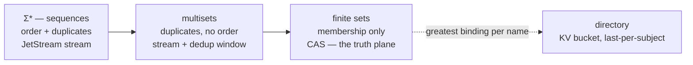

# The storage stack and the expressibility principle — the free-object chain as the carrier layering, ingress as two planes, and every API as a term

Date: 2026-08-18. Status: **DESIGN, PRE-GRILL.** Drafted by the Mac
coordinator seat for the **DEV-772 grill** at HEAD `0bbae1a44`. This
record promotes three coordinator consultation notes into one
grill-ready sheet. It rules nothing; the operator rules.

Its sources, named verbatim:

- `scratch/research/2026-08-18-algebra-engine-architecture.md` — "The
  algebra engine and the duplex substrate" (EXPLORATORY consultation
  note, coordinator-written 2026-08-18, PC seat), including its §10
  addendum "the cost ladder — physics prices bytes, logic prices
  meaning". Its §9 decision sheet is carried below as AE-1..AE-7.
- `scratch/research/2026-08-18-cas-motion-and-ingress.md` — "CAS motion
  and message ingress: frontiers, cadence, and the two-plane split"
  (EXPLORATORY consultation note, coordinator-written 2026-08-18, PC
  seat).
- "APIs as algebra: the expressibility principle, the eight access
  patterns, and the plane-layered surface" (EXPLORATORY consultation
  note, coordinator-written 2026-08-18, Mac coordinator seat; held in
  the coordinator's session scratch and **not committed to this tree**
  — its §7 rows are carried below as AE-8 and AE-9, which is how they
  reach the record).

The first two are in the tree and were read in place this session; they
are byte-identical to the coordinator's copies. Where this record says
"the notes", it means those three.

**This record changes no code, no gate, no ledger row, no ticket, and
no seam status.** Its only write is this file. It runs nothing and
measures nothing: every number in it is an ordering claim carried from
a note, and the measurement is commissioned rather than reported
(AE-7).

Confidence tiers, as the estate uses them: **ratified** (grill record
or standing ruling) · **proven** (a Lean theorem behind a green gate,
cited by its real name) · **measured** (a ran-it result recorded here —
**this record has none**) · **shipped** (code on this branch, read in
place) · **proposed** (this record's own design) · **lead** (an
external claim not verified this session).

Two standing fences ride every sentence, carried from all three notes.
**Safety only** — nothing below promises liveness, convergence,
throughput, or termination. **Attribution fence** — every "who" is a
credentialed connection under a writ. A third rides the whole record
because it is the subject matter: **the meaning/carriage split** — the
algebra never sees placement; it sees digests, and a sentence that
moves a claim from meaning to carriage or back is doing the one thing
this record exists to keep legible.

---

## 0. For an outsider, before any house word

This estate runs a coordination substrate for fleets of AI agents.
Every value is named by the hash of its one canonical byte form; every
change of state is either a mergeable set, a checkpointed reduction
over an append-only journal, or a fenced one-winner decision; and the
concurrency claims behind those three shapes are machine-checked in the
Lean proof assistant rather than asserted in prose. The agent-facing
API is a tiny algebra: eight primitive acts and a closed list of things
that have no syntax at all.

This record is about two questions that sound like plumbing and are
not.

The first is **where the bytes go**. A system like this has to store
things, move them, and let many writers work at once without stepping
on each other. The usual answer is to design a storage layer and then
argue about it. The answer here is that the storage layering is already
implied by the mathematics: there is a standard chain of structures
that forget progressively more — a sequence remembers order and
repeats, a bag remembers repeats but not order, a set remembers
neither — and the message broker this estate runs happens to sell a
product for each stage of that chain. So the layering is not designed;
it is *recognized*, and the rule that falls out is a single sentence:
an operation may be served by the most forgetful layer whose
forgetfulness it can tolerate. If your combining operation does not
care about order, order need not be stored for it. That is not a
performance tip; it is what makes parallelism safe, and the estate can
check it in the type system rather than in code review.

The second question is **what an API is allowed to be**. The proposal
carried here is that every public function must name the mathematical
expression it stands for, and the friendly surface — the method names,
the chained calls, the tool descriptions a language model reads — is
generated from that expression rather than written by hand beside it.
The payoff is that agreement between the human's documentation, the
machine's code, and the model's tool list stops being something anyone
maintains. All three are pictures of one thing, so they agree by
construction. The cost, stated honestly, is that every such surface
needs a generator and an automatic comparison that proves the pictures
still match, and the estate owes one of those already.

**House terms, one line each.** A **digest** is a SHA-256 hash over a
value's canonical bytes: its permanent name. The **CAS** is the space
of those digests — the truth plane. A **dot** is one value in it. The
**door** is the one admission function; a **refusal** is a typed value
the door returns instead of an error, carrying the law it defends and a
legal next move. A **lane** is an append-only evidence stream; a
**position** is a place in one; an **anchor** is a reader's recorded
position; a **fold** is a declared reduction over a lane. A **cell** is
a lattice value merged by least upper bound. A **fence** is the one
place exclusive choice happens. A **writ** is the authority scope a
connection acts under. **Carriage** is everything that moves bytes and
claims no meaning. **NATS** and **JetStream** are the message broker
and its persistence layer; **KV** is its key-value product. **KM-** and
**AE-** name grill items — from the kernel-model notes, and from this
record's sheet.

---

## 1. Result first

**1.1 The storage stack is not designed; it is the free-object chain
wearing an ops uniform.** F2's factorization — sequences ↠ multisets ↠
finite sets — is the layering, and JetStream ships a carrier for each
stage: streams carry order and duplicates, streams with a dedup window
carry counts, the CAS carries membership, and the KV bucket's
last-value-per-subject read carries the directory. That last row is not
an analogy: NATS KV *is* a stream read at the greatest position per
subject, which is exactly `provision_positioned_correspondence`. The
directory algebra was proved before the substrate was noticed to sell
it as a product. **AE-2.**

**1.2 One equality, many carriers — never a second CAS.** "One CAS" is
a logical claim about equality, never a physical claim about buckets or
streams. Shard streams by kind and partition, put blobs in Object Store
or the filesystem or R2, record *where bytes sleep* as placement facts:
the algebra never sees placement; it sees digests. Splitting truth into
several digest spaces is the one move that costs forever, because
pairwise coherence must then be re-proved forever. **Do not duplicate
the CAS; duplicate carriers.** Metadata is more join-plane facts keyed
by the digest on a meta lane, discriminated by kind — never a second
address space, because a second address space is a second equality
(CP-1: sameness IS root-digest equality). **AE-2, and KM-23
confirmed.**

**1.3 The rung⇒carrier rule is the whole storage discipline in one
line.** *A fold may read from the deepest quotient its algebra
respects.* Commutative and idempotent → the set plane, where redelivery
and reordering are free. Commutative but not idempotent → the multiset
presentation, where dedup by content digest makes at-least-once
harmless. Non-commutative or positional → the positioned plane, with an
anchor that carries positions. KM-17's rung brands make this a compile
error rather than a code review. **AE-2.**

**1.4 The fence has a native carrier, and it is source-verified.**
`decide` publishes with an expected-last-subject-sequence header; the
race loser gets a rejection that maps to a refusal with a mechanical
repair. KV's update-with-revision is the same primitive on the
directory plane. Both are **VERIFIED** against nats-server v2.14.4 in
`docs/research/2026-08-12-jetstream-guarantees-source-verified.md` —
check and append share one critical section standalone, and the
clustered path checks at the leader under `clMu` with inflight-subject
blocking. Everywhere else JetStream's ordering is demoted to advisory:
**positions are read material, never authority.** **AE-3.**

**1.5 The CAS never updates, so a live view draws frontiers, not
dots.** A set only accretes; there is no motion in the truth plane to
draw. All motion is at frontiers, at six different cadences (§5.1). The
principle is **draw the frontiers, resolve the dots on demand**: per-lane
head positions, per-consumer anchor lag (head minus anchor = honest
staleness, with no clock), rare directory rebinds highlighted, and
refusal-rate-at-anchor as the alignment gauge. The view is itself a
coalgebra — a watch is a consumer — so it is pushed, never polled, and
"how often does it update" has the honest answer: exactly as often as
the lanes it watches advance.

**1.6 Message ingress splits into two planes, and both operator models
were right.** **One class as bytes, many kinds as meaning, any layout
as carriage.** As identity: yes, one digest per message — identical
messages dedup themselves across agents, and batching ten thousand
messages into one segment is a placement-plane choice invisible to
every fold. As meaning: never one class — the event is a kinded,
attributed fact on a session lane, because folds and writs operate
per-kind, and flattening to one "message" class forces re-parsing
meaning downstream. Utterances enter at the claims tier: **the saying
is a fact; the said is a claim.** Retention splits cleanly, so you
never choose between keeping all chatter and losing history; you choose
which plane pays. **§6; KM-23 applied to chatter.**

**1.7 Every public API names its denotation, or it is not an API.** The
proposed ruling: every public surface names a composition term in the
estate meta-language; the fluent surface is generated sugar over that
term; parity across prose, TypeScript, and MCP is held by
served-equals-derived walls rather than by review; and an API with no
denotation is either fenced as carriage or grilled as a missing
construct. This extends ADR-0010 one rung — from "licensed by a law" to
"denoted by a term". Its consequence is the one worth naming: **parity
is a digest equality**, and agent-first stops being a posture because
there is nothing first except the algebra. **AE-8.**

**1.8 Everything any caller does to the substrate is one of eight
access patterns**, each licensed by a generator, each landing at a
known cost tier, each naming the carriage its signature never mentions
(§7). Seven of the eight are already terms. The eighth — watching a
frontier — has its home in the coalgebraic half, which nothing yet
rules, so watch surfaces ship as chatter with recovery-by-read and make
no parity claim. That is the principle's one honest gap, stated rather
than papered over. **AE-9, gated on AE-4.**

**1.9 The cost ladder is priced by logic, not by physics, and it is
unmeasured on purpose.** The classical numbers-every-programmer-should-know
table is priced by the speed of light and seek time; the estate's is
priced by which laws an operation's algebra satisfies. So the search
for efficiency is the search for stronger laws — **optimization becomes
proof** — and a service's performance envelope is legible at
declaration time from the rungs of its folds: **SLA from signature**.
Three inversions against the classical table: cache invalidation is
deleted, speculation is free on the join plane, and the expensive
instruction is coordination, which earns a rung the classical table
never had. Every tier assignment below is an **ordering claim**. AE-7
commissions the measurement. **§8.**

**1.10 The through-line the duplex closure needs, pre-registered.** The
door gives ingress totality: every state change is the image of an
admitted act. The dual is stated and unproved:

> **Every outbound byte is the image of an anchored read under a
> declared, writ-scoped fold.**

No unlogged output; no view that is not a declaration; no read outside
a writ; a view that would reveal beyond its writ becomes a *refusal*,
not a breach. Proposed **stated-only** in the F13 posture, with one
carve-out kept honest: host-internal debug exhaust is carrier plane,
non-semantic, and must never be read by folds. Ingress totality and
egress totality are the same statement twice — **nothing enters
unjudged, nothing leaves undeclared.** **AE-4.**

---

## 2. Grounding — the authorities this record stands on

Every row below was opened in this tree this session. Nothing in this
record is grounded on a document it did not read.

| Authority | What it carries here | Tier |
| --- | --- | --- |
| `docs/research/2026-08-12-jetstream-guarantees-source-verified.md` | the fence's carrier: expected-last-sequence-per-subject CAS **VERIFIED** at nats-server v2.14.4 (standalone check+append in one `mset.mu` critical section; clustered leader-side check under `clMu` with inflight-subject blocking); `kv.Update(key, value, rev)` revision-CAS **VERIFIED** as the same server mechanism; `Nats-Msg-Id` dedup **VERIFIED-WITH-CAVEAT** (in-memory window, standalone CAS fires before dedup, so the digest-compare fallback is load-bearing); KV Watch **VERIFIED-WITH-CAVEAT** as an ordered-consumer live plane correctly treated as chatter with `Get` as recovery authority; KV reads are never read-after-write consistent | source-verified research |
| `docs/research/2026-08-12-nats-agent-protocol.md` | the four properties the substrate's replay leans on — facts before visibility, content-addressed identity, CAS-only writes, verify-on-read — and the three wire shapes that differ in what surviving means | research |
| `docs/research/2026-08-12-nats-server-as-abstraction.md` | JetStream **mirrors** copy at the origin's sequence numbers with resync-on-gap, so hash-chain verify-on-read carries over and lag manifests as absence; **sources renumber and are disqualified**; the durable identity of a server is its `StoreDir` | source-verified research |
| `docs/adr/0009-journal-roles-authority-and-replica.md` | a journal is an AUTHORITY (imports nothing) or a REPLICA (a verified mirror, locally read-only, **lag is absence, never wrong data**); the rejected alternative — replicas re-appending through their own journal — renumbers history and turns a verifiable mirror into a trusted port | ratified |
| `docs/adr/0010-the-lawful-surface.md` | a public function enters a library only with the law that licenses it, and ships with generated law tests; convenience functions with no licensing law are refused from the public surface. AE-8 extends exactly this one rung | ratified |
| `docs/design/2026-08-18-plait-kernel-algebra.md` §4–§5 | the eight generators (`declare`, `resolve`, `emit`, `join`, `fold`, `decide`, `trigger`, `spawn`), the immutable/head-relative sort split, §4.3's not-a-generator table, §5.3's closure list, §5.6's one-AST rule (`render = assemble ∘ compile`; a second assembler is refused), §4.5's naming and Dvořák rules | ratified |
| `docs/design/2026-08-18-km-algebraic-register.md` | the register model for this sheet, and KM-17's rung brands — the mechanism that makes §4.4's rung⇒carrier rule a compile error rather than a review note | design, pre-grill |
| `docs/research/2026-08-18-kernel-model-notes.md` §11 | **KM-22** and **KM-23**, already pinned. This record cites them and restates neither | pinned |
| `scratch/research/2026-08-18-algebra-engine-architecture.md` | §0–§10; §9 is carried below as AE-1..AE-7 and §10 as the cost ladder | consultation note |
| `scratch/research/2026-08-18-cas-motion-and-ingress.md` | §1–§4; the frontier cadence table and the two-plane ingress split | consultation note |

Standing rulings the notes compose and this record does not reopen:
the ratified kernel algebra (K-1..K-10), the **REF-0 extraction ruling
of 2026-08-16** (WASM-preferred kernel, stateless ABI, OCaml lane
killed), the **generated-vectors ruling of 2026-08-15** (model↔runtime
fixtures are executed out of the model, byte-identical, hand-authored
model verdicts banned), the provision lane's Effect correspondence with
its `provisionFold`/`greatestAt` theorems, KM-15 (environments are
directories), KM-16 (paths resolve from explicit roots), and KM-17
(rung brands).

---

## 3. The stance, and the one correction it rests on

**You do not compile the model into the system; you hold the system to
the model.**

Strip the engine to what the ratified model defines and it is two
functions, both pure, both total, both theorem-covered:

```
admit : Candidate → Act ⊕ Refusal     -- the door
eval  : Anchor × FoldDecl → Value     -- the read canon
```

`admit` returns either the intrinsic act or a refusal carrying reason,
law, repair, and applicability (refusal parity). `eval` is the anchored
read. `decide` is not a third function — a fenced act passes `admit`
like everything else and becomes exclusive only at its carrier (§4.4).
Triggers are standing `eval`s whose results re-enter as candidates.

Everything else in the stack — NATS, Go, TypeScript, Effect, MCP, the
UI — is **carriage**: moving candidate bytes to the door, and moving
admitted bytes to readers. The engine holds no state; that is the REF-0
stateless-ABI ruling restated as architecture. **State lives in
carriers; the engine is a judgment, not a place.**

This is what buys semantic coherence by construction rather than by
discipline. LLM→MCP, human→language, and TS→API are three surfaces
feeding **one door**. Agreement between tool, model, and user is not
maintained; it is inherited, because all three speak projections of one
signature and are judged by one `admit`. The three projections shipped
this session — `kernel.ts`, `tools.schema.json`, `prose.md` — are the
existing evidence that a surface can be a 100%-fidelity image of the
signature.

The stack, with the arrows labeled honestly:

```
law plane       Lean model + gate        proves; generates vectors; referees
                  ║  conformance (byte-identical vector replay — NOT compilation)
kernel plane    admit + eval             stateless; WASM-preferred; embedded in every host
truth plane     CAS                      one digest space; kinds; join-plane facts
directory plane KV (name → digest)       arbitrated bindings; fenced rebinds
position plane  JetStream streams        sequences, sessions; advisory order
host plane      Go daemon                consumers, triggers, carriers, heartbeats
surface plane   TS/Effect · MCP · prose  term builders; projections; humans and LLMs
```

**The correction that formalizes the whole approach:** the arrow from
Lean to the engine is a *conformance* arrow, not a production arrow.
Lean does not produce the engine; Lean produces the **obligations** the
engine is held to. The allocation of rigor follows in three steps —
**prove once** (laws live in Lean and nowhere else), **project
statements** (signatures, types, schemas, prose are mechanical images),
**conform behavior** (every host and the kernel replay the generated
vectors byte-identically at the gate). Nothing transports proofs across
languages, and nothing needs to: the vectors are the proofs' images.
The estate's upgrade over the ordinary reference-model-plus-conformance-suite
pattern is that the suite is *generated by executing the model*, so it
cannot drift from the theorems.

Four constructions carry the mathematics, one sentence each. Candidates
are **free terms** — anyone may write any term, which is why the
language can be populated by unreliable writers safely. The door is a
**characteristic function that explains itself** — the quotient map
onto the lawful algebra with its kernel materialized as typed refusals
instead of discarded, so the refusal plane is the complement of the
language made into data. The journal is a **free join-semilattice**, so
every lawful fold is the *unique* homomorphism out of it — the
measurement canon is an initiality guarantee, not a library of handy
functions, and that uniqueness is the extreme-cohesion property proved
rather than maintained. The fence is **the one non-free act**.

---

## 4. The storage stack: the free-object chain and its carriers

### 4.1 The chain, and the carrier for each stage

F2, the factorization chain of free objects, read as architecture:



*Figure: each arrow forgets something, and each stage has a carrier
that remembers exactly what the stage does. The directory hangs off the
set plane because a name's greatest binding is a positioned read, not a
set membership.*

| Quotient stage | What it remembers | NATS carrier | Estate construct |
| --- | --- | --- | --- |
| Σ* — sequences | arrival order + duplicates | JetStream stream (subject sequence numbers) | positioned plane; `positionedOf` |
| multisets | counts, not order | stream + dedup window (`Nats-Msg-Id` = digest) | count-class measurements |
| finite sets | membership only | CAS (digest space; Object Store / FS / R2 carriers) | the join plane; truth |
| directory (named cells) | greatest binding per name | **KV bucket, last-per-subject** | `greatestAt` / `provisionFold` |

Two of those rows are theorems from this session wearing an ops
uniform. NATS KV is implemented as a stream with last-value-per-subject
reads: subject = hole name, stream sequence = position, read = greatest
position per name. That is **exactly**
`provision_positioned_correspondence` — the provision fold is a
positioned greatest-read. The estate adds what the product lacks: laws,
refusal typing, anchored reads.

### 4.2 One equality, many carriers

**Do not duplicate the CAS; duplicate carriers.** "One CAS" is a
logical claim — one digest space, one equality — never a physical claim
about buckets or streams. Once those are separated, the
wasteful-or-limiting worry dissolves:

- NATS session and indexing limits are **per-carrier engineering**.
  Shard streams by kind and partition, put blobs in Object Store or the
  filesystem or R2, and record where bytes sleep as placement facts.
  The algebra never sees placement; it sees digests.
- The expressive power is not wasted by unity — it is **enabled** by
  it. Folds compose across kinds only because every fact shares one
  digest space. Split truth into three CASes and you must re-prove
  pairwise coherence forever. That tax is exactly the unease the
  operator reported. **The tax is real, so never split truth. Split
  carriers.**

**Metadata is kinds, not channels.** Metadata about digest `d` is more
join-plane facts *keyed by `d`* on a meta lane, discriminated by kind.
The `Digest kind` coproduct is the discrimination; a second CAS would
be a second equality, which is the one thing the estate must never have
two of.

**Coherence is pre-paid.** It is not a protocol to design; it is a
refusal the model already owns. Every carrier read is verify-on-read —
hash the bytes, compare the digest — and a mismatch is
`unverifiedRead`, one of the four machine-applicable refusals, with a
mechanical repair. Carriers are therefore *allowed* to be stale,
partial, or wrong: they are hint planes. **Truth never degrades because
truth is the equality, not the carrier.** The substrate agrees at the
replication layer: ADR-0009 rules that a replica is a verified mirror
whose **lag is absence, never wrong data**, and the server research
records that mirrors copy at origin sequence numbers with resync-on-gap
while sources renumber and are disqualified from carrying a journal.

### 4.3 The rung⇒carrier rule

The operator's instinct — "each defined algebra corresponds to some
kind of structure??" — is theorem-shaped. Stated as a rule:

> **A fold may read from the deepest quotient its algebra respects.**

- Commutative + idempotent (bounded-semilattice rung) → may read the
  set plane (CAS). Redelivery and reordering are free.
- Commutative, not idempotent (counting monoids) → needs the multiset
  presentation; dedup by content digest makes at-least-once delivery
  harmless.
- Non-commutative / positional (provision, latest-wins, sequences) →
  must read the positioned plane, and its anchor must carry positions
  (the `AnchorFact fold partition` brands already type this).

Publishing a result *down* the chain — claiming a positional fold as a
set-plane fact — requires exactly the homomorphism condition of F2:
invariance under the quotient. KM-17's rung brands make the rule
enforceable in the TypeScript surface, so the carrier a fold may read
becomes a type error rather than a code review.

### 4.4 The fence's native carrier, and what sessions are

JetStream supports publish with an expected-last-subject-sequence
header — compare-and-set on a subject. **That is `decide`'s carrier.**
The fenced act publishes with the expected position; the race loser
gets a rejection that maps to a refusal with a mechanical repair
(re-read, re-decide). KV's update-with-revision is the same primitive
on the directory plane, so fenced rebinding of names uses it too. Both
are source-verified (§2). The one place where order is truth gets the
one primitive where the carrier enforces order; everywhere else,
JetStream's ordering is demoted to advisory.

A **session is read-plane state** — a consumer's position in a stream
plus a writ scoping what it may resolve. Sessions never touch truth;
they are where the coalgebra keeps its place. This is why holding
JetStream first-class is safe: it supplies positions and sessions (read
plane), the CAS supplies equality (truth plane), and neither can
corrupt the other.

### 4.5 Addressing is the language

KM-15 (environments are directories) and KM-16 (paths resolve from
explicit roots) already carry this. The formal statement: **an address
is an iterated resolve.** `/a/b/c` from root `R` is
`resolve c ∘ resolve b ∘ resolve a` applied to `R` — a path IS a
program, a composition of the resolve generator, evaluated by the
directory algebra, which is `greatestAt`, which is NATS KV. The
"filesystem service" is therefore not a service to design; it is sugar
over three pieces that exist:

```
eval      : Root × Path → Digest ⊕ Refusal   (iterated resolve)
placement : Digest → facts about carriers     (monotone hint plane)
read      : Carrier × Digest → Bytes          (verify-on-read)
```

Compose them and that is the whole storage subsystem: "where is this
data?" → address → digest → carriers → verified bytes. Mounting a blob
store is declaring a root. Listing is a directory fold; watching is a
KV subscription (a coalgebra). Two further images resolve here:
**peeling slices per dot** is resolving the same digest against another
plane — the slices are not inside the dot, because bytes inside the dot
would change its digest and break equality; they are **facets**, the
fibers over the digest in adjacent planes, each a monotone fact-set
keyed by the digest. **Each dot a cell in a database you can fold
over** is what kinded facts on lanes already are. The three operator
images were never competing designs; they are one design seen from
three planes — facets, cells, rungs.

---

## 5. CAS motion: what actually moves

### 5.1 Door growth, precisely

"Door growth" is growth of the **world the door consults**, never of
the door's rules. The sixteen refusal reasons and their checks are
pinned at a language version; what grows is catalog membership and the
writ universe. Formally the door is `admit(world, candidate)`, and door
growth is `world ⊆ world'`. Multi-agent activity is exactly what drives
it: every admitted declare any agent pushes enlarges everyone else's
world. The three theorems, read operationally for a fleet:

- `admit_monotone` — nothing anyone else says can invalidate your
  lawful sentence; admission survives the world filling in around it.
  This is what lets a thousand agents write concurrently without
  re-checking each other.
- `intrinsic_fault_refused_everywhere` — an unlawful shape (clock read,
  unfenced decide, cross-sort comparison) refuses at EVERY world; no
  one else's declarations can save you, and the only repair is
  rewriting. The competence-error half.
- `relative_refusal_repairable_by_growth` — every door-relative refusal
  (forward reference, off-writ referent) admits unchanged at some
  larger world: someone declares the referent, or the authority grants
  the writ. The ignorance half — wait or ask, don't rewrite.

Not every emission moves the door. Lane evidence changes what folds
*say*; admission consults catalog membership and the writ universe
specifically — both monotone, which is why the family is CALM-at-the-door.

### 5.2 The frontiers, and their cadences

A set only accretes; there is no motion in the truth plane to draw. All
motion lives at frontiers, at very different speeds:

| What moves | Plane | Expected cadence |
| --- | --- | --- |
| lane heads (emissions, messages, ticks) | positioned | fast — machine-paced, the hot plane |
| cell states (joins, measurements) | set | medium — measurement-paced |
| new declarations (schemas, programs, skills) | set + directory | low — minting-paced |
| greatest bindings (name rebinds) | directory | rare and salient |
| fenced outcomes | fence | rare — priced |
| anchors (each consumer's read position) | read | consumer-paced |

**Draw the frontiers, resolve the dots on demand.** The set is
unbounded and mostly cold; the frontier is small and hot. A live view
is: per-lane head positions; per-consumer anchor lag (head minus anchor
= honest staleness, no clock); directory rebinds highlighted because
rare; refusal-rate-at-anchor as the alignment gauge. The UI itself is a
coalgebra — a watch is a consumer — receiving pushed deltas at T2 and
never polling. The substrate research agrees on the posture: KV Watch
is an ordered-consumer live plane correctly classified as **chatter**,
with `Get` as the recovery authority. Real rates are AE-7's job to
measure; the architecture guarantees only that folds absorb any rate
incrementally.

---

## 6. The two-plane ingress split

The operator's two candidate models — "each message behind one digest
on a persistence carrier address" and "all messages as one class" — are
both right, on different planes. The rule of thumb:

**One class as bytes, many kinds as meaning, any layout as carriage.**

```
ingress:  message ──admit──▶ splits into
  content plane (what was said):   canonical bytes → ONE digest (the dot, stored once)
                                   → placement facts (join like evidence)
                                   → carrier segment/blob (batching invisible to meaning)
  event plane (that it was said):  attributed, kinded fact citing the digest
                                   → lane position p (the head advances)
                                   → folds + anchors (views catch up, lag honest)
```

- **As identity: yes, one digest per message on a carrier address.**
  This is KM-23's two-plane dot applied to chatter. Free consequences:
  identical messages dedup themselves across agents (same bytes, same
  digest); batching is a placement-plane choice — ten thousand small
  messages in one segment with digest → segment+offset placement facts,
  log-structured, invisible to every fold.
- **As meaning: never one class.** The event is a kinded, attributed
  fact on a session lane ("agent A said ⟨digest⟩ at position p"). Kinds
  discriminate — claim, tool result, instruction, refusal, repair are
  different kinds on different lanes — because folds and writs operate
  per-kind. Flattening to one "message" class forces re-parsing meaning
  downstream, the exact failure the kind system exists to prevent.
- **Claims tier for utterances.** The journal records THAT A said X as
  truth; whether X holds stays untrusted testimony until verified and
  promoted. **The saying is a fact; the said is a claim.**
- **Retention splits cleanly.** Content dots are cheap to keep forever
  (cold carrier, dedup'd); the hot event lane compacts by the lawful
  route — a distillation fold emits a summary dot pinned to the anchor
  interval it compresses, and the read root rebinds. You never choose
  between keeping all chatter and losing history; you choose which
  plane pays.

The dedup consequence has a caveat the substrate research pins and this
record carries: the `Nats-Msg-Id` window is an **assist**, not the
authority. The dedup map is in-memory and rebuilt from stream contents
on restart, and in the standalone path the CAS check fires before the
dedup check — so the journal's digest-compare fallback is load-bearing,
not belt-and-braces. Content-address dedup at the meaning plane is
free; carrier-window dedup at the carriage plane is an optimization
with a window.

---

## 7. The eight access patterns

Everything any caller does to the substrate reduces to eight patterns.
Each is licensed by a generator, lands at a known cost tier (§8), and
names the carriage that serves it — **carriage the pattern's signature
never mentions**.

| # | Pattern | Generator | Denotation shape | Carriage (never in the signature) | Tier |
| --- | --- | --- | --- | --- | --- |
| 1 | Mint | `declare` | candidate → door → dot (+ placement fact) | CAS carrier put; KV/stream per kind | T0 + T2/T3 |
| 2 | Fetch by identity | `resolve` | digest → verified bytes; placement-hinted | direct get / object store / any carrier | T1 hot, T3 cold |
| 3 | Append at a frontier | `emit` | envelope at a position; msg-id = digest | stream publish | T2 |
| 4 | Merge into a lattice | `join` | read ∘ join ∘ CAS-at-revision (the one loop) | KV update-with-revision | T2 |
| 5 | Read at an anchor | `fold` | anchored reduction; incremental by associativity | consumer step / maintained state | T1 maintained, T3 replay |
| 6 | Decide at a fence | `decide` | fenced outcome at expected position | expected-last-sequence publish / KV revision update | T4 |
| 7 | Watch a frontier | (coalgebra) | consumer step: state → observation × state | pull consumer / KV watch — chatter, recovery by read | T2 push |
| 8 | Attenuate | `spawn` | writ meet | credential selection at connect | T0 |

Rows 1–6 and 8 are already terms: their fluent forms must compile to
exactly these compositions. **Row 7 is the one pattern whose
meta-language home is the coalgebraic half**, which the egress law
(AE-4) names and nothing yet rules; until it lands, watch surfaces ship
as chatter with the recovery-by-read law and make no parity claim.

### 7.1 The expressibility principle

The operator's sentence, and then the precise form:

> All APIs should be expressible as algebraic constructs, and so in
> turn expressible in the estate meta-language — lean proof → algebra →
> AST → {dsl, code, prose, mcp} — meaning we aim to have almost all
> APIs be fluent compositions of the algebraic constructs they model,
> and so maintain machine, human, and LLM parity in understanding. This
> is how we guarantee agent-first is a truth as much as any dot in the
> CAS.

Stated as an admission rule over the API surface itself:

> **Every public API names its denotation: a composition term in the
> estate meta-language. The fluent surface is generated sugar over that
> term, and the term — not the sugar — is what the projections share.**

Three consequences, each checkable rather than aspirational:

1. **Parity is a digest equality.** The LLM reads the MCP projection,
   the human reads the prose or the fluent code, the machine executes
   the AST — and all three are images of one declaration with one
   digest. "Do these three understand the same thing" stops being a
   review question and becomes served-equals-derived, the wall class
   the estate already runs for tool descriptions.
2. **A fluent method with no denotation is refused, not shipped.** If a
   proposed API cannot be written as a composition of the eight
   generators, declared algebras, and ruled combinators, it is either
   carriage (fenced behind the environmental band, where it never
   claims meaning) or a missing algebraic construct (a grill item under
   the K-1 growth discipline). The refusal mirrors the
   hand-written-tool-list refusal: a hand-written API is a second
   assembler in miniature.
3. **Agent-first is constructional.** An agent's surface is not a port
   of the human surface; both are projections of the same term. The
   agent cannot be second because there is nothing first except the
   algebra.

What is already ratified, so the principle composes rather than
invents: **one AST, three projections** (the kernel record's §5.6 —
`render = assemble ∘ compile` is law, and a parsed math-DSL or any
second assembler is refused); the **dual construction** (authoring in
Effect constructs the program declaration and the executable together);
**shipped evidence of 100% fidelity** (`kernel.ts`,
`tools.schema.json`, `prose.md`, with KM-13 owing the emitter wall that
keeps them honest); **KM-18** (notation as projection register;
generated JSDoc reaches agents through Effect Schema annotations → JSON
Schema → the MCP tool surface with no human in the path); **ADR-0010**
(a public function enters a library only with the law that licenses
it — the principle extends this from "licensed by a law" to "denoted by
a term"); and §3's three-surfaces-one-door. **The delta carried to the
grill:** those rulings cover the kernel language; the principle extends
them to the whole public surface — affordances, frontier reads,
placement resolution, the measurement catalog, future service faces.

### 7.2 Fluency, fenced

"Fluent composition" earns its place only under three fences:

- **Fluency adds no semantics.** A fluent chain is notation for a term;
  two spellings of one term must produce one digest. KM-18's
  bracket-alias discipline — aliases are the same function, never an
  overload — is the precedent, generalized.
- **Fluency never hides a plane crossing.** A chain that silently moves
  from meaning to carriage (a `.publish()` that means transport, not
  `emit`) is the confusion the meaning/carriage split exists to
  prevent; carriage configuration lives in options records in the
  environmental band, never in the fluent chain.
- **The chain's type is the term's rung.** KM-17's brands ride the
  fluent surface unchanged: `join` elaborates only at a
  bounded-semilattice carrier whether spelled fluently or not — the
  rung⇒carrier rule cannot be dodged by sugar.

### 7.3 The module organization the principle forces

Layer by **plane, not by NATS construct** — the plane-aligned layout
(DEV-760 epic) already runs this direction; the principle says why it
is forced: projections are generated per plane, and a module that mixed
planes would need a projection that lies about one of them.

| Plane | Owns | Never contains |
| --- | --- | --- |
| meaning | digests, kinds, sorts, envelopes, refusals, declared algebras | any carrier type (already the ruled discipline) |
| placement | placement facts, the hint-consulting resolver | authority over identity |
| position | lanes, anchors, frontiers (heads, lag) | wall-clock time |
| fence | registers, tokens, incarnation pins | a second decision point |
| coalgebra | consumers, sessions, declared views (DEV-765) | truth writes |
| carriage adapters | one per construct, each exactly three things: a shape gate, transport-absence terms, CAS classification | meaning of any kind |

The adapter row is the transport spine's per-adapter data promoted to a
definition: **an adapter IS its shape gate plus its absence terms plus
its CAS classification, and anything more is smuggled meaning.**

### 7.4 The API admission test

For any proposed public surface, in order:

1. **Denote it.** Write the composition term. If it exists, the API is
   that term's generated sugar; its docstring opens with the algebraic
   sentence (the Dvořák rule), its projections are emitted, and the
   parity wall byte-compares them.
2. **If no term exists, classify the residue.** Carriage → options in
   the environmental band, fenced out of the fluent surface. Liveness →
   coalgebra hosting, stated as chatter. Genuinely new meaning → a
   grill item; the API waits for the construct, never the reverse.
3. **Never split the difference.** A "mostly algebraic" API with one
   ad-hoc verb is a second assembler wearing a good coat.

---

## 8. Duplex, and the cost ladder as ordering claims

### 8.1 Duplex, formally

- **Ingestion is algebra.** Folds (catamorphisms) consume the journal;
  the door admits; state accretes. This side is proved.
- **Emission is coalgebra.** A consumer is a state plus a step function
  producing an observation and a next state; streams are final
  coalgebras; subscriptions, watches, views, MCP responses, and UI
  projections are all unfolds. JetStream consumers are *literally*
  this — ack floor as coalgebra state.
- A live behavior (an agent, the daemon, a view server) pairs the two:
  it observes by coalgebra and writes by algebra, and its whole I/O
  boundary is typed by those two faces.

This dissolves the daemon's specialness into something statable: **the
truth plane needs no liveness (a set is not alive); the system is alive
iff its coalgebras are productive.** The daemon is the host of the
unfolds. Aliveness obeys house discipline — heartbeats are emitted
facts, so "alive" is a *reader's fold* over recent positions with a
staleness tolerance: observed, never promised. There is no "alive now"
sentence, only "productive through position p" — the
semantic-space-not-time thesis applied to the runtime itself.

The egress law (§1.10, AE-4) is what closes the duplex.

### 8.2 The ladder — priced by logic, not physics

The classical ladder is priced by physics (speed of light, seek time,
round trips); the estate ladder is priced by **logic** — an operation's
tier is determined by which laws its algebra satisfies. So the search
for efficiency is the search for stronger laws: **optimization becomes
proof**, and the rung brands make cheap-tier access a typed right
instead of a hope. Corollary for services: a service is a bundle of
declared folds + a root + a writ, so its performance envelope is
legible at declaration time from the rungs of its folds — **SLA from
signature**. Strengthening its laws is the only way to move it down the
ladder.

Classical anchors below are public folklore numbers, order of magnitude
(**lead** — not verified this session). Estate tiers are COST CLASSES,
deliberately unmeasured; **AE-7 commissions the measurement.**

| Tier | Estate operation | Cost class (classical anchor) | What lives here |
| --- | --- | --- | --- |
| T0 | kernel judgment — `admit` intrinsic checks, `eval` on in-hand bytes | function call (L1 ≈1 ns … µs) | stateless WASM; all intrinsic refusals are FREE |
| T1 | verified local read — digest-keyed cache hit; local carrier + hash | RAM→NVMe (≈100 ns – 100 µs) | hot dots; maintained index carriers; hashing ≈GB/s |
| T2 | positioned read/append — KV get, stream publish, consumer step | same-DC round trip (≈0.5 ms) | journal appends; directory reads; watches; door-relative checks |
| T3 | remote carrier fetch — placement lookup + fetch + verify | WAN (≈10–150 ms) | cold blobs; replay; parallel from UNTRUSTED sources — verification is local |
| T4 | the fence — expected-sequence publish, ×(1 + contention) | consensus (RTT × rounds) | `decide` only; the one mandatory wait |
| T5 | ratification — grill, seal, writ grant | minutes–days; never printed on classical charts | the human plane; the design exists to keep this rung rare |

Three inversions against the classical table:

1. **Cache invalidation is deleted.** A digest-keyed entry is valid
   forever (referential transparency of content addressing). Names are
   the only mutable plane, and there "invalidation" is a new greatest
   position — a pushed event, not a guess.
2. **Speculation is free on the join plane.** Optimistic work can never
   conflict where everything is monotone; the only rollback surface is
   the fence, and a fence-race loss is a cheap typed retry — the
   branch-mispredict analog.
3. **The expensive instruction is not the disk seek; it is
   coordination** — and the ladder gains a rung (T5) the classical
   table never had. CALM is the demotion theorem: monotone ⇔ may skip
   T4.

The door's stability split doubles as the admission cost model:
intrinsic checks price at T0 (no world knowledge needed), door-relative
checks at T2 (one directory read).

### 8.3 The two pipelines, priced per stage

```
INGRESS  candidate ─T0 admit─▶ T2 append fact ─▶ [large payload: T3 carrier put + T2 placement fact]
         door-relative checks add one T2 read; indexes maintain themselves at T2 in the background

EGRESS   query ─T2 resolve name (cacheable)─▶ T1 eval on maintained fold ─▶ T1 verify + serve
         cold path: T3 replay; subscriptions push deltas at T2
```

Ingress totality (the door) and egress totality (AE-4) are the same
statement made twice: **nothing enters unjudged, nothing leaves
undeclared.**

### 8.4 Harness needs on the ladder

| Harness need | Classical analog | Estate construct | Steady-state tier | Law that buys the tier |
| --- | --- | --- | --- | --- |
| working context | registers/RAM | session consumer + anchored reads | T1–T2 | positions are read-plane |
| long-term memory | disk | resolve name → fetch dot | T2, then T1 forever | digests never invalidate |
| search | on-disk index | declared reduction, incrementally maintained | T1 query / T2 maintain | associativity ⇒ incrementality |
| logging | append-only file | `emit` — the journal IS the log | T0+T2 | idempotent join ⇒ retries free |
| deps / config | DI container, env | provision fold = KV greatest-read | T2 | the proven correspondence |
| locks / coordination | mutex, consensus | `decide`, expected-sequence | T4 | CALM: only non-monotone pays |
| cache | L1/L2 | digest-keyed memo | T1 | content addressing |
| replication / durability | RAID, backup | placement facts; ≥k as a measured fold | T3 background | placement = hint plane |
| compaction / GC | defrag | distillation fold + fenced rebind | T3 background + one T4 | view change, not data change |
| runtime verification | CI, hope | the door, always on | T0 intrinsic / T2 relative | the stability split = cost split |
| escalation | page the on-call | grill / seal | T5 | fences price authority |

### 8.5 The license table: optimization = proof

Every classical optimization has a lawful precondition that classical
systems assert by hope (or test) and the estate holds by brand:

| Classical optimization | The law that licenses it | When unlicensed |
| --- | --- | --- |
| shard / parallelize | commutativity | rung⇒carrier type error |
| retry, at-least-once | idempotence | never needed — exactly-once refused as vocabulary |
| incremental / delta views | associativity (monoid fold) | replay from anchor |
| fuse passes | fold composition under KM-19 combinators | leaves-the-variety refusal |
| memoize forever | content addressing | `unverifiedRead` on mismatch |
| pushdown to storage | homomorphism (F2 invariance) | quotient violation |
| speculate | monotonicity of the join plane | fence races only, typed retry |
| approximate in constant space | bounded-semilattice sketches (HLL/CMS/MinHash) | non-mergeable sketch refused |
| skip coordination | CALM: monotone ⇔ coordination-free | unfenced decide refused |

### 8.6 The harness as the fourth projection

The classical agent-harness anatomy reads as a requirements list
because it is one — but for the estate it is not a list of subsystems
to build; it is a list of **derivations to publish**. Same move as
prose/TS/schema: project the one signature into ops vocabulary.

| Harness row | Derivation in the algebra | Carrier | Refusal surface |
| --- | --- | --- | --- |
| Logging | `emit` — the journal IS the log; levels are kinds; there is no second telemetry plane | JetStream lanes | unattributed emit |
| Persistence / filesystem | the addressing stack (§4.5): iterated resolve + placement facts + verify-on-read | KV + Object Store/FS/R2 | `unverifiedRead` (machine-applicable) |
| Git-like versioning | already native: Merkle DAG + fenced rebinding of names (git is a sibling species — CAS + refs) | CAS + KV CAS-update | fence race → re-read repair |
| Search / index | a declared reduction (KM-11) maintained by a consumer; index snapshots are dots with placement | stream → index carrier | rung⇒carrier violations |
| Memory | lanes + anchored reads + distillation folds | CAS + lanes | forward reference (door-relative) |
| Compaction | distillation fold emits summary + lineage pin; **fenced rebind of the read root; nothing deleted** — a view change, not a data change | KV rebind | seal without writ |
| Code execution | `spawn` under a writ; sandbox spec = a root directory (KM-15) + a token; outcomes journal back | daemon + streams | off-writ referent |
| Sandboxing | writ narrowing — authority meets downward; the environment handed to a process is literally a directory root | tokens | writ escalation |
| Web/MCP ingestion | external reads enter as *attributed claims* (G27 claims tier), untrusted until verified | claims lanes | unverified promotion |
| Skills / tools | a skill is a declared, digested program with a schema — a resolvable dot; MCP surface = the 8 kernel tools + declared derivations | CAS + tools.schema.json | schema mismatch |
| Planning / loops | a plan is a ProgramDecl with holes; planning = provision (proved lane); loops = triggers on evidence-appears; **completion is a read (holes exhausted), not a promise** | KV (provision!) + consumers | intrinsic refusals on unlawful plans |
| Verification | the door + the gate — already the core | kernel + CI | the whole refusal plane |

Two things the table shows. First, the **provision lane is the
existence proof of the method**: take a harness subsystem (Effect's
dependency environment), find its algebra (holes + newest-wins fold),
prove the correspondence, and the carrier falls out — NATS KV, exactly.
The remaining rows repeat that loop. Second, the classical harness
treats logging as exhaust and the store as a peripheral; the estate
inverts this — the log is the substrate and everything else is a fold
over it. That inversion is why the rows derive instead of accrete.

---

## 9. Honest bounds

Carried from all three notes, unsoftened. Each is host engineering,
future proof work, or an unmeasured claim, and pretending the algebra
covers it would violate house discipline.

**From the algebra-engine note (§2, §8, §10.5):**

1. **Conformance is not verification.** The vector gate covers the
   vectored surface; behavior off it is where drift lives. The
   mitigation is minimality — two functions, stateless, one WASM
   source, so every host embeds the *same bytes* and drift has no
   per-host corner to hide in. It is a mitigation, not a proof.
2. **Scheduling and liveness policy** — who wakes when, trigger
   fairness, retry pacing — is coalgebra hosting. The algebra makes any
   schedule *safe* (idempotent joins make at-least-once free; the
   estate never needs exactly-once, distributed systems' most expensive
   lie); it does not make any schedule *good*.
3. **Retention economics.** What carriers drop and when is policy;
   dropping a sole carrier of a live digest must itself be fenced.
   Unmodeled.
4. **Backpressure and flow control.** NATS pull consumers give the
   primitives; the algebra is silent.
5. **Key custody.** The convergent-encryption results compose with the
   digest plane, but the spike's crypto is simulated and stays labeled
   so.
6. **The egress law is a candidate** — stated here, unproved,
   ungrilled.
7. **Tier assignments are ordering claims, not measurements.**
   Constants — hash throughput on large blobs, WASM boundary crossings,
   NATS locality, fence contention — move real numbers within and
   across adjacent tiers. Until AE-7 lands, the ladder licenses design
   decisions, not capacity plans.

**From the CAS-motion note (§1, §4):**

8. **On multi-fault candidates the refused STATUS is stable under
   growth, not the reason string.** The stability theorems are about
   admission, not about which of several faults is reported.
9. **Actual frontier rates are unmeasured until AE-7 runs.** §5.2's
   cadence column is expectation, not measurement.
10. **UI-side flow control** — how a view sheds load when a lane runs
    hot — is coalgebra host engineering the algebra is silent on. NATS
    pull consumers give the primitive; each view picks its own pace.
11. **The ingress pipeline's per-stage pricing** (T0 admit, T2 append,
    T3 blob put when large) is an ordering claim, not a measurement.

**From the API note (§6):**

12. **The coalgebraic half is unruled** (AE-4 stated-only); watch and
    view parity claims wait on it. Access-pattern row 7 is the honest
    gap.
13. **Generation cost is real.** Every projected surface needs an
    emitter and a wall, and KM-13's emitter debt is still open for the
    three kernel projections — extending scope before that wall lands
    would widen the hand-derived drift class, so sequencing matters.
14. **"Almost all" is the operator's own qualifier.** Connection
    bootstrap, Config/Redacted credentials, retry Schedules, and
    process lifecycle are environmental-band carriage and must never be
    forced into algebraic costume.
15. **LLM parity in *understanding* is an empirical claim.** KM-18's
    pre-registered eval is the instrument, and this record licenses no
    claim ahead of its runs.

**From this record's own posture:**

16. **Nothing here is measured.** The register model this record
    follows carries measured arms; this one has none. Every claim is
    carried from a note, cited to a repo authority, or structural, and
    the record says which.
17. **One source note is not in the tree.** The API note lives in the
    coordinator's session scratch; its content reaches the record
    through §7 and AE-8/AE-9 and nowhere else. If the grill needs the
    note itself, it must be committed first.

---

## 10. The decision sheet

House style: one decision per item; recommended option first;
alternatives priced; reversal cost stated. **All AE items are
PROPOSED.** AE-1..AE-7 are carried from the algebra-engine note's §9;
AE-8 and AE-9 are carried from the API note's §7. KM-22 and KM-23 are
already pinned on the kernel-model notes' sheet and appear here as
**confirmation rows only** — cited, not restated.

### 10.1 AE-1..AE-7 — the algebra engine and the storage stack

- **AE-1 — kernel embodiment.** Recommended: **hold the ruling.**
  Reaffirm REF-0 (2026-08-16): single-source WASM `admit` + `eval`,
  embedded via wazero in Go (no cgo) and natively in TypeScript; Lean
  is referee, never runtime. The technical facts under it, stated
  plainly: Lean 4's C output is real and is production-grade for a CLI
  reference interpreter and vector generator, which is what
  `ControlMain.lean` already is; "runtime-viable" fails
  **operationally, not on speed** — the generated C is welded to the
  Lean runtime (reference-counted objects, GMP, its own
  initialization), so embedding means cgo against a large foreign
  runtime in Go, a native addon in Node, and tens of megabytes in the
  browser, and you would own a toolchain whose one job is to avoid
  rewriting two small functions. Alternatives priced: **(a) Lean as
  runtime via extraction** — costs the toolchain above, and buys
  nothing the vectors do not, because the model covers `admit` and
  `eval` and does not and should not cover NATS, persistence, sessions,
  or schedulers, so the hosts need vectors regardless; once the vector
  gate is load-bearing for the hosts, letting it also carry the kernel
  costs nothing, and the gate is the piece the estate has already
  hardened. **(b) Per-host hand-written kernels** — every host is a
  place drift can hide; minimality is the whole mitigation. Reversal:
  this is a reaffirmation, so the cost is zero — REF-0 stands unless
  the grill moves it, and no artifact changes either way.

- **AE-2 — the free-object chain as the storage stack.** Recommended:
  **adopt** — the flagship result of the source note. Adopt Σ* ↠
  multisets ↠ finite sets as the carrier layering (stream ↠ stream with
  dedup window ↠ CAS), with KV last-per-subject as the directory and
  the **rung⇒carrier rule** typed via KM-17 brands: a fold may read
  from the deepest quotient its algebra respects, and publishing down
  the chain requires F2's homomorphism condition. Alternatives priced:
  **(a) duplicate the CAS / split truth by channel** (metadata,
  regular, persistence) — costs pairwise coherence re-proved forever
  between every pair of digest spaces, which is precisely the unease
  the operator reported, and gives up cross-kind fold composition,
  which exists only because every fact shares one digest space; **(b)
  a second address space for metadata** — a second equality, refused by
  CP-1 (sameness IS root-digest equality); metadata is kinds keyed by
  the digest on a meta lane instead; **(c) adopt the layering as
  documentation without the brands** — loses the compile-time
  enforcement and returns the rule to code review, which is where this
  class of bug survives. Reversal: the chain is a *recognition* of
  existing structure, and carriers are engineering — re-sharding
  streams, moving blobs between Object Store and FS and R2, or
  retiring a carrier entirely changes no digest and strands no
  identity, because the algebra never sees placement. The rung brands
  are additive type parameters with defaults (KM-17's own reversal
  statement).

- **AE-3 — `decide`'s carrier.** Recommended: **adopt** — the fence is
  carried by expected-last-subject-sequence publish on streams and by
  revision-guarded update on KV, with the race loser's rejection mapped
  to a refusal carrying a mechanical repair (re-read, re-decide). Both
  primitives are **VERIFIED** against nats-server v2.14.4 in the
  source-verified research (§2), including the clustered path's
  leader-side check and inflight-subject blocking. Everywhere else,
  JetStream's ordering is demoted to advisory: positions are read
  material, never authority. Alternatives priced: **(a) treat stream
  order as authority generally** — makes every reader depend on a
  carrier property the model does not own, and loses the CALM demotion
  that lets monotone work skip coordination entirely; **(b) an
  application-level lock or lease** — the register is not a lock: it
  fences outcomes, it does not exclude effort, and leases are liveness
  machinery that never enters the grammar. Reversal: the fence's
  *meaning* is `decide`; the header and the revision guard are
  carriage, so swapping to a different CAS primitive is a carriage
  swap under §4.2's one-equality-many-carriers rule and strands no
  meaning. The caveat that rides: the `Nats-Msg-Id` dedup assist is
  standalone-path-ordered behind the CAS check and its map is
  in-memory, so the digest-compare fallback stays load-bearing.

- **AE-4 — the egress law.** Recommended: **pre-register, stated-only**
  in the F13 pattern — gate-enforced statement, proofs staged after the
  unity bridge. The statement: *every outbound byte is the image of an
  anchored read under a declared, writ-scoped fold.* No unlogged
  output; no view that is not a declaration; no read outside a writ; a
  view that would reveal beyond its writ becomes a refusal, not a
  breach. One carve-out, kept explicit: host-internal debug exhaust (Go
  logs) is carrier plane, non-semantic, and must never be read by
  folds — anything semantic must be emitted as facts or it does not
  exist. Alternatives priced: **(a) prove it now** — the coalgebraic
  half is exactly what is unruled, so a proof ahead of the ruling is
  the overclaim channel the F13 posture exists to close; **(b) leave
  duplex unruled** — leaves access-pattern row 7 (watch) without a
  meta-language home indefinitely, which is what currently blocks AE-9
  from covering all eight rows. Reversal: a stated-only law is a
  sentence and a gate check; retiring it deletes both and strands no
  identity, because nothing is proved on it and no surface claims it.

- **AE-5 — the harness/ops projection as the fourth projection.**
  Recommended: **adopt, sequenced behind the unity lane.** §8.6's
  derivation table is its skeleton: the harness anatomy becomes a list
  of derivations to publish, not subsystems to build, projected from
  the one signature into ops vocabulary exactly as prose, TypeScript,
  and the tool schema already are. Alternatives priced: **(a) build the
  harness rows as subsystems** — accretion instead of derivation, and
  the classical inversion returns (logging as exhaust, the store as a
  peripheral) which is what makes those systems drift; **(b) ship it
  ahead of the unity lane** — a fourth projection needs the same
  emitter-and-wall machinery as the other three, and KM-13's emitter
  debt is open (bound 13). Reversal: a document. Retiring it strands no
  identity; the derivations it publishes are already carried by the
  rows it projects.

- **AE-6 — addressing sugar.** Recommended: **fold into existing KM
  rows** — no new machinery. The path grammar is iterated resolve
  (KM-16), mounts are root declarations (KM-15), facets are per-plane
  fact fibers over one digest, listing is a directory fold, and
  watching is a KV subscription. Alternatives priced: **(a) design a
  filesystem service** — costs a new surface that would be sugar over
  three pieces that already exist (`eval`, `placement`, `read`), and a
  new surface with no denotation is exactly what AE-8 refuses; **(b)
  put facets inside the dot** — refused outright: bytes inside the dot
  change its digest and break equality. Reversal: folding into existing
  rows adds no row, so there is nothing to retire.

- **AE-7 — the cost-ladder measurement harness.** Recommended: **adopt
  when the daemon lands.** Produce the estate's own numbers table —
  T0–T4 measured on the live NATS deployment, per-stage on both the
  ingress and egress pipelines — and until it lands, §8's tiers license
  design decisions and not capacity plans. This row is the measurement
  commission for every ordering claim in §8, and for the frontier
  cadences in §5.2. Alternatives priced: **(a) publish the tier
  assignments as numbers now** — refused: they are ordering claims, and
  constants (hash throughput, WASM boundary crossings, NATS locality,
  fence contention) move real numbers within and across adjacent tiers;
  **(b) measure before the daemon** — there is no live deployment to
  measure, so the result would be a benchmark of a harness rather than
  of the system. Reversal: a measurement harness and a table; deleting
  both returns the ladder to ordering claims, which is its current
  state.

### 10.2 AE-8 and AE-9 — the expressibility ruling and its inventory

- **AE-8 — the expressibility ruling.** Recommended: **adopt** — every
  public API names its denotation as a meta-language term; fluent
  surfaces are generated sugar over that term; parity is held by
  served-equals-derived walls; and an API with no denotation is fenced
  as carriage or grilled as a new construct, never hand-written beside
  the algebra. This extends ADR-0010 one rung, from "licensed by a law"
  to "denoted by a term", and it is what makes parity a digest equality
  rather than a review question. Alternatives priced: **(a) keep the
  rule at the kernel language only** — leaves affordances, frontier
  reads, placement resolution, and the measurement catalog
  hand-authored, which is the drift class the ruling exists to close;
  **(b) adopt without the emitter walls** — parity becomes prose, and a
  parity claim nobody byte-compares is the failure mode the
  served-equals-derived discipline was built for. Reversal: **additive**
  — hand-authored surfaces persist until each is re-derived; nothing
  strands. **Sequencing rider:** AE-8's walls extend KM-13's emitter —
  rule the emitter first or with it, never after the scope grows.

- **AE-9 — the access-pattern inventory.** Recommended: **adopt §7's
  eight rows as the checked inventory** — every public read/write path
  maps to one of the eight, and a ninth pattern is a grill item by
  construction, on the same growth discipline that governs a ninth
  generator (K-1). The inventory is what makes AE-8 auditable rather
  than aspirational: a path with no row is a path with no denotation.
  Alternatives priced: **(a) keep the table descriptive** — then a new
  access path needs no grill, and the inventory stops being a check,
  which returns the surface to accretion; **(b) adopt it as covering
  all eight rows including watch** — refused while AE-4 is stated-only:
  row 7's meta-language home is the coalgebraic half, so watch surfaces
  ship as chatter with recovery-by-read and make no parity claim (a
  posture the substrate research independently supports, classifying KV
  Watch as chatter with `Get` as recovery authority). Reversal: the
  inventory is a checklist over paths that already exist; retiring it
  removes a check and strands no identity.

### 10.3 Confirmation rows — pinned elsewhere, cited not restated

- **KM-22 — the data-processing strata.** Pinned on the kernel-model
  notes' sheet (`docs/research/2026-08-18-kernel-model-notes.md` §11).
  Cited here because AE-2 and AE-9 depend on its compression split
  (digests are computed over canonical uncompressed bytes, so
  compression is a carrier concern that can never touch meaning;
  duplication is free by content address; shuffling is exactly the
  commutativity license) and on its third stratum (the ill-behaved core
  enters as fenced or advisory computation whose outputs join as
  attributed evidence). **Ask of the grill: confirm that nothing in
  this record moves it.** Nothing below AE-1 restates it.

- **KM-23 — placement is a hint plane: the second coordinate of the
  dot.** Pinned on the same sheet. Cited here because §4.2, §4.5, and
  the whole of §6 are applications of it — the ingress split is KM-23's
  two-plane dot applied to chatter, and one-equality-many-carriers is
  its consequence drawn in the architecture note. **Ask of the grill:
  confirm that nothing in this record moves it.** Nothing below AE-2
  restates it.

---

## 11. Glossary additions

| Term | Meaning |
| --- | --- |
| the free-object chain | F2's factorization Σ* ↠ multisets ↠ finite sets, read as the carrier layering (§4.1) |
| the rung⇒carrier rule | a fold may read from the deepest quotient its algebra respects (§4.3) |
| one equality, many carriers | "one CAS" is a claim about equality, never about buckets or streams; split carriers, never truth (§4.2) |
| facet | the fiber over a digest in an adjacent plane — placement, provenance, metadata — resolved by addressing the same digest against another plane, never by opening the dot (§4.5) |
| frontier | the small hot edge of a plane: lane heads, cell states, greatest bindings, fenced outcomes, anchors (§5.2) |
| anchor lag | head minus anchor — honest staleness, computed with no clock (§5.2) |
| the two-plane ingress split | content plane (one digest per message) and event plane (kinded, attributed fact citing it) — one class as bytes, many kinds as meaning, any layout as carriage (§6) |
| the claims tier for utterances | the saying is a fact; the said is a claim (§6) |
| denotation (of an API) | the composition term in the estate meta-language that a public surface names, and of which its fluent form is generated sugar (§7.1) |
| the eight access patterns | mint, fetch by identity, append at a frontier, merge into a lattice, read at an anchor, decide at a fence, watch a frontier, attenuate (§7) |
| the egress law | every outbound byte is the image of an anchored read under a declared, writ-scoped fold — stated-only (AE-4) |
| cost class | a tier on the logic-priced ladder; an ordering claim, never a measurement, until AE-7 (§8.2) |
| SLA from signature | a service's performance envelope is legible at declaration time from the rungs of its folds (§8.2) |

---

## 12. Sources

**The three consultation notes this record promotes**, named verbatim
at the top and read in full this session:
`scratch/research/2026-08-18-algebra-engine-architecture.md` (whole —
§0 the stance, §1 the two functions and the plane stack, §2 Lean
honestly, §3 the four constructions, §4 the storage answer including
§4.1 one-equality-many-carriers, §4.2 metadata as kinds, §4.3
pre-paid coherence, §4.4 the rung⇒carrier rule, §4.5 the fence's
carrier, §4.6 sessions, §5 duplex and the egress law candidate, §6
addressing, §7 the harness derivation table, §8 the bounds, §9 the
decision sheet carried as AE-1..AE-7, §10 the cost ladder and its
bounds);
`scratch/research/2026-08-18-cas-motion-and-ingress.md` (whole — §1
door growth and the three theorems, §2 the frontier cadence table and
the visualization principle, §3 the two-plane ingress split, §4 the
bounds);
"APIs as algebra: the expressibility principle, the eight access
patterns, and the plane-layered surface" (whole — §0 the principle and
its three consequences, §1 what is already ratified, §2 the eight
access patterns, §3 fluency fenced, §4 the module organization, §5 the
API admission test, §6 the bounds, §7 the DEV-772 rows carried as AE-8
and AE-9, §8 the targeted vertical slice — **coordinator session
scratch, not committed to this tree**, and the record says so at §9's
bound 17).

**Repo authorities, read in place this session at HEAD `0bbae1a44`:**
`docs/research/2026-08-12-jetstream-guarantees-source-verified.md` (the
verdict table and §1's two enforcement paths, at nats-server v2.14.4
`bbd6dc5e903f3505a1d9a7a21c50e0131901afd7` and nats.go v1.53.1
`db1375fcffae2eb0b4ced1b7bad4d47c4447e4ac`);
`docs/research/2026-08-12-nats-agent-protocol.md` (the frame — general
replay with four properties — and the three wire shapes);
`docs/research/2026-08-12-nats-server-as-abstraction.md` (the TL;DR and
§1's lifecycle: the server as a plain Go value, `StoreDir` as durable
identity, mirrors at origin sequence numbers with resync-on-gap,
sources disqualified);
`docs/adr/0009-journal-roles-authority-and-replica.md` (whole);
`docs/adr/0010-the-lawful-surface.md` (whole);
`docs/design/2026-08-18-km-algebraic-register.md` (the register model
this record follows — §0's outsider paragraph, §1's result-first shape,
§9's bounds, §10's grill-sheet style, §12's sources shape — and KM-17's
rung brands as the enforcement mechanism §4.3 names);
`docs/design/2026-08-18-plait-kernel-algebra.md` §4–§5 (the alphabet
and the grammar: §4.1's sort split, §4.2's eight generators, §4.3's
not-a-generator table, §4.4's size claim and K-1 growth discipline,
§4.5's naming and Dvořák rules, §5.3's closure list, §5.6's one-AST
rule);
`docs/research/2026-08-18-kernel-model-notes.md` §11 (KM-22 and KM-23,
read in place and cited without restatement);
`AGENTS.md` (the working precepts this record is drafted under —
concepts ratified before machinery, claims sized to their evidence,
findings before fixes).

**Nothing was built, run, or measured for this record.** The one
exemplar the API note targets — the `joinAll` vertical slice — is
**not** carried here as a result: it is a pre-grill exemplar the note
proposes, wired into nothing and gated by nothing, and this record
neither ran it nor quotes an output from it.

**Diagram:** one inline Mermaid figure (§4.1, the free-object chain and
its carriers), authored this session; its labels carry the content so
the prose stands without the render.
