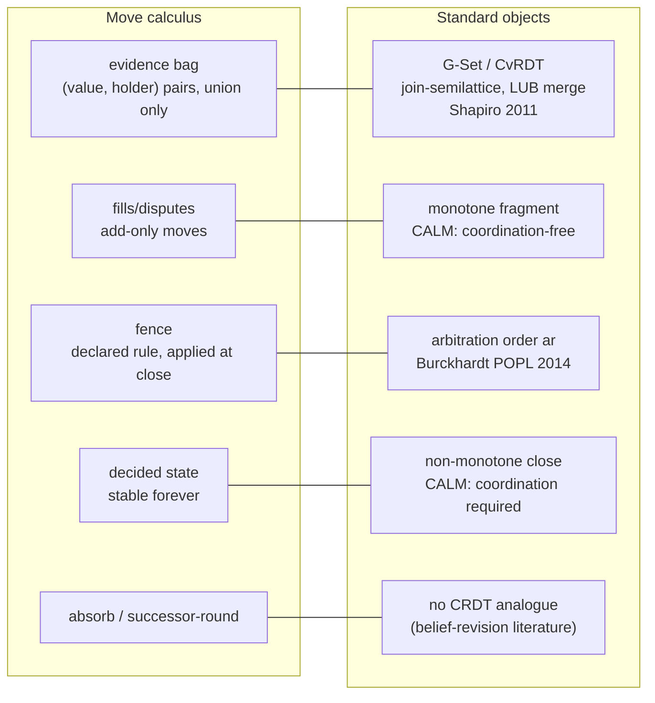
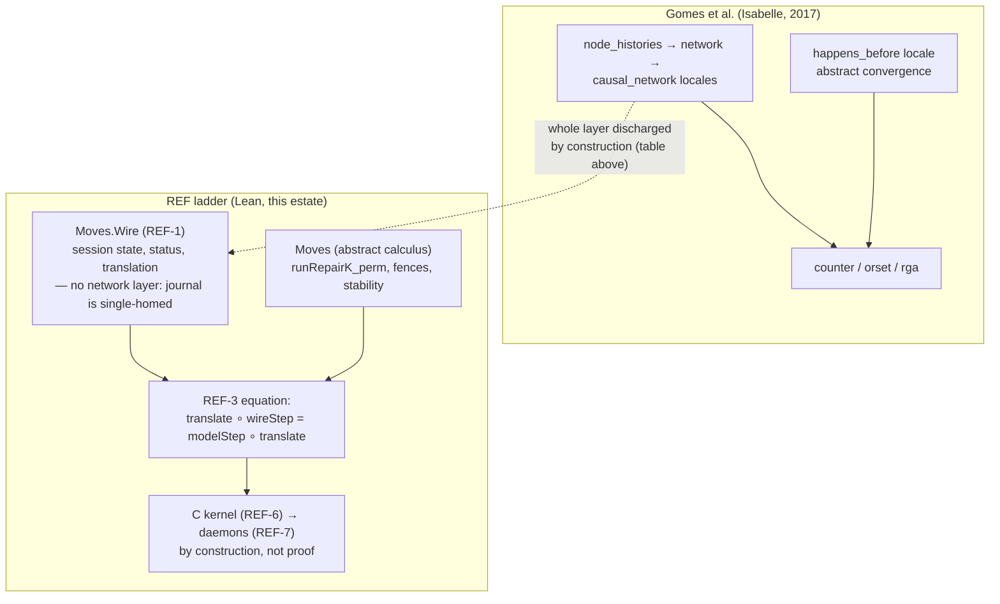

# Proof-support briefing — wire model and move calculus, 2026-08-16

> **2026-08-17 acquisition addendum.** Sections 3.4, 3.5, 5.6, and
> the Lean-native row in §6 were written before opening or building the three
> Lean libraries. Their adoption verdicts and the CSLib unordered-semantics
> absence claim are superseded by the hands-on
> [Lean 4 landscape exploration](2026-08-17-lean4-landscape-exploration.md).
> Access-ledger items 9–11 are retired below against that report.

Status: research briefing for the operator and the REF-1/REF-2a
executors. **Everything conceptual here is PROPOSED pending the
operator's grill.** This document changes no code, no ledger row, and
no dispatch spec; its recommendations are sized as immediate support
to existing proof efforts, never new lanes. Nothing below exceeds
what VERIFICATION.md licenses about the estate.

Toolchain, checked on this machine 2026-08-16 (**ran-it**): Lean and
lake are present and working. `lake build` in `verify/moves` exits 0,
"Build completed successfully (23 jobs)", at the pinned toolchain
(`lean-toolchain` = v4.33.0). The Lean surface is 2,685 lines across
five files; there is **no `Wire.lean`** — the `Moves.Wire` namespace
REF-1 specifies does not exist yet, which is why the sub-session
theorems cannot currently be stated (see §4.4).

Confidence tiers, used on every claim:

| Tier | Meaning |
| --- | --- |
| **ran-it** | executed on this machine 2026-08-16, transcript or command named |
| **primary-source** | quoted from source code or a specification/paper text retrieved and read 2026-08-16; where the retrieval had artifacts, the Access-failure ledger (§7) says so |
| **lead** | a secondary source, abstract, or unread body; recorded, not relied on |
| **unverified** | stated from memory or inference; marked, never load-bearing |

Glossary of house terms used below:

| Term | What it means here |
| --- | --- |
| hole | a declared gap in a protocol that seats fill with values |
| fill / dispute | the two wire moves: propose a value for a hole; record that proposals conflict. Both only add information |
| evidence bag | the per-hole set of (value, holder) pairs accumulated from fills and disputes. Grows only; never pruned |
| seat | a role a protocol declares; a principal is bound to a seat when a session opens |
| fence | the declared tie-break rule a protocol names at authoring time; applied to the candidate set at close to pick one value |
| close | the single authorized act that seals a session: fence, seal, record a final-state digest |
| absorb / successor-round | the two declared revision modes: fold a repeat fill into the same round, or require a new round (a new session pinned to the old one) |
| journal | the append-only per-session event log; single-writer, compare-and-swap append, digests re-derived by every reader |
| digest | SHA-256 over RFC 8785 canonical bytes; identity is always re-derived, never asserted |
| the model | `verify/moves`, the Lean 4 development proving laws about the move calculus |
| refinement equation | `translate (wireStep s op) = modelStep (translate s) (translate op)` — REF-3's target, quantified over the REF-1 wire objects |
| footprint-clean | a theorem whose `#print axioms` output stays inside `{propext, Classical.choice, Quot.sound}` |
| CRDT / CvRDT | conflict-free replicated data type; the Cv (convergent, state-based) variant converges because state forms a join-semilattice and merge is least upper bound |
| G-Set | grow-only set, the simplest CvRDT |
| MV-register | multi-value register: keeps all concurrent writes, prunes causally superseded ones using version vectors |
| visibility / arbitration | Burckhardt's two relations specifying a replicated type: which events an operation sees, and a total order used to break conflicts |
| CALM | Consistency As Logical Monotonicity: a problem has a coordination-free consistent distributed implementation iff it is monotone |
| SEC | strong eventual consistency: nodes that delivered the same set of updates are in the same state |

---

## 1. Result first

**1.1 The precise, citable name for the calculus** (primary-source,
verified against Burckhardt's POPL 2014 text this session): the move
calculus is a **join-semilattice of holder-attributed observations
(a CvRDT) carried over an op-shaped wire, with arbitration declared
as a constant of the protocol value rather than derived from the
execution**. That last clause is the defensible version of the "no
vector clocks" sentence, and it now stands on the primary source
rather than on the orchestration synthesis's summary (§3.2 below
quotes the paper). Last-writer-wins derives its arbitration order
from timestamps at run time, which is why it needs clocks; the fence
is the same mathematical object — Burckhardt's `ar`, "transitive,
irreflexive and total" — fixed at authoring time.

**1.2 The Gomes et al. network model is now read in full** (it was an
unread lead in every prior estate document), and the comparison is
better for the estate than the summary suggested. Their convergence
theorem needs three hypotheses per trace — operations distinct,
concurrent operations commute, delivery order consistent with
happens-before — and the third is discharged by a `causal_delivery`
axiom their paper says is "typically implemented in network protocols
using vector timestamps" (§3.1). The estate's `runRepairK_perm`
carries none of the three in that form: `repairK_comm` commutes
**every** pair of wire moves, not merely concurrent ones, so the
happens-before premise is vacuous and arbitrary permutations are
covered. More useful for REF-1: their four network axioms map one-for-
one onto properties the estate's single-writer journal provides **by
construction**, which licenses `Moves.Wire` to model no network at
all (§4.5 gives the table). Their Isabelle locale layering — abstract
convergence proved once, network model separate, composed by
extension — is the field-tested precedent for exactly the layer
partition dispatch 24 already mandates.

**1.3 The refutations that survive contact with the primary sources.**
Keeping every candidate is worse than a clock-pruned conflict set on
exactly one axis: a seat cannot supersede its own earlier fill, and a
plurality-style rule would count the retracted value (**ran-it** in
the prior-art lane, reproduced in §2.3's row). "Pure op-based CRDT
without the clocks" is wrong on the literature — pure op-based
frameworks move causality into a tagged causal stable broadcast
layer; the estate's shape is a CvRDT worn over an op wire, which is
the framing that genuinely needs no delivery guarantees. And "the
fence removes the need for coordination" is false as stated:
`fence_deterministic` quantifies over runs of the same bag, and CALM
places the unavoidable coordination point exactly where the estate
already built it — declared close authority.

**1.4 The Lean 4 landscape moved in 2025–2026, in three places.**
Sal (PaPoC 2026) verifies 30 replicated datatypes in Lean 4 — and its
middle proof stage admits SMT verdicts via `MVarId.admit`, the exact
channel the estate's axiom-footprint gate exists to refuse
(primary-source, repo text). Veil (CAV 2025) is a Lean 4 framework
for distributed transition systems. CSLib (2026) is a Lean 4 library
for concurrency theory. None is adoptable at acceptable cost (§6),
but "no Lean 4 prior art" is now false in every direction it used to
be true, and the hygiene-gates brief is confirmed, not undermined, by
the newest tool's design.

**1.5 The single highest-leverage mathematical support found:** the
estate's own layering decision — REF-1 before any sub-session or
transport theorem — is precisely what the mechanized field's
structure predicts, and two small, statable theorems are waiting on
it: `sealed_stable` and the monotone-gate confluence property, the
second of which changes the claim's **kind** from safety to liveness
and must be pre-registered as such (§4.4). Meanwhile the cheapest
genuinely absent artifact is a mechanized profile of the **shipped**
fence: `Violations.lean` analyses the minimum and plurality rules;
the seat-priority rule that actually ships is analysed nowhere
(primary-source, §2.2 row 4).

---

## 2. The mapping: our objects, the literature's objects



The table below is the load-bearing artifact of section A of the
charge. "Cost" rows are what adopting the name obliges the estate to
say honestly.

### 2.1 Permutation-invariant evidence bags → a G-Set of holder-attributed pairs (a CvRDT)

**Standard name.** Grow-only set; the canonical example of a
convergent (state-based) replicated data type, whose convergence is
the join-semilattice theorem of Shapiro, Preguiça, Baquero, Zawirski,
INRIA RR-7506 (2011) (primary-source via the prior-art lane's
retrieval; the estate already cites it and already disclaims novelty
— `docs/design/2026-08-14-learning-by-refutation.md:432`).

**Where mechanized.** Isabelle: the AFP entry "A framework for
establishing Strong Eventual Consistency for Conflict-free Replicated
Datatypes" (Gomes, Kleppmann, Mulligan, Beresford; submitted
2017-07-07, BSD license, sessions Util / Convergence / Network /
Ordered_List / RGA / Counter / ORSet; maintained through
Isabelle2025-2 as of the 2026-02-06 release) — primary-source, AFP
entry page fetched 2026-08-16. Automated provers: VeriFx (ECOOP 2023,
51 CRDTs via Z3). Lean 4: Sal (2026, 30 RDTs). Our own instance:

```lean
-- verify/moves/Moves/Model.lean:1808-1810 (primary-source, read in place)
theorem runRepairK_perm {l₁ l₂ : List Mv} (hperm : l₁.Perm l₂) :
    (∀ m ∈ l₁, WireMove m) →
      ∀ s : State, (runRepairK s l₁).1 = (runRepairK s l₂).1
```

**What the mapping buys.** Fifteen years of convergence results and
the correct citation posture (instance of a known theorem, not a
finding). It also buys a precise strength comparison: the estate's
commutation premise is `WireMove m` — every wire move commutes with
every other (`repairK_comm`, `Model.lean:1789-1791`) — where the
generic frameworks require commutation only of concurrent operations
plus causally consistent delivery. That is not "stronger than Gomes
et al." (their framework covers operation sets ours does not); it is
the statement that our operation set sits in the degenerate,
best-behaved corner of their hypothesis space, where the causal-
delivery machinery has nothing left to do.

**What it costs.** The honest trade the orchestration synthesis
already flags (§3.2 there; **ran-it** in the prior-art lane, Lean
model evaluated): with no causal metadata, a holder's correction of
its own fill is indistinguishable from a two-party disagreement —
self-supersession is inexpressible, which is exactly the cost an
MV-register pays version vectors to avoid. The trade is better on
provenance, worse on supersession, and belongs in VERIFICATION.md's
bounds prose, where it currently is not.

### 2.2 The fence → Burckhardt's arbitration, declared rather than derived

**Standard name.** The arbitration relation of Burckhardt, Gotsman,
Yang, Zawirski, "Replicated Data Types: Specification, Verification,
Optimality," POPL 2014. Verified against the full paper text this
session (retrieved from the IMDEA mirror, text extracted locally;
ligature artifacts noted in §7). The load-bearing definitions,
quoted from the extraction (spacing repaired, nothing else):

> "operation context for a data type τ is a tuple L = (o, E, oper,
> vis, ar), where o ∈ Op_τ, E is a finite subset of Event,
> oper : E → Op_τ, vis ⊆ E × E is acyclic and **ar ⊆ E × E is
> transitive, irreflexive and total**"

> a data type specification is a "function F_τ that, given an
> operation context L for τ, specifies a return value F_τ(L) ∈ Val_τ"

And the two sentences that make the estate's contrast precise. On how
implementations obtain `ar` (their LWW-register verification):

> "We also assume that I ⊔ J recomputes the **arbitration relation in
> the resulting execution from the timestamps.** This is the reason
> for recording them in info: we would not be able to construct
> receive(I,J).ar solely from I.ar and J.ar."

On the update signature: each update receives "a timestamp
t ∈ Timestamp provided by the rest of the store implementation …
e.g., to implement the last-writer-wins conflict-resolution strategy
mentioned in §1, **but is free to ignore it**."

**The mapping, stated once.** In Burckhardt's framework `ar` is part
of the specification's input, and every implementation he verifies
manufactures it at run time from timestamps. The estate's fence is
the same object with a different provenance: the protocol value
declares the rule (`fenceChoice` iterates the declared
`hole.Fence.Order` — `proto/go/protod/protocol_step.go:349-360`,
primary-source via the prior-art lane), and `fence_deterministic`
(`Model.lean:1342-1351`, read in place this session) proves that any
sound rule that is a function of the candidate set alone decides
identically across all interleavings of the same bag. So the
defensible sentence is:

> **Arbitration is a declared constant of the protocol value, not a
> function of the execution — which is why no clocks are needed to
> compute it.**

**What it buys.** A specification-language home for the fence (the
fence is `F_τ` restricted to conflict resolution), and a vocabulary
reviewers already know. It also names what the MV-register does with
the same machinery — its specification "is free to ignore"
arbitration and return all conflicting values — which is precisely
the estate's `disputed` state: disputes-as-data is the MV-register's
read behavior promoted to a persistent, holder-attributed state,
with arbitration deferred to a single declared act (close).

**What it costs.** Two honest boundaries. First, `fence_deterministic`
quantifies over runs of the **same** bag; nothing in it says two
parties who saw different bags agree. Establishing "the candidate set
is complete" is a coordination point, CALM says it is unavoidable for
a non-monotone act, and the estate's declared close authority (D104)
is that point — this should be stated wherever the fence is praised,
because the false stronger sentence is easy to write. Second, the
**shipped** fence (seat-priority) has no mechanized manipulation
profile: `Violations.lean` analyses `minFenceRule` and
`pluralityFenceRule` (`fence_manipulable`, `Violations.lean:338-349`,
read in place), and the shipped rule is neither. In social-choice
terms seat-priority is a dictatorship — immune to candidate
injection, unconditionally deferential to the first seat in the
declared order holding any candidate. Absence is the finding; §5.3
sizes the theorem.

### 2.3 Disputes as data → deferred arbitration; the MV-register comparison, priced

| Axis | MV-register (Shapiro 2011; Burckhardt POPL 2014) | Estate |
| --- | --- | --- |
| Conflict representation | concurrent writes co-exist until read; causally dominated writes pruned by version vectors | `disputed cs` is a first-class state; nothing is ever pruned |
| Provenance | not kept (values only) | every pair holder-attributed; L1 strong no-loss is unconditional (`Spec.lean:39-42`) |
| Self-correction | a writer's new value replaces its old one (causal dominance) | inexpressible — both values stay, and a support-counting rule counts the retracted one (**ran-it**, prior-art lane E1: `plurality = 10` from a retracted fill) |
| Resolution | at read, by the client | at close, by the declared fence, once |

The protocol-level compensation for the self-correction gap is the
revision mode: `successor-round` refuses the differing re-fill and
routes revision to a new session pinned to the old (which is why the
probed self-correction hazard is not live product behavior —
orchestration synthesis §3.2, sizing correction). But the live defect
found beside it stands: single-seat + `absorb` + a self-differing
value wedges a session permanently open with no refusal (**ran-it**,
gap lane, `e3-transcript.md`) — a disposition the calculus side
should watch, since any REF-1 model of revision modes will make the
wedge statable.

### 2.4 Fills never destroy → the CALM monotone fragment; close → the non-monotone act

Consistency As Logical Monotonicity (conjectured Hellerstein PODS
2010; proved for relational transducer networks by Ameloot, Neven,
Van den Bussche, JACM 2013; survey Hellerstein & Alvaro, CACM 2020 —
primary-source citations via the prior-art lane, bodies unread:
lead). Mapped: fill/dispute only grow the evidence order, so the
fragment is monotone and coordination-free — `runRepairK_perm` is
the instance. `decide`/close is non-monotone (it closes a set against
future information — `decided_stable`, `Model.lean:1460-1462`, read
in place), so CALM predicts a mandatory coordination point, and the
estate's declared close authority is it. The estate's own ledger
already carries the honest half of this ("decide-bearing bags are
order-sensitive by design… the one deliberate schedule-sensitivity
the calculus keeps," VERIFICATION.md bounds prose, read in place);
the CALM citation gives that sentence its theory home.

### 2.5 Absorb / successor-round revision → no CRDT-taxonomy analogue

Searched by the prior lanes and again here: revision-as-new-round
with a content-addressed predecessor pin has no name in the
CRDT/eventual-consistency corpus; the nearest literature is belief
revision and argumentation, which the estate's 2026-08-14 lit sweep
already catalogs (`docs/research/2026-08-14-lit-belief-revision-merging.md`).
Absence recorded, not padded over. The one adjacent mechanized fact:
`decided` behaves as an inflationary tombstone (a monotone encoding
of an irreversible act), which is a standard CRDT trick — but the
successor-round structure above it is estate-specific and will meet
the literature only at REF-1, when session identity becomes a Lean
object.

---

## 3. Mechanized prior art — what was retrieved, what it proves, what it supports

### 3.1 Gomes / Kleppmann / Mulligan / Beresford, Isabelle/HOL (OOPSLA 2017 + AFP)

**Retrieval** (all 2026-08-16): full paper body, arXiv:1707.01747v3
PDF, text extracted locally and read (the WebFetch summarizer could
not parse the binary; see ledger). Upstream proof source
`Convergence.thy` and `Network.thy` fetched from
`raw.githubusercontent.com/trvedata/crdt-isabelle` — the theorem and
axiom text below matched across two independent retrievals (this
session's raw-file fetch and the prior-art lane's) — primary-source.

The abstract convergence theorem, verbatim from `Convergence.thy`:

```isabelle
theorem convergence:
  assumes "set xs = set ys"
          "concurrent_ops_commute xs"
          "concurrent_ops_commute ys"
          "distinct xs" "distinct ys"
          "hb_consistent xs" "hb_consistent ys"
  shows   "apply_operations xs = apply_operations ys"
```

The network model, verbatim from `Network.thy` — one locale per
assumption layer:

```isabelle
locale node_histories =
  fixes history :: "nat ⇒ 'evt list"
  assumes histories_distinct: "distinct (history i)"

locale network = node_histories history + fixes msg_id
  assumes delivery_has_a_cause:
    "Deliver m ∈ set (history i) ⟹ ∃j. Broadcast m ∈ set (history j)"
  and deliver_locally:
    "Broadcast m ∈ set (history i) ⟹ Broadcast m ⊏ⁱ Deliver m"
  and msg_id_unique:
    "Broadcast m1 ∈ set (history i) ⟹ Broadcast m2 ∈ set (history j)
     ⟹ msg_id m1 = msg_id m2 ⟹ i = j ∧ m1 = m2"

locale causal_network = network +
  assumes causal_delivery:
    "Deliver m2 ∈ set (history j) ⟹ hb m1 m2 ⟹ Deliver m1 ⊏ʲ Deliver m2"
```

And from the paper body (local extraction), on how the causal
delivery axiom is realized: "Causal delivery is typically implemented
in network protocols using vector timestamps [Fidge 1988; Raynal and
Singhal 1996; Schwarz and Mattern 1994]."

**What it supports here.** Three things, one per REF rung:

1. **The comparison sentence for the ledger.** Their theorem needs
   `hb_consistent` on both traces; the estate's `runRepairK_perm`
   needs only `WireMove` membership, because `repairK_comm` commutes
   all pairs. The framework relationship is: our operation set makes
   their strongest hypothesis vacuous. That is the correct,
   non-inflated form of "no vector clocks" at the theorem level (the
   declared-arbitration form of §2.2 is the correct form at the
   design level).
2. **The assumptions REF-1 may drop, named axiom-by-axiom** — §4.5's
   table. Their entire Network session exists to justify hypotheses
   our single-homed journal enforces mechanically.
3. **The structural precedent for the layer partition.** Their proof
   is factored as: abstract convergence (a property of order
   relations, no network), then the network locales, then per-CRDT
   instantiations, composed by locale extension — "more than half of
   our proof is used to construct a general-purpose model… independent
   of any particular replication algorithm" (paper body, local
   extraction). Dispatch 24's mandated partition — definitions / law
   statements / proofs in separate files, gate-checked — is the same
   discipline in Lean clothing, and their framework's measured reuse
   ("proofs for the latter two CRDTs in a few hours") is the payoff
   the partition purchases.

### 3.2 Burckhardt / Gotsman / Yang / Zawirski, POPL 2014

**Retrieval**: full PDF from the IMDEA author mirror
(`software.imdea.org/~gotsman/papers/distrmm-popl14.pdf`), text
extracted locally, definitions grepped verbatim (the first WebFetch
attempt at the Microsoft mirror 404'd, and the summarizer's gloss of
the second attempt contained wording not present in the source — both
in the ledger; every quote in §2.2 was re-derived from the extracted
text). Primary-source with the stated extraction caveat.

Beyond §2.2's definitions, the paper's verification method is
**replication-aware simulation**: "relations R_r and M, analogous to
simulation (aka coupling) relations used in data refinement" —
per-replica relations tying implementation state to the
specification's event graph. Relevance to the refinement ladder: this
is the machinery you need when the implementation is nondeterministic
and distributed. The estate's REF-3 equation is cheaper by
construction — the daemon's step was made total and deterministic
(DEV-671/674/675), so a single equational statement replaces the
simulation-relation apparatus. That is a real structural dividend of
the totalization work, worth one sentence in the REF-3 spec when it
is drafted; it is also the answer to "why not simulation?" if a
reviewer raises Burckhardt or seL4 (whose refinement is likewise
simulation over a stateful kernel — the grill record's D-d rationale
already covers this from the seL4 side).

### 3.3 Baquero / Almeida / Shoker, pure op-based CRDTs (DAIS 2014; arXiv:1710.04469)

**Retrieval**: arXiv abstract page, 2026-08-16 (lead for the body;
the framework requirements below are stated in the abstract itself).
Pure op-based CRDTs transmit only operations and require the
middleware to provide **tagged causal stable broadcast** — causality
metadata at delivery, plus a later causal-stability signal that
allows the partially-ordered log of operations to be compacted.

**What it supports: a refutation on standing guard.** If anyone
frames the estate as "a pure op-based CRDT without the clocks," the
literature says that is a contradiction — the pure op-based
discipline is exactly the one that *relocates* clocks into the
broadcast layer. The estate's correct self-description (prior-art
lane, confirmed against `packages/moves/src/kernel.ts:413-414`:
merge is `replay(left ++ right)`) is a CvRDT in the algebra wearing
an op-shaped wire — the combination that needs neither delivery
ordering nor duplicate suppression.

### 3.4 Sal — Lean 4 replicated data types (PaPoC 2026; arXiv:2603.27202)

**Retrieval**: GitHub repository page (`fplaunchpad/sal`) fetched
2026-08-16; README text quoted; individual `.lean` theorem files not
fetched (ledger). Primary-source for the repository's own statements;
no Sal theorem text is quoted or relied on anywhere in this document.

Facts confirmed from the repo page: 17 CRDTs + 12–13 MRDTs under
`Sal/CRDTs/` and `Sal/MRDTs/`; Lean pinned at v4.28.0; depends on
Mathlib, a forked `lean-blaster`, and Z3. The three-stage `sal`
tactic: stage 1 `dsimp + grind` ("the result is a kernel-checkable
proof term"); stage 2 lean-blaster/Z3, which "sacrifices proof
reconstruction, so the TCB grows to include the SMT solver" and is
"intentionally not guarded" — Z3 verdicts enter via `MVarId.admit`;
stage 3 `dsimp + aesop` with kernel-checked outputs.

**What it supports.** Two things. It ends the "no Lean CRDT prior
art" era (true until 2026-03). And it is the strongest external
confirmation the kernel-hygiene brief could ask for: the newest
published Lean RDT framework ships, by design and on by default in
its middle stage, exactly the admitted-goal channel that
`verify/moves/run.sh`'s axiom-footprint check (`#print axioms` over
the rostered theorems, failing outside
`{propext, Classical.choice, Quot.sound}`) exists to catch. Adoption
is separately priced and declined in §6.

### 3.5 Veil — Lean 4 transition systems (CAV 2025) and CSLib (2026)

**Veil** (`verse-lab/veil`; CAV 2025 paper): a Lean 4 framework for
specifying and verifying transition systems / distributed protocols,
imperative surface language, verification conditions discharged by
SMT (`lean-cvc5` dependency), with interactive Lean fallback.
Repository page fetched 2026-08-16 (primary-source for what the page
states); whether its SMT results are proof-reconstructed or trusted
is **not stated on the page — lead**, and no claim here depends on
it. Examples on the page: ring leader election, FloodSet. Relevance:
if the estate ever wants the client↔daemon transport modeled in Lean
rather than TLA+ (the orchestration synthesis routes it to TLA+,
sized against the existing `verify/pipeline/Pipeline.tla`), Veil is
the existing Lean idiom to evaluate first. Not a present need.

**CSLib** (arXiv:2602.04846 and companions, 2026; lead — titles,
abstracts, and third-party summaries only): a Lean 4 computer-science
library under Fabrizio Montesi's maintainership covering labelled
transition systems, process calculi (CCS, π-calculus), bisimilarity,
and Hennessy–Milner logic. **No session-type or MPST formalization
was confirmed in it**, and no Lean 4 MPST development was found at
all this session — consistent with the prior-art lane's absence
finding, now with the sharper statement: the Lean 4 concurrency
library where such a development would land exists, and the
development does not. Absence is the finding, in the estate's favor:
nobody's mechanized MPST metatheory is sitting ready to embarrass an
unordered, completion-set protocol semantics; equally, there is
nothing to reuse.

### 3.6 IronFleet and Verdi — proof structure only

**IronFleet** (Hawblitzel et al., SOSP 2015): the paper PDF was not
retrievable this session (two 404s; ledger). From the
`microsoft/Ironclad` repository README (fetched 2026-08-16,
primary-source for the sentence): a "methodology for building
practical and provably correct distributed systems based on a unique
blend of TLA-style state-machine refinement and Hoare-logic
verification." The three-layer detail (spec / distributed protocol /
implementation, refinement proofs between layers) is widely reported
but was **not verified against the primary text — lead**, and only
one structural point is taken from it: the field's successful
distributed-system verifications interpose an explicit
protocol-layer object between the abstract spec and the running
code. The REF ladder's `Moves.Wire` is that object, and the equation
form (rather than simulation) is licensed by the daemon-side
totalization, per §3.2. **Verdi** (PLDI 2015) was not retrieved at
all this session — named as a lead; its verified-system-transformer
idea (verify against an idealized network, transform to a
fault-tolerant one) is the inverse of the estate's situation, which
has no network to idealize.

### 3.7 MPST and nested protocols — the refusal, and the one reusable idea

Unchanged from the two lane reports, both of which this briefing
re-read in their raw form (they are session-scoped and will not
survive; the load-bearing quotes are preserved here). Zooid (PLDI
2021, Coq) mechanizes asynchronous MPST metatheory — deadlock
freedom, protocol compliance, liveness — for **ordered** interaction;
the estate has no ordered interaction and nothing blocks (fills are
total; refusals are data), so MPST's central theorems address a
hazard the calculus constructs itself out of. Demangeon–Honda
(CONCUR 2012) is the nested-protocol precedent for the sub-session
hole; their completion result excludes recursion by side condition
where the estate excludes it by hash-preimage infeasibility, and
their delegation guarantee rests on linear channels the estate does
not have (the sub-session lane's G5/G6, with primary-PDF quotes in
its report). The reusable idea is **projection**: a mechanically
derived per-seat statement of what a participant may do, with a
soundness theorem relating it to the global object — the shape a
protocol-session frontier wants, and the estate currently has no
theorem relating any per-seat surface to the protocol value. ECOOP
2025's "Multiparty Asynchronous Session Types: A Mechanised Proof of
Subject Reduction" (lead, search result only) indicates the MPST
mechanization field is active; nothing found covers unordered
completion-set semantics.

---

## 4. Modeling choices for the live specs, with what each route makes provable

### 4.1 REF-1: the wire step — total function, not relation

Dispatch 17 already rules this (the equation, not a simulation), so
this section records why the literature agrees rather than reopening
it. Three routes exist in the field:

- **Total function** (`wireStep : State → Op → State × Receipt`).
  Makes the REF-3 equation statable as one `=`; both soundness and
  completeness ride the same equation because refusal is a value.
  Everything in `Moves` is already this shape. Cost: any genuine
  daemon nondeterminism must be either refused into determinism or
  named in the divergence enumeration — which is exactly what the
  enumeration is for.
- **Relation + simulation** (Burckhardt's replication-aware
  simulation; seL4's forward simulation). Needed only when the
  implementation is nondeterministic or stateful across calls. The
  estate paid DEV-671/674/675 precisely to not need this; adopting it
  anyway would forfeit that purchase.
- **Partial function** (Gomes et al.'s `interp :: 'oper ⇒ 'state ⇀
  'state`, paper §4.2). Their choice forces a separate `no-failure`
  obligation thread through the whole development (paper body, local
  extraction). D85 totalization is the estate's structural answer;
  REF-1 should keep refusal-as-value and never introduce `Option` at
  the step seam.

### 4.2 REF-1: session status — a state field, with the fold as a later invariant

The spec (dispatch 24) fixes the footprint: holes, seat bindings,
candidate sets, close status — journal excluded, nothing growing
with session length. Within that ruling the executor still chooses
how status relates to history. Two routes:

- **Status as a state field** (the spec's default reading). Makes
  `sealed_stable` and the completion arithmetic statable as
  state-local theorems, keeps every law's statement size flat
  (RQ-8's measured concern: proof size grows roughly quadratically
  with statement size, dependencies included), and matches the
  daemon's pure step, which already threads `status` as a value.
- **Status as a fold over events.** Buys "status cannot drift from
  history" by definition, at the cost of every theorem quantifying
  over journals — exactly the growth the footprint ruling exists to
  prevent — and it would put the journal back inside the objects the
  REF-3 equation quantifies over.

The literature-informed middle course: take the field now, and when
REF-4 gives close its semantics, add one bridging lemma —
`statusOfJournal j = s.status` as an invariant of lawful runs —
which is the Gomes pattern in miniature (their per-node state is a
fold of delivered messages, proved once, then reasoned about
state-locally). That lemma is REF-4 material, not REF-1; naming it
now prevents the REF-1 executor from half-building it.

### 4.3 Recursion discipline: structural, no fuel

The current model is structural recursion over lists (`runRepairK`),
`partial` is gate-forbidden (brief 22 / the cure's widened roster),
and nothing in the wire surface is unboundedly recursive — protocol
reference graphs are acyclic by the shipped recursion ban, and
protocol-digest cycles are SHA-256 fixed points (sub-session lane
G5). So fuel-indexed recursion — the standard trick when termination
is unprovable — has no consumer here, and adopting it would tax every
statement with a fuel parameter that means nothing. If REF-4's close
semantics ever wants a well-founded measure (e.g., replay over a
journal prefix), Lean's structural recursion over the journal list
suffices; no `termination_by` exotica should be needed, and any
appearance of one is a spec smell to report.

### 4.4 The sub-session theorems: statable only after REF-1, and one changes kind

Both from the sub-session lane (raw report re-read this session;
quotes preserved because the scratch tree is ephemeral):

- **`sealed_stable`** — shape:
  `∀ s m h v, status s = closed → holes s h = .filled v ∧ sealed →
  holes (step s m) h = .filled v`. Extends the existing stability
  family (`decided_stable`, `repairK_decided_stable`). Not statable
  today: `status`, `outcome`, `sealed`, and the completion arithmetic
  do not exist in `verify/moves` (**ran-it** this session: no
  `Wire.lean`; the lane's grep found the session vocabulary absent,
  and the verifier's caveat stands — `single_seat_stable`
  (`Model.lean:1546-1549`, read in place) already gives conditional
  filled-stability under a `SeatConsistent` premise, so the gap is
  narrower than "no stability theorem," but the sealed form still
  needs REF-1's objects).
- **Monotone-gate confluence** — shape:
  `∀ l₁ l₂, l₁.Perm l₂ → Monotone G → FairRetry →
  MeaningEq (gatedRun G l₁) (gatedRun G l₂)`. The permutation
  theorem's engine (`repairK_comm` via `cellApply_comm`) requires a
  move's effect to be a function of the hole's cell alone; a
  child-closure gate is not, so nothing lifts for free (**ran-it** in
  the lane, with the verifier's caveat that the killing experiment
  was engineered — the argument, not the run, carries it). The
  fairness premise converts the family's claim from safety (any
  order, same answer) to liveness (eventually same answer, if
  refused moves retry) — a genuine expansion of what the model
  models, against VERIFICATION.md's explicit "no liveness" bound.
  **Pre-register the kind change before anyone states the theorem**
  (§5.4); discovering it mid-proof is the failure mode the estate's
  pre-registration discipline exists to prevent.

### 4.5 What a single-homed journal lets REF-1 drop, axiom by axiom

The wire model needs **no network locale at all**, and this table is
the license (left column verbatim from `Network.thy`, primary-source):

| Gomes et al. axiom | What it guards | Why `Moves.Wire` does not need it |
| --- | --- | --- |
| `delivery_has_a_cause` | no message minted by the network | one writer appends; every event's origin is the daemon's own step; verify-on-read re-derives digests (`go/journal` CAS-append) |
| `msg_id_unique` | global uniqueness of message ids | identity is content-addressed (SHA-256 over canonical bytes); uniqueness is collision resistance, already in the trusted base |
| `deliver_locally` | a broadcaster sees its own message | trivial: there is one journal and the appender reads it |
| `causal_delivery` (the vector-clock axiom) | order respects happens-before | vacuous: `repairK_comm` commutes **all** wire-move pairs, so no delivery order is privileged — the theorem quantifies over raw permutations |
| `histories_distinct` | no duplicate events per node | CAS append refuses duplicates positionally; idempotent union makes re-application harmless anyway |

What is **not** discharged and must stay named: the client↔daemon
transport (at-least-once, unordered, no-resume — the orchestration
synthesis's §1.5 routes this to a TLA+ model beside `Pipeline.tla`,
and its caveat about the misquoted spec-24 authority is noted and
avoided here: dispatch 24 does not forbid a Lean transport model; the
TLA+ routing stands on fit, not on a prohibition), multi-venue
mirroring (doctrine says mirror-then-resolve-locally; nothing
mechanized), and everything else VERIFICATION.md's bounds already
list (crash recovery, CAS, retries, leases, liveness).



### 4.6 REF-2a: the canonical value law — the ruled route is the field's route

The spec (dispatch 23) already fixes the route: a Lean model of the
canonicalization over the narrowed inductive grammar, idempotence and
soundness proved, differential walls against both runtime
canonicalizers. The field offers two alternatives, both properly
refused: verifying the production implementations directly (the
VeriFx posture — automated, but the proof lives in an SMT TCB and in
someone else's language semantics) and trusting agreement between two
implementations (the pre-REF-2a status quo, which the spec's own
"stops resting on two implementations agreeing" sentence retires).
Two literature corroborations worth carrying into the slice: DAG-CBOR
independently forbids NaN/infinities and discourages negative zero —
a second standards lineage converging on the float drop — and the
JCS-vs-DAG-CBOR key-order divergence on pure ASCII (**ran-it** in the
prior-art lane: 3 of 7 probed pairs, because DAG-CBOR sorts
length-first) is the standing reason the spec pins "RFC 8785" by name
rather than saying "canonical JSON." The opaque leaf as
uninterpreted canonical bytes (equality = byte equality, by
definition) keeps the soundness theorem's opaque clause definitional
— no route through it requires parsing, and any that appears to is a
scope breach to report.

---

## 5. Recommendations — small, consumer-named, each with cost and reversal

All PROPOSED pending grill; none opens a lane.

**5.1 Adopt the declared-arbitration sentence, with the citation.**
One prose edit wherever the "no vector clocks" claim appears
(VERIFICATION.md's E2 bounds prose; any R2-publication draft):
"arbitration is a declared constant of the protocol value, not a
function of the execution (cf. Burckhardt et al., POPL 2014, where
implementations recompute arbitration from timestamps)," paired with
the CALM-shaped caveat that close authority is the retained
coordination point. Consumer: the ledger's reader and the splash
post. Cost: prose. Reversal: revert the edit.

**5.2 Fold §4.5's assumptions-dropped table into REF-1's closing
tour.** The spec already owes the operator a guided tour of
`Moves.Wire`; the table is the tour's "why there is no network in
this model" page, with the Isabelle axioms as the foil. Consumer: the
operator (education rule), then the ledger. Cost: report content in a
deliverable already specced. Reversal: none needed.

**5.3 The shipped fence's mechanized profile — one theorem pair,
gated on the operator's standing question.** The orchestration
synthesis (item 9) already asks whether the operator wants the
seat-priority rule's dictatorship property as a theorem or as ledger
prose; this briefing adds the mathematical sizing: a
`seatPriorityFenceRule : FenceRule` instance (soundness is the same
`ValueAppears` obligation the other two rules discharge) plus two
short lemmas — injection-immunity (a candidate attributed to a seat
outside the fence order, or below the deciding seat, never changes
the choice) and dictatorship (the first fence-order seat holding any
candidate decides, regardless of all other evidence). Both are
`Violations.lean`-shaped, both consume only existing machinery, and
`fence_deterministic` already covers the rule's schedule-freedom.
Consumer: exists only under the operator's "theorem" answer — under
"prose," write the two sentences in the ledger instead. Cost: roster
growth (the orphan gate makes it visible); it will state plainly that
the shipped rule is a dictatorship, which is true, deliberate, and
currently unwritten. Reversal: delete theorem and roster line.

**5.4 Pre-register the monotone-gate kind change now.** One paragraph
in the sub-session grill record (or its successor dispatch): any
child-closure gate takes the confluence family from safety to
liveness (fair-retry premise), which exceeds VERIFICATION.md's stated
bounds and must be ratified as an expansion, not discovered. Consumer:
whoever grills the sub-session hole; REF-1's executor benefits
because the `Moves.Wire` file layout can leave room for a gated-run
definition without committing to it. Cost: a paragraph. Reversal:
free until someone states the theorem.

**5.5 Write the MPST refusal down, one page, with the projection IOU.**
The refusal is argued identically in two ephemeral lane reports and
this briefing; none of the three is a durable estate document a
reviewer will find. One page in `docs/design/`: why ordered-
interaction metatheory is refused (nothing blocks; fills total;
refusals are data), and the single reusable idea — a projection
theorem relating any future per-seat frontier to the protocol value,
in the `fence_deterministic` "any sound rule" style. Consumer: the
frontier slice (orchestration item 3) and every future reviewer the
word "protocol" sends to the session-types literature. Cost: a page.
Reversal: delete it.

**5.6 Decline the three Lean 4 adoptions; record one Multiset note
for REF-9.** Sal (Mathlib + solver fork + Z3, toolchain v4.28 vs our
v4.33, admits SMT goals), Veil (SMT stack, transition-system idiom we
do not currently need), CSLib (process-calculus idiom refused with
MPST) — each read for ideas, none imported; the model's
zero-dependency posture (`lake-manifest.json` lists only `moves`) is
load-bearing for the extraction lane and for the footprint gate. The
one recorded seed: mathlib defines
`Multiset α := Quotient (List.isSetoid α)` — "the quotient of List α
by list permutation" (primary-source, mathlib4 docs, 2026-08-16) —
which is the estate's permutation-invariance theorems as a *data
type*. If a REF-9-class extension ever wants evidence bags as
first-class quotients rather than perm-quantified lists, that is the
shape, at the price of the Mathlib dependency; not now, and not for
REF-1. Cost of the recommendation: a DECISIONS note. Reversal: none —
it decides nothing.

---

## 6. Proof-bank survey — what the field's libraries hold for this program

| Bank | Pertinent holdings | Import / transliteration cost | License |
| --- | --- | --- | --- |
| **Lean 4 mathlib4** | `Mathlib.Data.Multiset.Defs` (`Multiset` as List-mod-Perm quotient — verbatim above); `Mathlib.Order.Lattice` (`SemilatticeSup` and the lattice-law hierarchy the hand-proved `finset_union_comm/_assoc/_idem` + `dispute_merge_semilattice` obligations restate); `List.Perm` theory (already in core/Std reach) | Adoption = a Mathlib dependency and toolchain coupling, against a model that is deliberately zero-dependency; the semilattice laws it would replace are ~55 lines already proved (`Model.lean:200-256`). Transliteration: nothing to do — the content already exists in-tree. Declined for REF-1/2a; Multiset noted for REF-9 (§5.6) | Apache 2.0 |
| **Isabelle AFP** | Entry "A framework for establishing Strong Eventual Consistency for Conflict-free Replicated Datatypes" (2017-07-07, BSD; sessions Util/Convergence/Network/Ordered_List/RGA/Counter/ORSet; maintained through Isabelle2025-2, release 2026-02-06) — the only CRDT entry found; **no session-types entry found** (searched, not an exhaustive index walk — ledger §7.8) | No code import possible (different assistant). Transliteration value is structural, not textual: the locale layering (§3.1) and the exact axiom inventory REF-1 gets to drop (§4.5). Cost already paid — this briefing is the transliteration | BSD (entry) |
| **Coq / Rocq ecosystem** | Zooid (PLDI 2021, mechanized asynchronous MPST — refused with MPST, §3.7); Nieto's Iris-based CRDT specifications (foundational, separation-logic; lead); ECOOP 2025 MPST subject-reduction mechanization (lead) | Teaching only; no import path. The Iris line matters only if the estate ever wants client-code composition proofs, which the oracle/corpus lane covers empirically instead | varies (mostly MIT/BSD; unchecked per-repo — lead) |
| **Lean 4 native, non-mathlib** | Sal (30 RDTs; §3.4), Veil (transition systems; §3.5), CSLib (LTS/process calculi/HML; §3.5). No Lean 4 MPST, no Lean 4 unordered-protocol semantics — absence confirmed again | Each pins its own toolchain and solver stack; all declined (§5.6) | Sal: unchecked (lead); Veil: unchecked (lead); CSLib: unchecked (lead) |

The licensing cells marked unchecked are deliberate: no adoption is
recommended, so no license diligence was spent; any future adoption
decision re-runs that check first.

---

## 7. Access-failure ledger

Every source attempted this session that could not be properly
accessed or read in full, per the operator's instruction. Nothing in
the main body rests on a partial view except where a tier says so.

1. **`microsoft.com/.../popl14-full.pdf` (Burckhardt POPL 2014,
   Microsoft mirror)** — HTTP 404. Wanted: the paper. Got: nothing.
   Recovered in full via the IMDEA author mirror (below). Reliance on
   the failed fetch: none.
2. **WebFetch summarizer gloss of Burckhardt (first successful
   fetch)** — the tool's model returned a summary containing a
   "Definition 1" label and vector-clock phrasing **not present
   verbatim in the source**. Wanted: verbatim definitions. Got: a
   paraphrase with fabricated-looking scaffolding. Disposition:
   discarded entirely; every Burckhardt quote in §2.2 was re-derived
   by grep over the locally extracted PDF text. Reliance: none.
3. **Burckhardt PDF local extraction** — the pdftext extraction drops
   fi/fl ligatures and mathematical spacing ("specication",
   "conict"). Quotes were re-spaced only; ligatures repaired only
   where the word is unambiguous. Any quote destined for a ratified
   document should be re-checked against the PDF by eye. Reliance:
   §2.2's quotes, tier primary-source with this stated caveat.
4. **`arxiv.org/pdf/1707.01747` (Gomes et al.) via WebFetch** — the
   summarizer could not parse the binary ("cannot extract legible
   content"). Recovered: the saved binary was text-extracted locally
   (same ligature caveat as above) and the body read; axioms
   additionally cross-checked against the upstream raw `.thy` files.
   Reliance: §3.1, tier primary-source, double-sourced.
5. **`Convergence.thy` / `Network.thy` raw fetches** — retrieved via
   the WebFetch summarizer over raw source, so the Isabelle
   symbol rendering (`⊏ⁱ` etc.) passed through a model layer. The
   `convergence` theorem text matches the prior-art lane's
   independent retrieval character-for-character on every assumption
   name and clause; treated as primary-source on that agreement.
6. **`microsoft.com/.../ironfleet-sosp15.pdf`** — HTTP 404. Wanted:
   the three-layer methodology section. Got: nothing; fell back to
   the Ironclad repo README (one methodology sentence, quoted §3.6).
   The three-layer detail is therefore tier **lead**, and the main
   body takes only the one structural point from it.
7. **Verdi (PLDI 2015)** — not attempted after the IronFleet 404s
   consumed the budget; named as lead in §3.6. Reliance: one
   inverted-relevance sentence, marked.
8. **AFP session-types absence** — established by web search over the
   AFP, not by enumerating the AFP index. The claim in §6 is bounded
   accordingly ("no entry found," not "no entry exists").
9. **RETIRED 2026-08-17 — Sal `.lean` theorem sources.** The pinned
   repository, central theorem statements, Blaster admission path,
   representative axiom footprints, and four legacy build failures are
   recorded in the
   [Lean 4 landscape exploration](2026-08-17-lean4-landscape-exploration.md).
10. **RETIRED 2026-08-17 — Veil SMT trust status.** Source and an
    executable two-mode probe establish that trusted UNSAT uses
    `MVarId.admit`/`sorryAx`, while `veil.smt.trust=false` requests and
    reconstructs proofs; exact scope and the bit-vector caveat are in the
    [exploration report](2026-08-17-lean4-landscape-exploration.md).
11. **RETIRED 2026-08-17 — CSLib source access.** The pinned tree and
    capstones were built and axiom-audited. CSLib does contain unordered
    `Multiset`-based in-flight-message semantics, commutation/diamond
    theorems, and the FLP development; the earlier broad absence claim is
    superseded by the
    [exploration report](2026-08-17-lean4-landscape-exploration.md).
12. **CALM (JACM 2013 / CACM 2020) and Shapiro RR-7506 bodies** —
    cited via the prior-art lane's retrievals and the estate's
    existing corpus; bodies not re-read this session. Tier: the
    mapping claims that rest on them are standard-textbook-level and
    corroborated by multiple estate documents, but they carry
    primary-source-via-prior-lane, not this-session-read.
13. **Ephemeral lane reports** — the sub-session and verified-prior-
    art reports live in a session-scoped temp tree and will not
    survive; every quote and experiment this briefing relies on from
    them is reproduced inline above (the charge's instruction), and
    their **ran-it** results were not re-executed here except `lake
    build`. Anything built on their numbers should re-run them.

---

## 8. Sources

Retrieved 2026-08-16 unless noted. Repository citations are
file:line against `C:\Users\kokok\Dev\foldlab`, branch
`agent/codex/kernel-hygiene-gates`.

**Run on this machine this session**
- `lake build` in `verify/moves` — exit 0, 23 jobs, Lean v4.33.0.
- Line counts and file inventory of `verify/moves/Moves/` (no
  `Wire.lean`).

**Estate sources read in place**
- `verify/moves/Moves/Spec.lean` (:24-79 — `FillDisputeOnly`,
  `D85Refusal`, SpecL1–L8).
- `verify/moves/Moves/Model.lean` (:1270-1351 — plurality machinery,
  `fence_deterministic`; :1458-1462 — `decided_stable`; :1499-1556 —
  `SeatConsistent`, `single_seat_stable`; :1558-1676 — `WireMove`,
  `repairDisputeLocal`, `cellApply`; :1788-1830 — `repairK_comm`,
  `runRepairK_perm`, `repairK_decided_stable`).
- `verify/moves/Moves/Violations.lean` (:320-360 —
  `fence_manipulable`).
- `VERIFICATION.md` (claims table; E2 bounds and residuals prose).
- `scratch/dispatch/17`, `18`, `21`, `22`, `23`, `24`, `25`;
  `docs/research/2026-08-16-orchestration-analysis-synthesis.md`.
- Ephemeral lane reports under the session scratchpad `wf\` tree
  (`verified-prior-art\report.md`, `subsession-hole\report.md`) —
  quoted inline per §7.13.

**External, fetched this session**
- Gomes, Kleppmann, Mulligan, Beresford. *Verifying Strong Eventual
  Consistency in Distributed Systems.* PACMPL 1(OOPSLA):109, 2017.
  arXiv:1707.01747v3 — full body, locally extracted.
- `raw.githubusercontent.com/trvedata/crdt-isabelle/master/src/Convergence.thy`
  and `.../Network.thy` — upstream proof source.
- AFP entry page `isa-afp.org/entries/CRDT.html` — title, authors,
  2017-07-07, BSD, session list, maintained to Isabelle2025-2.
- Burckhardt, Gotsman, Yang, Zawirski. *Replicated Data Types:
  Specification, Verification, Optimality.* POPL 2014.
  `software.imdea.org/~gotsman/papers/distrmm-popl14.pdf` — full
  body, locally extracted.
- Baquero, Almeida, Shoker. *Pure Operation-Based Replicated Data
  Types.* arXiv:1710.04469 — abstract page.
- Ramesh, Soundarapandian, Sivaramakrishnan. *Sal.* arXiv:2603.27202;
  repo `github.com/fplaunchpad/sal` — repository page.
- Veil: `github.com/verse-lab/veil`; CAV 2025 paper (DOI
  10.1007/978-3-031-98682-6_2, not fetched); POPL 2026 tutorial page
  (search result).
- CSLib: arXiv:2602.04846, arXiv:2602.15078, arXiv:2602.15409
  (titles/abstracts via search — lead).
- IronFleet: `raw.githubusercontent.com/microsoft/Ironclad/main/ironfleet/README.md`.
- mathlib4 docs: `Mathlib/Data/Multiset/Defs.html` (Multiset
  definition, verbatim), `Mathlib/Data/Multiset/Basic.html`.
- ECOOP 2025, *Multiparty Asynchronous Session Types: A Mechanised
  Proof of Subject Reduction* (DOI 10.4230/LIPIcs.ECOOP.2025.31 —
  search result, lead).

**External, via the prior lanes' 2026-08-16 retrievals (not re-fetched)**
- Shapiro, Preguiça, Baquero, Zawirski. INRIA RR-7506, 2011.
- Hellerstein, Alvaro. *Keeping CALM.* CACM 2020; Ameloot, Neven,
  Van den Bussche, JACM 2013.
- Kleppmann, Howard. arXiv:2012.00472; Kleppmann, PaPoC 2022.
- De Porre et al., VeriFx, ECOOP 2023.
- Castro-Perez et al., Zooid, PLDI 2021; Scalas & Yoshida, POPL 2019;
  CAV 2023 complete projection.
- Demangeon, Honda. *Nested Protocols in Session Types.* CONCUR 2012
  — local PDF extraction in the sub-session lane's scratch directory.
- IPLD DAG-CBOR specification (Descriptive — Draft).
