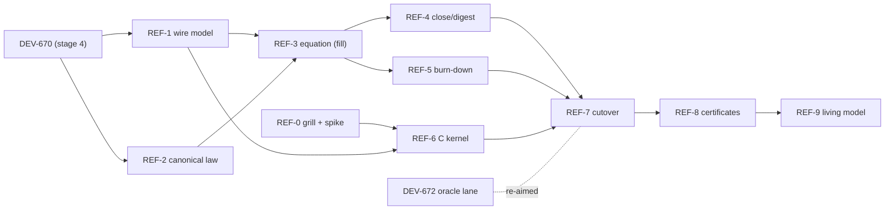

# The refinement ladder — model-to-daemon conformance as a build invariant

Status: draft, direction ratified by the operator 2026-08-16; swept
the same day for consistency with the ratified D-bc lane and the
grill-record amendments, under operator-delegated correction
authority. REF-0's grill and spike must close before any slice that
consumes the lane choice (REF-6 onward) is dispatched. The
lane-invariant proof slices (REF-1–REF-5, pure Lean) dispatch on
their own blockers while the spike runs — ratified 2026-08-16,
post-sweep ruling 4 in the grill record, which also re-scoped the
spike to the wasm lane (ruling 3: the native lane is discharged by
RQ-1's verified minimal example). Parent-issue body for the board once REF-0's decisions are
ratified; slices open in order like DEV-664's stages did.

## The ratified direction

Close the model↔daemon seam (S1) and the model↔TS-kernel seam (S7) by
**proven, verifiable artifact creation**, not by more testing: state
the correspondence as a machine-checked theorem where proof can reach,
generate the running seam code from the proved model where proof
cannot reach across languages, and certify everything left over with
the exhaustive corpus and oracle machinery DEV-670/DEV-672 build. The
extraction target is **C**, because C is what the Lean backend emits
and what both lanes consume: compiled to a single `.wasm` artifact
embedded by both runtimes (D-bc's ratified lane — wazero in Go,
native WebAssembly in Bun), or to a native static library in the
fallback lane (cgo in Go, `bun:ffi` in TS). And because the model will never
be final — updates, tweaks, extensions are expected forever — the
program's terminal artifact is not a conformance certificate but a
**demonstrated update cycle**: a model change flows through proofs,
divergence enumeration, corpus, kernel, and both runtimes in one gated
chain, and a law-breaking change is shown to be refused by the same
chain.

## The shape of the argument

Three layers, two gaps:

1. **Abstract calculus** — `verify/moves/` as it stands: moves,
   absorb, confluence, refusal characterization. Proved (R5,
   model-level).
2. **Concrete wire model** — a Lean formalization of the actual wire
   surface: session state, wire operations, close, digest. Mostly new;
   DEV-670's executable translation layer is its embryo.
3. **Running daemons** — protod (Go) and `@foldlab/moves` (TS).

Gap 1 (abstract ↔ concrete) closes by **proof**. Because DEV-671 made
the step total and DEV-674/675 collapsed the daemon's behavior into
one pure decision routine, the theorem can be **equational**, not a
simulation argument:

```
translate (wireStep s op) = modelStep (translate s) (translate op)
```

for every state and wire operation. Totality of `modelStep` makes this
one equation carry both directions: soundness (the wire does nothing
the calculus forbids) and completeness (the wire refuses exactly what
the calculus refuses). The typed divergence enumeration DEV-670
introduces is the equation's explicit exception set; full conformance
is that set reaching **empty** — by fixing the daemon or by ratifying
the behavior into the model, never by annotation.

Gap 2 (concrete Lean model ↔ running code) cannot close by proof —
Lean does not reason about Go or TS. It closes by **construction**:
the concrete model's step/close/digest functions are compiled to a C
kernel that both runtimes link, so the seam has one implementation and
it is the proved one. What remains outside (FFI boundary, transport,
storage, serialization edges) stays policed by the DEV-672 oracle and
the corpus, and is named in the trusted base, not waved at.

## The standing law (pre-registered)

The safety candidate this program exists to install:

> **No silent drift channel.** Any semantic change to the calculus
> either re-proves and regenerates every downstream artifact —
> divergence enumeration, corpus, C kernel, both runtime bindings —
> or the build fails. There is no path by which the model and the
> running system come to disagree quietly.

REF-9 is this law's mechanical demonstration, positive and negative.

## Slices

Rung names R0–R5 belong to the verification ladder; slices here are
REF-0..REF-9 to avoid collision. Every gate is mechanical — a command
that exits nonzero when the claim is false, or a committed artifact
that replays — or it is not a gate.

### REF-0 — the extraction grill and spike (decisions + one artifact, no product build)

**Grill closed 2026-08-16**; the record with the full rationale is
`docs/design/2026-08-16-ref0-extraction-grill-record.md`. The
ratified decisions:

- **D-a. Extraction mechanism — backend-first, thresholds
  pre-registered.** Lean's own C backend (`@[export]` symbols) is
  primary; the freestanding C generator is the named fallback,
  triggered only by a pre-registered threshold breach: T1 no
  link-and-run on Windows, T2 added artifact > 64 MB, T3 per-call
  overhead > 1 ms (binding cell pinned in the record: steady-state
  p50 of `spike_step` at 10 KB, any host, any platform), T4 runtime
  unsafe under per-session serialization.
  Hand-written C named and killed (hand-authoring where generation is
  possible).
- **D-bc. Binding topology — WASM-preferred, native fallback.** One
  `.wasm` artifact, one content digest everywhere: wazero in Go (no
  cgo in protod's build), native WebAssembly in Bun. Ratified over
  the native lean because only the WASM lane lets the regeneration
  gate pin the artifact that actually runs, with a single digest
  across runtimes and platforms. Native (cgo static lib + `bun:ffi`)
  is the fallback; the D-a thresholds govern both lanes.
- **D-d. Kernel ABI — stateless, total, self-identifying.**
  `step(stateBytes, opBytes) → (stateBytes', receiptBytes)` over
  RFC 8785 canonical bytes; the host owns all state. Total by
  refusal: every input byte string returns a typed payload — a trap
  is a gate failure. The kernel exports its model version and build
  identity; hosts compute and journal the digest of the artifact they
  loaded per session, and replay under a different kernel refuses by
  name (amended per the grill record: the embedded-self-digest fixed
  point does not exist).
- **D-e. `proved` requires five obligations, unconditional.**
  Equation sha-pinned and footprint-clean; divergence constant = 0
  (no proved-with-asterisks status exists); running seam is the
  generated kernel with matching self-digest under a single-source
  gate; trusted base stated in VERIFICATION.md; **status-as-gate** —
  one CI command re-verifies the obligations at HEAD, cited by the
  ledger row, so downgrade is automatic.

What remains of REF-0 is the spike, re-scoped to the wasm lane
(post-sweep ruling 3): the native lane's T1–T4 are discharged by
RQ-1's independently verified minimal example (all clear on Windows,
`docs/research/reference/rq1-lean-c-backend/`). The spike produces
and measures a Lean-runtime `.wasm` — zero-import goal, validated
under wazero's DEFAULT feature configuration and under Bun, from a
clean checkout, committed build commands — recording the D-a
thresholds, per-instance instantiation and memory, the declared
import list, the default-config validation verdict, and the host
call pattern. Gate: the wasm lane builds and runs in both hosts, or
a breach is recorded against its named threshold. If it breaches,
selection falls to the proven native lane; the generator fallback
activates only if new evidence invalidates RQ-1's result.

Blocked on: nothing. Runs beside DEV-670.

### REF-1 — the concrete wire model

Formalize the wire surface in Lean, in a `Moves.Wire` namespace
inside the existing verify/moves Lake package — ruled 2026-08-16
(post-sweep ruling 4) on RQ-8's measured evidence: build isolation
buys nothing at this size, and D-e obligation 1 wants the refinement
equation footprint-clean inside the same `#print axioms` sweep as
the abstract laws, which a package split would sever. Scope:
session state (holes, seat bindings, committed/disputed candidate
sets, journal), wire operations, and the translation to/from the
abstract calculus. DEV-670's executable mapping is **promoted**, not
rewritten: the corpus generator becomes a consumer of the formal
objects.

The `stateBytes` split is ruled (2026-08-16, post-sweep ruling 4).
The kernel is stateless either way — D-d is not in question; the
host owns all state and passes it in on every call. Precisely
because of that, whatever the host includes in the blob crosses the
boundary twice per call — and RQ-8 added a second, independent
reason to keep the blob minimal: proof size grows quadratically in
statement size, dependencies included, so a journal inside the blob
inflates every law that quantifies over state. Ruled: `stateBytes`
carries exactly what the theorems quantify over (holes, seat
bindings, candidate sets, close status); the journal stays
host-owned and append-only, never crossing the kernel boundary; and
the journal records each operation as the canonical opBytes the
kernel saw, so a third party can replay — REF-8's central property,
cheap now and irreversible later.

Gates: `lake build`, no `sorry`, footprint check extended to the new
namespace; the layer partition (definitions / law statements /
proofs in separate files) enforced by a check so no law file is
orphaned from the gate (roster-ratified, RQ-8 — the structure that
made s2n's model survive 956 replays on three proof updates); the
DEV-670 corpus **regenerates byte-identically** from the promoted
objects — proving the promotion changed nothing; the typed
divergence enumeration compiles as the formal exception set with its
count still pinned.

Blocked on: DEV-670.

### REF-2 — the canonical value law

The highest-consequence comparison in the system — is this fill a
repeat or a conflict — must hold over the **entire** value grammar,
not the corpus alphabet. Ruled 2026-08-16 (post-sweep ruling 2): the
mintable float leaf leaves the v0 wire grammar first (brief 21), so
"entire" is satisfiable without shortest-round-trip printing, and
REF-2 splits. **REF-2a**: a Lean model of RFC 8785 canonical form
over the narrowed wire value grammar — structural laws plus the
integer number path (ES2019 §7.1.12.1 steps 1–4 and 6–10, ~40 lines
demonstrated in RQ-9 against all 26 Appendix B rows and a 200k-value
differential corpus) — proved idempotent and sound (canonical
equality iff semantic equality per the declared spec), differentially
walled against both runtime canonicalizers over the existing
adversarial corpus plus a generated full-grammar sample. **REF-2b**:
step 5 (shortest digits, Note 2 selection), pre-registered as the
proof obligation floats carry if a REF-9-class extension ever
re-admits them — over a Lean-defined binary64 model, never over
`Float.toString`, which is the one genuinely opaque piece
(roster-ratified narrowing, RQ-9's verifier). Nothing dispatches
REF-2b now.

Gates (REF-2a, roster-ratified additions folded in): theorems
footprint-clean; the specification edition pinned in the spec file
(ES2019 §7.1.12.1 including Note 2 — non-normative in ECMAScript,
normative in JCS by RFC 8785's MUST); the differential wall runs
green in both runtimes; the RFC's es6testfile100m wall adopted as a
nightly tier, REGENERATED with its generator and comparison runtime
both named in the gate spec — the repository's Go generator draws
its expected column from Go's own shortest-float engine, the same
engine behind the canonicalizer under test, so an unnamed pairing is
close to a self-test; the pinned S7 bound "outside the narrow
grammar Lean's printer and RFC 8785 diverge" is **discharged in the
same commit** that lands the law.

Blocked on: brief 21 (the narrowed grammar lands first) and DEV-670
(shares its generator); independent of REF-1.

### REF-3 — the refinement equation, fill fragment

State and prove the equation over the fill/dispute wire fragment, with
the divergence set as explicit hypothesis. Refusal is guard-for-guard:
the concrete model's rejection set mapped onto the abstract
characterization, both directions.

Gates: no `sorry`; the equation's statement file is Rev-frozen and
sha256-pinned like `Spec.lean` (statement drift is a gate failure);
divergence count pinned as a constant; the corpus's Lean side becomes
a corollary — the enumerated vectors now certify only the non-Lean
sides.

Blocked on: REF-1, REF-2.

### REF-4 — close, fence, digest as observations

The calculus grows close semantics (seal + fence + record — today
explicitly "not modeled" in the E2 bounds): the versioned digest
recipe as a declared observation function, the daemon's fence already
an instance of the general fence theorem (DEV-670). Prove observation
equality through the translation: the digest computed from the
concrete final state equals the digest of the abstract outcome. The
close contract tests are then **retired into model-derived vectors**
— purged, not suspended.

Gates: observation-equality theorem footprint-clean; contract tests
deleted and their generated replacements landed in the same commit;
the VERIFICATION.md close bounds discharged in the same commit.

Blocked on: REF-3.

### REF-5 — divergence burn-down

Every named divergence gets a disposition issue, one each, exactly as
DEV-675/676 retired theirs: **fix the daemon**, or **revise the model
and re-ratify** so the equation covers the behavior unconditionally.
No divergence survives as annotation. The daemon's behavior must be
ratified into place before REF-7 replaces its implementation — burn-
down first, cutover after, so no behavior change ships disguised as a
mechanical swap.

Gates: the pinned divergence constant reaches **0**; the regenerated
corpus reports agree-everywhere; each disposition issue carries its
own mechanical acceptance.

Blocked on: REF-3 (runs beside REF-4).

### REF-6 — the C kernel

Extract the concrete model's step, close, digest, and canonicalization
functions to C by the REF-0 mechanism, behind the ratified D-d ABI
(stateless, total by refusal, self-identifying). Certification
instruments (the corpus machinery re-aimed at the new boundary): the
exhaustive DEV-670 corpus driven through the kernel directly, zero
skips, garbage rows included — every malformed input must return its
typed refusal, never trap; at least three planted mutants at the
kernel level, each killed by a named vector; kernel artifact
regeneration byte-diffed in CI on the designated build platform — the
generated-vectors ruling extended to generated code — with one
content digest for the deployed artifact everywhere it runs, and
cross-platform behavior walled by the corpus driven through that same
artifact on both platforms.

Gates (roster-ratified additions folded in): corpus green through
the kernel with the zero-skip count pinned, on both platforms
through the same deployed artifact; **no trap and no defaulted
return** on any corpus row (the emitted C's panic-routine count is
zero — the artifact half of the brief-22 source gate); every
`@[export]` symbol's EXISTENCE asserted in the artifact (a missing
export emits no symbol and no diagnostic); the module declares
**zero imports**; the annotation gate green (no `@[implemented_by]`,
no non-allowlisted `@[extern]` in owned sources); mutants die
**by their named refusal**, not merely nonzero exit, with the roster
drawn from real defect history; regeneration byte-identical from two
clean checkouts **at different filesystem paths** on the designated
build platform (a same-path double build passes while the property
fails), with cross-platform build identity recorded as a datum (RQ-6
ruled: not promoted to a gate); C emission through lake or an
explicit `-R`, or the checkout directory name enters the kernel via
the derived module name; the native fallback, if selected, builds
explicit static archives with dead-code elimination — never
`lake build :shared` (a 65 KB stub fronting ~178 MB, a threefold T2
breach); the host-journaled artifact digest matches the model
build's emission; the kernel's exported build identity matches the
model source.

Blocked on: REF-0 (mechanism), REF-1 (the functions), DEV-670 (the
instruments). Can start before REF-5 completes; cannot cut over.

### REF-7 — runtime cutover

protod embeds the kernel via wazero; `@foldlab/moves` runs it through
Bun's native WebAssembly — the D-bc lane, or its named native
fallback (cgo, `bun:ffi`) if the spike selected that. The
hand-written seam implementations **leave the estate** — purge,
not suspend; the DEV-672 oracle is re-aimed at what refinement cannot
reach: transport, storage, auth, serialization edges, the FFI boundary
itself.

Gates: the full existing suites green in both runtimes with the kernel
swapped in; a single-source gate — the seam module is generated-only,
tracked by digest, and CI fails on any second implementation of a
kernel function; the loaded artifact's digest journaled per session
by each host, and replay under a different kernel refuses by name; planted shell bugs
killed by the re-aimed oracle; **S1 and S7 move to `proved` in this
commit** under the five ratified D-e obligations, including the
status-as-gate command that CI re-verifies at HEAD, with the trusted
base stated in VERIFICATION.md in the same commit.

Blocked on: REF-4, REF-5, REF-6.

### REF-8 — session certificates

The replay checker, already sharing the kernel after cutover, emits a
per-session conformance certificate: log + final digest re-derived
from the same deployed artifact under **both hosts** (wazero and Bun)
— host independence, ruled 2026-08-16 (post-sweep ruling 1); build
independence is discharged by REF-6's regeneration gate, a
differently-authored checker is a named optional follow-on slice,
and builder independence (another party reproducing the digest on
other infrastructure) is named for a future slice to choose
deliberately. Nightly over gauntlet and real traffic via the DEV-672
lane. Universal-property dividend: refinement
covers all sessions in principle; certificates cover every session
that actually ran, including everything the shell touched **that the
journal records** — the certificate's reach is exactly the journal's
reach (roster-ratified, RQ-7). And REF-8 is not a route to `proved`:
D-e admits no proved-with-asterisks status, and a certificate over a
kernel wrong on both sides stays green — certificates add coverage
of real runs, never seam status.

Gates: the planted-corruption roster refused certificate-by-
certificate; every gauntlet session emits a verifying certificate; a
tampered certificate is itself refused.

Blocked on: REF-7.

### REF-9 — the living model (the update loop, demonstrated)

The program's point. One deliberate, operator-ratified model extension
(candidate: widen the value alphabet, or admit a new revision-policy
value) driven end-to-end in one PR chain: model edit → proofs re-run →
divergence enumeration recompiles (any new divergence must be named or
fixed at build time) → corpus regenerated → C kernel regenerated →
both runtimes rebuilt → certificates re-issued — every gate green. And
the negative control: a law-breaking edit (a no-loss-violating mutant)
committed on a throwaway branch and shown **refused** by the chain,
with the refusing command's nonzero exit recorded. A runbook in
`docs/` names every command in the cycle, organized in the
field-proven three-tier shape (roster-ratified, RQ-5, from seL4/l4v):
a pull-request tier budgeted at 20 minutes on the field's measured
medians (s2n 18m14s, Cedar 15m10s), a scheduled cache-free tier, and
a scheduled released-toolchain tier — with the estate's own
operational rule that a scheduled gate's green is not evidence until
it has fired at least once.

Gates: both controls committed as replayable artifacts; the runbook's
commands exit nonzero on the sabotaged variant and zero on the lawful
one; the standing law above enters VERIFICATION.md as a claim with
this slice as its evidence.

Blocked on: REF-8.

## Order



The DEV-664 stages 5–8 (first real session, author one type, the
join, the payoff) continue on the running system and are not blocked
by this program; REF-7 is the single point that touches the daemon,
and it lands only after REF-5 has ratified every behavioral question.

## Pre-registered risks (verify before belief)

1. **Lean-runtime linkage.** The Lean C backend's output depends on
   the Lean runtime: size, GC-at-FFI behavior, and the Windows cgo
   toolchain are unmeasured. REF-0's spike exists to catch this before
   any slice depends on it; the freestanding-generator fallback is
   named in D-a.
2. **Printer ≠ RFC 8785.** Already pinned as an S7 bound. REF-2 owns
   it; nothing downstream of REF-2 may assume it away before the wall
   is green.
3. **Close atomicity.** The daemon closes in one step (seal + fence +
   record); the model has never said this. REF-4 is where the
   modeling choice gets made and grilled, not discovered during
   REF-7.
4. **Cutover performance.** Bytes-across-FFI per fill is a measurable
   regression risk; REF-0's spike records call overhead so REF-7's
   budget is set on evidence.

## What stays assumed (the trusted base, stated ahead of time)

The Lean kernel and its C backend (or the generator, if D-a falls
back); **the Lean runtime's hand-written C** for the byte-array,
natural-number, string, and array primitives the emitted kernel
calls on every step (roster-ratified completion, RQ-2 — the emitted
code calls `lean_byte_array_uget` and kin; 931 `@[extern]`
annotations exist in Lean 4.33.0), together with the assumption —
mechanically enforced by the annotation gate — that our own kernel
sources carry no `@[implemented_by]` and no non-allowlisted
`@[extern]`; in the ratified wasm lane, the wasm toolchain
(emscripten or WASI SDK), wazero, and Bun's WebAssembly host, plus
the thin embedding code in each runtime, with behavioral identity
resting on the two named conditions (zero declared imports; a single
standalone `.wasm`, no generated-JS half); in the native fallback,
the C compiler and linker on both platforms, the FFI boundary code
in cgo and the TS binding, and the mandatory plain-C shim (the
byte-array allocator is a `static inline` with no linkable symbol —
hand-written C on the critical path, named here rather than absorbed
silently); the shell's JCS canonicalization of opaque payloads (ruling 6: the
kernel treats opaque as uninterpreted canonical bytes and never
parses it — canonicity of what arrives is the shell's, walled by the
JCS differential, never proved); SHA-256 collision resistance;
JetStream properties per the standing-assumptions gate; the transport
and storage shell, policed empirically by the oracle and gauntlet,
never proved. VERIFICATION.md states all of this in the REF-7 commit
— a `proved` seam with an unstated base is the overclaim this ledger
exists to prevent.
